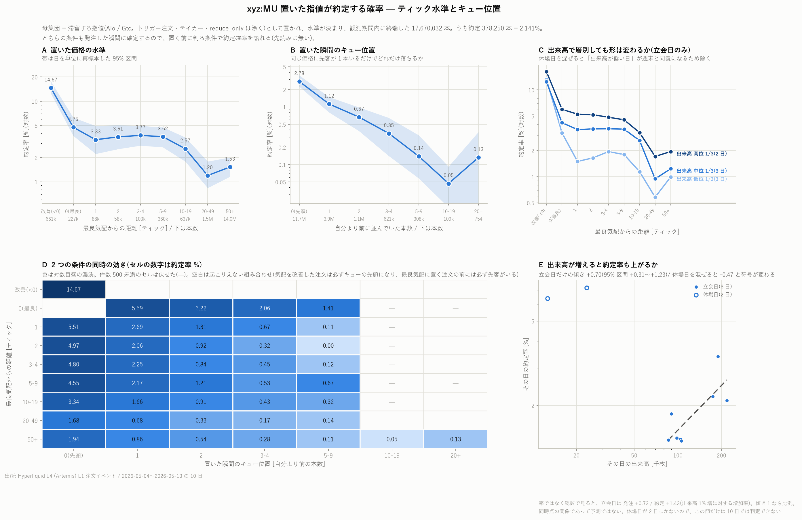

# 置いた指値が約定する確率 — ティック水準とキュー位置

[← xyz:MU の分析索引](README.md) ／ [用語辞書](../../GLOSSARY.md)

対象 `xyz:MU` ／ **暫定** 2026-05-04 〜 2026-05-13 の連続 10 日

指値を板に置いたとき、それが最終的に約定する確率を、
**発注した瞬間に確定する 2 つの条件**で層別しました。



> **この版は 10 日分の暫定値です。** 全 99 日の集計は l1 の取得後に走る設定にしてありますが、
> 本稿執筆時点では完了していません。数字は差し替わります。

---

## 1. 何を測ったか

| 条件 | 定義 | 確定する時刻 |
|---|---|---|
| ティック水準 | 置いた価格が**同じ側の**最良気配から何ティック離れているか(負なら気配を改善) | 発注の瞬間 |
| キュー位置 | 置いた瞬間、同じ価格に既に何本並んでいたか | 発注の瞬間 |

どちらも置く前に判る量なので、「置く前に判る条件で約定確率を語れる」ことになります。
目的変数(最終的に約定したか)は発注より後なので、先読みはありません。

母集団は **滞留する指値** 17,670,032 本。うち約定 378,250 本 = **2.141%**。

## 2. ★ 板に入れてはいけない注文を 2 種類踏んだ

- **トリガー注文**(`is_trigger`)は発火するまで板に載りません。これを入れると
  買い \$991 と売り \$96 が同時に生存し、板が **99.95% の時間クロス**しました
- **テイカー**(`tif` が `Ioc` / `FrontendMarket` / `LiquidationMarket`)は板に留まりません。
  「置いた指値が約定するか」を測る母集団ではないので除きます

加えて **`reduce_only` の注文を除外**しています。取引所がポジション減少に合わせて
注文を自動縮小するため、残量が減っても約定とは限らないためです
(hl-l4-pipeline で filled_sz を 22.8% 過大計上した既知の罠)。

## 3. 結果

分母は「滞留指値として置かれ、水準が決まり、観測期間内に終端した注文」です。

| ティック水準 | 本数 | 約定率 | | キュー位置 | 本数 | 約定率 |
|---|---:|---:|---|---|---:|---:|
| 改善(<0) | 661,223 | **14.67%** | | 0(先頭) | 11,695,698 | **2.78%** |
| 0(最良) | 226,836 | 4.75% | | 1 | 3,883,427 | 1.12% |
| 1 | 87,955 | 3.33% | | 2 | 1,051,400 | 0.67% |
| 2 | 57,516 | 3.61% | | 3–4 | 621,433 | 0.35% |
| 3–4 | 103,339 | 3.77% | | 5–9 | 308,420 | 0.14% |
| 5–9 | 360,124 | 3.62% | | 10–19 | 108,900 | 0.047% |
| 10–19 | 636,520 | 2.57% | | 20+ | 754 | 0.13% |
| 20–49 | 1,497,743 | 1.20% | | | | |
| 50+ | 14,038,776 | 1.53% | | | | |

**キュー位置のほうが強く効きます。** 先客が 1 本いるだけで 2.78% → 1.12%(2.5 分の 1)、
5〜9 本で 0.14%(20 分の 1)。一方ティック水準は 1 → 20-49 で 3.33% → 1.20% と 3 倍弱です。

気配を改善した注文(14.67%)だけが別格ですが、これは定義上必ずキューの先頭になるため、
水準の効果とキューの効果が分離できていない一群です。
図 D の同時分布では、**水準を固定してキューを右に動かすだけで率が落ちる**ので、
効いているのは主にキューのほうと読めます。
件数 500 以上の 42 セルで **0.047% 〜 14.67%(312 倍)** の開きがあります。

構造上ありえない組み合わせは空白にしてあります。気配を改善した注文は必ずキューの先頭になり、
最良気配に置く注文の前には必ず先客がいます。

## 4. 検算(別のデータとの突合)

同じ 10 日の `node_fills` のメイカー側は **532,062 行**。
こちらの「約定した注文」は 378,250 本で、**1 注文あたり 1.41 回の約定イベント**になります。
部分約定があるので注文数 < 約定行数のはずで、向きも比率も整合します。

## 5. ★ 出来高との関係は 10 日では判定できない(図 E)

全 10 日をまとめた両対数の傾きは **−0.47**(出来高が増えると約定率が下がる)ですが、
**立会日 8 日だけにすると +0.70 と符号が反転**します。
低出来高・高約定率の点が週末 2 日で、それが全体を引っ張っているためです。

総数で見ると立会日は 発注 +0.73 / 約定 +1.43(出来高 1% 増に対する増加率)。
ただし 8 日の回帰なので、確定として扱えません。

## 6. 注意 — 約定率が高い = 良い、ではない

メイカーが約定するということは、誰かに取られたということです。それは逆選択そのものです。
本レポートは**確率だけを測っており、損益は測っていません**。
[OBI と OFI のレポート](mu_obi_ofi_report.md) では往復スプレッド 1.245bp に対し
どの信号も 0.918bp 止まりでした。同じ物差しでの評価は別途必要です。

その他の留保:

- 50+ 帯(1.53%)が 20–49 帯(1.20%)より高い非単調があります。遠くの注文には
  「約定させる気のない注文」と「長く生き残って価格が到達した注文」が混在するためと
  思われますが、検証していません
- 20+ キューは 754 本しかなく(0.13% = 1 本)、ほぼ雑音です
- 水準 2 × キュー 5–9(571 本)は約定 0 件です。空白(ありえない組み合わせ)と
  区別できるよう、図では最も薄い色で `0.00` と書いてあります

## 7. データの出所

注文 1 本ごとの記録が要ります。`l2/lifecycle` はバケット上で **DEEP_ARCHIVE** に
移行済みで読めないため、**GLACIER_IR の l1** を列プルーニングして取得しました
(`hash` / `cloid` / `user` が全体の 67% を占めるので取りません)。

## 8. 再現手順

```bash
uv run python scripts/fetch_l1.py --coin xyz:MU
uv run python scripts/build_fill_rate.py --coin xyz:MU
uv run python scripts/plot_fill_rate.py --coin xyz:MU
```
