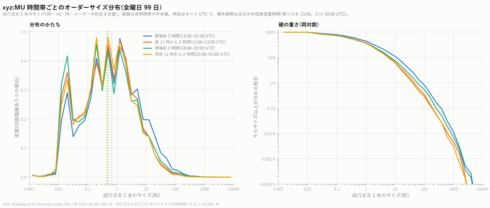

# xyz:MU 時間帯ごとのオーダーサイズ分布

[← xyz:MU 分析索引](README.md)

4 つの時間帯について、成行注文 1 本あたりのサイズの分布を出した。
標本期間は 2026 年 5 月 4 日から 8 月 10 日までの 99 日間、**全曜日込み**。

再現: `scripts/build_order_size.py --coin xyz:MU` → `scripts/plot_order_size.py --coin xyz:MU`

---

## 1. 「オーダーサイズ」に何を使ったか(重要)

板に置かれた指値注文の当初数量(`orig_sz`)は L2 の `lifecycle` 表にあるが、
**この表は作業用バケット上で DEEP_ARCHIVE に移されており、復元しないと読めない**
(復元には数時間かかり費用も発生する。詳細は第 5 節)。

そこで手元の約定記録から作れる次の量を「オーダーサイズ」として使った。

> **成行注文 1 本のサイズ** = 同一ナノ秒・同一ユーザーのテイカー約定の合計数量

板を何段も食った注文は 1 本として合算される
(11,174,755 件の約定 → **6,372,171 本**の成行注文、1 本あたり 1.75 件)。

**これは「執行された攻撃的注文」のサイズであって、板に置かれて待っている
指値注文のサイズではない。** 両者は別物なので、ここでの結論を
「この市場の注文サイズ分布」一般へ広げてはいけない。

## 2. 時間帯の定義(すべて UTC)

標本期間は全日が米国東部夏時間なので、ニューヨークの寄り付きは 13:30 UTC、
引けは 20:00 UTC にあたる。

| 呼び名 | UTC | 米国東部時間 | 本数 |
|---|---|---|---:|
| 開場後 2 時間 | 13:30–15:30 | 9:30–11:30 | 1,125,358 |
| 昼 11 時から 2 時間 | 11:00–13:00 | 7:00–9:00 | 479,923 |
| 閉場前 2 時間 | 18:00–20:00 | 14:00–16:00 | 544,849 |
| 深夜 11 時から 2 時間 | 23:00–翌 01:00 | 19:00–21:00 | 574,551 |

**「昼 11 時」は UTC の 11 時なので、米国では寄り付き前の早朝**にあたる。
同様に「深夜 11 時」は米国の引け後 1〜3 時間の帯である。
4 つの窓は重ならず、合計 2,724,681 本(全体の 42.8%)を覆う。

深夜の窓だけ日付をまたぐので、分単位で「23 時台以降 または 1 時前」と判定した。

---

## 3. 分布

サイズは 4 桁以上にわたるので横軸は対数。左は対数階級あたりの密度、
右は「そのサイズ以上が占める割合」(両対数)で、裾の重さはこちらで読む。

### 全曜日

| 時間帯 | 本数 | 中央値 | 平均 | 第 1 四分位 | 第 3 四分位 | 99% 点 | 最大 | 10 枚以上 |
|---|---:|---:|---:|---:|---:|---:|---:|---:|
| 開場後 2 時間 | 1,125,358 | **0.670** | **5.639** | 0.144 | 2.893 | 84.02 | 6,241 | **11.13%** |
| 昼 11 時から 2 時間 | 479,923 | 0.500 | 3.241 | 0.090 | 2.000 | 45.07 | 3,851 | 6.40% |
| 閉場前 2 時間 | 544,849 | 0.443 | 3.926 | 0.075 | 2.000 | 56.59 | 4,118 | 7.47% |
| 深夜 11 時から 2 時間 | 574,551 | 0.484 | 2.954 | 0.100 | 1.788 | 38.63 | 2,523 | 6.09% |

**開場後 2 時間だけが明確に大きい。** 中央値で他の 1.3〜1.5 倍、平均で 1.4〜1.9 倍、
10 枚以上の注文の割合は 11.13% と他の 6〜7% のおよそ 1.7 倍ある。
図でも青い線だけが 1〜100 枚の帯で上に出て、右の図の裾も一段上にある。

**閉場前は「中央値は最小なのに平均は 2 番目」という形をしている**
(中央値 0.443 で 4 つの中で最小、平均 3.926 で 2 番目)。
小さい注文が多い一方で、大きい注文が全体をより強く引っ張っている。

### 裾の重さ

| 時間帯 | 上位 1% の本数 | その 1% が全数量に占める割合 |
|---|---:|---:|
| 開場後 2 時間 | 11,253 | 34.46% |
| 昼 11 時から 2 時間 | 4,799 | 33.69% |
| 閉場前 2 時間 | 5,448 | **38.04%** |
| 深夜 11 時から 2 時間 | 5,745 | 33.47% |

どの時間帯でも **上位 1% の注文が数量の 3 分の 1 以上**を占める。
最も偏っているのは閉場前(38.04%)で、上の「中央値は最小・平均は 2 番目」と整合する。

分布は単峰ではなく、0.02 枚・0.2 枚・0.5〜1 枚あたりに山がある。
**参加者が丸い数量を使うため**で、階級をこれより細かくすると棘だらけになる。

### 立会日と休場日に分けた場合

「開場後」「閉場前」は原市場が開いている日にしか意味がないので、分けた値も出す。

| 時間帯 | 立会日 中央値 | 立会日 平均 | 休場日 中央値 | 休場日 平均 |
|---|---:|---:|---:|---:|
| 開場後 2 時間 | 0.742 | 5.887 | 0.230 | 1.339 |
| 昼 11 時から 2 時間 | 0.543 | 3.538 | 0.220 | 1.492 |
| 閉場前 2 時間 | 0.491 | 4.230 | 0.220 | 1.261 |
| 深夜 11 時から 2 時間 | 0.515 | 3.243 | 0.290 | 1.602 |

**休場日はどの時間帯でも一貫して小さい**(中央値 0.22〜0.29 枚、平均 1.3〜1.6 枚)。
第 3 節の「全曜日」の値は立会日と休場日を混ぜたものなので、
時間帯どうしの差には **その窓に休場日がどれだけ混ざっているかの違い** も入っている。
時間帯だけの効果を見たい場合は立会日の行を使うこと。
なお立会日だけで見ても、開場後 2 時間が最大という順位は変わらない。

---

## 4. 注意点

1. **第 1 節のとおり、これは成行注文のサイズである。** 指値注文のサイズ分布は
   別物で、本レポートからは何も言えない。
2. 「同一ナノ秒・同一ユーザー = 1 本の注文」は近似である。注文 ID は取得して
   いないため、まれに別注文が同一ナノ秒に入る(向きが混在するグループが
   全体の 0.07%)。詳細は
   [攻撃的な売買の向きの推移確率行列](mu_sign_chain_report.md) 第 1 節。
3. **時間帯の比較は同時点の記述であって、原因の説明ではない。**
   「開場後だから注文が大きい」のか「注文が大きい参加者が開場後に来る」のかは
   区別していない。判定の作法は [予測の定義](../predicting_definition.md) を参照。
4. 4 つの窓は 1 日 24 時間のうち 8 時間しか覆っていない(全注文の 42.8%)。
   残りの時間帯は本レポートの対象外である。
5. 1 銘柄の記述統計である。銘柄横断の比較は他の 5 銘柄で同じ手順を実行してから行う。

---

## 5. データ保管状況の変化(作業上の注意)

本レポートの作成中に、作業用バケットのオブジェクトが階層化されていることが判った。

| 階層 | ストレージクラス | 読み出し |
|---|---|---|
| L1 | GLACIER_IR | すぐ読める(取り出し料は割高) |
| fills | GLACIER_IR | すぐ読める(同上) |
| **L2**(bbo / lifecycle / book_px / book_bp / trigger_density) | **DEEP_ARCHIVE** | **復元が必要(数時間)** |
| L3 | STANDARD | すぐ読める |

L2 が読めなくなっているため、次の分析は事前に復元を要求しない限り実行できない。

- 指値注文のサイズや生存時間(`lifecycle`)
- 板の深さ・傾き(`book_px` / `book_bp`)
- トリガー注文の密度(`trigger_density`)

幸い **最良気配(`bbo`)と約定記録(`fills`)は手元に落としてある**ため
(`data/bbo_xyz_MU.parquet`、`data/fills_xyz_MU.parquet`)、
既存レポートの再現と本レポートの作成には支障がなかった。
他の 5 銘柄へ横展開するときは、まず必要な表の復元から始める必要がある。
