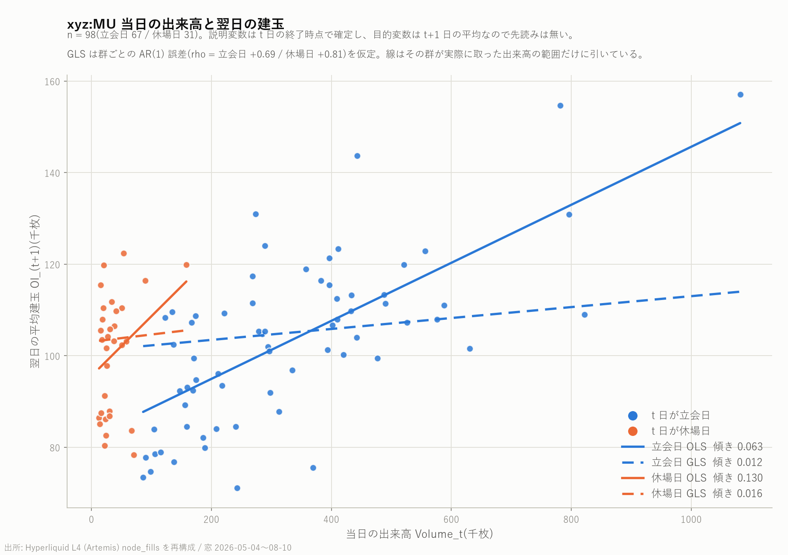
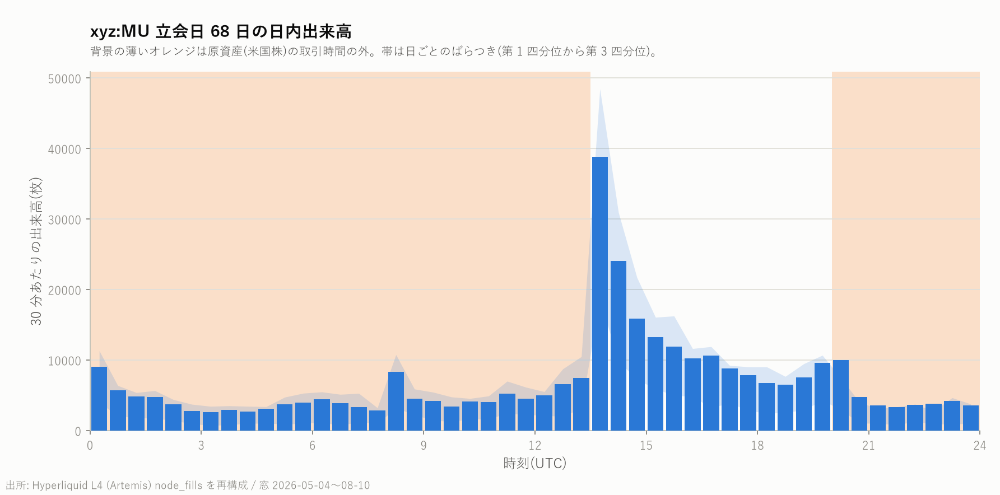
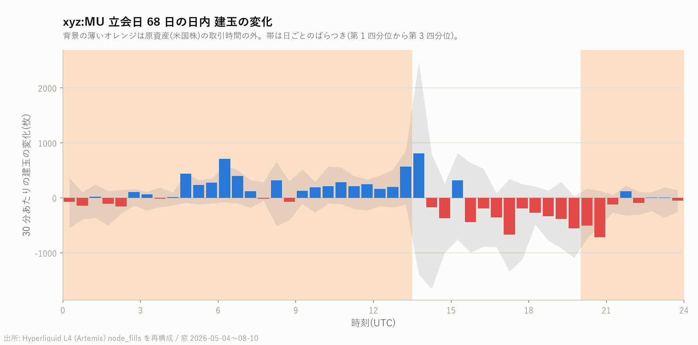
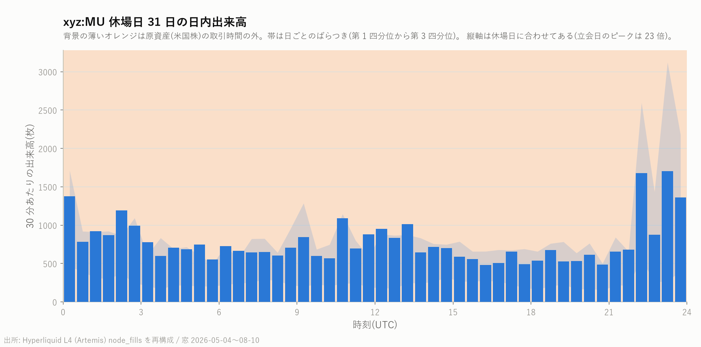
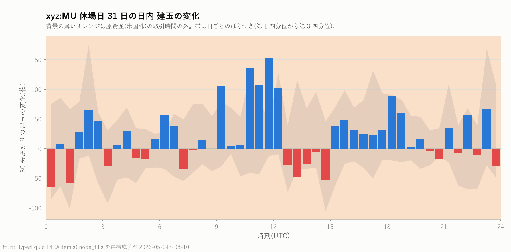
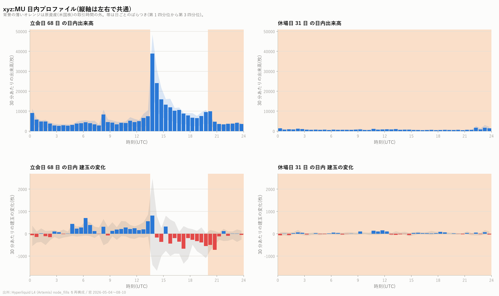

# xyz:MU 回転率・出来高と翌日建玉の関係・日内プロファイル

対象は [MU の日次平均建玉と出来高](mu_oi_volume_report.md) と同じ `xyz:MU`、
標本期間 2026 年 5 月 4 日から 8 月 10 日までの 99 日間。
建玉は約定履歴から復元した推定値で、その手順と検証は上記レポートの第 5 節にある。

出来高と建玉はどちらも **枚数** で扱う。名目ドルで取ると、期間中に価格が 1.5 倍に
なった影響が両辺へ共通して入り、見かけの関係が水増しされるため。

再現: `scripts/build_oi_volume.py` → `scripts/regress_oi_volume.py` / `scripts/plot_intraday.py`

---

## 1. 回転率

1 日の出来高がその日の平均建玉の何倍にあたるかを回転率とする。分子と分母が
どちらも枚数なので無次元である。

$$
\mathrm{Turnover}_t = \frac{\mathrm{Volume}_t}{\mathrm{OI}_t}
$$

| | 平均 | 中央値 |
|---|---:|---:|
| 全 99 日 | 2.240 | 1.863 |
| 立会日(68 日) | 3.090 | 2.860 |
| 休場日(31 日) | 0.376 | 0.299 |

最小は 0.130(8 月 8 日、土曜)、最大は 7.242(7 月 28 日、火曜)。

立会日には建玉のおよそ **3 倍** が 1 日で売買されている。建玉が 1 日に 3 回
入れ替わっているという意味ではなく、同じ玉が何度も往復している状態を指す。
休場日の 0.3 倍という水準は、原市場が閉じている間はほとんど手仕舞いも
新規建ても起きないことと整合する。

---

## 2. 当日の出来高と翌日の建玉

推定する式は次のとおり。$t$ 日は 99 日のうち翌日が存在する 98 日。

$$
\mathrm{OI}_{t+1} = \alpha + \beta\,\mathrm{Volume}_t + \varepsilon_t
$$

**時間契約**: 説明変数 $\mathrm{Volume}_t$ は $t$ 日の終了時点で確定し、目的変数
$\mathrm{OI}_{t+1}$ の期間は $t$ 日の終了後に始まる。したがって先読みは無い。

GLS は誤差に一次の自己相関を仮定し、Prais-Winsten 型の反復で $\rho$ を推定した。

$$
\varepsilon_t = \rho\,\varepsilon_{t-1} + u_t
$$

### 推定結果

| 手法 | 切片 | 傾き $\beta$ | 標準誤差 | $t$ | $p$ | 決定係数 |
|---|---:|---:|---:|---:|---:|---:|
| OLS | 92,458 | **0.0416** | 0.0067 | 6.20 | 1.4e-08 | 0.286 |
| OLS(Newey-West、5 次まで) | 同上 | 0.0416 | 0.0078 | 5.32 | 1.1e-07 | — |
| GLS($\rho = +0.787$) | 101,281 | **0.0111** | 0.0054 | 2.05 | 0.043 | — |

**OLS と GLS で傾きが 3.7 倍違う。** OLS 残差の Durbin-Watson は 0.690(無相関なら 2)で、
自己相関が強い。建玉も出来高もゆっくり動く系列なので、OLS はこの持続性を
「出来高が建玉を説明した」と読み替えてしまう。自己相関を織り込んだ GLS では
傾きが 4 分の 1 近くまで縮み、有意性も 5% をわずかに下回る水準まで落ちる。

### この関係は予測なのか

**同時点との比較**(建玉の当日値を同じ日の出来高に回帰):
OLS の傾き 0.0441($t$ = 6.41、決定係数 0.300)。翌日を見る場合(0.0416)と
ほとんど変わらない。つまりこの関係は「翌日を当てている」のではなく、
**出来高と建玉が同じ時期に一緒に高くなる** という同時性に近い。

**前日の建玉を対照に置いた場合**(目的変数を建玉の変化 $\mathrm{OI}_{t+1} - \mathrm{OI}_t$ にする):

| 手法 | 傾き | 標準誤差 | $t$ | $p$ | 決定係数 |
|---|---:|---:|---:|---:|---:|
| OLS | −0.0025 | 0.0048 | −0.51 | 0.61 | 0.003 |
| GLS | −0.0020 | 0.0048 | −0.41 | 0.69 | — |

**前日の建玉水準を知っている人にとって、出来高は翌日の建玉について何も足さない。**
表の決定係数 0.286 は、ほぼ全部が「建玉は前日の建玉に近い」という持続性で説明できる。

### プラセボ検定

説明変数を時間方向に $k$ 日ずらしても関係が残るなら、日を特定した対応ではない。

| $k$ | −5 | −3 | −1 | **0** | +1 | +3 | +5 |
|---|---:|---:|---:|---:|---:|---:|---:|
| 傾き | 0.0084 | 0.0140 | 0.0425 | **0.0416** | 0.0338 | 0.0181 | 0.0293 |
| $t$ | 1.06 | 1.80 | 6.38 | **6.20** | 4.73 | 2.35 | 3.98 |
| 決定係数 | 0.012 | 0.032 | 0.298 | **0.286** | 0.189 | 0.054 | 0.142 |

$k = -1$ でも $k = +1$ でも関係が残る。ここで先読みは構造上あり得ない(時間契約は
満たしている)ので、これは **数日にわたって続く共通の変動** を見ているという解釈になる。

### 群を分けた場合

| 群 | 観測数 | 傾き | $t$ | $p$ | 決定係数 |
|---|---:|---:|---:|---:|---:|
| 立会日のみ | 67 | 0.0634 | 7.72 | 9.2e-11 | 0.478 |
| 休場日のみ | 31 | 0.1305 | 1.66 | 0.108 | 0.087 |

散布図では休場日(橙)が出来高の低い側に固まるため、群の分離が傾きを作っている
のではないかと疑ったが、立会日だけに絞っても傾きはむしろ大きくなる。
群の分離が原因ではない。

### まとめ

- 図に描いた OLS と GLS の 2 本は、**同じデータから自己相関の扱いだけで
  3.7 倍違う傾きが出る** ことを示している。自己相関のある系列では OLS の
  標準誤差と決定係数をそのまま読んではいけない。
- 出来高から翌日の建玉を予測できるという主張は、**前日の建玉を対照に置くと消える**。
  報告するなら「出来高と建玉は同じ時期にともに高い」までに留めるべきである。

---

## 3. 日内プロファイル

30 分ごとに区切り、立会日 68 日と休場日 31 日それぞれで平均した。時刻はすべて UTC。
背景の薄いオレンジは原資産(米国株)の取引時間の外を表す。米国東部夏時間の
9:30-16:00 は UTC の 13:30-20:00 にあたり、標本期間は全日が夏時間である。
帯は日ごとのばらつき(第 1 四分位から第 3 四分位)。

建玉は約定のたびに変わる階段関数なので、区間の境界時刻の値は **後ろ向きの asof 結合**
(その時刻以前で最後の値)で取っている。

### 4 枚の図

縦軸を左右で揃えた比較図:

### 読み取れること

| | 立会日(68 日) | 休場日(31 日) |
|---|---:|---:|
| 1 日の出来高 | 331,136 枚 | 37,362 枚(立会日の 11.3%) |
| 出来高のピーク | **38,866 枚 / 30 分(13:30 UTC)** | 1,705 枚 / 30 分(23:00 UTC) |
| ピークが 1 日に占める割合 | 11.7% | 4.6% |
| 立会時間帯(13:30-20:00)の出来高 | 171,959 枚 = **51.9%** | 7,624 枚 = 20.4% |

立会時間帯は 1 日の 27.1%(6.5 時間)しかないのに、立会日の出来高の **51.9%** が
そこに集まる。最も濃いのは **ニューヨーク証券取引所が開く 13:30 UTC ちょうどの
30 分** で、この 1 本だけで 1 日の 11.7% を占める。原資産の価格発見が始まる瞬間に
取引が集中している。

休場日は 1 日を通して平坦で、原市場の時間帯に山ができない。休場日にできる
わずかな山は 23:00 UTC 前後にあり、これは米国東部時間の 19 時ごろにあたる。

### 建玉は原市場が閉じている間に積まれ、開いている間に落ちる

立会日の建玉の変化を時間帯ごとに合計し、68 日で平均した(片側検定ではなく両側)。

| 時間帯 | 平均 | 中央値 | $t$ | $p$ |
|---|---:|---:|---:|---:|
| 00:00-13:30(米国市場が開く前) | **+4,364 枚** | +3,070 | +3.05 | **0.0033** |
| 13:30-20:00(立会時間) | −2,772 枚 | −1,643 | −1.51 | 0.135 |
| 20:00-24:00(引け後) | **−1,332 枚** | −771 | −2.82 | **0.0063** |

検定は 6 通り(立会日と休場日 × 3 つの時間帯)行っているので、
Bonferroni の閾値は $0.05 / 6 = 0.0083$ である。この閾値でも
**開場前の積み増し**(0.0033)と **引け後の取り崩し**(0.0063)は残る。

立会時間中の減少(−2,772 枚)は **統計的に有意ではない**($p$ = 0.135)。
これは「効果が無い」という意味ではなく、68 日では日ごとのばらつきに対して
検出力が足りないという意味である。図の帯を見ても、開場直後のばらつきは
第 1 四分位から第 3 四分位で 3,000 枚を超える。

効果の大きさは、開場前の +4,364 枚が期間平均の建玉 101,960 枚に対して **4.3%** にあたる。
1 日の純増は +260 枚にすぎず、積み増しと取り崩しがほぼ相殺している。

休場日の建玉変化はどの時間帯も小さく、Bonferroni の閾値を超えるものは無い
(最小の $p$ は 00:00-13:30 の 0.027)。

---

## 4. 限界

1. 建玉は約定履歴からの復元値であり、期間中に一度も約定しなかった参加者の玉は
   含まれない。水準の推定には平均 ±2.0% の不確かさがある(詳細は
   [MU の日次平均建玉と出来高](mu_oi_volume_report.md) の第 5 節)。
   本レポートの結論は建玉の **変化** を見ているため、この定数分の誤差の影響は小さい。
2. 標本は 99 日、うち立会日 68 日・休場日 31 日しかない。時間帯ごとの検定は
   検出力が限られており、有意でない結果を「効果が無い」と読まないこと。
3. 標本期間は全日が米国東部夏時間である。冬時間を含む期間へ拡張する場合、
   立会時間の UTC 表現は 14:30-21:00 に変わるので、時間帯の区切りを
   固定値で書かず取引所カレンダーから引くこと。
4. 回転率・回帰・日内プロファイルはいずれも 1 銘柄の記述統計である。
   本リポジトリの目的である銘柄横断の比較は、他の 5 銘柄について
   同じ手順を実行してから行う。
