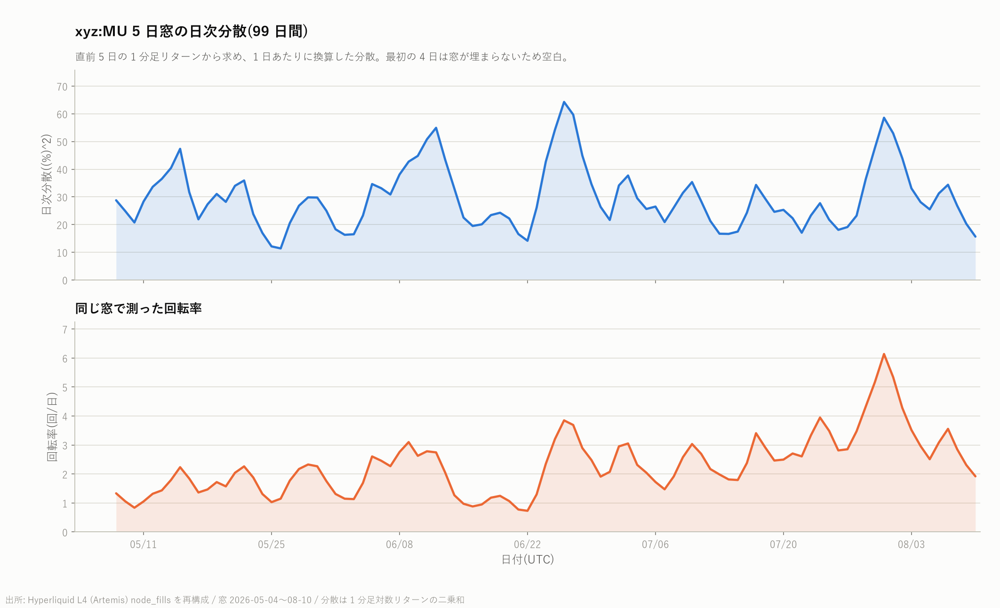
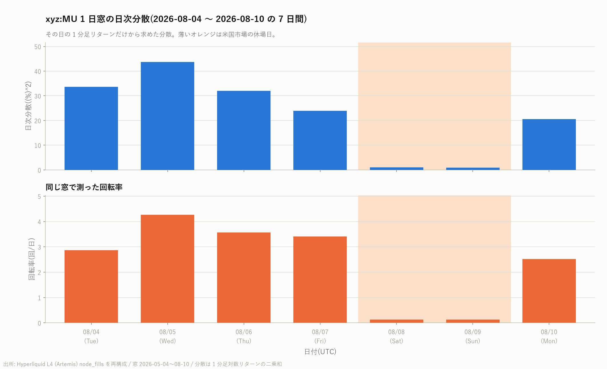
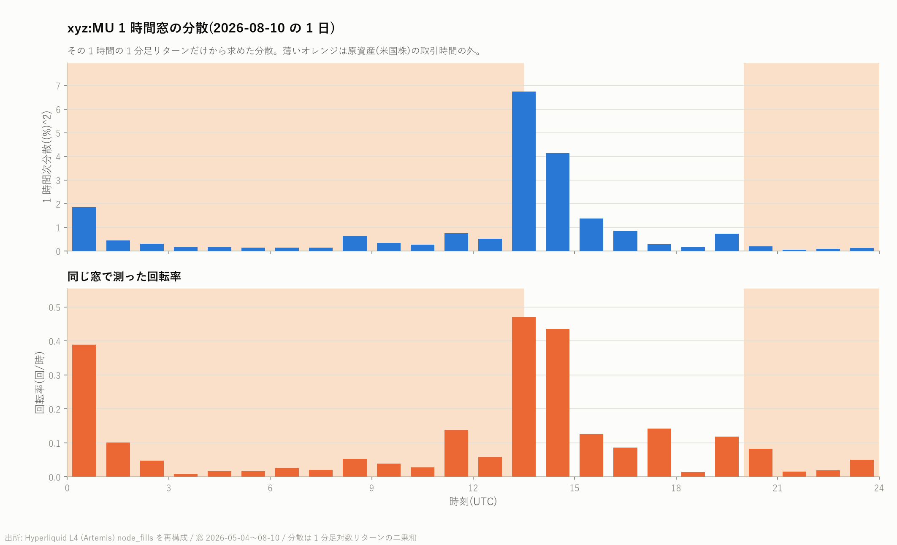

# xyz:MU 回転率・出来高と翌日建玉の関係・日内プロファイル

対象は [MU の日次平均建玉と出来高](mu_oi_volume_report.md) と同じ `xyz:MU`、
標本期間 2026 年 5 月 4 日から 8 月 10 日までの 99 日間。
建玉は約定履歴から復元した推定値で、その手順と検証は上記レポートの第 4 節にある。

出来高と建玉はどちらも **枚数** で扱う。名目ドルで取ると、期間中に価格が 1.5 倍に
なった影響が両辺へ共通して入り、見かけの関係が水増しされるため。

再現: `scripts/build_oi_volume.py` → `scripts/regress_oi_volume.py` / `scripts/plot_intraday.py`
(第 1〜4 節)、`scripts/build_variance.py`(第 5〜10 節)

---

## 1. 回転率

1 日の出来高がその日の平均建玉の何倍にあたるかを回転率とする。分子と分母が
どちらも枚数なので無次元である。

```math
\mathrm{Turnover}_t = \frac{\mathrm{Volume}_t}{\mathrm{OI}_t}
```

| | 平均 | 中央値 |
|---|---:|---:|
| 全 99 日 | 2.240 | 1.863 |
| 立会日(68 日) | 3.090 | 2.860 |
| 休場日(31 日) | 0.376 | 0.299 |

最小は 0.130(8 月 8 日、土曜)、最大は 7.242(7 月 28 日、火曜)。

立会日には建玉のおよそ **3 倍** が 1 日で売買されている。建玉が 1 日に 3 回
入れ替わっているという意味ではなく、同じ玉が何度も往復している状態を指す。
休場日の 0.3 倍という水準は、原市場が閉じている間はほとんど手仕舞いも
新規建ても起きないことと整合する。

---

## 2. 当日の出来高と翌日の建玉


立会日と休場日は出来高の水準も性質も違うため、**それぞれ別に当てはめて 4 本の線を引いた**。
線はその群が実際に取った出来高の範囲だけに引いてある。

推定する式は次のとおり。$`t`$ 日は 99 日のうち翌日が存在する 98 日。

```math
\mathrm{OI}_{t+1} = \alpha + \beta \mathrm{Volume}_t + \varepsilon_t
```

**時間契約**: 説明変数 $`\mathrm{Volume}_t`$ は $`t`$ 日の終了時点で確定し、目的変数
$`\mathrm{OI}_{t+1}`$ の期間は $`t`$ 日の終了後に始まる。したがって先読みは無い。

GLS は誤差に一次の自己相関を仮定し、Prais-Winsten 型の反復で $`\rho`$ を推定した。

```math
\varepsilon_t = \rho\,\varepsilon_{t-1} + u_t
```

### 推定結果(図の 4 本の線)

**立会日のみ**(観測数 67、$`\rho = +0.693`$、Durbin-Watson 1.367):

| 手法 | 切片 | 傾き $`\beta`$ | 標準誤差 | $`t`$ | $`p`$ | 決定係数 |
|---|---:|---:|---:|---:|---:|---:|
| OLS | 82,259 | **0.0634** | 0.0082 | 7.72 | 9.2e-11 | 0.478 |
| OLS(Newey-West、5 次まで) | 同上 | 0.0634 | 0.0093 | 6.82 | 9.0e-12 | — |
| GLS | 101,062 | **0.0119** | 0.0114 | 1.05 | 0.298 | — |

**休場日のみ**(観測数 31、$`\rho = +0.813`$、Durbin-Watson 0.562):

| 手法 | 切片 | 傾き $`\beta`$ | 標準誤差 | $`t`$ | $`p`$ | 決定係数 |
|---|---:|---:|---:|---:|---:|---:|
| OLS | 95,569 | **0.1305** | 0.0786 | 1.66 | 0.108 | 0.087 |
| OLS(Newey-West、5 次まで) | 同上 | 0.1305 | 0.0773 | 1.69 | 0.091 | — |
| GLS | 103,058 | **0.0157** | 0.0373 | 0.42 | 0.677 | — |

**どちらの群でも、OLS と GLS で傾きが 5 倍以上違う。** 立会日では 0.0634 から 0.0119 へ、
休場日では 0.1305 から 0.0157 へ縮む。OLS 残差の Durbin-Watson は 1.367 と 0.562 で、
無相関の目安である 2 から離れている。建玉も出来高もゆっくり動く系列なので、
OLS はこの持続性を「出来高が建玉を説明した」と読み替えてしまう。
**自己相関を織り込むと、どちらの群でも傾きは有意でなくなる**
($`p`$ = 0.298 と 0.677)。

参考までに、全 98 日をまとめて当てはめた場合は OLS の傾き 0.0416
($`t`$ = 6.20、決定係数 0.286)、GLS の傾き 0.0111($`t`$ = 2.05、$`p`$ = 0.043、
$`\rho`$ = +0.787)である。

**まとめた場合の GLS は 5% をわずかに下回り、群に分けると下回らなくなる。**
この食い違いは隠さず書いておく。観測数が 98 から 67 と 31 に減れば標準誤差は
広がるので、群ごとに有意でないことは **「関係が無い」ことの証拠ではなく、
この標本では判別できないという意味** である。実際、立会日の GLS の傾き 0.0119 は
まとめた場合の 0.0111 とほぼ同じ大きさで、変わったのは主に標準誤差
(0.0054 → 0.0114)のほうである。どちらの読み方をしても、次節の
「前日の建玉を対照に置くと消える」という結論は変わらない。

なお群ごとの GLS が仮定する「一次の自己相関」は、**その群の中で連続する観測**の間の
相関を指す。立会日なら連続する立会日どうしだが、休場日は土・日・土…という並びに
なるため、暦日として等間隔ではない。この点は解釈上の弱みとして明記しておく。

### この関係は予測なのか

**同時点との比較**(建玉の当日値を同じ日の出来高に回帰):
OLS の傾き 0.0441($`t`$ = 6.41、決定係数 0.300)。翌日を見る場合(0.0416)と
ほとんど変わらない。つまりこの関係は「翌日を当てている」のではなく、
**出来高と建玉が同じ時期に一緒に高くなる** という同時性に近い。

**前日の建玉を対照に置いた場合**(目的変数を建玉の変化 $`\mathrm{OI}_{t+1} - \mathrm{OI}_t`$ にする):

| 手法 | 傾き | 標準誤差 | $`t`$ | $`p`$ | 決定係数 |
|---|---:|---:|---:|---:|---:|
| OLS | −0.0025 | 0.0048 | −0.51 | 0.61 | 0.003 |
| GLS | −0.0020 | 0.0048 | −0.41 | 0.69 | — |

**前日の建玉水準を知っている人にとって、出来高は翌日の建玉について何も足さない。**
表の決定係数 0.286 は、ほぼ全部が「建玉は前日の建玉に近い」という持続性で説明できる。

### プラセボ検定

説明変数を時間方向に $`k`$ 日ずらしても関係が残るなら、日を特定した対応ではない。

| $`k`$ | −5 | −3 | −1 | **0** | +1 | +3 | +5 |
|---|---:|---:|---:|---:|---:|---:|---:|
| 傾き | 0.0084 | 0.0140 | 0.0425 | **0.0416** | 0.0338 | 0.0181 | 0.0293 |
| $`t`$ | 1.06 | 1.80 | 6.38 | **6.20** | 4.73 | 2.35 | 3.98 |
| 決定係数 | 0.012 | 0.032 | 0.298 | **0.286** | 0.189 | 0.054 | 0.142 |

$`k = -1`$ でも $`k = +1`$ でも関係が残る。ここで先読みは構造上あり得ない(時間契約は
満たしている)ので、これは **数日にわたって続く共通の変動** を見ているという解釈になる。

### 群の分離が傾きを作っているのではないか

散布図では休場日(橙)が出来高の低い側に固まるため、2 つの塊が離れているだけで
右上がりに見えている可能性を疑った。しかし立会日だけに絞った OLS の傾きは 0.0634 と、
全体をまとめた 0.0416 よりむしろ大きい。**群の分離が原因ではない。**

一方で休場日の OLS(傾き 0.1305)は、出来高の幅がほとんど無い 31 点への当てはめであり、
標準誤差が 0.0786 と大きく有意でない。図でも橙の実線が短い区間に急な角度で
引かれているとおり、この傾きは信頼できない。

### まとめ

- 図に描いた 4 本の線は、**同じデータから自己相関の扱いだけで 5 倍以上違う傾きが出る**
  ことを示している。自己相関のある系列では OLS の標準誤差と決定係数を
  そのまま読んではいけない。
- 出来高から翌日の建玉を予測できるという主張は、**前日の建玉を対照に置くと消える**。
  報告するなら「出来高と建玉は同じ時期にともに高い」までに留めるべきである。

---

## 3. 日内プロファイル

30 分ごとに区切り、立会日 68 日と休場日 31 日それぞれで平均した。時刻はすべて UTC。
背景の薄いオレンジは原資産(米国株)の取引時間の外を表す。米国東部夏時間の
9:30-16:00 は UTC の 13:30-20:00 にあたり、標本期間は全日が夏時間である。
帯は日ごとのばらつき(第 1 四分位から第 3 四分位)。

建玉は約定のたびに変わる階段関数なので、区間の境界時刻の値は **後ろ向きの asof 結合**
(その時刻以前で最後の値)で取っている。

### 4 枚の図


縦軸を左右で揃えた比較図:


### 読み取れること

| | 立会日(68 日) | 休場日(31 日) |
|---|---:|---:|
| 1 日の出来高 | 331,136 枚 | 37,362 枚(立会日の 11.3%) |
| 出来高のピーク | **38,866 枚 / 30 分(13:30 UTC)** | 1,705 枚 / 30 分(23:00 UTC) |
| ピークが 1 日に占める割合 | 11.7% | 4.6% |
| 立会時間帯(13:30-20:00)の出来高 | 171,959 枚 = **51.9%** | 7,624 枚 = 20.4% |

立会時間帯は 1 日の 27.1%(6.5 時間)しかないのに、立会日の出来高の **51.9%** が
そこに集まる。最も濃いのは **ニューヨーク証券取引所が開く 13:30 UTC ちょうどの
30 分** で、この 1 本だけで 1 日の 11.7% を占める。原資産の価格発見が始まる瞬間に
取引が集中している。

休場日は 1 日を通して平坦で、原市場の時間帯に山ができない。休場日にできる
わずかな山は 23:00 UTC 前後にあり、これは米国東部時間の 19 時ごろにあたる。

### 建玉は原市場が閉じている間に積まれ、開いている間に落ちる

立会日の建玉の変化を時間帯ごとに合計し、68 日で平均した(片側検定ではなく両側)。

| 時間帯 | 平均 | 中央値 | $`t`$ | $`p`$ |
|---|---:|---:|---:|---:|
| 00:00-13:30(米国市場が開く前) | **+4,364 枚** | +3,070 | +3.05 | **0.0033** |
| 13:30-20:00(立会時間) | −2,772 枚 | −1,643 | −1.51 | 0.135 |
| 20:00-24:00(引け後) | **−1,332 枚** | −771 | −2.82 | **0.0063** |

検定は 6 通り(立会日と休場日 × 3 つの時間帯)行っているので、
Bonferroni の閾値は $`0.05 / 6 = 0.0083`$ である。この閾値でも
**開場前の積み増し**(0.0033)と **引け後の取り崩し**(0.0063)は残る。

立会時間中の減少(−2,772 枚)は **統計的に有意ではない**($`p`$ = 0.135)。
これは「効果が無い」という意味ではなく、68 日では日ごとのばらつきに対して
検出力が足りないという意味である。図の帯を見ても、開場直後のばらつきは
第 1 四分位から第 3 四分位で 3,000 枚を超える。

効果の大きさは、開場前の +4,364 枚が期間平均の建玉 101,960 枚に対して **4.3%** にあたる。
1 日の純増は +260 枚にすぎず、積み増しと取り崩しがほぼ相殺している。

休場日の建玉変化はどの時間帯も小さく、Bonferroni の閾値を超えるものは無い
(最小の $`p`$ は 00:00-13:30 の 0.027)。

---

## 4. 限界

1. 建玉は約定履歴からの復元値であり、期間中に一度も約定しなかった参加者の玉は
   含まれない。水準の推定には平均 ±2.0% の不確かさがある(詳細は
   [MU の日次平均建玉と出来高](mu_oi_volume_report.md) の第 4 節)。
   本レポートの結論は建玉の **変化** を見ているため、この定数分の誤差の影響は小さい。
2. 標本は 99 日、うち立会日 68 日・休場日 31 日しかない。時間帯ごとの検定は
   検出力が限られており、有意でない結果を「効果が無い」と読まないこと。
3. 標本期間は全日が米国東部夏時間である。冬時間を含む期間へ拡張する場合、
   立会時間の UTC 表現は 14:30-21:00 に変わるので、時間帯の区切りを
   固定値で書かず取引所カレンダーから引くこと。
4. 回転率・回帰・日内プロファイルはいずれも 1 銘柄の記述統計である。
   本リポジトリの目的である銘柄横断の比較は、他の 5 銘柄について
   同じ手順を実行してから行う。

---

同じ量を **5 日・1 日・1 時間** の 3 つの算出期間で測り、それぞれに対応する回転率を
並べて示す。

## 5. 定義

### 実現分散

1 分ごとの最終約定値で価格系列を作り、その対数差をリターンとする。窓 $`W`$ の
実現分散は、窓に含まれる 1 分足リターンの二乗和である。

```math
\mathrm{RV}(W) = \sum_{i \in W} r_i^2, \qquad r_i = \ln\frac{p_i}{p_{i-1}}
```

約定が 1 件も無い分は直前の値を持ち越した。該当するのは 142,559 分のうち **1.0%** で、
この扱いによる分散の過小評価はごく小さい。

窓の長さが違うものを並べるので、**単位時間あたりに揃えて**比較する。

| 呼び名 | 算出期間 | 単位 | 図の横軸 |
|---|---|---|---|
| 5 日窓の日次分散 | その日を含む直前 5 日 | 1 日あたり($`\mathrm{RV}`$ を 5 で割る) | 99 日間 |
| 1 日窓の日次分散 | その日 | 1 日あたり | 1 週間 |
| 1 時間窓の 1 時間次分散 | その 1 時間 | 1 時間あたり | 1 日間 |

数値は $`(\%)^2`$ で表示する(対数リターンを百分率に直した分散)。
たとえば 25 は日次ボラティリティ 5% にあたる。

### 回転率

**分散とまったく同じ窓**で測る。分子はその窓の出来高(枚)、分母はその窓の
時間加重平均建玉(枚)。分子と分母がどちらも枚数なので無次元である。

```math
\mathrm{Turnover}(W) = \frac{\mathrm{Volume}(W)}{\overline{\mathrm{OI}}(W)}
```

5 日窓は日あたりに揃えるため 5 で割る。1 日窓と 1 時間窓はそのまま
(単位はそれぞれ「回/日」「回/時」)。

### 窓の選び方

結果を見てから都合の良い期間を選ぶと生存バイアスになるので、機械的な規則で決めた。
1 週間の図は **標本の最後の 7 日**(8 月 4 日〜10 日)、1 日の図は
**標本の最終日**(8 月 10 日)である。

---

## 6. 5 日窓の日次分散(99 日間)



| | 中央値 | 最小 | 最大 |
|---|---:|---:|---:|
| 日次分散 $`(\%)^2`$ | 27.32 | 11.39 | 64.29 |
| 日次ボラティリティ | 5.23% | 3.37% | 8.02% |
| 回転率(回/日) | 2.26 | — | — |

5 日で均すと分散は 11 から 64 の範囲、日次ボラティリティにして 3.4% から 8.0% を
行き来する。**回転率は分散とほぼ同じ形で動く。** 6 月下旬と 7 月末の 2 回、
分散の山と回転率の山が重なっている。

最初の 4 日は窓が埋まらないため空白にしてある。

---

## 7. 1 日窓の日次分散(1 週間)



窓を 1 日に縮めると、5 日窓では均されていた**立会日と休場日の落差**がそのまま出る。

| 日付 | 曜日 | 日次分散 $`(\%)^2`$ | 回転率(回/日) |
|---|---|---:|---:|
| 08-04 | 火 | 33.7 | 2.86 |
| 08-05 | 水 | 43.7 | 4.26 |
| 08-06 | 木 | 32.0 | 3.57 |
| 08-07 | 金 | 23.9 | 3.41 |
| 08-08 | **土** | **1.0** | **0.13** |
| 08-09 | **日** | **0.9** | **0.13** |
| 08-10 | 月 | 20.5 | 2.52 |

**土日の分散は平日のおよそ 1/32、回転率は 1/25 に落ちる。**
平日 5 日の平均は分散 30.8・回転率 3.32、土日 2 日の平均は分散 0.95・回転率 0.131 である。
原資産である米国株の価格が動かない日は、perp の価格もほとんど動かず、玉も回らない。
2 つの量がそろって同じ程度の比率で落ちている点に注目したい。

期間全体で見ても、1 日窓の分散は最小 0.89(休場日)から最大 95.42 まで
100 倍以上の幅がある。最大は **2026 年 6 月 24 日** で、この日は Micron の
決算発表があった([出来高の買い・売り内訳と標本期間のニュース](mu_volume_side_news_report.md) を参照)。

---

## 8. 1 時間窓の分散(1 日)



さらに窓を 1 時間に縮めると、**1 日の中の集中**が見える。8 月 10 日(月曜、立会日)では

- 13:00-14:00 UTC の分散が 6.75 $`(\%)^2`$ で、1 日の中で突出して大きい。
  この時間帯にニューヨーク証券取引所が開く(13:30 UTC = 米国東部夏時間 9:30)。
- 続く 14:00-15:00 UTC が 4.13 $`(\%)^2`$ で 2 番目。
- 深夜から午前(01:00-12:00 UTC)は 0.13〜0.76 $`(\%)^2`$ で静か。

回転率も同じ 2 本の時間帯で 0.469 回/時、0.435 回/時と跳ね、01:00-12:00 UTC の
0.008〜0.137 回/時と大きく違う。**分散の山と回転率の山は同じ時間に立つ。**

期間全体では 1 時間窓の分散は中央値 0.567、最大 33.88 $`(\%)^2`$ である。

---

## 9. 分散と回転率の関係

3 つの尺度すべてで、分散と回転率は同じ向きに動いた。対数どうしの相関を取ると

| 尺度 | 相関係数 | 観測数 |
|---|---:|---:|
| 日次($`\log`$ 分散 と $`\log`$ 回転率) | **+0.918** | 99 |
| 1 時間($`\log`$ 分散 と $`\log`$ 回転率) | **+0.858** | 2,371 |

**これは同時点の関係であって、予測力ではない。** 同じ窓で測った 2 つの量を
並べただけなので、片方からもう片方を当てられるという意味は一切含まない。
予測の主張をするには、説明変数が確定する時刻を目的変数の期間の開始時刻より
前に置いた設計が必要で、それは本レポートの第 2 節で扱っている
(そこでは、前日の建玉を対照に置くと出来高の説明力は消えた)。

---

## 10. 限界

1. 1 分足の欠測(1.0%)を直前値の持ち越しで埋めているため、分散はわずかに
   過小評価される。窓が短いほどこの影響は相対的に大きくなるので、
   1 時間窓の値を 1 日窓と直接比べる際は注意すること。
2. 回転率の分母である建玉は約定履歴からの復元値で、水準に平均 ±2.0% の
   不確かさがある(詳細は [日次平均建玉と出来高](mu_oi_volume_report.md) の第 4 節)。
   ただし本レポートは主に**時間方向の変化**を見ており、水準の定数誤差の影響は小さい。
3. 1 週間の図と 1 日の図はそれぞれ 7 点・24 点しかない。ここに見えた形が
   期間を通じて成り立つかは、第 6 節の 99 日の図と第 9 節の相関で確かめること。
4. 1 銘柄の記述統計である。銘柄横断の比較は他の 5 銘柄に同じ手順を適用してから行う。
