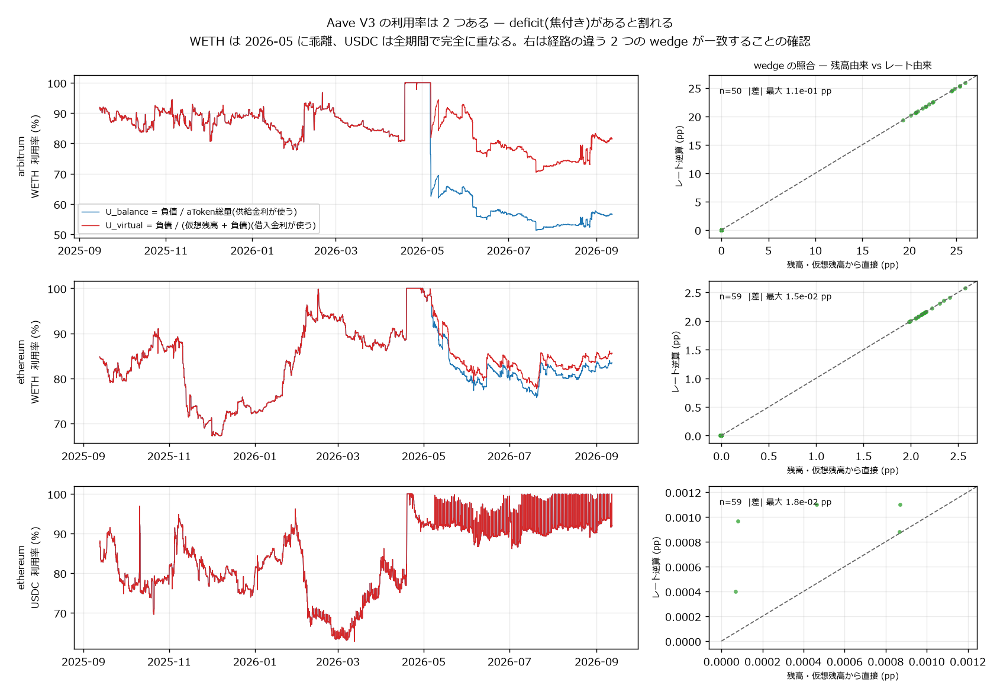
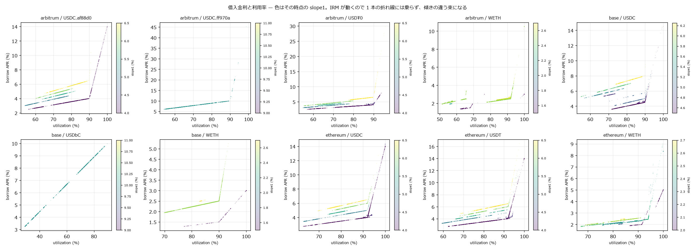
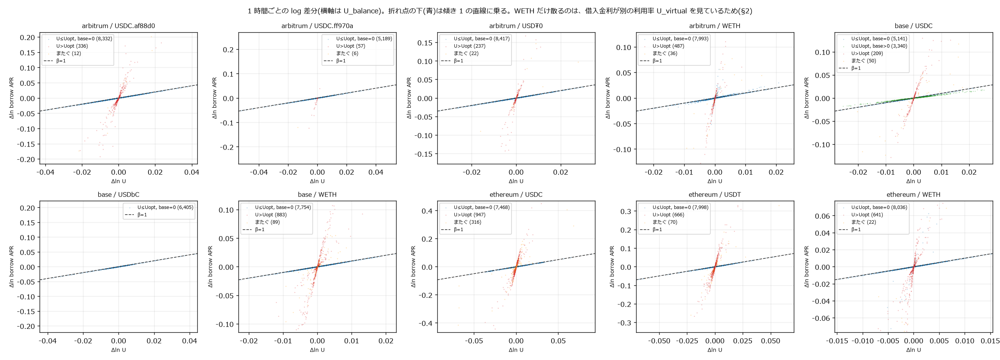
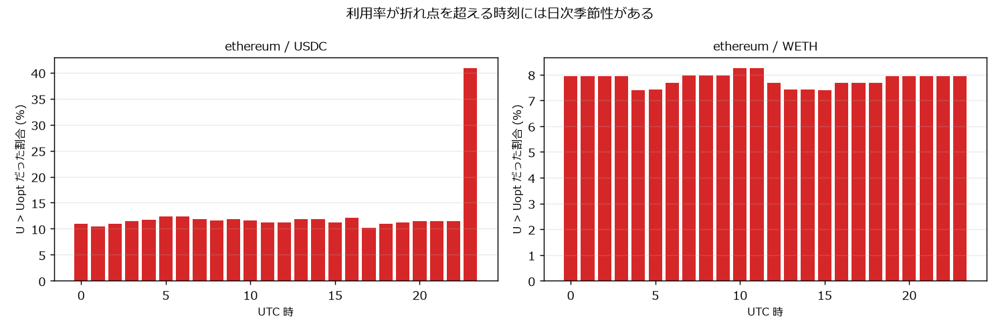
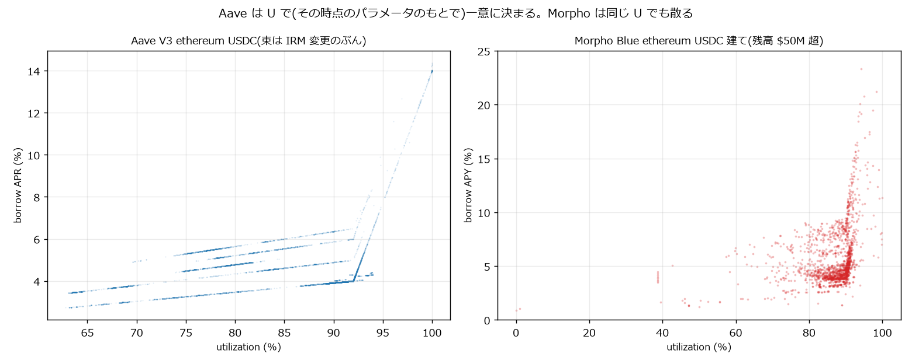
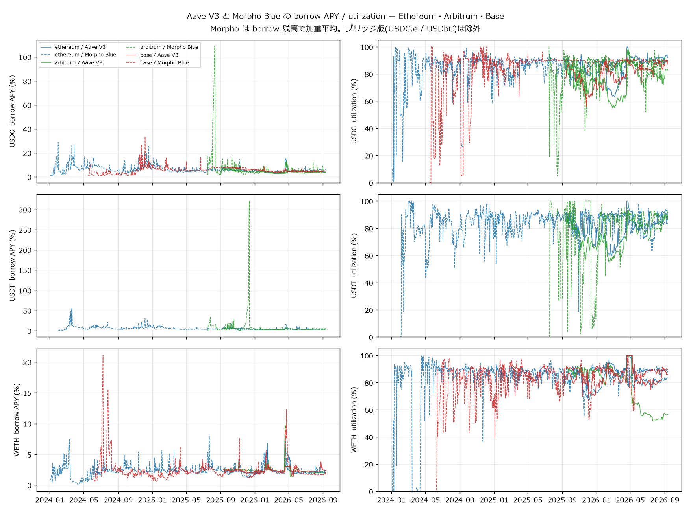
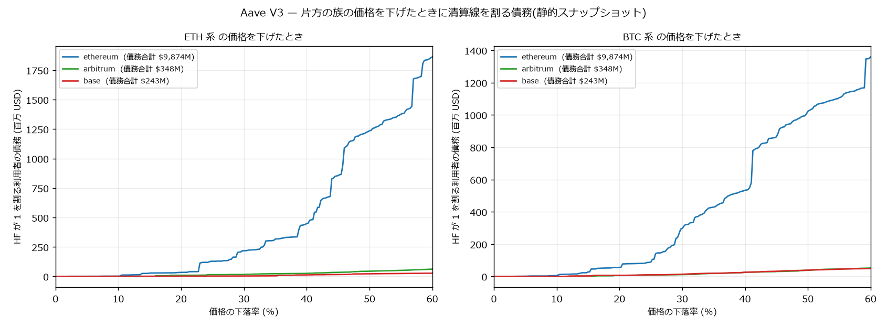
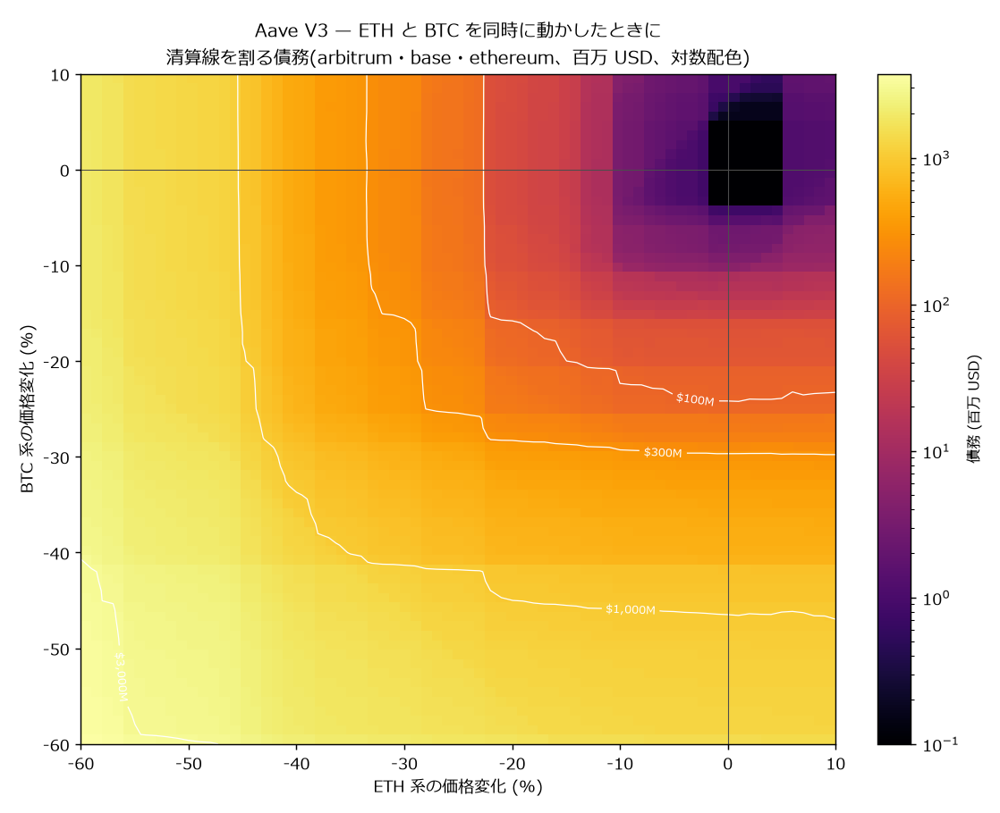

# Aave 分析索引

[← ホーム](../../README.md)

<p>
  <a href="https://aave.com/"></a>
</p>

| 項目 | 内容 |
|---|---|
| プロトコル | [Aave](https://aave.com/) V3。過剰担保型の貸借プロトコル |
| 対象 | Ethereum / Arbitrum One / Base の USDC・USDT・WETH(+ ブリッジ版 3 本) |
| データの出所 | オンチェーンのログと `eth_call`。集計サイトは使わない |
| 粒度 | **全トランザクション**(`ReserveDataUpdated` イベント 1 本ごと) |
| 規模 | 3 チェーン合計 **941 万イベント**(2025-09 〜 2026-09、1 年) |
| 状態 | 金利構造の分析と清算ヒートマップまで完了 |
| 作業場所 | `C:\Users\ii562\defi-rates` |

---

## この対象を他と分けて扱う理由

板ではなく**金利と担保**の市場なので、マイクロストラクチャーの指標がそのままは
当てはまらない。ここで測るのは供給金利・借入金利・利用率の関係と、その裏にある
決定的な規則である。

そして先に結論を書くと、**この 3 つは「相関を探す対象」ではない。プロトコルの
定義で結ばれている。** 意味があるのは相関の有無ではなく、どの関数形で結ばれ、
実データがその形に合っているか、変化がどう伝わるかである。

```
U <= Uopt :  r_b = base + slope1 · U / Uopt
U >  Uopt :  r_b = base + slope1 + slope2 · (U − Uopt) / (1 − Uopt)
r_s = r_b · U · (1 − reserveFactor)
```

---

## 1. ★ Aave の利用率は 1 つではない

この案件で一番大きな発見。**供給金利と借入金利は別々の利用率を見ている。**

```
U_balance = 負債 / aToken総量                       ← 供給金利が使う
U_virtual = 負債 / (仮想残高 + 負債)                 ← 借入金利(IRM)が使う
```

aToken の総量には **deficit(回収不能債権)の分まで含まれる**ので、焦付きのある
準備金では両者が割れる。deficit がゼロなら一致する。



*左: WETH は 2026-05 に 2 本が分離し、USDC は全期間で完全に重なる。右: 経路の
まったく違う 2 つの wedge(残高と仮想残高から直接 / 2 本のレートから逆算)の照合。
最下段の USDC だけ点が y=x から外れて見えるが、軸の単位が 0.001 パーセント
ポイントなので、これは deficit がゼロであることの裏返しでしかない。*

実測(2026-09 時点):

| chain | asset | U_balance | U_virtual | deficit | aToken 比 |
|---|---|---|---|---|---|
| arbitrum | WETH | 0.5653 | 0.8132 | 29,835 ETH | **30.8%** |
| ethereum | WETH | 0.8072 | 0.8277 | 52,964 ETH | 2.82% |
| ethereum | USDC | 0.9212 | 0.9212 | 1.55 USDC | 0.00% |
| base | USDC / WETH | 一致 | 一致 | ほぼゼロ | 0.00% |

**Arbitrum の WETH は aToken 総量の 30.8% が焦付きに裏付けられている。** 借り手から
見れば手元の ETH はほぼ貸し切り(81.3%)だが、預金者から見ると請求権の半分強
(56.5%)しか働いていない。受け取る利息はその比の分だけ薄まる。

### なぜ気づけたか

WETH だけ 2026-05-18 以降、**両チェーン同時に**借入金利が IRM と合わなくなった。
最初は式が変わったのかと疑ったが、ストラテジ契約は同じで USDC は合っていた。
真の残高を読んで初めて、式ではなく**入力が違う**と判った。

### 3 つの量の関係(実測で検算済み)

```
totalAToken  =  仮想残高  +  負債  +  deficit  −  未計上の treasury 分
```

Ethereum WETH での検算: totalAToken 2,119,365.27 に対し 仮想残高+負債 2,066,501.85、
差 52,863.42 のうち deficit 52,964.45 / 未計上 treasury 102.22 → **残差 1.18**(5.6e-7)。
USDC / USDT / Base でも残差は aToken 総量の 1e-7 程度に収まった。

### 仮想残高は「契約が実際に持っている残高」ではない

プロトコルが入出金を自分で加算減算する内部カウンタで、**直接送りつけられた
トークンを数えない**。実測で Ethereum の USDC は aToken 契約に 31,731 USDC が
誰の請求権にもならず転がっていた。

なぜそうするか: `balanceOf` は**プロトコルの許可なく外部から書き換えられる**。
もし金利計算に使っていたら、送りつけるだけで金利を動かせる。現在の状態から
試算すると:

| chain | asset | 手元流動性 | −100bp に必要な送金額 |
|---|---|---|---|
| base | **USDbC** | 44,086 | **22,422** |
| arbitrum | **USDC.e** | 183,132 | **136,721** |
| base | USDC | 24.8M | 52.0M |
| ethereum | USDC | 206.4M | **726.4M** |

大きいプールは安全でも、小さいプールは $22k で 100bp 動く。しかも `balanceOf`
会計だと寄付分が「貸せる流動性」に数えられるので担保を入れて借り戻せる —
実質コストは借入コストだけになる(これは会計規則からの帰結であって、本番で
実行して確かめたわけではない)。

---

## 2. 借入金利は利用率の折れ線関数 — ただしパラメータは動く



*色はその時点の slope1。IRM が動くので 1 本の折れ線には乗らず、傾きの違う束になる。*

**IRM のパラメータは 1 年で何度も変わっていた。** Ethereum 62 件 / Arbitrum 24 件は
`RateDataUpdate` ログの件数(Ethereum のうち 3 件は同値の再送なので実変更は 59)。
Base はログが引けないのでアーカイブ走査で数え、**実変更 17 回**。
Uopt が 0.92↔0.94 で往復する資産もある。Arbitrum の USDC は slope1 が
6.5% → 6.0% → 5.5% → 5.0% → 4.0% と 5 段階で下がった。

時点ごとのパラメータを当てると、観測した借入金利は理論値と一致する:

| chain | asset | 相対残差 中央値 | 1% 以内の割合 | (参考)現在値を 1 年に当てた場合 |
|---|---|---|---|---|
| ethereum | USDC | 5.6e-08 | 100.0% | 1.4e-01 |
| ethereum | USDT | 5.8e-08 | 100.0% | 1.4e-01 |
| arbitrum | USDC(native) | 6.9e-08 | 100.0% | 5.0e-05 |
| base | USDC | 7.0e-08 | 100.0% | — |

最後の列が罠である。**同じデータでも現在値のパラメータを 1 年に当てると残差が
2〜3 桁悪化する。**

---

## 3. log 差分 — 弾性は折れ点の上下で一桁変わる



1 時間ごとの `Δln r_b = α + β Δln U`。標準誤差は Newey-West(24 ラグ = 1 日)。

**切片 base = 0 のとき `r_b ∝ U` なので β = 1 ちょうど**になるはずである。実測:

| regime | 資産 | β 実測 (NW SE) | β 理論値 | R² |
|---|---|---|---|---|
| U≤Uopt, **base=0** | 8 資産 | **1.00000〜1.00023** | 1.00000 | ≥ 0.99914 |
| U≤Uopt, **base>0** | base USDC(3,340 時間) | **0.72681** (0.0111) | **0.71515** | 0.99543 |
| U>Uopt | 全資産 | 12.7〜18.9 | 6.3〜23.5 | — |

10 資産中 9 つは全期間 base = 0 だったが、**Base の USDC は一時期 base が最大 1.75%**
あった。切片があると弾性は 1 を割る。事前に計算できる 0.7152 に対し実測 0.7268 で、
これは非自明な予測の的中である。

残る 2 つ(Ethereum / Arbitrum の WETH)が β 1.18 / 1.67 と外れるのは**関係が弱い
からではなく、借入金利が §1 の別の利用率を見ているから**である。

### 同時点であって予測ではない

β = 1 に乗るのは「同じトランザクションで両方が更新されるから」で、予測力ではない。

| 種別 | β | R² |
|---|---|---|
| 同時点 | 1.0000〜1.0002 | ≥ 0.9991 |
| 予測(t→t+1) | −0.14〜−0.01 | ≤ 0.0011 |
| プラセボ(13h / 37h シフト) | ≈ 0 | ≤ 0.0009 |

---

## 4. ★ プラセボを 24 時間シフトにしてはいけない



利用率が折れ点を超える時刻には日次季節性がある。Ethereum の USDC は 23 時(UTC)
が最頻で、一様の 3.2 倍が集中する。**24 時間シフトのプラセボでは対応が保たれてしまう。**

regime の誤分類を含んでいた途中版では、ethereum USDC の 24h プラセボが **R²=0.76**
で本物と見分けがつかなかった。最終版でも **R²=0.12・t=4.9** 残る一方、13h / 37h
シフトは R² < 0.001 に落ちる。

---

## 5. Aave と Morpho の違い



Aave の IRM は利用率の関数だが、Morpho の AdaptiveCurve IRM は目標利用率からの
乖離の**履歴**で水準そのものが漂う。同じ利用率でも金利が散る。詳細は
[Morpho の分析](../morpho/README.md)。



---

## 6. 清算ヒートマップ

Morpho は隔離市場なので清算価格が一意に決まり API がそのまま返すが、
**Aave は 1 人が複数の担保と複数の債務を持つので自分で解く必要がある**。
その代わり、**2 つの価格を同時に動かした面**が描ける。

```
HF(mE, mB) = (C_E·mE + C_B·mB + C_oth) / (D_E·mE + D_B·mB + D_oth)

片方だけ動かすなら  m* = (D_oth − C_oth) / (C_F − D_F)
```

C は担保価値 × 清算閾値、D は債務価値。`getUserAccountData` の合計から族の分を
引いた残りを C_oth / D_oth に置く。

### 取得

| 段階 | 実測 |
|---|---|
| 借り手の列挙(`Borrow` イベント全史) | Ethereum 85,708 / Arbitrum 187,302 アドレス。103 / 249 コール |
| 口座状態(Multicall3 `getUserAccountData`) | **600 件/コール・1.6 秒** |
| 資産別の建玉(`getUserReserveData` × 族の準備金) | Ethereum 17 本 × 28,030 人 = 39 分 |

対象は **3 チェーン 100,623 人 / 債務 $10.22B**。

### ★ 検証

分解した「担保 × 清算閾値 ÷ 債務」を報告値の HF と突き合わせた。

```
相対差  中央値 1.55e-16 / 95%点 1.08e-04 / 最大 1.98e-04  (n=27,845、Ethereum)
```

**恒等式として合っている。** 借り手の捕捉率も、プロトコル全体の債務を分母にして測った。

| chain | 捕まえた債務 | プロトコル全体 | 捕捉率 |
|---|---|---|---|
| ethereum | $9,873.9M | $9,804.8M | 100.7% |
| arbitrum | $347.6M | $345.9M | 100.5% |
| **base** | $242.5M | $353.3M | **68.6%** |

100% を数%超えるのは分子と分母の取得時刻が 1 時間ほどずれているため。
**Base だけ 68.6% に留まる**のは、公開 RPC の getLogs が 1,000 ブロック上限で
配備時点からの全走査に約 49,000 コール要るため窓(120 日)を切ったから。
Base の数字は**下振れ**である。

### 片方の族だけ動かす



清算線を割る債務(百万 USD):

| 族 | chain | 債務合計 | −5% | −10% | −20% | −30% | −50% |
|---|---|---|---|---|---|---|---|
| ETH 系 | ethereum | 9,874 | 0.9 | 2.0 | 33.7 | 217.7 | 1,235.4 |
| ETH 系 | arbitrum | 348 | 0.1 | 0.3 | 9.5 | 16.4 | 44.3 |
| ETH 系 | base | 242 | 0.2 | 1.1 | 1.6 | 3.9 | 22.0 |
| BTC 系 | ethereum | 9,874 | 1.3 | 4.9 | 55.5 | 297.1 | 1,022.2 |
| BTC 系 | arbitrum | 348 | 0.1 | 0.2 | 6.0 | 11.1 | 38.5 |
| BTC 系 | base | 242 | 0.1 | 0.2 | 6.5 | 13.0 | 38.5 |

**Aave の借り手は Morpho より遥かに保守的である。** ETH が 20% 下げても
Ethereum で清算線を割るのは債務 $9,874M のうち **$33.7M(0.34%)**にすぎない。
HF の中央値が 2.05 なので、本格的に効くのは −40% 以降になる。

対して Morpho は、ステーブル担保でステーブルを借りる建玉が $560M あり、その
**$306M が 2.5% の相対変動**で清算線に触れる([Morpho の分析](../morpho/README.md))。
**同じ「貸借」でも、積み上がっているレバレッジの質がまるで違う。**

### ETH と BTC を同時に動かす



隔離市場の Morpho では作れない図である。等高線は清算線を割る債務の合計。

| 同時に動かす | 清算線を割る債務 |
|---|---|
| 両方 −10% | $11M |
| 両方 −20% | $119M |
| 両方 −30% | $609M |
| 両方 −50% | $2,687M |

片方だけ −30% にしたときの合計($217.7+16.4+3.9 = 238M、ETH 側)と比べると、
**両方 −30% では $609M と 2.6 倍に膨らむ**。担保を分散していても、
相関して落ちれば分散は効かない。

### いま既に HF < 1 の口座

3 チェーンで **数百人いるが債務合計は $100 未満**。採算の取れる清算は実際に
執行されているということで、残っているのはガス代に見合わない塵である。
2 次元図の「変化なし」の点が 0 になるのはこのため。

### 読み方の前提

- **静的スナップショットである。** 価格が動く途中で返済・担保追加・部分清算が
  起きるので、上限でも期待値でもない。
- **金額は「HF が 1 を割る利用者の債務総額」**で、実際に売られる担保額ではない。
  Aave の close factor は通常 50%、HF<0.95 で 100%。
- **族の中の相対価格は動かないと置いている。** wstETH/ETH のディスカウントや
  LST のデペッグはこの軸では表現できない。
- eMode の利用者はカテゴリの清算閾値を族の担保に一律で当てている。eMode は
  同じ族で組む機能なので、その場合 HF は族の価格に不変になりこの図に
  現れないのが正しい。

---

## 7. 取得の勘所

| 論点 | 内容 |
|---|---|
| アドレス | **PoolAddressesProvider の 3 アドレスだけ**ハードコード。Pool / DataProvider / Configurator は provider から引き、対象資産は `getAllReservesTokens()` の実登録から選ぶ |
| APR と APY | チェーンから返るのは **RAY(1e27)の毎秒複利 APR**。APY は `(1+apr/31536000)^31536000 − 1`。混ぜると USDC の borrow で 9bp ずれる |
| 実現利回り | APY を積まない。`liquidityIndex` の比 `I(t1)/I(t0)` が実際に増えた倍率 |
| 時刻 | tenderly の公開ゲートウェイは 3 チェーンとも `eth_getLogs` の返りに `blockTimestamp` を載せる。当初のアンカー + 線形補間(最大 116 秒ずれ)は不要だった |
| reserveFactor / IRM 履歴 | ログ走査ではなく**アーカイブ標本 + 再帰二分探索**。Base はログだと 15,768 コール要るところ 873 コール。Ethereum で旧方式と突き合わせ、59/62 を検出しパラメータ値は全て完全一致(残り 3 件は同値を再送した no-op) |
| Base の重さ | tenderly の公開枠が **1,000 ブロック上限**。1 年 = 15,768 コール・約 6 時間。200 万行ごとのシャード書き出しとレジュームが要る(実際 2 回落ちた) |

### 同じ「USDC」でも別物がある

Arbitrum は USDC が 2 本あり、`getAllReservesTokens()` は**どちらも symbol "USDC"
を返す**。native(`0xaf88d0`)は reserveFactor 10% / borrow APY 中央値 4.06%、
bridged USDC.e(`0xff970a`)は **50% / 7.07%** で別物。Base の USDbC も同様。
シンボルが重複したらアドレスで分けて保持すること。

---

## 検証

`validate_aave.py` がアーカイブ呼び出しで N 点を無作為抽出し、その時点の
`getReserveData` から出した真の utilization と真の block timestamp に突き合わせる。

| chain | utilization 誤差 中央値 / 95% / 最大 | 最大(pp) | 時刻の誤差 |
|---|---|---|---|
| ethereum | 2.45e-05 / 7.66e-05 / 7.98e-05 | 0.0080 | **0.0s** |
| arbitrum | 5.48e-06 / 1.53e-04 / 3.33e-04 | 0.0333 | **0.0s** |
| base | 3.39e-06 / 8.07e-05 / 1.19e-03 | 0.1186 | **0.0s** |

**短い窓の検証結果をそのまま長期の保証として書かないこと** — 現在ブロックだけで
測ると 5e-05 程度に見えるが、1 年から抜き取ると 1.2e-03 まで出る。

---

## 訂正の記録

この分析では自分の結論を 2 度訂正している。隠さずに残す。

1. **「borrow APY の 1 年最大が base+slope1+slope2 の理論値と一致する」は誤り。**
   IRM のパラメータが動くので、現在値から出した理論上限は過去に当てはまらない。
2. **「全資産・全期間で base = 0」は誤り。** Base の USDC は一時期 1.75% あった。
   分けずに測ると β が 0.8475 という「どちらでもない数字」になる。
   気づけたのは、水準の当てはめが完璧(不一致 0/8,751)なのに Δlog の β が 0.85
   という内部矛盾からで、矛盾を潰しに行かなければ見逃していた。

---

## レポート

| レポート | 内容 |
|---|---|
| 本ページ | 金利・利用率・弾性の構造、利用率が 2 つあること、清算ヒートマップ |

Base の借り手の捕捉率は 68.6% に留まっている(公開 RPC の getLogs が 1,000 ブロック
上限のため)。窓を遡って継ぎ足すか、キー付きの RPC を使えば上げられる。
