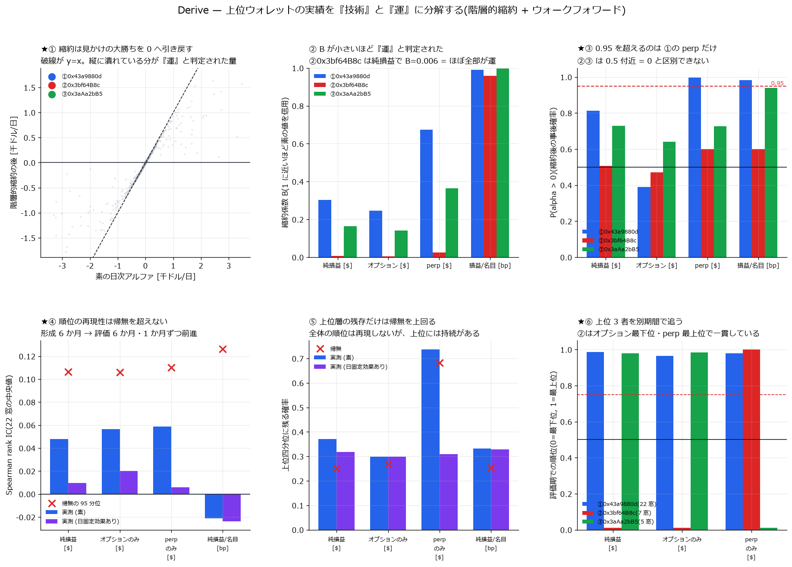

# Derive 分析索引

[← ホーム](../../README.md)

| 項目 | 内容 |
|---|---|
| 取引所 | [Derive](https://derive.xyz/)(旧 Lyra)。オプション DEX。板は中央集権的なマッチングエンジン、決済は Derive Chain 上 |
| API | **`https://api.lyra.finance`**(認証不要・無料)。★`api.derive.xyz` は同じパスで 404 |
| 対象 | オプション: BTC / ETH / HYPE / SOL / ZEC(active 約 2,566 銘柄)。ヘッジ分析のため perp も同 5 通貨 |
| 標本期間 | 約定・満期決済は **2024-01-11 〜 2026-09-12(33 か月)**。板は 2026-09-11 から記録開始 |
| 規模 | オプション約定 1,202,681 行 / perp 約定 7,044,832 行 / 満期決済 253,291 件 / ウォレット 11,699 |
| データの出所 | `E:\Derive-options`(記録機と REST バックフィル)。設計と罠は同リポジトリの README |

★**オプション板の履歴は存在しない。**約定・満期決済は 2024-01 まで無料で遡れるが、
板は「今から録る」以外に手段が無い。記録は 2026-09-11 14:17Z に開始した。

---

## 何が判ったか(要約)

1. **★推定は外れていた。**板から推定した「メイカーのエッジ +3.3bp をヘッジ費用
   4.2bp が食い潰すので赤字」は、実現損益で検証すると**逆**だった。
   オプション取引自体は赤字(−$9.25M)で、**perp が +$13.18M** を稼いでいる
2. **点推定は黒字だが、成立しているとは言えない。**メイカー主体 41 ウォレットで
   +$7.33M(**+5.09 bp**)。しかし**絶対値の大きい 3 日を除くと −$1.98M** に反転し、
   日次の中央値は **−$5**、ウォレット別の中央値は **−$714**
3. **上位 3 者で全体の 103%。**残り 38 ウォレットは合計 −$249,407 の赤字。
   黒字は「3 者が稼ぎ、残りはほぼ相殺」という構造
4. **満期決済を落とすと符号が変わる。**オプションの建玉は反対売買か満期決済でしか
   終わらない。`realized_pnl` だけでは満期組が丸ごと抜ける
5. **★上位 3 者のうち技術の証拠があるのは 1 者だけ。**階層的縮約とウォークフォワード
   22 窓で検定した結果、`0x43a9880dA3` は 22/22 窓で評価期の上位 1%・P(α>0)=0.997 だが、
   最大手 `0x3bf64B8c8c` は縮約係数 B=0.006 で +$2.11M が運で説明できる範囲。
   市場全体では Spearman IC が帰無を超えず、**アルファは上位層に局在**している
6. **手数料は名目基準**(メイカー 1bp / テイカー 3bp)。実測でメイカー約定の
   **87% が手数料ゼロ・50% がリベート受領**だが、ゼロ手数料は **10 ウォレットのみ**
7. **★生存バイアスを除いても結論は保たれる。**「最初の 200 約定だけ」で
   メイカー主体を判定し **201 約定目以降**だけで測っても +4.65 bp・上位 3 者で 98%。
   ただし**初期の成績と後の成績の Spearman は −0.250**(n=40)で、
   早期の勝ちは後の勝ちを予測しない
8. **★参入した者の半分は 30 日で消え、1 年後に残るのは 12%。**
   撤退した 9,802 者のうち**黒字で退場したのは 21%**、中央値 −$70。
   200 約定以上こなした「本気の参加者」でも黒字は 20%、中央値 −$1,932
9. **★RFQ は「幅が広いが毒も強い」ではなかった。**同一銘柄・サイズ キャリパーで
   56,498 組をマッチすると、RFQ の execution edge は **+9.48 対 +5.47 bp**(p=4e-105)
   と 1.7 倍なのに、markout の差は **+0.70 bp(p=0.085)で有意でない**。
   2026 年はメイカー名目の **71%** が RFQ 経由で、板を通っていない

---

## レポート

### A. 市場の素性

| レポート | 内容 |
|---|---|
| (準備中)市場構造の偵察 | 出来高ランキング、板の在席率、RFQ 比率、競合集中度。現時点の実測値は本ページの要約と `E:\Derive-options\README.md`(ローカル)にある |

### B. 採算

| レポート | 内容 |
|---|---|
| [★実現損益による MM 採算の実測検証](derive_mm_pnl_report.md) | 取引所が確定させた実現損益(反対売買 + 満期決済 + perp)でオプション MM の採算を直接検証。33 か月・976 日・41 ウォレット。点推定 +5.09 bp だが 3 日を除くと反転すること、上位 3 者で 103% を占めること、推定が外れていた理由を含む。 |
| [★実績を「技術」と「運」に分解する](derive_alpha_report.md) | wallet × day パネル 275,656 行で r = α_i + β'X + ε を推定。**階層的縮約**(empirical Bayes)で小標本の見かけの大勝ちを 0 へ引き戻し、形成 6 か月 → 評価 6 か月のウォークフォワード 22 窓で持続性を検定。Spearman rank IC・上位四分位の残存・P(α>0)。結論: 上位 3 者のうち技術の証拠があるのは 1 者だけ。 |
| [★生存バイアスの除去・参入者の生存分析・RFQ と CLOB の分離](derive_cohort_rfq_report.md) | 上の 2 本にあった設計上の穴を塞ぐ。(1) 全期間を見てからコホートを選ぶのをやめ、**最初の 200 約定だけ**で判定して **201 約定目以降**で評価する。(2) 11,699 ウォレットの **Kaplan-Meier** 生存分析(撤退 = 30 日無取引)で「新規参入者から見た経済性」を出す。(3) **RFQ と CLOB を完全に分離**し、同一銘柄・DTE・moneyness・サイズ・時刻・mark IV をマッチングして execution edge と markout を比較する。 |

---

## 図

**実現損益による MM 採算** — perp を入れた符号の反転、損益の内訳、ウォレット別の集中度、月次、上位日を除いた感度、日単位ブートストラップ。解説: [MM 採算の検証](derive_mm_pnl_report.md)


**技術と運の分解** — 階層的縮約の効き方、縮約係数 B、P(α>0)、ウォークフォワードの IC と帰無、上位四分位の残存、上位 3 者の別期間での位置。解説: [技術と運の分解](derive_alpha_report.md)



**生存バイアスの除去 / 生存分析 / RFQ 分離** — 分類期と評価期の散布、評価期の損益の集中、
Kaplan-Meier 生存曲線、撤退者の生涯損益、マッチ後の RFQ 対 CLOB、RFQ 比率と edge の関係。
解説: [生存バイアスの除去・生存分析・RFQ 分離](derive_cohort_rfq_report.md)


---

## 数値データ

中間生成物は容量のため版管理外(`E:/Memory-derive/`)。
下表の生成スクリプトで作り直せます。

| ファイル | 内容 | 生成スクリプト |
|---|---|---|
| `ledger_trades.parquet` | オプション約定 120 万行(損益・手数料・ウォレット付き) | `derive_ledger.py` |
| `ledger_perp.parquet` | perp 約定 704 万行を (wallet, day, cur, role) に集計 | `derive_ledger.py` |
| `ledger_settle.parquet` | 満期決済 255,631 件(API 224,816 + 自前補完 30,815) | `derive_ledger.py` |
| `ledger_open.parquet` | 残存建玉 9,182 組(未実現) | `derive_ledger.py` |
| `mm/wallet_pnl.parquet` | ウォレット別の完全な損益 | `derive_mm_pnl.py` |
| `mm/daily_maker.parquet` | メイカー主体の日次損益 976 日 | `derive_mm_pnl.py` |
| `alpha/panel.parquet` | wallet × day パネル 275,656 行 | `derive_alpha.py` |
| `alpha/alpha_*.parquet` | 目的変数 × 仕様ごとの縮約後アルファ | `derive_alpha.py` |
| `alpha/walkforward.parquet` | 22 窓の IC・残存率・帰無・上位 3 者の順位 | `derive_alpha.py` |
| `cohort/cohort_wallets.parquet` | 最初の 200 約定での分類と、201 約定目以降の損益 | `derive_cohort.py` |
| `cohort/survival.parquet` | 11,699 ウォレットの生存日数・打ち切り・生涯損益 | `derive_cohort.py` |
| `cohort/cohort_month.parquet` | 参入月別のコホート | `derive_cohort.py` |
| `rfq/maker_edge.parquet` | メイカー約定 600,632 行の edge / markout / RFQ 旗 | `derive_rfq.py` |
| `rfq/matched.parquet` | マッチ後 56,498 組の比較結果と釣り合い | `derive_rfq.py` |
| `rfq/wallet_rfq.parquet` | ウォレット別の RFQ 比率と edge | `derive_rfq.py` |

## 再現手順

```bash
# データ取得(E:\Derive-options 側)
uv run --with zstandard python scripts/backfill_trades.py --all              # オプション約定
uv run --with zstandard python scripts/backfill_trades.py --type perp --all  # perp 約定
uv run --with zstandard python scripts/fetch_settlements.py --passes 4       # 満期決済
# 分析(このリポジトリ側)
uv run --with zstandard --with polars python scripts/derive_ledger.py
uv run --with zstandard python scripts/derive_settle_check.py                # 完全性検査
uv run --with polars python scripts/derive_mm_pnl.py
uv run --with polars python scripts/derive_mm_plot.py
uv run --with polars --with scipy python scripts/derive_alpha.py                 # 技術と運の分解
uv run --with polars python scripts/derive_alpha_plot.py
uv run --with polars --with scipy python scripts/derive_cohort.py                # 生存バイアス除去 + KM
uv run --with polars --with scipy python scripts/derive_rfq.py                   # RFQ vs CLOB マッチング
uv run --with polars --with scipy python scripts/derive_cohort_plot.py
```

## ★このデータを扱うときの罠(すべて実際に踏んだ)

1. **`float("37_25")` は 3725.0。**Derive は行使価格の小数点を `_` で書く
   (`HYPE-20260314-37_25-P` = 37.25)。Python が下線を桁区切りと解釈するため、
   本源的価値が 100 倍になり決済損益が 30 万倍ずれる
2. **満期決済 API はページ境界で重複を返す** = 取りこぼしも起きる。
   刻みを変えた多重走査で和集合を取る(単発だと 10.3% 落ちた)
3. **古い満期ほど決済記録が欠ける**(2024 年は 20〜27%)。自前計算で補完する
4. **WS の `trades` は REST より項目が少ない。**wallet / subaccount_id /
   maker-taker / 手数料 / `realized_pnl` は **REST にしか無い**
5. **1 約定が maker 行と taker 行の 2 行**で返る。損益は両方使うが、
   **数量・名目を足すときは片側だけ**
6. **REST の既定 User-Agent は 403 で弾かれる**
7. **★ウォレット単位の名目を 2 で割ってはいけない。**「1 約定が 2 行」は
   全ウォレットを合算したときの話。個別ウォレットは自分の側の行しか出ない
   (最大手は maker 78,116 行 / taker 36 行)。これで bp を 2 倍過大に出した
8. **★日次 bp を単純平均するとおかしな順位が出る。**名目が極小の日が効き過ぎる
   (総損益 −$133,523 のウォレットが +1,180bp で 1 位になった)。名目加重にする
9. **★加重平均には加重の標準誤差を使う。**非加重の sd/√n を当てると
   モーメント法の σ_α² が 0 に潰れ、全員が完全縮約される
10. **perp 704 万行を辞書で持つと OOM する**(RAM 15.3GB の機で空き 0.2GB まで落ちた)。
   ファイル単位で集計する
11. **★マッチングにキャリパーを入れないと裾で壊れる。**同一銘柄・時間窓だけで
   最近傍を取ると、大口 RFQ に見合う CLOB 約定が無いときに桁違いの相手と組み、
   **名目合計が $8.02B 対 $1.76B と 4.6 倍ずれた**。中央値は釣り合って見えたので、
   標準化差だけでなく**名目の合計まで確認する**。|Δlog(size)| ≤ 0.5 を入れて 1.3% 差に収まった
12. **打ち切りを無視して生存日数を平均しない。**まだ活動中の 1,897 者を「短命」に
   数えることになる。参入月別で 2026-08 以降の撤退率が低く見えるのも
   **打ち切りであって生存ではない**
13. **polars の `.mean()` は NaN を伝播する。**markout は「次の約定まで」が
   3 日を超えると NaN にしてあるので、`.drop_nans().mean()` にしないと全体が NaN になる
14. **cp932 のコンソールに `α̂` を print すると落ちる**(U+0302 の結合文字)。
   `PYTHONIOENCODING=utf-8` を付けるか、表示用の文字列を ASCII にする
