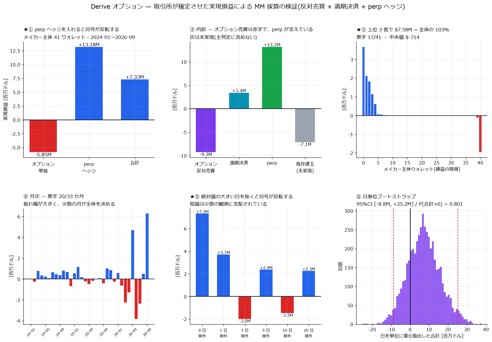

# Derive 分析索引

[← ホーム](../../README.md)

| 項目 | 内容 |
|---|---|
| 取引所 | [Derive](https://derive.xyz/)(旧 Lyra)。オプション DEX。板は中央集権的なマッチングエンジン、決済は Derive Chain 上 |
| API | **`https://api.lyra.finance`**(認証不要・無料)。★`api.derive.xyz` は同じパスで 404 |
| 対象 | オプション: BTC / ETH / HYPE / SOL / ZEC(active 約 2,566 銘柄)。ヘッジ分析のため perp も同 5 通貨 |
| 標本期間 | 約定・満期決済は **2024-01-11 〜 2026-09-12(33 か月)**。板は 2026-09-11 から記録開始 |
| 規模 | オプション約定 1,202,681 行 / perp 約定 7,044,832 行 / 満期決済 253,291 件 / ウォレット 11,699 |
| データの出所 | `E:\Derive-options`(記録機と REST バックフィル)。設計と罠は同リポジトリの README |

★**オプション板の履歴は存在しない。**約定・満期決済は 2024-01 まで無料で遡れるが、
板は「今から録る」以外に手段が無い。記録は 2026-09-11 14:17Z に開始した。

---

## 何が判ったか(要約)

1. **★推定は外れていた。**板から推定した「メイカーのエッジ +3.3bp をヘッジ費用
   4.2bp が食い潰すので赤字」は、実現損益で検証すると**逆**だった。
   オプション取引自体は赤字(−$9.25M)で、**perp が +$13.18M** を稼いでいる
2. **点推定は黒字だが、成立しているとは言えない。**メイカー主体 41 ウォレットで
   +$7.33M(+10.18 bp)。しかし**絶対値の大きい 3 日を除くと −$1.98M** に反転し、
   日次の中央値は **−$5**、ウォレット別の中央値は **−$714**
3. **上位 3 者で全体の 103%。**残り 38 ウォレットは合計 −$249,407 の赤字。
   黒字は「3 者が稼ぎ、残りはほぼ相殺」という構造
4. **満期決済を落とすと符号が変わる。**オプションの建玉は反対売買か満期決済でしか
   終わらない。`realized_pnl` だけでは満期組が丸ごと抜ける
5. **手数料は名目基準**(メイカー 1bp / テイカー 3bp)。実測でメイカー約定の
   **87% が手数料ゼロ・50% がリベート受領**だが、ゼロ手数料は **10 ウォレットのみ**

---

## レポート

### A. 市場の素性

| レポート | 内容 |
|---|---|
| (準備中)市場構造の偵察 | 出来高ランキング、板の在席率、RFQ 比率、競合集中度。現時点の実測値は本ページの要約と `E:\Derive-options\README.md`(ローカル)にある |

### B. 採算

| レポート | 内容 |
|---|---|
| [★実現損益による MM 採算の実測検証](derive_mm_pnl_report.md) | 取引所が確定させた実現損益(反対売買 + 満期決済 + perp)でオプション MM の採算を直接検証。33 か月・976 日・41 ウォレット。点推定 +10.18 bp だが 3 日を除くと反転すること、上位 3 者で 103% を占めること、推定が外れていた理由を含む。 |

---

## 図

**実現損益による MM 採算** — perp を入れた符号の反転、損益の内訳、ウォレット別の集中度、月次、上位日を除いた感度、日単位ブートストラップ。解説: [MM 採算の検証](derive_mm_pnl_report.md)



---

## 数値データ

中間生成物は容量のため版管理外(`E:/Memory-derive/`)。
下表の生成スクリプトで作り直せます。

| ファイル | 内容 | 生成スクリプト |
|---|---|---|
| `ledger_trades.parquet` | オプション約定 120 万行(損益・手数料・ウォレット付き) | `derive_ledger.py` |
| `ledger_perp.parquet` | perp 約定 704 万行を (wallet, day, cur, role) に集計 | `derive_ledger.py` |
| `ledger_settle.parquet` | 満期決済 255,631 件(API 224,816 + 自前補完 30,815) | `derive_ledger.py` |
| `ledger_open.parquet` | 残存建玉 9,182 組(未実現) | `derive_ledger.py` |
| `mm/wallet_pnl.parquet` | ウォレット別の完全な損益 | `derive_mm_pnl.py` |
| `mm/daily_maker.parquet` | メイカー主体の日次損益 976 日 | `derive_mm_pnl.py` |

## 再現手順

```bash
# データ取得(E:\Derive-options 側)
uv run --with zstandard python scripts/backfill_trades.py --all              # オプション約定
uv run --with zstandard python scripts/backfill_trades.py --type perp --all  # perp 約定
uv run --with zstandard python scripts/fetch_settlements.py --passes 4       # 満期決済
# 分析(このリポジトリ側)
uv run --with zstandard --with polars python scripts/derive_ledger.py
uv run --with zstandard python scripts/derive_settle_check.py                # 完全性検査
uv run --with polars python scripts/derive_mm_pnl.py
uv run --with polars python scripts/derive_mm_plot.py
```

## ★このデータを扱うときの罠(すべて実際に踏んだ)

1. **`float("37_25")` は 3725.0。**Derive は行使価格の小数点を `_` で書く
   (`HYPE-20260314-37_25-P` = 37.25)。Python が下線を桁区切りと解釈するため、
   本源的価値が 100 倍になり決済損益が 30 万倍ずれる
2. **満期決済 API はページ境界で重複を返す** = 取りこぼしも起きる。
   刻みを変えた多重走査で和集合を取る(単発だと 10.3% 落ちた)
3. **古い満期ほど決済記録が欠ける**(2024 年は 20〜27%)。自前計算で補完する
4. **WS の `trades` は REST より項目が少ない。**wallet / subaccount_id /
   maker-taker / 手数料 / `realized_pnl` は **REST にしか無い**
5. **1 約定が maker 行と taker 行の 2 行**で返る。損益は両方使うが、
   **数量・名目を足すときは片側だけ**
6. **REST の既定 User-Agent は 403 で弾かれる**
7. **perp 704 万行を辞書で持つと OOM する**(RAM 15.3GB の機で空き 0.2GB まで落ちた)。
   ファイル単位で集計する
