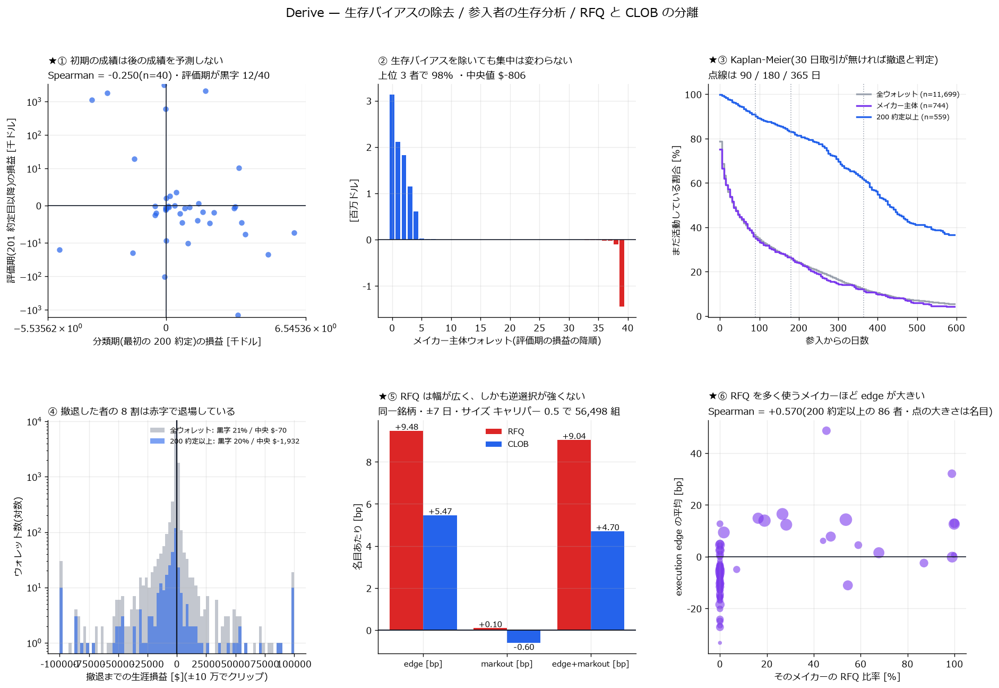

# ★生存バイアスの除去・参入者の生存分析・RFQ と CLOB の分離

[← Derive の分析索引](README.md)

## なぜこの報告が要るか

[MM 採算の検証](derive_mm_pnl_report.md)と[技術と運の分解](derive_alpha_report.md)には、
**設計上の穴が 2 つ**あった。

1. **生存バイアス。**「メイカー主体 41 者」を**全期間を見た後で**
   「maker 比 70% 以上・200 約定以上」で選んでいた。
   **将来まで生き残って大量に取引した者ほど選ばれやすい。**
2. **RFQ と CLOB の混在。**オプション出来高の 20〜34% は RFQ 経由で板を通らない。
   採算をこの 2 つ混ぜたまま測っていた。

本報告はこの 2 つを直し、さらに**新規参入者から見た経済性**(生存分析)を足す。



---

## 1. 生存バイアスの除去 — 分類と評価を時間で分ける

### 設計

- 各ウォレットの **最初の 200 約定だけ**で maker 主体かを判定する
  (maker 比 70% 以上)。**この 200 約定の損益は評価に使わない**
- **201 約定目以降**の損益だけを測る。満期決済と perp も「評価期の開始日以降」に限る

分類の時点で将来を一切見ていないので、生存バイアスが入らない。

### 結果 — 結論は変わらないが、新しい事実が出た

| 量 | 全期間で選んだ 41 者(旧) | **最初の 200 約定で選んだ 40 者(新)** |
|---|---:|---:|
| 実現損益 | +$7,327,909 | **+$7,172,149** |
| 名目あたり | +5.09 bp | **+4.65 bp** |
| 黒字 | 17 / 41 | **12 / 40** |
| 中央値 | −$714 | **−$806** |
| 上位 3 者の占有 | 103% | **98%** |
| 上位 3 を除いた合計 | −$249,407 | **+$112,443** |

**生存バイアスを除いても結論は保たれた。**
「集計は黒字だが、上位 3 者が全部で、典型的な参加者は赤字」という構造は同じである。

### ★新しい発見 — 初期の成績は後の成績を予測しない

| | 値 |
|---|---:|
| 分類期(最初の 200 約定)の損益と評価期の損益の Spearman | **−0.250**(n=40) |

**符号が負である。**最初の 200 約定で稼いだ者ほど、その後は稼いでいない。
これは[技術と運の分解](derive_alpha_report.md)の「市場全体では順位が再現しない」と整合し、
さらに強い形の主張になる。

★n=40 なので −0.250 は偶然の範囲に入りうる(|ρ|>0.312 で 5% 水準)。
**「初期の成績が予測的だという証拠は無い」**までが言えることで、
「初期に勝つと後で負ける」とは言えない。

内訳: オプション −$8,473,147 / 満期決済 +$6,652,131 / perp +$8,993,164。
**perp が利益の源泉**という構造もそのまま。

---

## 2. 参入コホート → 生存時間 → 撤退前累積損益

### 生存の定義(結果を見る前に固定)

> 最終約定から **30 日**取引が無ければ、その最終約定日に撤退したとみなす。
> 最終約定が標本終端(2026-09-12)の 30 日以内なら **打ち切り(censored)**。

★打ち切りを無視して平均生存日数を出すと、まだ生きている者を「短命」として
数えることになり下方に歪む。Kaplan-Meier はこれを正しく扱う。

全 **11,699 ウォレット**のうち、撤退 9,802 / まだ活動中(打ち切り)1,897。

### Kaplan-Meier 生存率

| 母集団 | n | 30 日 | 90 日 | 180 日 | **365 日** | 540 日 |
|---|---:|---:|---:|---:|---:|---:|
| 全ウォレット | 11,699 | 51.2% | 35.9% | 25.8% | **12.1%** | 6.3% |
| メイカー主体(全期間 70% 以上) | 744 | 51.8% | 34.8% | 26.1% | **11.2%** | 4.5% |
| **200 約定以上** | 559 | **96.4%** | **90.0%** | **83.2%** | **61.2%** | 39.0% |

**参入した者の半分は 30 日で消える。1 年後に残るのは 12%。**

ただし **200 約定以上を実際にこなした者は別の世界**にいる:
1 年後も 61% が活動しており、生存日数の中央値は **323 日**(全体は 19 日)。

つまり「大半は試して数日で辞める」と「本格的に取り組む少数」がはっきり分かれている。

### 撤退前の累積損益

| 母集団 | 撤退者 | 黒字の割合 | 中央値 | 合計 | 生存日数の中央 |
|---|---:|---:|---:|---:|---:|
| 全ウォレット | 9,802 | **21%** | −$70 | −$7,863,313 | 19 日 |
| メイカー主体 | 598 | 27% | −$51 | +$1,351,115 | 17 日 |
| **200 約定以上** | 341 | **20%** | **−$1,932** | −$472,319 | **323 日** |

**★撤退した者の 8 割は赤字で退場している。**
しかも 200 約定以上こなした「本気の参加者」でも黒字は 20% で、
中央値は −$1,932。**長く続けたからといって勝てるようにはなっていない。**

### 新規参入者から見た経済性

上の 3 つを合わせると、新規参入者の期待値はこうなる:

- 1 年後まで活動している確率 **12%**(200 約定までこなせば 61%)
- 撤退時に黒字である確率 **20〜21%**
- 撤退時の損益の中央値 **−$70**(本格参加者は **−$1,932**)

★参入月別で見ると、2026-08 以降のコホートは撤退率が低く見えるが
(2026-08 が 7.6%、2026-09 が 0%)、これは**打ち切りであって生存ではない**。
標本終端が近いので、まだ撤退が観測できていないだけである。

---

## 3. RFQ と CLOB の分離

### 規模

| 経路 | メイカー行 | 名目 | 1 約定の名目の中央値 |
|---|---:|---:|---:|
| CLOB | 480,171(79.9%) | $10.36B | $3,948 |
| **RFQ** | 120,461(20.1%) | **$10.69B** | **$7,901** |

**行数では 2 割だが、名目では半分。**1 約定が 2 倍大きい。しかも増えている:

| 年 | 行の RFQ 比率 | **名目の RFQ 比率** |
|---|---:|---:|
| 2024 | 10.0% | 20.6% |
| 2025 | 14.7% | 29.9% |
| **2026** | **34.0%** | **71.3%** |

★**2026 年はメイカーが動かした名目の 7 割が RFQ 経由**で、板を通っていない。
板だけを見て市場を論じると、この venue では大半を見落とす。

### 測る量

$$ Edge_t = \begin{cases} Mark_t - P_t & \text{メイカーが買い} \\ P_t - Mark_t & \text{メイカーが売り} \end{cases} $$

$$ Markout_\Delta = side \times (Mark_{t+\Delta} - Mark_t) $$

いずれも名目で割って bp にする。$Edge$ が正なら理論値より有利に約定し、
$Markout$ が負なら逆選択されている。

★**mark の系列は約定行にしか無い**(板の記録は 2026-09-11 開始)。
よって $\Delta$ は「同一銘柄の次の約定まで」で近似し、3 日を超える間隔は落とした。
経過時間の中央値は CLOB 83.7 分 / RFQ 113.4 分。

### マッチング

**同一銘柄**で突き合わせる(通貨・行使価格・満期が一致する)。その上で
時間窓 ±7 日、log サイズ最近傍、**キャリパー |Δlog(size)| ≤ 0.5**。

★キャリパーは必須だった。入れないと、大口の RFQ に見合う CLOB 約定が無いときに
桁違いに小さい相手とマッチし、**名目合計が RFQ $8.02B 対 CLOB $1.76B と 4.6 倍ずれた**。
中央値では釣り合って見えても裾で壊れる。

成立した組 **56,498**(RFQ 約定の 47%)。釣り合いは良好:

| 共変量 | RFQ 中央 | CLOB 中央 | 標準化差 |
|---|---:|---:|---:|
| log サイズ | 8.408 | 8.404 | **0.003** |
| 満期まで[日] | 7.866 | 7.628 | 0.010 |
| log(K/S) | 0.006 | 0.006 | 0.005 |
| 時刻[UTC 時] | 13.394 | 13.680 | 0.008 |
| mark IV | 0.630 | 0.631 | 0.001 |

(標準化差 |d| < 0.1 で釣り合いとみなす慣例。名目合計も $1.056B 対 $1.043B で 1.3% 差)

### ★結果 — RFQ は「幅が広いが毒も強い」ではない。**幅が広く、毒も強くない**

| 指標 | RFQ | CLOB | 差(RFQ−CLOB) | p |
|---|---:|---:|---:|---:|
| **edge [bp]** | **+9.479** | +5.466 | **+4.013** | 4e-105 |
| markout [bp] | +0.098 | −0.604 | +0.701 | **0.085** |
| **edge + markout [bp]** | **+9.043** | +4.705 | **+4.339** | 3e-52 |

- **RFQ のメイカーは CLOB の 1.7 倍の edge を取っている**(+9.48 対 +5.47 bp)
- **markout は RFQ のほうが良い**(+0.10 対 −0.60)が、**p=0.085 で有意ではない**

したがって言えるのは:

> **RFQ はメイカーにとって明確に幅が広く、かつ「CLOB より逆選択が強い」という証拠は無い。**

「スプレッドが広いぶん toxicity も高い」という素朴な予想は**支持されなかった**。
markout の差は方向としては RFQ 有利だが、統計的には 0 と区別できない。

★**p=0.085 を「RFQ のほうが毒が少ない」と読んではいけない。**
言えるのは「毒が多いという証拠が無い」まで。

ドル建て(釣り合った標本、名目ほぼ同額):

| 経路 | 名目 | edge | markout | 合計 |
|---|---:|---:|---:|---:|
| RFQ | $1.056B | +$637,309 | −$845 | **+$636,464** |
| CLOB | $1.043B | +$359,372 | −$164,615 | +$194,758 |

同じ名目を回して、**RFQ は CLOB の 3.3 倍を稼いでいる**。

### ★誰が RFQ を使っているか

200 約定以上のメイカー 86 者のうち:

| RFQ 比率 | 人数 |
|---|---:|
| 10% 未満 | **69** |
| 10〜50% | 7 |
| 50% 以上 | **10** |

**中央値は 0.0%** — 大半のメイカーは RFQ を使っていない。一方で大手は使う:

| ウォレット | 約定 | RFQ 比率 | edge [bp] | markout [bp] | 名目 |
|---|---:|---:|---:|---:|---:|
| `0x3bf64B8c8c` | 78,073 | **54%** | +14.30 | −0.44 | $6.77B |
| `0x43a9880dA3` | 209,706 | 19% | +13.92 | −0.94 | $4.16B |
| `0xEAc2374016` | 72,396 | 27% | **+16.48** | +0.15 | $2.20B |
| `0x3aAa2bB57a` | 23,089 | 28% | +12.34 | −1.22 | $1.84B |
| `0xE1DC5576b3` | 56,131 | **2%** | +9.36 | −1.02 | $1.76B |
| `0x801209Bf04` | 1,847 | **100%** | +12.59 | −0.82 | $0.64B |

| 関係 | Spearman |
|---|---:|
| **RFQ 比率 と edge** | **+0.570** |
| RFQ 比率 と markout | +0.012 |

**RFQ を多く使うメイカーほど edge が大きい**(ρ=+0.570)。一方 markout との関係は無い。

これは「情報優位のある MM だけが RFQ を選んでいる」というより、
**RFQ という経路そのものが幅の広い場所**で、そこにアクセスできる者
(= RFQ の引き合いを受けられる、規模と信用のある MM)が取っている、
という読みのほうが整合する。markout に差が無いのは、
**RFQ を出す側が情報を持っているわけではない**ことを示唆する。

★ただし**因果は特定できていない。**「RFQ を使うから edge が高い」のか
「edge を出せる MM だから RFQ を任される」のかは、このデータでは分けられない。

---

## 4. 自己精査

1. **生存バイアスを除いても結論は保たれた**(+5.09 → +4.65 bp、上位 3 者 103% → 98%)。
   これは元の結論の頑健性の証拠であり、同時に「バイアスが無かった」ことの確認でもある
2. **★初期成績と後期成績の Spearman −0.250 は n=40。**5% 水準(|ρ|>0.312)に届かない。
   「予測的だという証拠が無い」までしか言えない
3. **★打ち切りを正しく扱った。**KM を使わずに平均生存日数を出すと、
   まだ活動中の 1,897 者を「短命」に数えることになる。
   参入月別の表で 2026-08/09 の撤退率が低いのも**打ち切りであって生存ではない**
4. **★キャリパーが無いとマッチングは裾で壊れる。**
   中央値の釣り合いだけ見て「揃った」と判断していたら誤っていた。
   名目合計まで確認して初めて 4.6 倍のずれに気づいた
5. **markout の p=0.085 を有意と書いていない。**
   方向は RFQ 有利だが 0 と区別できない
6. **単価だけでなく総額も出した**(§3 のドル建て表)
7. **分母を明示した。**edge も markout も名目(数量 × index)で割っている

### この報告が答えていないこと

- **markout の $\Delta$ が不揃い。**「次の約定まで」なので RFQ 113 分 / CLOB 84 分と
  経過時間が違う。板の記録(2026-09-11 開始)が貯まれば固定 $\Delta$ で測り直せる
- **RFQ の引き合いを断った分は見えない。**メイカーが提示しなかった、
  あるいは提示して負けた見積りは記録に残らない。
  **観測できるのは約定した RFQ だけ**で、選択が入っている
- **因果は分けられない**(§3 末尾)
- **venue 外のヘッジは依然として見えない**

## 再現手順

```bash
uv run --with polars --with scipy python scripts/derive_cohort.py     # 生存バイアス除去 + KM
uv run --with polars --with scipy python scripts/derive_rfq.py        # RFQ vs CLOB マッチング
uv run --with polars --with scipy python scripts/derive_cohort_plot.py
```
