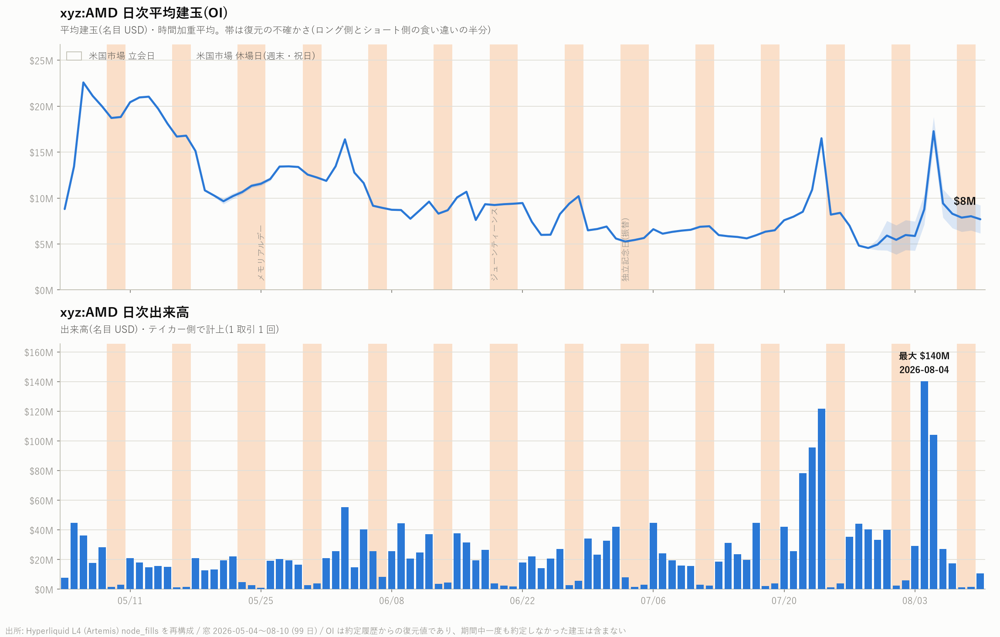
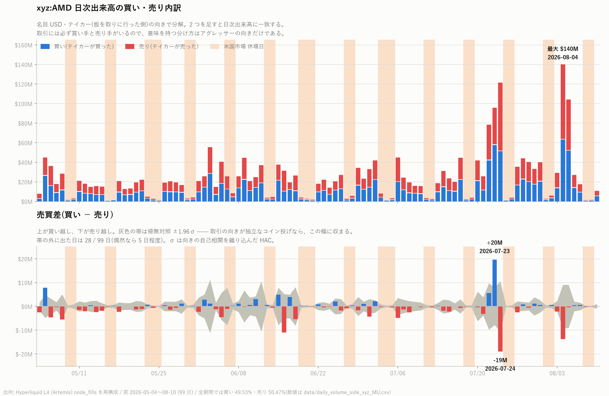
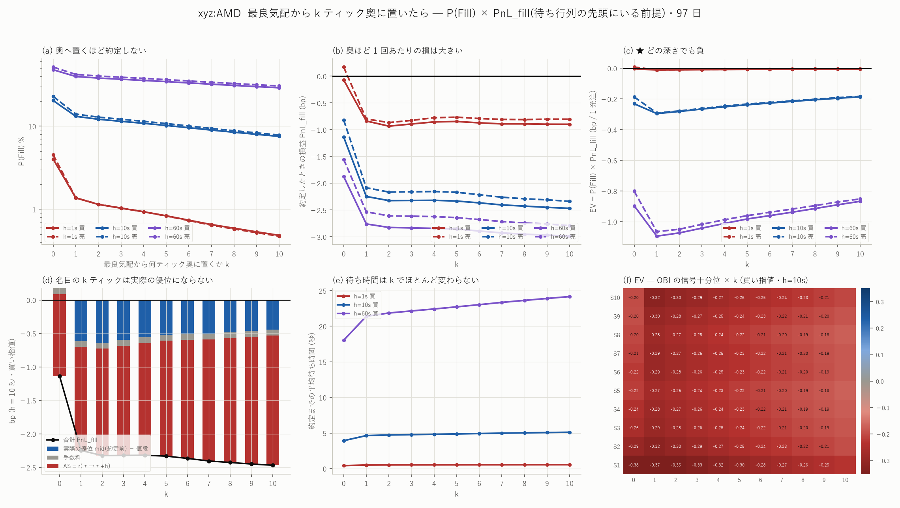
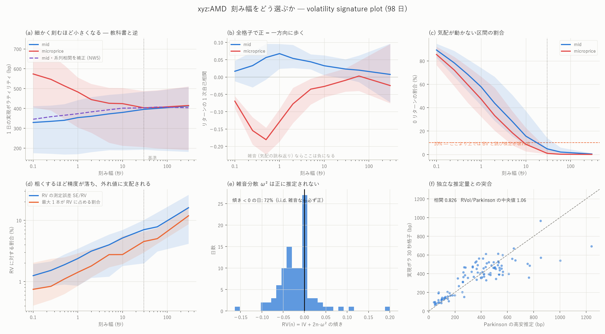
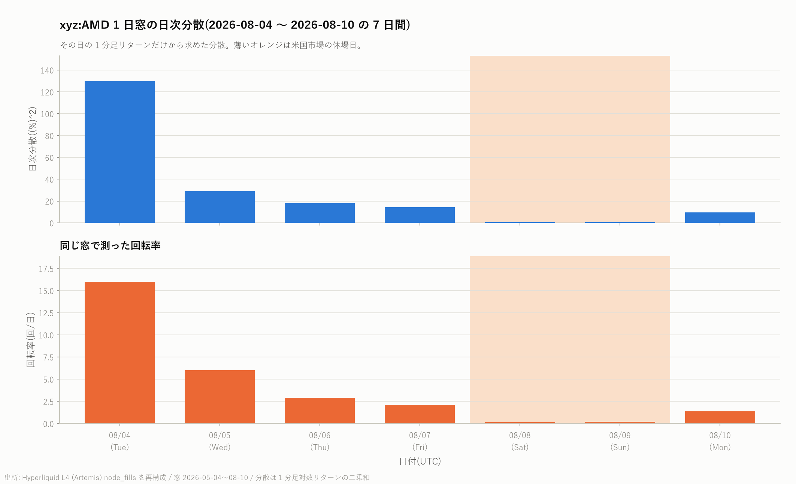
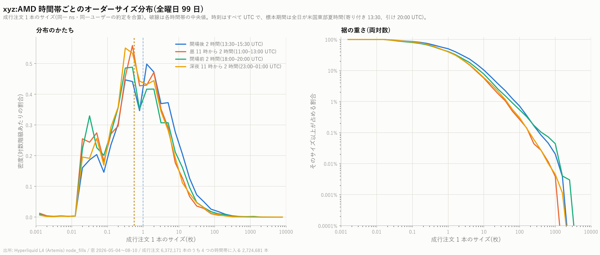
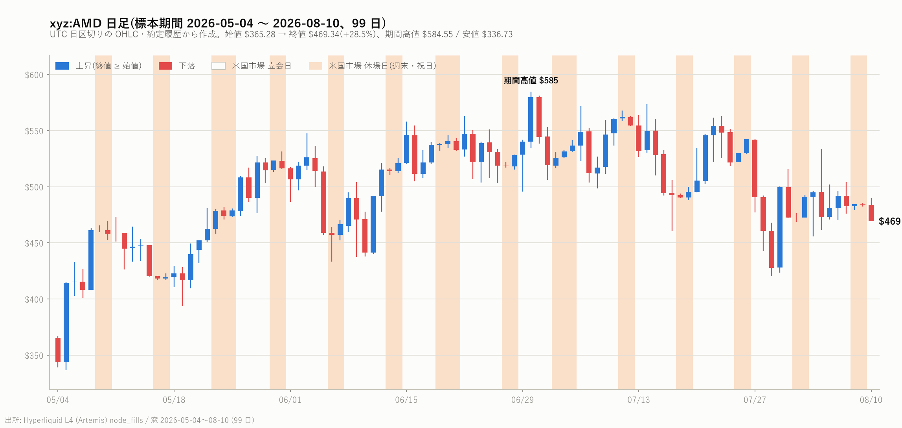

# `xyz:AMD` 分析索引

[← ホーム](../../../README.md) / [Hyperliquid の分析](../README.md)

| 項目 | 内容 |
|---|---|
| 銘柄コード | `xyz:AMD` |
| 原資産 | AMD(Advanced Micro Devices)。CPU / GPU のファブレス大手、米国ナスダック上場 |
| 商品の種別 | 無期限先物(perp)。24 時間 365 日取引 |
| 取引所 | [Hyperliquid](https://hyperliquid.xyz/)([Trade.xyz](https://trade.xyz/) が配備) |
| 標本期間 | 2026 年 5 月 4 日 〜 8 月 10 日(99 日) |
| 位置づけ | **対照(メモリではなくロジック)**。INTC に続く 2 つめの非メモリ銘柄 |
| 規模 | 日次出来高 \$1,938 万、取引 15,968 件/日、建玉 \$877 万 |

取引件数は 7 銘柄で最少の部類(約定は中央値で 10 秒に 0 件台)。
**それでも効く特徴量と符号は他銘柄と同じ**で、δ の逆張りはむしろ強い
(1 秒 −0.219)。清算は 5 件/日と最少。

---

## レポート

| レポート | 内容 |
|---|---|
| [MU の分析一式を AMD で走らせる](amd_report.md) | 17 分析 + 特徴量 199 本 × 7 ホライズン。約定が疎な板での δ 逆張り(−0.219)と、10 秒でも 0.202 残る遅い減衰。 |
| [7 銘柄の横並び](../cross_coin_report.md) | 板の姿は 20 倍違っても「効き方」の相関は +0.95〜1.00。 |
| [7 銘柄 × 84 本の十分位分析](../decile_all_report.md)(7 銘柄共通) | 最良気配と約定だけで作れる 84 本 × 9 ホライズン(100ms〜60 秒) × mid/micro。十分位の境目は**前日の分布**、標準誤差は日でクラスタ、帰無対照は 1 営業日ずらし。有意 55.8%(プラセボ 0.0%)。最良は `ofi_ewma → mid_60s` の片側 0.63bp で、費用 4.42bp の 14% と 7 銘柄で最も遠い。 ★費用は銘柄ごとに違い、判定は \|D10 − D1\| ではなく**片側 max(\|D1\|,\|D10\|)** で行う。**7 銘柄 4,530 本の有意なセルのうち費用を越えたものはゼロ**。 |
| [7 銘柄のメイカー検証](../mm_all_report.md)(7 銘柄共通) | 在庫つきメイカー(両側に指値・\|q\|≤1 で FIFO 相殺・BBO 追随)を `xyz:MU` と同じ設定で当て、1 組あたり損益を恒等式で分解する。入口の門・無作為の門(帰無対照)・発注遅延 130 ms・執行できる数量を順に入れる。半スプレッド 2.751bp に対し劣化 2.805bp(**102%**)。相殺率も 66.8% と 7 銘柄で最低で、−2.136 bp と最も悪い。 ★7 銘柄のどれも、費用を引く前ですら**出す価値が無い**。 |

---

## 図

**約定から見た素性**


**特徴量 199 本 × 7 ホライズンの予測力**


**建玉と出来高** / **買い売りの内訳**





**MicroPrice 帯 × ホライズンの上昇確率** / **OBI・OFI の行列**


**Book Slope 回帰** / **キャンセル率の傾き**


**符号の持続** / **テイカー向きの推移確率**


**OBI・OFI の自己相関(200ms)** / **100ms 分散と将来リターン**


**スプレッド・注文量・約定量の関係** / **深さと逆選択**




**markout の分解** / **流動性ショックからの回復**


**ボラティリティの姿** / **分散と回転率** / **注文サイズ** / **日足**









---

## 数値データ

| ファイル | 中身 |
|---|---|
| [mmgate_fit_xyz_AMD.csv](../../../data/mmgate_fit_xyz_AMD.csv) | 入口の門の学習・評価の別と通過率 |
| [inv_days_xyz_AMD_q1.csv](../../../data/inv_days_xyz_AMD_q1.csv) | 在庫つきメイカーの日次(門なし・幽霊注文) |
| [decile_null_xyz_AMD_bbo.csv](../../../data/decile_null_xyz_AMD_bbo.csv) | 同じ表のプラセボ(1 営業日ずらし) |
| [decile_sum_xyz_AMD_bbo.csv](../../../data/decile_sum_xyz_AMD_bbo.csv) | 84 本 × 18 目的変数の十分位要約(`build_decile.py`) |
| [profile_xyz_AMD.csv](../../../data/profile_xyz_AMD.csv) | 日次の出来高・件数・価格・参加者 |
| [suite_headline_xyz_AMD.json](../../../data/suite_headline_xyz_AMD.json) | 見出しの数字 |
| [xfeat_pred_xyz_AMD.csv](../../../data/xfeat_pred_xyz_AMD.csv) | 199 本 × 7 ホライズンの予測力 |
| [xfeat_daily_xyz_AMD.csv](../../../data/xfeat_daily_xyz_AMD.csv) | 上位の日次 r と符号一致 |
| [order_size_stats_xyz_AMD.csv](../../../data/order_size_stats_xyz_AMD.csv) | 時間帯別の注文サイズ |
| [daily_volume_side_xyz_AMD.csv](../../../data/daily_volume_side_xyz_AMD.csv) | 買い売り内訳と HAC z |

## 再現手順

```bash
uv run python scripts/mirror_to_local.py --coin xyz:AMD
uv run python scripts/coin_profile.py    --coin xyz:AMD --ref xyz:MU
sh scripts/run_mu_suite.sh xyz:AMD
uv run python scripts/build_xfeat.py --coin xyz:AMD
uv run python scripts/fit_xfeat.py   --coin xyz:AMD --stage pool
uv run python scripts/fit_xfeat.py   --coin xyz:AMD --stage daily
uv run python scripts/plot_xfeat.py  --coin xyz:AMD
uv run python scripts/build_featbbo.py --coin xyz:AMD                    # 84 本(bbo + fills のみ)
uv run python scripts/build_fwd.py      --coin xyz:AMD --src featbbo --suffix _bbo
uv run python scripts/build_decile.py   --coin xyz:AMD --src featbbo --suffix _bbo
uv run python scripts/build_inventory.py --coin xyz:AMD --qmax 1 --posts
uv run python scripts/build_mmgate.py      --coin xyz:AMD
uv run python scripts/build_mmgate_null.py --coin xyz:AMD
uv run python scripts/build_inventory.py --coin xyz:AMD --qmax 1 --gate data/entrygate_xyz_AMD_mmg.parquet
```