# `xyz:AMD` — MU の分析一式を当てる(17 分析 + 特徴量 199 本 × 7 ホライズン)

[← xyz:AMD の分析索引](README.md) ／ [7 銘柄の横並び](../cross_coin_report.md)
／ [予測の定義](../../predicting_definition.md)

対象 `xyz:AMD`(AMD perp、**対照 = 非メモリ**)
／ 標本 2026-05-04 〜 2026-08-10 の 99 日
／ 数字の出所は [suite_headline_xyz_AMD.json](../../../data/suite_headline_xyz_AMD.json)

## 先に結論

- **約定が疎な板**(15,968 件/日、10 秒中央値で 0 件)。清算 5 件/日は最少
- **δ = microprice − mid の 1 秒逆張りは −0.219 と MU より強く、
  10 秒でも 0.202 残る。**約定が疎な板ほど歪みの解消が遅い、という
  [横並びの序列](../cross_coin_report.md)どおりの位置
- **mid 建ての δ は +0.032 と 7 銘柄で最も弱い。**逆張りの大半が
  「microprice の定義が mid に戻る」機械的な部分で説明でき、
  mid そのものを当てる力はほぼ無い
- OBI 帯の端は +0.049 と 7 銘柄で最弱。最良気配の偏りが情報を持たない
  (板が動かないので偏りが放置される)
- メモリ 5 銘柄と比べて**効く特徴量・符号に違いは見つからない**
  (効き方ベクトルの相関 +0.97〜1.00)。ロジックかメモリかは
  この物差しには写らない

---

## A. この銘柄はどういう市場か

| 量 | 値 |
|---|---|
| 日次出来高(テイカー側、中央値) | \$19,379,377 |
| 日次取引件数(中央値) | 15,968 |
| 日中平均建玉(中央値) | \$8,769,396 |
| テイカー参加者/日(中央値) | 480 |
| 清算 fill/日(中央値) | **5(最少)** |
| 価格の中央値 | \$503 |
| 成行 1 本の中央値 / p99 | 0.443 枚 / 21.5 枚 |
| 買いの割合(平均) | 48.77% |
| \|z\|(HAC) > 2 の日 | 19 / 99 |

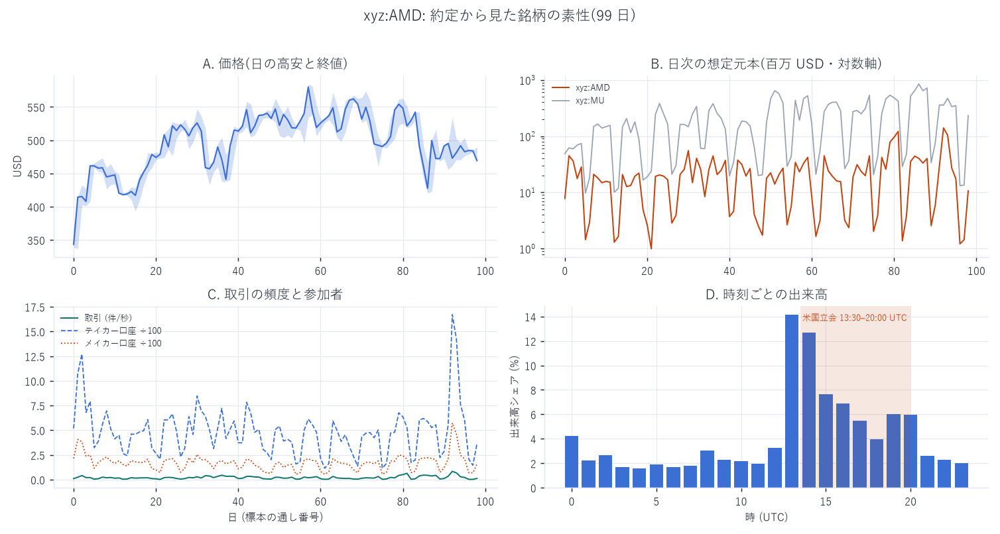

## B. 板の状態は将来の値動きを教えてくれるか

| h | 100ms | 500ms | 1s | 5s | 10s | 30s | 60s |
|---|---|---|---|---|---|---|---|
| 実測の最大 \|r\| | 0.116 | 0.221 | **0.236** | 0.215 | 0.202 | 0.154 | 0.127 |
| 帰無対照の最大 | 0.006 | 0.007 | 0.008 | 0.007 | 0.010 | 0.012 | 0.008 |

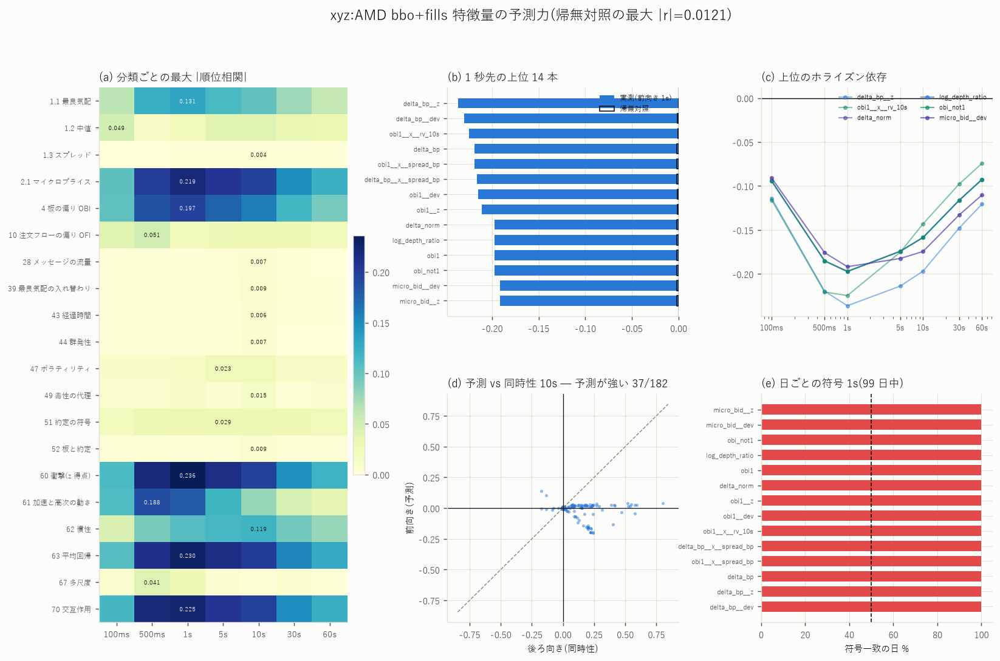

- 山は 1 秒(`delta_bp__z` −0.236)。100ms の首位だけ
  `obi1__x__rv_10s`(−0.116)で、静かな板では OBI×ボラの交互作用が
  最初に立ち上がる
- 前半後半の r 相関 0.969

| 指標 | 最大エッジ | セル | 帰無対照 |
|---|---|---|---|
| MicroPrice 乖離 | +0.203 | 立会日 / < −20bp / k=10 | 0.017 |
| OBI | +0.049 | 閉場日 / +0.75〜+1.00 / k=30 | — |
| OFI | +0.071 | 閉場日 / −1〜−0.5σ / k=1 | — |

MicroPrice の端が「< −20bp」という深い帯にあるのは、スプレッド
(中央値 2.83bp)が広く δ が大きく振れるため。

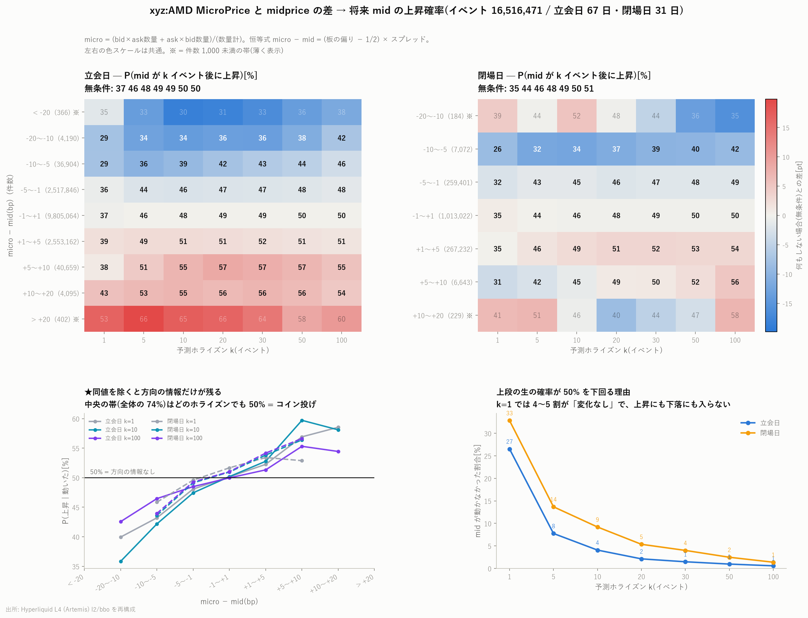

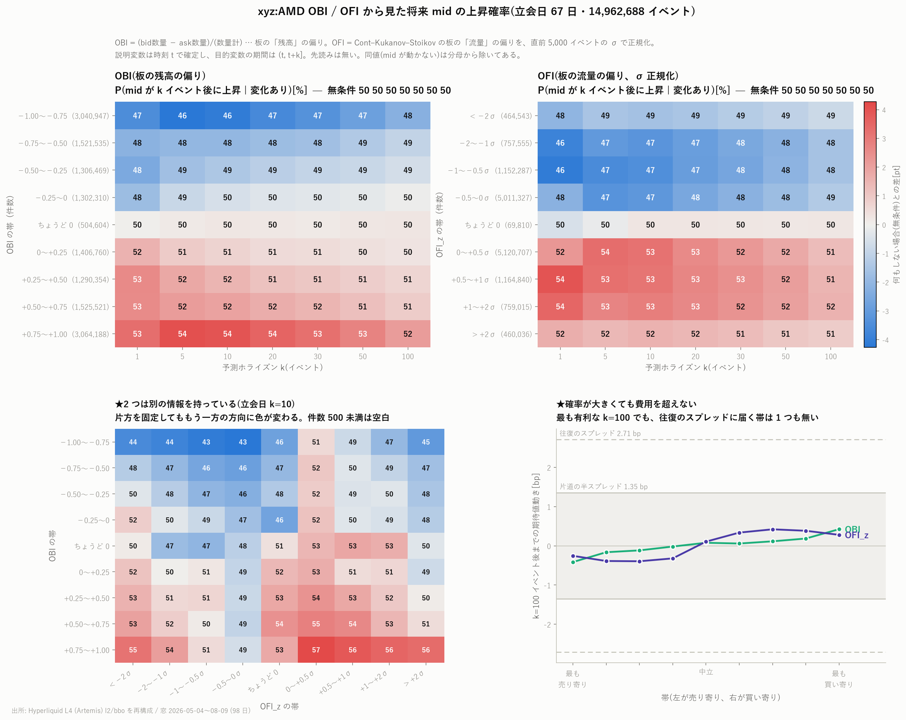

- Book Slope: β=0.0147、HAC t=24.7
- キャンセル率の傾き: 最大差 +0.053bp(閉場日/60 秒)、帰無対照 +0.005bp。
  片道費用(実効半スプレッド 1.58bp)の 1/30

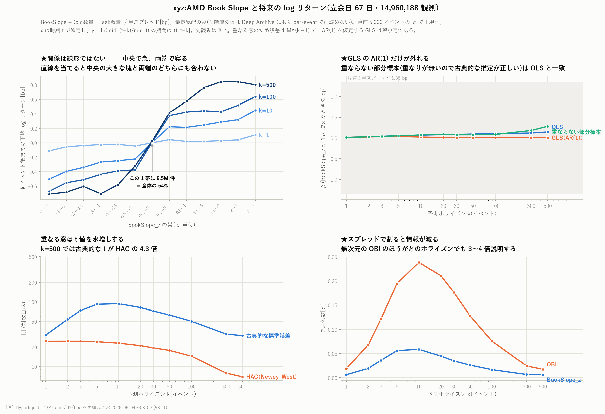

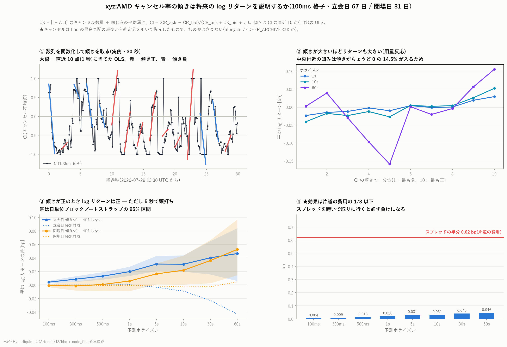

## C. 注文フローはどれだけ自分自身を引きずるか

| 量 | 値 |
|---|---|
| OBI 符号持続の超過(k=1) | +0.229 |
| OBI の lag1(200ms 格子) | +0.890 |
| OFI の lag1(200ms 格子) | −0.065(無記憶。わずかに反転) |

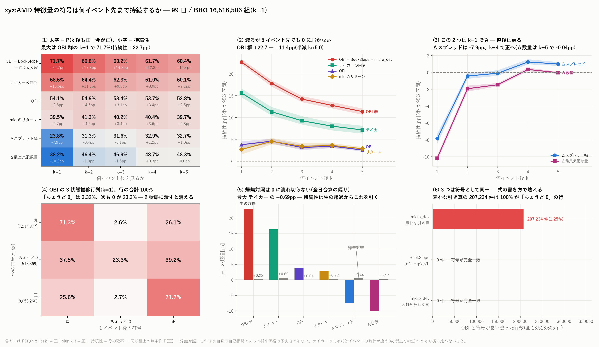

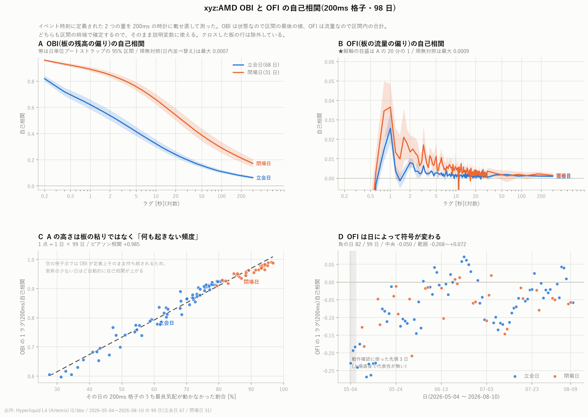

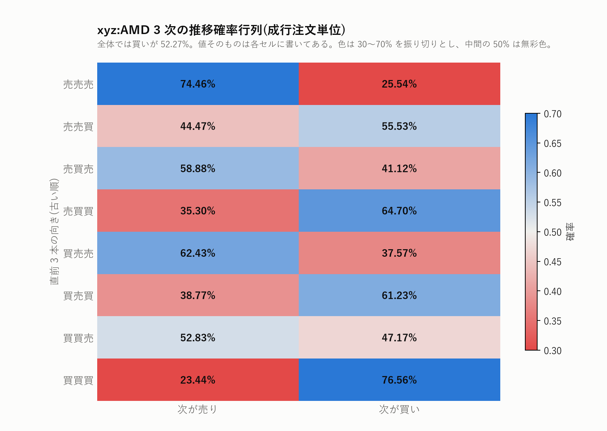

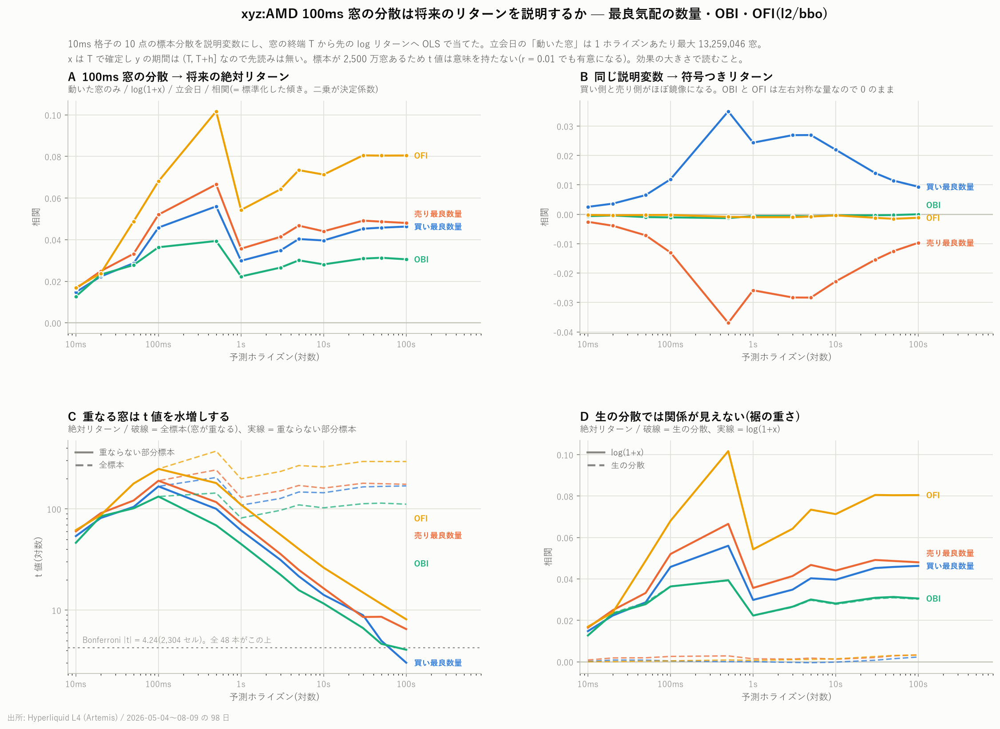

## D. 板の中の量どうし

- corr(スプレッド, 約定量) = −0.254
- corr(最良数量, 約定量) = +0.016(**7 銘柄で唯一ほぼゼロ** —
  板の厚みと約定がつながっていない)

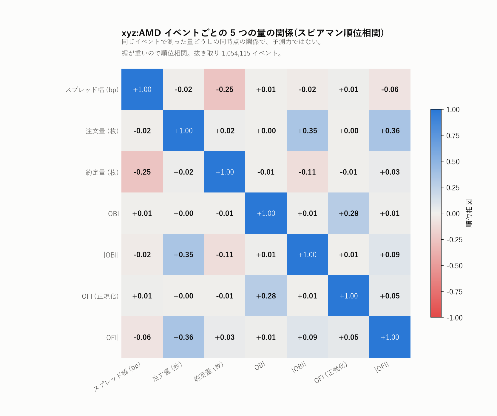

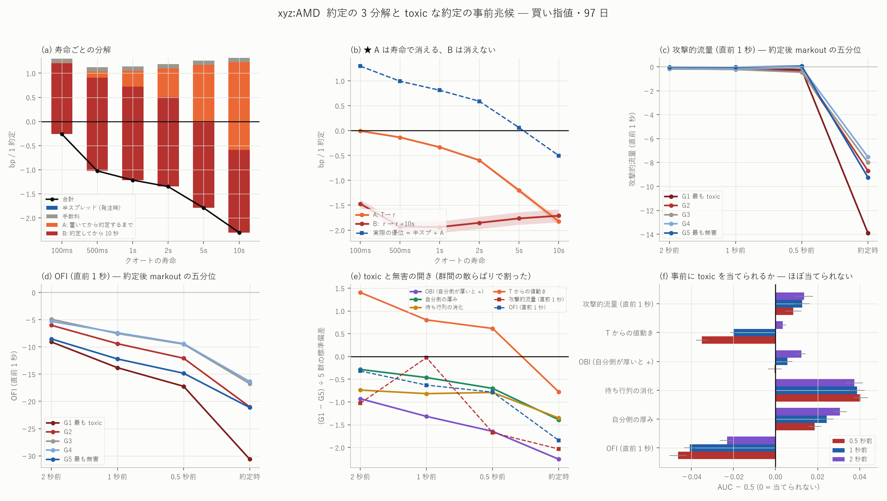

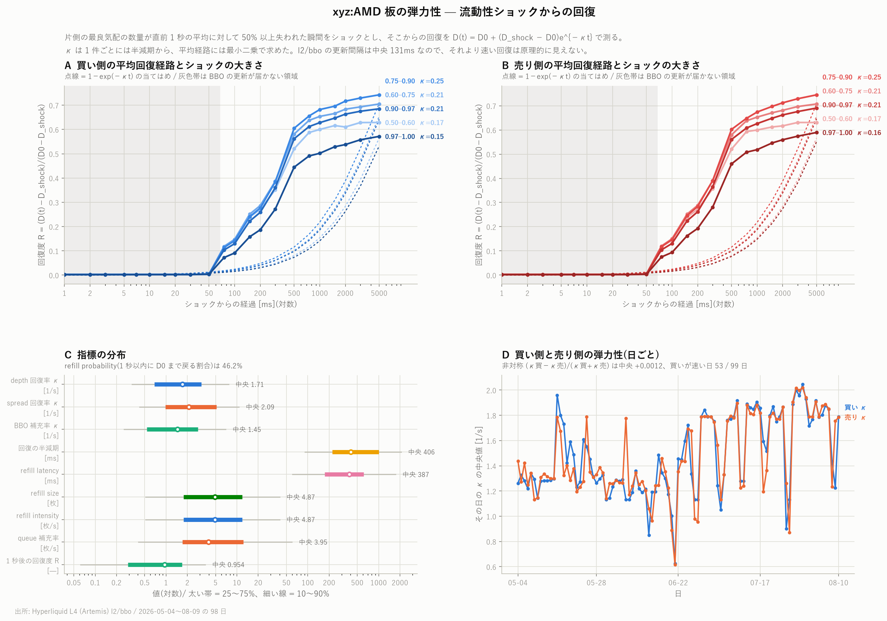

## 限界

1. bbo(最良 1 段)+ fills だけの物差し。キュー・寿命・口座の層は無い
2. 費用は引いていない。エッジ表は格子の最大値(多重比較あり)
3. 約定が疎なので、約定を条件にする指標(markout・depth)は標本が薄い

数字の再現は [README の再現手順](README.md#再現手順) を参照。
