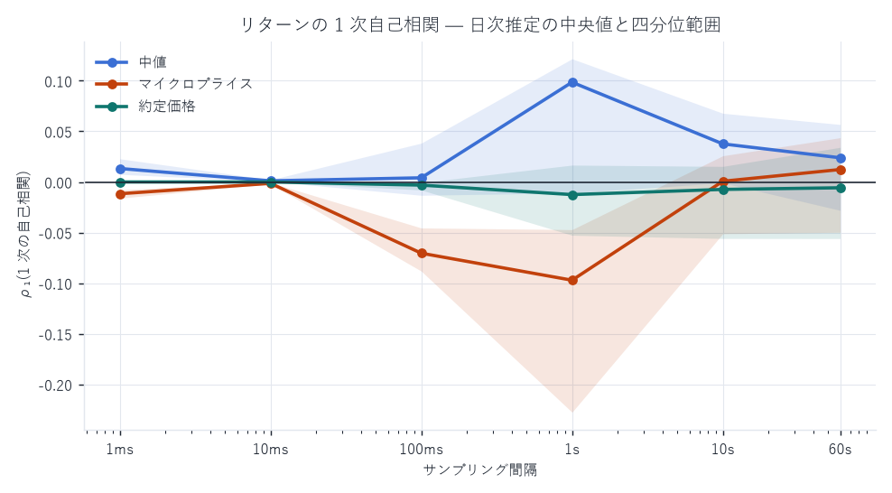
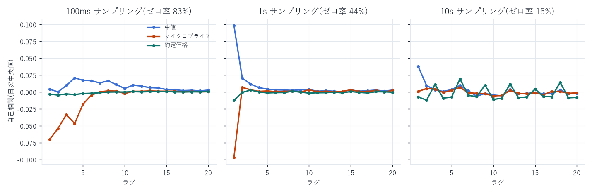
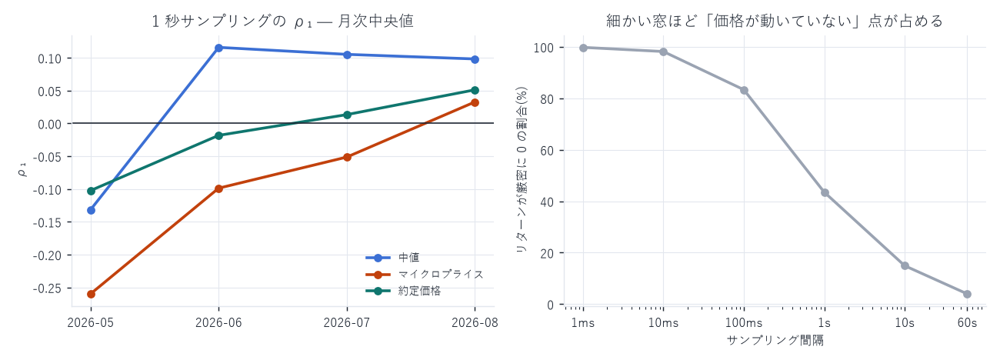

# 価格リターンの自己相関 — 1ms / 10ms / 100ms / 1s / 10s / 60s

対象: `xyz:DRAM / USDC`(Hyperliquid HIP-3)、2026-05-04 〜 2026-08-10(99 日)
定義: $r_{t+1} = \log P_{t+1} - \log P_{t}$(等間隔グリッド上)
作成日: 2026-08-14

---

## 1. 何を計算したか

3 種類の価格それぞれについて、6 通りのサンプリング間隔でリターン系列を作り、
ラグ 1〜20 の自己相関を算出した。

| 価格 | 定義 |
|---|---|
| `mid` | `(best_bid + best_ask) / 2` |
| `micro` | マイクロプライス $m + (I - \tfrac{1}{2})\,s$ |
| `trade` | 直近約定価格(`node_fills` のテイカー行) |

グリッド点の価格はその時刻以前の直近値(階段関数)。クロス状態は除外。

### 計算方法 — 86 億点を厳密に扱う

1ms グリッドは 1 日 8,640 万点、99 日で 84.96 億点になる。素直に配列を作れないので、
リターンが 0 でない点だけを持つ疎表現で自己共分散を計算した。

- 価格変化 i の対数増分 `d_i` を、それが最初に反映されるグリッド番号
  $j_i = \lceil (\tau_i - t_0)/\Delta \rceil$ に足し込む(同一グリッド内の複数変化は自然に合算される)
- 自己共分散 $\sum_j r_j\, r_{j-k}$ は「非ゼロ位置の集合と、それを k ずらした集合の共通部分」だけで決まる
- 分散・平均にはゼロ点も含めた全 n 点を使う

間引きでも近似でもなく、ゼロを明示的に持たないだけの厳密計算である。

推定は監査(`regression_report.md` §9)の作法に従い日次で行い中央値で読む。
n = 84.96 億では Bartlett の標準誤差が 1.1×10⁻⁵ になり、
どんな微小な値でも「有意」になってしまうため。

---

## 2. 結果 — ρ₁(ラグ 1 の自己相関)



日次推定の中央値。括弧内は 99 日中「符号が負だった日数」。

| 窓 | ゼロ率 | `mid` | `micro` | `trade` |
|---|---|---|---|---|
| 1 ms | 99.81% | +0.0133(0 / 99) | −0.0116(98 / 99) | −0.0000(98 / 99) |
| 10 ms | 98.20% | +0.0011(4 / 99) | −0.0014(93 / 99) | −0.0000(89 / 99) |
| 100 ms | 83.36% | +0.0041(39 / 99) | −0.0704(98 / 99) | −0.0028(73 / 99) |
| 1 s | 43.52% | +0.0985(27 / 99) | −0.0971(82 / 99) | −0.0088(64 / 99) |
| 10 s | 14.92% | +0.0376(26 / 99) | +0.0007(49 / 99) | −0.0068(56 / 99) |
| 60 s | 3.97% | +0.0239(37 / 99) | +0.0123(44 / 99) | −0.0057(54 / 99) |

### 全期間プールした値(参考)

| 窓 | `mid` | `micro` | `trade` |
|---|---|---|---|
| 1 ms | +0.0056 | −0.0062 | −0.0000 |
| 100 ms | −0.0001 | −0.0281 | −0.0072 |
| 1 s | −0.0335 | −0.1297 | −0.0658 |
| 10 s | −0.0097 | −0.1190 | −0.1026 |
| 60 s | +0.0205 | −0.0418 | −0.0431 |

プールと日次中央値で符号が食い違う場所がある(`mid` の 1 秒: プール −0.034 に対し
日次中央値 +0.099)。原因は既知の異質性で、プールは分散の大きい少数日に支配される
(`regression_report.md` §9 T2、I² = 99.7%)。日次中央値を主として読むこと。

---

## 3. 読み取れること



(1) 中値は正、マイクロプライスは負 — 同じ板から作った 2 系列で符号が逆になる。

- `mid` の ρ₁ は 1ms で 99 日すべて正(+0.013)。1 秒で最大 +0.099
- `micro` の ρ₁ は 1ms・100ms で 99 日中 98 日が負(−0.012 / −0.070)

理由は両者の動き方の違いにある。中値は 1 ティック刻みでしか動かず、
大口の掃きが複数の窓にまたがると同符号の増分が連続する = 継続。
一方マイクロプライスはキュー数量の揺れでスプレッド内を連続的に動くため、
その揺れ自体が反転成分として ρ₁ を押し下げる。
`microprice_report.md` の β が 1 未満だったこと(乖離が全部は実現しない)と整合する。

(2) 約定価格の反転はプールでのみ見える — bid-ask バウンスの古典的な負の自己相関は
プール値では 1 秒 −0.066 / 10 秒 −0.103 と明瞭だが、日次中央値では −0.009 / −0.007 と
ほぼ消える。少数日(値動きの荒い日)にバウンスが集中している。

(3) ラグ 2 以降はほぼゼロ — 1ms・10ms ではラグ 2 以降が厳密に 0 に近い。
非ゼロの窓が「ちょうど k ミリ秒離れて 2 つ並ぶ」ことがほとんど無いため。
100ms の `micro` だけはラグ 5 まで負が続く(−0.054, −0.034, −0.047, −0.018)。

(4) 細かい窓ほど「動いていない点」が支配する — 1ms ではリターンの 99.81% が
厳密に 0。この ρ₁ は「1 ミリ秒スケールの価格ダイナミクス」ではなく、
まばらに起きるジャンプの並び方を測っている。数値自体は正しいが、
連続時間過程の自己相関として解釈してはいけない。

---

## 4. 期間による変化



1 秒サンプリングの ρ₁ の月次中央値:

| 月 | `mid` | `micro` | `trade` |
|---|---|---|---|
| 2026-05(上場直後) | −0.132 | −0.260 | −0.102 |
| 2026-06 | +0.116 | −0.099 | −0.018 |
| 2026-07 | +0.105 | −0.051 | +0.014 |
| 2026-08 | +0.098 | +0.033 | +0.051 |

立ち上げ期は 3 系列とも強い反転、成熟後は反転が消えて中値は弱い継続に転じる。
スプレッドが 142bp から 0.5bp へ縮む過程(`microprice_report.md` §2)と同じ軸で、
板が薄い時期は 1 回の約定で価格が飛び、その後戻る動きが支配していたことを示す。

100ms でも同じ向きの変化がある(`mid`: −0.020 → +0.083、`micro`: −0.040 → −0.047)。

---

## 5. 成果物

```
data/return_acf.json         系列 × 窓 × ラグ 1〜20 の ρ、プール値・日次中央値・四分位・
                             ゼロ率・Bartlett SE
data/return_acf_daily.csv    日次の ρ₁〜ρ₃ とゼロ率(99 日 × 3 系列 × 6 窓)
scripts/return_acf.py        疎表現による厳密 ACF
scripts/acf_charts.py        図 17〜19
```

| 図 | 内容 |
|---|---|
| 17 | サンプリング間隔別の ρ₁(3 系列・四分位帯つき) |
| 18 | ラグ 1〜20 の ACF(100ms / 1s / 10s) |
| 19 | ρ₁ の月次推移と、窓ごとのゼロ率 |

### 再現手順

```bash
uv run python scripts/return_acf.py     # 約 25 分(99 日 × 3 系列 × 6 窓 × 20 ラグ)
uv run python scripts/acf_charts.py
```

---

AWS 費用: 既存データのみで完結(追加 egress なし)。
EC2 \$25.05 | S3 ≈\$1.87 | 累計 ≈\$26.92 / 予算 \$60(EC2 は停止中)
