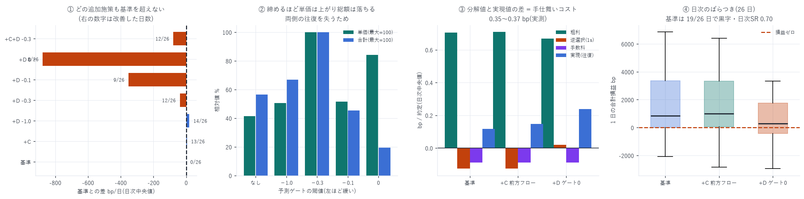

# バックテスタ v3 — 両側同時シミュレーションへの統合

対象: 2026-07-10 〜 08-04(26 日。学習 20 日は除外)
構成: 両側同時・在庫上限 5・気配改善あり・メイカー手数料 0.088 bp 控除
作成日: 2026-08-16

> ★訂正(2026-08-17): 初版は対象を「2026-07-15 〜 08-09」と記載していたが、
> `backtest_v3.csv` の実データは 2026-07-10 〜 08-04 である(08-09 は含まれて
> いない)。報告 35 の監査で `dt` 列を数えて発見した。日数 26 は正しく、
> 表の数値はすべて実データどおりで変更なし。評価日の集合が
> 「実行時に npz が存在した日」で暗黙に決まる作りが原因(同 §7 参照)。

---

## 0. 結論 — シグナルはどれも効かず、A+B が最良

| 方策 | 発注/日 | 約定/日 | 単価 bp | 合計 bp/日 | 黒字日 | 日次 SR | 基準との差 | 改善日 | p |
|---|---|---|---|---|---|---|---|---|---|
| A+B 基準 | 281,150 | 5,656 | 0.1172 | 845.9 | 19/26 | 0.70 | — | — | — |
| A+B+C 前方フロー | 281,459 | 5,571 | 0.1467 | 1005.4 | 20/26 | 0.71 | +4.6 | 13/26 | 0.578 |
| A+B+D ゲート0 | 137,678 | 2,538 | 0.2379 | 291.8 | 16/26 | 0.39 | −877.0 | 8/26 | 0.986 |
| A+B+D ゲート−0.1 | 186,836 | 3,582 | 0.1385 | 677.2 | 17/26 | 0.63 | −352.1 | 9/26 | 0.962 |
| A+B+D ゲート−0.3 | 248,925 | 4,938 | 0.2661 | 1496.7 | 19/26 | 0.71 | −38.4 | 12/26 | 0.721 |
| A+B+D ゲート−1.0 | 275,874 | 5,547 | 0.1350 | 1000.0 | 20/26 | 0.70 | +19.1 | 14/26 | 0.423 |
| A+B+C+D ゲート−0.3 | 249,215 | 4,861 | 0.3015 | 1486.4 | 19/26 | 0.73 | −78.4 | 12/26 | 0.721 |

★が付いた方策はゼロ。どの追加施策も基準を有意に上回らない。

基準は 19/26 日で黒字(p=0.0145)、日次シャープ 0.70。
なお「合計」の中央値と「基準との差」の中央値は別々に取っているので加減が合わない
(差は同じ日で比較した対応差)。判定は対応差で行う。



> A(気配改善)+ B(在庫制約)が最良。
> 方向性シグナルによるゲートは、両側マーケットメイクでは有害である。

---

## 1. なぜ v3 を作ったか

報告 23〜31 はすべて片側の約定 1 件ずつを数える観察研究で、2 つの問題が残っていた。

| 問題 | 片側分析 | v3 |
|---|---|---|
| 手仕舞いコスト | 前提次第で符号が反転(中値 +0.2303 / テイカー −0.4137) | 両側約定なら構造的に消える |
| 再参入 | 未計上(過小評価側) | 区間ごとに出し直すので自然に入る |

---

## 2. ★片側分析では見えなかったこと

ゲートを強くするほど単価は上がるのに総額は落ちる。

| ゲート | 発注/日 | 単価 bp | 合計 bp/日 |
|---|---|---|---|
| なし | 281,150 | 0.0958 | 781.2 |
| −1.0(緩) | 275,874 | 0.1350 | 834.0 |
| −0.3 | 248,925 | 0.2661 | 1015.7 |
| −0.1 | 186,836 | 0.1385 | 714.6 |
| 0(強) | 137,678 | 0.2565 | 311.6 |

両側マーケットメイクでは、片側を止めると往復のスプレッド獲得を失う。
方向性シグナルによるゲートは「良い側だけ出す」ことになり、
マーケットメイクではなく指値による方向性の賭けへ変質する。

証拠として、ゲート 0 では日終建玉の中央値が −2.0 に偏った(基準は 0.0)。

> 報告 27 の「E[PnL] が 11 倍」は、失った往復を数えていなかったための過大評価だった。
> v3 を作った目的がまさにこれで、目的は果たされた。

---

## 3. C(前方約定フロー)が効かない理由 — 母集団の違い

`pull_rule_99_report.md` では +25.5 bp/日(32/41 日、p=0.0002)だったが、
v3 では −10.5(12/25 日、p=0.655)。

| | 報告 25 | v3 |
|---|---|---|
| 母集団 | 前に 400 単位超の局面のみ | 全局面 |
| 発火率 | 13% | 1.6%(87/5,557) |

深さの条件を外すと、規則はほとんど発火しない。
報告 25 の結果自体は否定されないが、その層に限定された話である。

---

## 4. 統合した 4 施策と、その出所

| | 施策 | 出所 | v3 での判定 |
|---|---|---|---|
| A | 気配改善(広いスプレッドで内側 1 ティック) | 報告 19 | 有効 |
| B | 在庫制約(上限 5) | 報告 19 | 必須 |
| C | 前方約定フロー(10ms で 5 単位超なら引く) | 報告 25 | 効かず |
| D | 価格予測ゲート(L10 book_slope スプライン) | 報告 31 | 有害 |

### C の実装で使った性質

自分は発注時点で最後尾なので、その価格帯で起きる約定はすべて自分より前の注文のもの。
したがって「前方の約定フロー」=「その価格レベルの約定フロー」で厳密に一致する。

---

## 5. ★損益の分解 — 手仕舞いコストを初めて実測した

$E[\mathrm{PnL}] = E[\mathrm{Revenue}] - E[\mathrm{Cost}]$ の形に落とす(1 約定あたり bp・日次中央値)。

| 方策 | 粗利 | 逆選択(1s) | 手数料 | = 分解値 | 実現値 | 差 |
|---|---|---|---|---|---|---|
| A+B 基準 | 0.7054 | −0.1253 | −0.0880 | 0.4921 | 0.1172 | 0.3749 |
| A+B+C 前方フロー | 0.7096 | −0.1261 | −0.0880 | 0.4956 | 0.1467 | 0.3489 |
| A+B+D ゲート0 | 0.6690 | +0.0194 | −0.0880 | 0.6004 | 0.2379 | 0.3625 |

分解値は「1 秒後に中値で手仕舞える」前提の値、実現値は往復が閉じた後の値である。
その差 0.35〜0.37 bp/約定 が、実際に払っている手仕舞いコストにあたる。

報告 27 で「前提次第で符号が変わる」として置いた 3 つの見積りと比べると:

| 前提 | 手仕舞いコスト |
|---|---|
| 中値で手仕舞える | 0(楽観) |
| メイカーで手仕舞う(手数料のみ) | 0.088 |
| v3 の実測(両側の往復) | 0.35〜0.37 |
| テイカーで手仕舞う(半スプ+手数料) | 0.644(保守) |

実測は楽観と保守のちょうど中間だった。
両側マーケットメイクでも手仕舞いは無料ではなく、
「反対側が都合よく約定するとは限らない」ぶんのコストが実在する。

これが v3 を作った最大の成果である。片側分析では原理的に測れなかった。

---

## 6. ★逆選択の扱い

逆選択は損益に含まれている。別項目として計上していないが、経済的な帰結は完全に入る。

```
損益 = 現金 + 建玉 × 日終の中値
```

- 各約定は実際の約定価格で現金に入る
- 約定後に価格が自分と逆へ動けば、その損失は次の約定の現金または日終の評価に現れる
- 買って売れば `−p + p'` が丸ごと残る。間の値動きは相殺されない

つまり 逆選択は「約定価格と、その後の値動き」として実現損益に直接反映される。
`queue_adverse_report.md` などで別途測っていた $\mathrm{adv} = s\,(m_{t+\Delta} - m_t)$ は、
片側分析で往復が閉じないための代理指標だった。v3 では代理を使う必要がない。

ただし v3 が扱えない逆選択の経路が 1 つある。
自分が板に居ることで他者の行動が変わる効果は入っていない(§7)。

---

## 7. 限界

| 項目 | 内容 |
|---|---|
| 自分の注文の影響 | 他者の行動変化は未モデル化。`capacity_report.md` のとおり<br>中央的な参加者は 53 単位(板の 7%)を置くので、規模を上げれば無視できない |
| 取消の遅延・拒否 | δ=100ms は仮定。レート制限・API 障害は未計上 |
| 取り分 | 自分が入ることで他者 62 名の約定が減る効果は入らない |
| 部分約定 | 1 単位の全量約定として扱う |
| 26 日・成熟期 | 立ち上げ期を含まない |
| 1 単位あたり | 845.9 bp/日 は 1 単位の想定元本に対する値。規模は未測定(§8) |
| 単一銘柄 | DRAM は HIP-3 の小型市場 |

---

## 8. 次にやるべきこと

1. A+B の規模を測る — 781.2 bp/日 は 1 単位あたり。
   `capacity_report.md` の枠組みで何単位まで捌けるかを見る
2. 気配改善の細分化 — 現在は「スプレッド 3 ティック以上なら 1 ティック内側」の二値。
   何ティック内側か、どのスプレッドからかを連続的に最適化する余地がある
3. 自分の注文への反応をモデル化 — §6 の最大の限界

---

## 9. 成果物

```
data/backtest_v3.csv             方策 × 日の結果(損益分解つき)
scripts/backtester_v3.py         両側同時シミュレーション(A〜D を統合)
scripts/backtester_v3_chart.py   図 44
```

```bash
uv run python scripts/backtester_v3.py        # 約 15 分
uv run python scripts/backtester_v3_chart.py
```

---

AWS 費用: 既存データのみで完結(追加 egress なし)。
EC2 \$25.05 | S3 ≈\$1.50 | 累計 ≈\$26.55 / 予算 \$60(EC2 は停止中)
