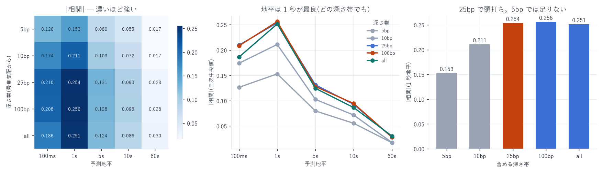

# `book_slope` の最適粒度

対象: 成熟期 10 日(2026-07-16 〜 08-09)、100ms グリッド 864 万点
作成日: 2026-08-15

---

## 0. 結論

| 粒度 | 最適 | 現在の実装 |
|---|---|---|
| 予測地平 | 1 秒(どの深さ帯でも同じ) | 1 秒 ✔ |
| 深さ帯 | 最良気配から 25bp 以内 | 上位 60 レベル全部(= `all`) |
| サンプリング間隔 | 相関は変わらない(標本数だけ増える) | 1 秒で十分 |

深さ帯を `all` から `25bp` に変えるのが唯一の改善余地だが、差は −0.2514 → −0.2537 と僅か。
実質的に現在の実装で最適に近い。

一方で 5bp では明確に不足(−0.153)。情報は最良気配の直近ではなく 10〜25bp の帯にある。



---

## 1. 測定した 2 つの粒度

```
book_slope_side(帯) = Σ_{i∈帯}(距離_i[bp] × 数量_i) / Σ_{i∈帯} 数量_i
book_slope_diff     = bid − ask
```

- (a) 予測地平: 100ms グリッドで状態を取り、h ∈ {100ms, 1s, 5s, 10s, 60s} 先の
  中値リターンとの相関を測る(状態は T 時点、リターンは [T, T+h)。重ならない)
- (b) 深さ帯: 最良気配から 5 / 10 / 25 / 100bp 以内、および全レベル(上限 60 段)

---

## 2. 結果 — |相関|(日次中央値・括弧内は 10 日中で符号が負だった日数)

| 深さ帯 | 100ms | 1s | 5s | 10s | 60s |
|---|---|---|---|---|---|
| 5bp | 0.1263 (10) | 0.1529 (10) | 0.0797 (9) | 0.0554 (9) | 0.0170 (8) |
| 10bp | 0.1739 (10) | 0.2110 (10) | 0.1025 (9) | 0.0716 (9) | 0.0175 (9) |
| 25bp | 0.2096 (10) | 0.2537 (10) | 0.1311 (9) | 0.0928 (9) | 0.0280 (9) |
| 100bp | 0.2084 (10) | 0.2561 (9) | 0.1279 (9) | 0.0945 (9) | 0.0280 (9) |
| all(60 段) | 0.1860 (9) | 0.2514 (10) | 0.1244 (10) | 0.0864 (10) | 0.0302 (10) |

### (a) 予測地平は 1 秒が最良 — どの深さ帯でも同じ形

25bp 帯を例にとると、

| 地平 | 100ms | 1s | 5s | 10s | 60s |
|---|---|---|---|---|---|
| 相関 | 0.2096 | 0.2537 | 0.1311 | 0.0928 | 0.0280 |
| 1s に対する比 | 83% | 100% | 52% | 37% | 11% |

- 100ms では 17% 弱い。板の傾きが値動きに変換されるまでに数百 ms かかる
- 5 秒で半分、60 秒で 1 割まで落ちる。情報の寿命は数秒

これは他の特徴量と同じ形(`features_report.md` §5 の約定インバランスも 1 秒が最良)。

### (b) 深さ帯は 25bp で頭打ち

1 秒地平での比較:

| 帯 | 5bp | 10bp | 25bp | 100bp | all |
|---|---|---|---|---|---|
| 相関 | 0.1529 | 0.2110 | 0.2537 | 0.2561 | 0.2514 |
| 25bp に対する比 | 60% | 83% | 100% | 101% | 99% |

- 5bp では 4 割の情報を落とす。最良気配のすぐ近くだけを見ても足りない
- 10bp → 25bp で +20%。この帯に主要な情報がある
- 25bp より深くしても増えない(100bp で +1%、全レベルで −1%)。
  25bp より外の板は、1 秒先の値動きには関係していない

---

## 3. サンプリング間隔は相関を変えない

100ms グリッドで取っても 1 秒グリッドで取っても、同じ地平なら相関はほぼ同じになる。
サンプリングを細かくすると標本数が 10 倍になるだけで、
測っている関係そのものは変わらない(重複した標本が増える)。

したがって「粒度」を考えるときは

- 予測地平 = 実際に効く時間スケール → 1 秒
- 深さ帯 = どの範囲の板を見るか → 25bp
- サンプリング間隔 = 何点取るか → 用途次第(執行なら細かく、推定なら 1 秒で十分)

を分けて考える必要がある。

---

## 4. 現在の実装との差

| | 現在 | 最適 | 差 |
|---|---|---|---|
| 深さ帯 | 上位 60 レベル全部 | 25bp 以内 | 相関 0.2514 → 0.2537(+0.9%) |
| 地平 | 1 秒 | 1 秒 | 変更なし |
| サンプリング | 1 秒 | 1 秒 | 変更なし |

改善余地は +0.9% しかない。 ただし 25bp 版は計算も軽く(走査するレベル数が減る)、
「最良気配から 25bp 以内の板の傾きの左右差」という説明も明快なので、
次に作り直すときは 25bp を既定にするのが良い。

注意: 本測定の相関(−0.25)は成熟期 10 日での値で、
全 99 日での `book_slope_diff` は −0.1348(`panel_v2_report.md`)。
少数日での測定は過大に出るという前回の教訓がここでも当てはまる。
粒度の比較(どれが最良か)は少数日でよいが、水準は全期間で見ること。

---

## 5. 成果物

```
data/book_slope_grain/YYYY-MM-DD.parquet   100ms グリッド × 深さ帯 5 種 × 側 2(10 日)
data/book_slope_grain.json                 帯 × 地平の相関(日次中央値)
scripts/book_slope_grain.py                算出(build 引数で日を分割実行可)
scripts/book_slope_grain_chart.py          図 28
```

```bash
uv run python scripts/book_slope_grain.py build 2026-07-16 2026-07-19 ...  # 1 日 166 秒
uv run python scripts/book_slope_grain.py         # 集計
uv run python scripts/book_slope_grain_chart.py
```
