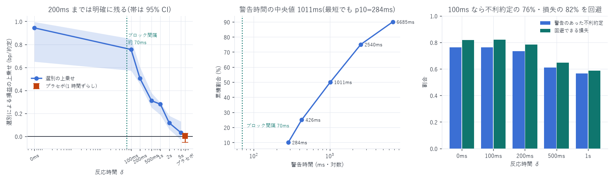

# キャンセル猶予時間の実測 — 逆選択回避は物理的に間に合うか

対象: 成熟期 10 日(2026-07-16 〜 08-09)、メイカー約定約 150 万件
判定に使う日数: 9 日(閾値に前日を使うため初日は評価から除外)
作成日: 2026-08-15

---

## 0. 結論

間に合う。 反応時間 200ms までなら選別の利益は明確に残り、
警告時間の中央値は 1,011ms、最短でも 10 パーセンタイルで 284ms ある。
取引所のブロック間隔(約 70ms)に対して 4 倍以上の余裕がある。

| 反応時間 δ | 選別後の損益 | 上乗せ | 上乗せが負の日 | ブートストラップ 95% CI | p(≤0) |
|---|---|---|---|---|---|
| 0 ms | +0.7024 | +0.9436 | 0 / 9 | [+0.650, +0.996] | 0.0000 |
| 100 ms | +0.6507 | +0.7555 | 0 / 9 | [+0.572, +0.849] | 0.0000 |
| 200 ms | +0.4516 | +0.5050 | 0 / 9 | [+0.456, +0.603] | 0.0000 |
| 500 ms | +0.1609 | +0.3098 | 0 / 9 | [+0.250, +0.377] | 0.0000 |
| 1 s | +0.1703 | +0.2796 | 0 / 9 | [+0.187, +0.292] | 0.0000 |
| 2 s | +0.0323 | +0.1169 | 1 / 9 | [+0.061, +0.179] | 0.0000 |
| 5 s | −0.1292 | +0.0321 | 2 / 9 | [−0.030, +0.130] | 0.1020 |
| プラセボ | −0.1371 | +0.0030 | 4 / 9 | [−0.053, +0.027] | 0.7278 |

選別なし(全約定)の平均損益の中央値は −0.0072 bp。



---

## 1. 何を、どう検証したか

### 1-1. 問いの定式化

「不利な約定を避ける」には、約定が起きる前にシグナルを見て板から引く必要がある。
実際の発注系には反応時間がかかる(シグナル計算 → 発注判断 → 取引所到達 → ブロック処理)。

したがって検証すべきは次の一点である。

> 反応時間を δ と仮定したとき、δ だけ古いシグナルでも不利な約定を選り分けられるか。

δ を伸ばしていって利益が消える点が、この戦略に許される反応時間の上限になる。

### 1-2. 測定の手順(1 約定ごと)

メイカー約定 1 件について、次を計算した。

```
方向        s   = +1(メイカーが買った) / −1(メイカーが売った)
実現損益    r   = s × (mid(t+1s) − 約定価格) / mid(t) × 10⁴ − 手数料 0.088 bp
シグナル    g_δ = book_slope_diff を **時刻 t − δ 以前の直近グリッド点**で読む
整合度      a_δ = s × (−g_δ)
```

- `book_slope_diff = S^Bid − S^Ask`(深さ 25bp)。予測リターンは `−book_slope_diff` に比例する
  (`slope_regression_report.md`: β_A = +0.0133、β_B = −0.0142、いずれも有意)
- シグナルは 100ms グリッドで持つ(`book_slope_grain` のキャッシュ)。
  δ = 100ms 単位で刻める粒度が要るため
- $a_\delta > 0$ = 「シグナルは、その約定が自分に有利な向きだと言っている」

### 1-3. 戦略の模擬

「その日の約定のうち、整合度 $a_\delta$ が上位 30% のものだけを取る」 戦略の平均損益を測る。
これは「不利なときは板から引き、有利なときだけ残す」に対応する。

上乗せ = (選別後の平均損益) − (全約定の平均損益)。これが選別によって得られる分。

### 1-4. 警告時間の測定(補助的な指標)

不利に終わった約定(`r < 0`)のうち、約定時点でシグナルが既に不利だったものについて、
そのシグナルが不利へ転じてから約定までの経過時間を遡って測った(最大 60 秒)。
これは「何ミリ秒前から危険と分かっていたか」を直接表す。

---

## 2. 統計的正当性のために取った措置

この検証は「間に合う/間に合わない」の判断を左右するので、
`METHODOLOGY.md` と `regression_report.md` §9 の監査で確立した作法をすべて適用した。

### (1) 閾値を未来から取らない

上位 30% の閾値を当日の分布から取ると、その日の結果を見てから線を引くことになる。
そこで 前日の整合度分布から閾値を計算して当日に適用した。
このため初日は評価対象から外れ、9 日での判定となっている。

### (2) 推論の単位は「日」

n = 150 万件だが、プールした t 統計量は使わない。
1 秒ごとの観測は強く自己相関し、実効標本は n の 1/14 しかない(§9 T5)。
そこで

- 日ごとに上乗せを計算し、9 日の中央値を報告する
- 符号が負だった日数を併記する(分布に依存しない証拠)
- ブロック・ブートストラップ(ブロック長 2 日、5,000 回)で 95% 信頼区間と
  `p(上乗せ ≤ 0)` を出す

### (3) プラセボ検定

シグナル系列を 1 時間ずらして同じ手順を回した。
分布も自己相関構造も同じで、時点の対応だけが壊れる。
ここで上乗せが出れば「手順そのものが利益を作っている」ことになり、結果は無効になる。

> 結果: プラセボの上乗せは +0.0030 bp、95% CI [−0.053, +0.027]、p = 0.728、
> 9 日中 4 日が負。完全にゼロと区別できない。
> したがって §0 の結果は手順の artifact ではない。

### (4) δ の結果を全部報告する

7 通りの δ を試している。良い δ だけを拾わないため全件を表に載せた。
結果は δ に対して単調に減衰しており、都合のよい 1 点を選んだ形跡がないことが読み取れる。

### (5) 既知の汚染要因を除外済み

- クロス状態(`is_crossed`)は `microprice` の読み込み時に除外
- 中値は backward asof のみで参照(`searchsorted(..., side="right") − 1`)
- シグナルは常に $t-\delta$ 以前の点。未来の情報は構造的に入らない
- 手数料 0.088 bp は実測値(`hft_roadmap.md`)を全ケースで控除済み

---

## 3. 結果

### 3-1. 反応時間ごとの選別効果

§0 の表のとおり。読み取れることは 3 つ。

1. 200ms までは明確に残る。0 → 100ms で上乗せは 0.944 → 0.756(80% 保持)、
   200ms でも 0.505(54% 保持)。いずれも 9 日すべてで正、CI は 0 を含まない
2. 500ms を超えると急速に落ちる。1s で 0.280、2s で 0.117、
   5s では p = 0.102 で有意でなくなる
3. プラセボはゼロ。手順の artifact ではない

### 3-2. 警告時間の分布

不利な約定 163,334 件について:

| 分位 | 警告時間 |
|---|---|
| p10 | 284 ms |
| p25 | 426 ms |
| p50 | 1,011 ms |
| p75 | 2,540 ms |
| p90 | 6,685 ms |

最も急な 10% でも 284ms の猶予がある。 ブロック間隔(約 70ms)の 4 倍。

### 3-3. どれだけ避けられるか

「シグナルが不利を示したら引く」を実行した場合:

| δ | 警告のあった不利約定 | 回避できる損失 | 引いた場合の平均損益 |
|---|---|---|---|
| 0 ms | 76.3% | 81.8% | +0.6658 |
| 100 ms | 76.4% | 81.9% | +0.5942 |
| 200 ms | 73.3% | 78.4% | +0.3986 |
| 500 ms | 61.0% | 64.7% | +0.1211 |
| 1 s | 56.7% | 58.8% | +0.0689 |

100ms の反応時間があれば、不利な約定の 76%・損失額の 82% を回避できる。
不利な約定は全体の 47.0% を占めるので、これは大きい。

0ms と 100ms がほぼ同じなのは、シグナルを 100ms グリッドで持っているため
両者が 1 グリッド分しか違わないことによる。劣化が始まるのは 200ms から。

---

## 4. 判定

| 論点 | 判定 |
|---|---|
| ブロック間隔(70ms)に対して猶予はあるか | ある(警告時間の p10 = 284ms、p50 = 1,011ms) |
| 100ms の反応時間で利益は残るか | 残る(上乗せ +0.756 bp、9/9 日で正、p < 0.0001) |
| 200ms でも残るか | 残る(+0.505 bp、9/9 日で正) |
| 500ms 以上でも残るか | 残るが半分以下(+0.310 bp)。5s では有意でない |
| 見せかけではないか | プラセボが完全にゼロ(p = 0.728) |

→ ロードマップの項目 1 は「合格」。物理的に成立する。
反応時間の予算は 200ms 以内、できれば 100ms 以内を目標にすべき。

---

## 5. 限界 — これで示せていないこと

| 限界 | 内容 |
|---|---|
| バックテストではない | 数えているのは他の参加者に実際に起きた約定。<br>自分が引いたときにその約定が起きなかったかは検証していない |
| 選別の機会費用が未計上 | 悪いシグナルで引くと、良い局面でキューの先頭にいない。<br>この損失は本検証に含まれない(項目 2・3 で測る) |
| 自分の注文が板に与える影響 | 小口なら無視できるが、規模を上げると自分がシグナルを動かす |
| 10 日・単一銘柄 | 成熟期のみ。立ち上げ期には当てはまらない(関係が 5〜7 倍動く) |
| δ の粒度 | シグナルが 100ms グリッドなので、それより細かい反応時間は区別できない |
| 1 秒地平の損益 | 在庫を 1 秒で落とせる前提。実際には約定確率モデル(項目 2)が要る |

---

## 6. 次にやること

本検証で物理的な可能性は確認できたので、ロードマップの項目 2 へ進める。

1. 約定確率モデル(`P(fill | キュー位置, スプレッド, シグナル, 経過時間)`)
   — 選別の機会費用を計算するために必須。データは `queue_qi`(3.44 億注文)に完備
2. イベント駆動バックテスタ — 自分の注文をキューに入れて追跡し、
   「常時両側に出す」が実測 −0.007 bp を再現するかで実装を検証する

---

## 7. 成果物

```
data/cancel_latency.json          δ 別の上乗せ・CI・プラセボ・警告時間の分位
data/cancel_latency_extra.json    警告割合・回避できる損失・引いた場合の損益
data/cancel_latency_extra.csv     日次の内訳
scripts/cancel_latency.py         本検証(閾値は前日・日次推論・プラセボ)
scripts/cancel_latency_extra.py   補足指標
scripts/cancel_latency_chart.py   図 31
```

```bash
uv run python scripts/cancel_latency.py         # 約 5 分
uv run python scripts/cancel_latency_extra.py   # 約 4 分
uv run python scripts/cancel_latency_chart.py
```

---

AWS 費用: 既存データのみで完結(追加 egress なし)。
EC2 \$25.05 | S3 ≈\$1.87 | 累計 ≈\$26.92 / 予算 \$60(EC2 は停止中)
