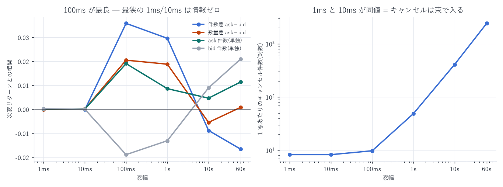

# 注文キャンセル — Bid/Ask 別の件数・数量を 6 通りの窓で

対象: `xyz:DRAM / USDC`(Hyperliquid HIP-3)、2026-05-04 〜 2026-08-10(99 日)
標本: 板に載った注文のキャンセル 340,236,484 件
(Bid 側の取消数量 311.0 億 / Ask 側 296.3 億 = 51.2% / 48.8%)
作成日: 2026-08-14

---

## 1. 定義

窓幅 Δt ∈ {1ms, 10ms, 100ms, 1s, 10s, 60s} ごとに、Bid / Ask 別で集計する。

| 列 | 内容 |
|---|---|
| `n_cancel_bid` / `n_cancel_ask` | キャンセル件数 |
| `vol_cancel_bid` / `vol_cancel_ask` | キャンセル数量(取消時点の残量 `orig_sz − filled_sz`) |
| `lambda_cancel_bid` / `lambda_cancel_ask` | 数量 / Δt [数量/秒] |
| `cancel_diff_n` | `n_cancel_ask − n_cancel_bid` ← 指定の「Bid/Ask キャンセル率」(件数版) |
| `cancel_diff_vol` | `vol_cancel_ask − vol_cancel_bid`(数量版) |
| `cancel_diff_lambda` | 同上を Δt で割ったもの |

符号は指定どおり ask − bid。 売り板の取消が多いと正になる。
(`flow_report.md` の `cancel_intensity_diff` は bid − ask で符号が逆。両方あるので取り違えに注意)

対象は板に載った注文のみ(棄却・非滞留 TIF・トリガーは除外)。
出力はキャンセルが 1 件以上あった窓だけで、無い窓は 0 と読む。

---

## 2. 窓の粒度 — キャンセルは束で入る

| 窓 | 窓数(全期間) | 1 窓あたりのキャンセル件数 |
|---|---|---|
| 1 ms | 41,110,727 | 8.28 |
| 10 ms | 41,109,343 | 8.28 |
| 100 ms | 34,799,275 | 9.78 |
| 1 s | 6,990,263 | 48.7 |
| 10 s | 831,788 | 409.0 |
| 60 s | 140,623 | 2,419.5 |

1ms と 10ms の窓数がほぼ同一(41,110,727 vs 41,109,343、差 0.003%)。
つまりキャンセルは離散的な瞬間に束になって入り、その束同士は 10ms 以上離れている。
最も忙しい日(2026-07-29)でも 21,732,296 件のキャンセルが 943,596 ミリ秒にしか現れず、
1 ミリ秒あたり 23 件が同時に飛ぶ。これは約定側で見た構造(`features_report.md` §5)と同じで、
取引所のブロック処理の刻みを反映している。

1ms まで刻んでも情報は増えない。

---

## 3. 記述統計

| 系列 | 窓 | 平均 | 標準偏差 |
|---|---|---|---|
| `n_cancel_bid` | 100ms | 4.92 件 | 9.40 |
| `n_cancel_ask` | 100ms | 4.86 件 | 9.42 |
| `vol_cancel_bid` | 100ms | 894 | 2,225 |
| `vol_cancel_ask` | 100ms | 851 | 2,145 |
| `cancel_diff_n` | 100ms | −0.060 件 | 8.39 |
| `cancel_diff_vol` | 100ms | −42.3 | 1,907 |
| `cancel_diff_n` | 1s | −0.297 | 22.7 |
| `cancel_diff_n` | 60s | −14.8 | 545 |

平均が一貫して負 = 買い板の取消のほうがわずかに多い(件数で 1.2%、数量で 4.7%)。
`flow_report.md` の `cancel_ratio` ≈ 0.52 と整合する。

---

## 4. 予測力 — 100ms が最良、最狭は情報ゼロ



次窓の中値リターン($\log m_{T+2\Delta} - \log m_{T+\Delta}$、先読みなし)との相関。
日次推定の中央値、括弧は「符号が逆だった日数 / 算出できた日数」。

| 系列 | 1ms | 10ms | 100ms | 1s | 10s | 60s |
|---|---|---|---|---|---|---|
| `cancel_diff_n`(件数差) | −0.0000<br>(36/69) | −0.0001<br>(48/92) | +0.0358<br>(14/99) | +0.0296<br>(15/99) | −0.0088<br>(62/99) | −0.0166<br>(64/98) |
| `cancel_diff_vol`(数量差) | −0.0001<br>(39/69) | +0.0002<br>(44/92) | +0.0205<br>(16/99) | +0.0188<br>(19/99) | −0.0054<br>(55/99) | +0.0008<br>(49/98) |
| `n_cancel_ask` 単独 | +0.0001 | +0.0001 | +0.0191<br>(12/99) | +0.0086<br>(25/99) | +0.0047 | +0.0114 |
| `n_cancel_bid` 単独 | +0.0003 | +0.0000 | −0.0189<br>(82/99) | −0.0131<br>(78/99) | +0.0090 | +0.0210 |

読み取れること

1. 符号は理論どおりで、片側ずつ見ると鏡像になる。 売り板の取消が増えると価格は上がり
   (`n_cancel_ask` は 99 日中 87 日で正)、買い板の取消が増えると下がる
   (`n_cancel_bid` は 99 日中 82 日で負)。板が消えた側へ価格が動く
2. 最良は 100ms(`cancel_diff_n` = +0.0358、99 日中 85 日で正)。
   これは本プロジェクトで測った板・フロー系の指標の中では強い部類
   (`order_imbalance` の 1 秒窓 +0.077 に次ぐ)
3. 件数差(+0.0358)が数量差(+0.0205)より強い。
   キャンセルは「何枚消えたか」より「何本消えたか」のほうが情報を持つ。
   大口の取消 1 本より、小口の取消が多数出るほうが方向を語る
4. 1ms / 10ms は完全に情報ゼロ(相関 0.0000〜0.0003)。
   §2 のとおり束で入るので窓を刻んでも中身が変わらない
5. 10s / 60s では符号が反転する(−0.009 / −0.017)。取消の情報は 1 秒以内に消費される

### 1ms で算出できない日がある理由

1ms 窓では 99 日中 30 日で相関が計算できなかった。原因は説明変数ではなく目的変数にある。
たとえば 2026-05-06 では 44,394 個の有効窓すべてで「1ms 先から 2ms 先までの中値変化」が
厳密に 0 だった(中値が 1ms の間に動くことが一度も無かった)。分散が 0 なので相関は未定義になる。
1ms は板の動きに対して細かすぎる、という事実そのものである。

---

## 5. 検証

| 項目 | 結果 |
|---|---|
| 窓に落とした後の件数保存 | 99 日 × 6 窓すべてで `Σ(n_bid + n_ask) = その日のキャンセル数`(実行時 assert) |
| 取消数量が負になる行 | 0 件(`orig_sz − filled_sz` を 0 で下限クリップ) |
| 対象の定義 | 板に載った注文のみ。棄却・非滞留 TIF・トリガーは除外(`flow_report.md` §1) |
| 全期間の合計 | 340,236,484 件 / Bid 311.0 億・Ask 296.3 億 |

---

## 6. 成果物

```
data/cancel_grid/step={1ms,10ms,100ms,1s,10s,60s}/dt=…/part-000.parquet   2.7GB
data/cancel_grid_daily.csv        日次サマリ 99 行
data/cancel_grid_summary.json     窓数と 1 窓あたり件数
data/cancel_grid_predictive.json  記述統計と予測力の全数値
scripts/build_cancel_grid.py      算出(約 15 分)
scripts/cancel_grid_summary.py    記述統計と予測力
scripts/cancel_grid_chart.py      図 21
```

```bash
uv run python scripts/build_cancel_grid.py <出力先>
uv run python scripts/cancel_grid_summary.py
uv run python scripts/cancel_grid_chart.py
```

---

AWS 費用: 既存データのみで完結(追加 egress なし)。
EC2 \$25.05 | S3 ≈\$1.87 | 累計 ≈\$26.92 / 予算 \$60(EC2 は停止中)
