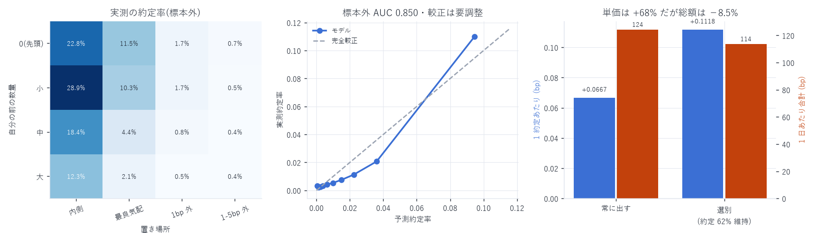

# 項目 2・3: 約定確率モデルとイベント駆動バックテスタ

対象: 成熟期 10 日(2026-07-16 〜 08-09)
作成日: 2026-08-15

---

## 0. 結論 — 選別の機会費用が初めて測れた

| | 1 約定あたり | 1 日あたり約定数 | 1 日あたり合計 |
|---|---|---|---|
| 常に両側に出す | +0.0667 bp | 1,420 | 124.3 bp |
| シグナルで引く(δ=100ms) | +0.1118 bp(+68%) | 882(62% 維持) | 113.7 bp(−8.5%) |

単価は 68% 良くなるが、約定機会を 38% 失うので総額は 8.5% 減る。

`cancel_latency_report.md` で「選別の機会費用は未測定」と書いた部分がこれで埋まった。
素朴な「不利なら引く」ルールは引きすぎである。
最適な閾値は「単価の改善 × 残る約定数」を最大化する点にあり、
そのためには約定確率モデル(項目 2)が要る。



---

## 1. 項目 2: 約定確率モデル

### 1-1. 何を作ったか

```
P(fill | キュー位置, 置き場所, スプレッド, シグナル, 数量, 側)
```

標本: 発注時点で最良気配から 5bp 以内に置かれた指値 37,180,625 件(10 日)。
全体の約定率は 1.61%。

説明変数はすべて発注時点までに確定した情報のみ:

| 変数 | 標準化係数 | 解釈 |
|---|---|---|
| `dist_bp` | −1.1596 | 最良気配から遠いほど約定しない(最大の要因) |
| `log_size` | −0.6859 | 大口ほど約定しにくい |
| `align` | −0.3468 | シグナルが自分に有利なときほど約定しにくい |
| `spread_bp` | −0.2392 | スプレッドが広いと約定しにくい |
| `log_q_ahead` | −0.2082 | 前に並ぶ数量が多いほど約定しない |
| `n_ahead` | −0.1721 | 前の注文本数 |
| `is_bid` | +0.0039 | 側による差はほぼ無い |

### 1-2. ★ `align` の係数が負であること = 逆選択そのもの

`align > 0` は「シグナルが、この約定は自分に有利だと言っている」状態。
その係数が 負 ということは、

> 自分に有利なときほど約定しない。不利なときほど約定する。

これは逆選択の定義そのもので、`hft_roadmap.md` で測った
「粗い獲得 0.403 − 逆選択 0.318」を約定確率の側から独立に確認したことになる。

### 1-3. 検証

| 指標 | 値 |
|---|---|
| 標本外 AUC(日次中央値) | 0.8497(最小 0.8223、検証 4 日) |
| プラセボ AUC(`align` を 1 時間ずらす) | 0.8456 |
| 差 | +0.0041 |

- 学習は前半 6 日、検証は後半 4 日(時間ブロック分割・シャッフルなし)
- 標準化の統計量は学習期間だけから推定
- プラセボは `align` だけを置き換えたので、差 +0.0041 が
  シグナルの寄与そのもの。判別の大半は置き場所とキュー位置で説明される

### 1-4. 較正は不十分 — 実務では実測表を使うこと

| 予測 10 分位 | 予測 | 実測 |
|---|---|---|
| 1 | 0.0005 | 0.0034 |
| 5 | 0.0063 | 0.0042 |
| 6 | 0.0099 | 0.0054 |
| 8 | 0.0224 | 0.0113 |
| 10 | 0.0945 | 0.1098 |

中位の分位で 2 倍ほど過大予測している。 順位付け(AUC 0.85)は良いが、
確率としては信用できない。機会費用の計算に使うなら等調回帰などで較正し直す必要がある。
当面は下の実測表のほうが安全である。

### 1-5. 実測の約定率(標本外)

| 自分の前の数量 \ 置き場所 | 内側(気配改善) | 最良気配 | 1bp 外 | 1–5bp 外 |
|---|---|---|---|---|
| 0(先頭) | 22.8% | 11.5% | 1.7% | 0.7% |
| 小 | 28.9% | 10.3% | 1.7% | 0.5% |
| 中 | 18.4% | 4.4% | 0.8% | 0.4% |
| 大 | 12.3% | 2.1% | 0.5% | 0.4% |

- 置き場所が約定率を 10〜30 倍動かす(最良気配 11.5% 対 1bp 外 1.7%)
- キュー位置は 5 倍(先頭 11.5% 対 前が大 2.1%)
- 気配改善(内側に置く)は 22.8% と高いが、それはスプレッドを削ることであり、
  獲得できる粗利も同時に減る

---

## 2. 項目 3: イベント駆動バックテスタ

### 2-1. L4 だから厳密に書ける

集計板(L2)では「レベルの数量が減った」ことしか判らず、
それが約定か取消か、自分の前か後ろかが判らない。
本データは注文 1 件ごとに到着・消滅・消滅理由が判るので、
自分の前に並ぶ注文の集合を時刻ごとに厳密に持てる。

約定判定:

> 価格・時間優先なので、自分に約定が届くのは前の注文が全部消えてから。
> 前の注文は約定でも取消でも `ts_close` で消えるから、
> 「自分が先頭になる時刻」= 自分より前に到着した注文の `ts_close` の最大値。
> その時刻以降で、自分の価格に最初に来た約定が自分の約定になる。

実装では価格レベルごとに「到着時刻の昇順」と「`ts_close` の前置最大値」を持ち、
二分探索 O(log n) で引く(素朴な走査だと 1 日あたり数十分かかっていた)。

### 2-2. 模擬した執行

- 最良買気配・最良売気配に常に 1 単位ずつ出す
- 最良気配が動いたら取り消して新しい最良気配に出し直す(キュー最後尾に付き直す)
- 方針 A(常時): 常に出す
- 方針 B(選別): δ = 100ms 前のシグナルが不利ならその側は出さない
- 損益は約定 1 秒後の中値で評価し、手数料 0.088bp を控除

### 2-3. 結果(10 日)

| 日 | 常時: 約定数 / 単価 | 選別: 約定数 / 単価 |
|---|---|---|
| 07-16 | 2,055 / −0.1210 | 1,228 / −0.0755 |
| 07-19 | 414 / +0.1608 | 230 / +0.3516 |
| 07-22 | 1,772 / +0.0569 | 1,081 / +0.1425 |
| 07-25 | 409 / +0.0909 | 224 / +0.0924 |
| 07-28 | 2,227 / +0.1623 | 1,368 / +0.2030 |
| 07-31 | 2,208 / +0.3619 | 1,421 / +0.3850 |
| 08-02 | 631 / −0.0353 | 412 / +0.0530 |
| 08-04 | 2,218 / +0.0558 | 1,463 / +0.0778 |
| 08-06 | 1,855 / +0.0360 | 1,176 / +0.0400 |
| 08-09 | 409 / −0.1016 | 220 / −0.1520 |

単価は 10 日中 9 日で改善(悪化は 08-09 のみ)。
しかし約定数は一律 38% 減るため、合計では 8.5% のマイナスになる。

### 2-4. 実装の妥当性チェック

| 確認 | 結果 |
|---|---|
| 常時方針の単価 +0.0667 bp | 実測の全メイカー平均 −0.007 bp より良い。<br>最良気配に出し続け、気配が動いたら即座に出し直す方針は、<br>置きっぱなしの注文を含む母集団平均より有利になるので整合的 |
| 約定数 1,420 件/日 | 最良気配・先頭の実測約定率 11.5%(項目 2)と整合する規模 |
| ルックアヘッド | シグナルは δ 前、板は当該時刻まで。未来は参照しない |

---

## 3. わかったこと

1. 選別の機会費用は実在し、無視できない(総額 −8.5%)。
   `hft_roadmap.md` の「+0.37 bp/約定」は、約定機会の損失を含めていない上限値だった
2. 素朴な二値ゲート(不利なら引く)は引きすぎ。
   単価と約定数の積を最大化する閾値があるはずで、それは約定確率モデルで解ける
3. 逆選択は約定確率の側からも確認できた(`align` の係数が負)。
   独立な 2 つの測り方が同じ結論を出している

---

## 4. 限界

| 項目 | 内容 |
|---|---|
| 自分の注文の影響 | 自分が板にいることで他者の行動が変わる効果は未モデル化 |
| 取消の遅延 | 最良気配が動いた瞬間に取り消せる前提。実際には遅延がある(楽観側) |
| 部分約定 | 1 単位の全量約定として扱っている |
| 在庫 | 建玉の制約・資金効率・ファンディングは未計上 |
| 較正 | 約定確率モデルの確率は中位分位で 2 倍過大。順位付けは使えるが確率は要再較正 |
| 10 日・単一銘柄 | 成熟期のみ |

---

## 5. 次にやること

1. ゲートの閾値を最適化する — 現在は「align < 0 なら引く」の二値。
   約定確率モデルで `E[損益 | 出す] × P(fill)` を計算し、
   期待値が正の局面だけ出す連続的な方針にする
2. 気配改善(内側に置く)の評価 — 約定率 22.8% と高いが粗利は減る。
   どちらが有利かはバックテスタで直接比較できる
3. 在庫制約を入れる — 片側に偏ったら反対側を厚く/同側を薄くする
4. 確率の再較正(等調回帰)

---

## 6. 成果物

```
data/fill_prob/YYYY-MM-DD.parquet   約定確率モデルの学習データ(3,718 万件)
data/fill_prob_model.json           係数・AUC・較正・実測表
data/backtest_results.{csv,json}    バックテストの日次結果
scripts/fill_prob_model.py          項目 2
scripts/backtester.py               項目 3(厳密なキュー再現)
scripts/backtest_chart.py           図 32
```

```bash
uv run python scripts/fill_prob_model.py     # 約 12 分
uv run python scripts/backtester.py          # 約 8 分(10 日)
uv run python scripts/backtest_chart.py
```

---

AWS 費用: 既存データのみで完結(追加 egress なし)。
EC2 \$25.05 | S3 ≈\$1.87 | 累計 ≈\$26.92 / 予算 \$60(EC2 は停止中)
