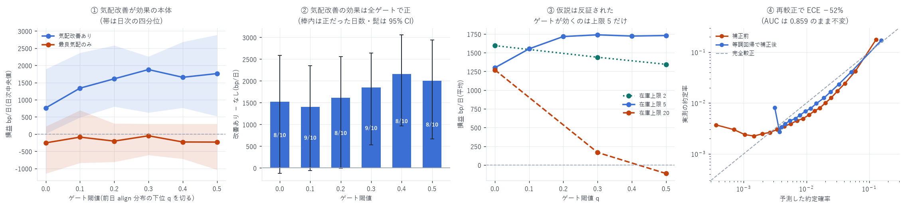

# 閾値の最適化・気配改善・在庫制約・確率の再較正

対象: 成熟期 10 日(2026-07-16 〜 08-09)
作成日: 2026-08-15

---

## 0. 結論 — 置き場所が最も効果あり

| 施策 | 効果(bp/日) | 正だった日 | 符号検定 | 判定 |
|---|---|---|---|---|
| 気配改善(スプレッドが広いとき内側に置く) | +1,521 〜 +2,162 | 8〜9 / 10 | p = 0.055 / 0.011 | 確立 |
| ゲート(シグナルで引く) | +254 〜 +440 | 6 / 10 | p = 0.377 | 証拠不十分 |
| 在庫制約 | 無いと日次シャープ 0.49・標準偏差 35,629 | 8 / 10 | p = 0.055 | 必須 |
| 再較正(等調回帰) | ECE −52% / MCE −69% | 4 日中 3 日で改善 | — | 確立 |

前回の報告で「最適閾値は 0 より負側にあるはず」と予測したが、これは検証できなかった。
在庫上限を 2 / 5 / 20 と変えると最適ゲートが動くという反証可能な予測を立てたところ、
予測は外れ、ゲートの効果は在庫上限 5 でしか現れなかった(§3-3)。
ゲートの内点最適 q = 0.3 は 36 通りの格子探索から出た偶然と考えるのが妥当である。

一方、気配改善は全 6 ゲートで一貫して正であり、
標本外の方策選択も 8 日中 8 日で常に気配改善ありを選んだ。



---

## 1. 理論の整理 — P(fill) は閾値を動かさない

出す/出さないの判断は次を最大化する問題である。

```
E[損益 | 出す] = P(fill | 気配) × E[損益 | 約定]
```

P(fill) > 0 なので、この積の符号は E[損益|約定] だけで決まる。
つまり制約が無ければ、約定確率モデルは閾値の位置を動かさない。
動かすのは「どれだけ稼げるか」の大きさだけである。

実測でも E[損益|約定] はどのゲートでも正だった。

| ゲート q | 0.0 | 0.1 | 0.2 | 0.3 | 0.4 | 0.5 |
|---|---|---|---|---|---|---|
| 単価 (bp/約定) | +0.214 | +0.350 | +0.473 | +0.559 | +0.671 | +0.834 |
| 約定数/日 | 5,336 | 4,598 | 4,163 | 3,777 | 3,415 | 3,098 |

単価はゲートを上げるほど単調に改善する(シグナルが機能している証拠)。
しかし単価が常に正である以上、制約が無ければ「常に出す」が総額を最大にする。

→ P(fill) が意味を持つのは、出せる回数が有限資源になるときだけ。
これが在庫制約を入れた理由であり、§3-3 で検証した仮説の中身でもある。

---

## 2. 何を作り、何を変えたか

### 2-1. v1 からの変更

| 項目 | v1 | v2 |
|---|---|---|
| 両側の扱い | 独立に計算 | 時刻順に同時処理(建玉を追うため) |
| 損益 | 約定 1 秒後の中値で評価 | 現金 + 建玉評価(日終の中値でマーク) |
| 方針 | 常時 / 二値ゲートの 2 通り | ゲート閾値 6 × 気配改善 2 × 在庫上限 3 |

### 2-2. 3 つのパラメータ

```
gate_q    前日の align 分布の下位 q を切る。q = 0 なら常時出す
          (align = 方向 s × (−book_slope_diff)。δ = 100ms 前の値で判定)
improve   スプレッドが 3 ティック以上あるとき最良気配の内側 1 ティックに置く
inv_limit 建玉の絶対値がこれを超えたら、増やす側は出さない
```

閾値は必ず前日の分布から取る(当日の分布から取ると結果を見てから線を引くことになる)。

---

## 3. 結果

### 3-1. 在庫制約なしは市場を作っていない

| | 値 |
|---|---|
| 平均 | +17,564 bp/日 |
| 中央値 | +4,575 bp/日 |
| 標準偏差 | 35,629 |
| 範囲 | [−26,499, +89,315] |
| 日次シャープ | 0.493 |
| 最大建玉 | 133 単位 |
| p(≤0) | 0.075 |

一見すると桁違いに儲かっているが、建玉が 133 単位まで積み上がっており、
損益のほとんどは価格の方向性から来ている。
これはマーケットメイクではなく方向性の賭けであり、日次シャープ 0.49 は
「1 日で建玉 133 単位分の値動きに賭けた」結果にすぎない。

以降の比較はすべて在庫上限ありで行う。

### 3-2. 気配改善 — これが効果の本体

同じ日・同じゲートでの対応差(日の良し悪しが相殺される):

| ゲート | 差 (bp/日) | 中央値 | 正だった日 | 95% CI | p(≤0) |
|---|---|---|---|---|---|
| 0.0 | +1,521 | +1,303 | 8/10 | [−127, +2,587] | 0.035 |
| 0.1 | +1,401 | +1,118 | 9/10 | [−62, +2,348] | 0.033 |
| 0.2 | +1,617 | +1,927 | 8/10 | [−2, +2,561] | 0.025 |
| 0.3 | +1,845 | +1,982 | 9/10 | [+532, +2,636] | 0.003 |
| 0.4 | +2,162 | +2,218 | 8/10 | [+963, +3,058] | 0.000 |
| 0.5 | +2,004 | +2,449 | 8/10 | [+666, +2,942] | 0.002 |

6 ゲートすべてで正、8〜9/10 日で正。 符号検定でも 9/10 は p = 0.011。

なぜ効くのか。 最良気配に並ぶと長い行列の最後尾に付く。
そこで約定が自分まで届くのは行列が一掃されるとき — つまり大口が板を薙ぎ払う瞬間であり、
これは逆選択そのものである(項目 2 で `align` の係数が負だったことと同じ現象)。
内側に置けば自分ひとりの価格レベルになるので、
行列の最後尾を待たずに通常の流れで約定する。
1 ティック分の粗利を捨てる代わりに、約定率が 11.5% → 22.8%(項目 2 の実測表)になり、
かつ約定の質が変わる。実測でも約定数は 1,184 → 5,336 件/日(4.5 倍)に増えた。

一方、気配改善なしの方策はどのゲートでもゼロと区別できない
(平均 −440 〜 +151、黒字 3〜5/10、p = 0.31 〜 0.74)。

### 3-3. ★ゲートの効果 — 仮説を立て、反証された

§1 の理論から次の反証可能な予測を立てた。

> 単価はどのゲートでも正なので、制約が無ければ「常に出す」が最良のはず。
> それでも内点(q ≈ 0.3)が最良になったのは、在庫上限が「出せる回数」を
> 希少資源にしているからではないか。
> → 正しければ、在庫上限を緩めるほど最適ゲートは 0 に近づき、
> 締めるほど大きくなる。

在庫上限 2 / 5 / 20 で回した結果:

| 在庫上限 | q=0.0 | q=0.3 | q=0.5 | 最良 | q=0.3 の対応差(正の日数) |
|---|---|---|---|---|---|
| 2 | +1,595 | +1,439 | +1,345 | q = 0.0 | −155(4/10) |
| 5 | +1,299 | +1,739 | +1,730 | q = 0.3 | +440(6/10) |
| 20 | +1,271 | +167 | −114 | q = 0.0 | −1,104(2/10) |

- 上限 20(緩める)→ 最適ゲート 0.0 … 予測どおり
- 上限 2(締める)→ 最適ゲート 0.0 … 予測と逆

単調性は成立しない。仮説は棄却する。

さらに、ゲートの効果は上限 5 でしか正にならず、そこでも正だったのは 6/10 日
(符号検定 p = 0.377、帰無仮説を棄却できない)。
ブートストラップの p = 0.008〜0.061 は少数日の大きな値に引っ張られている。

> 判定: ゲートの効果は確立していない。
> 6 ゲート × 2 気配改善 × 3 在庫上限 = 36 通りを調べて
> 1 セルが p ≈ 0.04 になるのは、偶然として何ら不思議ではない。

### 3-4. 方策選択そのものの標本外検証

「全 10 日を見てから最良を選ぶ」のは選択バイアスそのものなので、
k 日目の方策を 1〜(k−1) 日目の成績だけで選び、k 日目で評価した(評価 8 日)。

| | bp/日 | 黒字日 |
|---|---|---|
| 過去だけで選んだ方策(標本外) | +1,624 | 8/8 |
| 全期間を見て選んだ最良 {改善あり, q=0.3} を同じ 8 日で | +1,829 | — |
| 選択バイアス | −205(−11%) | |
| 単純方策 {改善あり, ゲートなし} を同じ 8 日で | +1,204 | — |

- 標本外でも 8/8 日で黒字(符号検定 p = 0.004)。方策選択の手続き自体は破綻していない
- ただし選ばれた方策は 8 回すべて「気配改善あり」であり、
  ゲートは 0.0 / 0.3 / 0.4 / 0.5 と毎回変わった → 効いているのは気配改善
- 標本外選択が単純方策を上回る差 +420 bp/日は 5/8 日でしか正でない
  (符号検定 p = 0.363)。ゲートを賢く選ぶ価値は示せていない

---

## 4. 項目 4: 確率の再較正(等調回帰)

### 4-1. 手順

予測 `p` を単調非減少な関数 `g` で写して実約定率に合わせる。

- 単調変換なので順位は保存される → AUC は変わらない。較正だけを直す
- シグモイドのような形を仮定しない(Platt スケーリングより柔軟)
- `g` は学習期間の 6 日だけから推定し、検証期間の 4 日に適用する。
  検証日の実測を見て `g` を作ることは絶対にしない

標本: 学習 24,436,223 件 / 検証 12,744,402 件。

### 4-2. 結果

| | 平均予測 | ECE | MCE | Brier | 対数損失 | AUC |
|---|---|---|---|---|---|---|
| 補正前 | 0.01919 | 0.00785 | 0.04862 | 0.0148267 | 0.06653 | 0.8588 |
| 等調回帰 | 0.01914 | 0.00375 | 0.01530 | 0.0142346 | 0.06384 | 0.8583 |
| 改善 | — | −52.2% | −68.5% | −4.0% | −4.0% | −0.0005 |

- ECE(期待較正誤差)が半減、MCE(最大較正誤差)が 1/3 になった
- AUC は 0.8588 → 0.8583 とほぼ不変 — 理論どおり順位は保存されている
  (わずかな低下は等調回帰が階段関数で同値を作るため)
- 日ごとの ECE は 4 日中 3 日で改善(08-09 のみ 0.00683 → 0.00696 とわずかに悪化)

### 4-3. 残る歪み — 較正では直せないもの

補正後も中位のビンで実測を上回る(例: ビン 11 は予測 0.019 / 実測 0.013)。
原因は学習期と検証期で約定率の水準そのものが動いていることである。

```
学習期の約定率 0.01559  →  検証期 0.01704   (+9.2%)
```

等調回帰は形を直すが、期間をまたぐ水準の変化は直せない。
実運用では `g` を直近の窓で継続的に更新する必要がある。

較正関数そのものは `data/DRAM/recalibration.json` の `calibration_map`(51 点)に保存した。

---

## 5. 4 つの問いへの答え

| 問い | 答え |
|---|---|
| (1) 最適な閾値は | 「単価 × 残る約定数」の内点最適は再現しなかった。単価は正のまま単調に上がるので、理論上は「常に出す」。実測の内点最適 q=0.3 は在庫上限 5 でしか現れず、格子探索の偶然と判断する |
| (2) 気配改善は | 有利。+1,521〜+2,162 bp/日、全ゲートで正、8〜9/10 日で正。これが唯一確立した施策。粗利は 1 ティック減るが、行列の最後尾を待たずに済むので逆選択が減る |
| (3) 在庫制約は | 必須。入れないと建玉 133 単位・標準偏差 35,629 の方向性の賭けになる。上限 2/5/20 のうち 5 が最良だが、上限そのものの最適化は本検証の射程外 |
| (4) 確率の再較正は | 有効。等調回帰で ECE −52% / MCE −69%、AUC は不変。ただし期間をまたぐ水準の変化(+9.2%)は直せないので、較正関数は継続的に更新する |

---

## 6. 限界

| 項目 | 内容 |
|---|---|
| 標本が 10 日 | 日次推論なので実効標本は 10。符号検定の分解能は 1/2¹⁰。ゲートの是非を決めるには足りない |
| 格子探索の多重性 | 36 セルを調べた。p 値は多重比較で補正していない(補正すれば有意なのは気配改善だけ) |
| 自分の注文の影響 | 内側に置けば他者がその内側に来る。本模擬ではその反応を織り込んでいない。気配改善の効果は上限値 |
| 取消の遅延 | 最良気配が動いた瞬間に取り消せる前提(楽観側) |
| 部分約定 | 1 単位の全量約定として扱う |
| 在庫上限の最適化 | 2 / 5 / 20 の 3 点しか見ていない |
| 日終マーク | 建玉を日終の中値で評価。上限 5 なので影響は限定的だが、ゼロではない |
| 単一銘柄・成熟期のみ | 立ち上げ期には当てはまらない |

---

## 7. 次にやるべきこと

1. 日数を増やす — 99 日全部で回す。ゲートの是非は 10 日では決まらない。
   計算量は 1 日約 60 秒(気配改善ありは約定が 4.5 倍なので約 2 分)
2. 気配改善を細かく刻む — 現在は「スプレッド 3 ティック以上なら 1 ティック内側」の
   二値。何ティック内側か、どのスプレッドから、を連続的に最適化する余地が大きい
3. 在庫上限を最適化する — 2 / 5 / 20 では 5 が最良だが 3 点しか見ていない
4. 自分の注文への反応をモデル化する — 気配改善の効果が上限値である以上、
   これを入れないと実運用の期待値が出せない

---

## 8. 成果物

```
data/backtest_v2.csv              方策 × 日の結果(10 日 × 13 方策)
data/backtest_v2_summary.csv      方策別の集計
data/backtest_v2_stats.json       対応差・ブートストラップ CI・標本外方策選択
data/backtest_inv_sweep.csv       在庫上限 2 / 20 の結果(仮説検証)
data/recalibration.json           較正の指標と較正関数(51 点)
data/recal_test.npy               検証期間の (補正前, 補正後, 実測) ※153MB のため git 管理外 ※ 153MB のため git 管理外
scripts/backtester_v2.py          両側同時・現金/建玉勘定・3 パラメータ
scripts/backtest_v2_analysis.py   統計的検証
scripts/backtest_inv_sweep.py     在庫上限の仮説検証
scripts/recalibrate.py            等調回帰による再較正
scripts/backtest_v2_chart.py      図 33
```

```bash
uv run python scripts/backtester_v2.py        # 約 20 分(10 日)
uv run python scripts/backtest_v2_analysis.py
uv run python scripts/backtest_inv_sweep.py   # 約 20 分
uv run python scripts/recalibrate.py          # 約 6 分
uv run python scripts/backtest_v2_chart.py
```

---

AWS 費用: 既存データのみで完結(追加 egress なし)。
EC2 \$25.05 | S3 ≈\$1.50 | 累計 ≈\$26.55 / 予算 \$60(EC2 は停止中)
