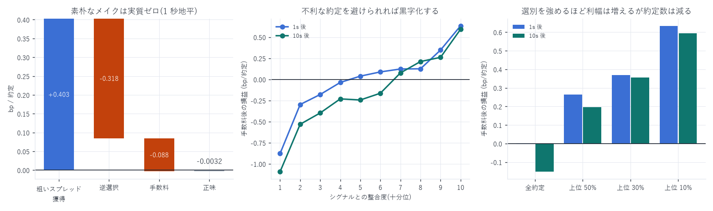

# ここから HFT 戦略にするには何が必要か

作成日: 2026-08-15
前提: 本レポートの数字は成熟期 10 日・メイカー約定 1,546,583 件の実測

---

## 0. 結論 — 戦略の形は数字が決めてしまう

| 事実 | 数字 | 含意 |
|---|---|---|
| テイカー手数料 | 0.846 bp(取引所 0.543 + deployer 0.227 + builder 0.076) | テイクは不可能。シグナルの予測幅は 1SD で 0.05bp |
| メイカー手数料 | 0.088 bp(リベートではなく支払い) | 獲得がこれを超える必要がある |
| 粗いスプレッド獲得 | +0.4032 bp / 約定 | 約定時のスプレッドの半分(0.788bp)の 51% しか取れていない |
| 逆選択(1 秒) | −0.3183 bp | 獲得の 79% を持っていかれる |
| 素朴なメイクの正味 | −0.0032 bp / 約定 | 実質ゼロ。全部の板に出すだけでは儲からない |
| シグナルで上位 30% だけ約定 | +0.3692 bp / 約定 | 選別すれば黒字。ここに唯一の勝ち筋がある |



戦略の形は 1 つに絞られる: パッシブなマーケットメイク + 逆選択回避。
方向を当てて叩きに行く戦略は、手数料 0.846bp に対しシグナルが 0.05bp なので成立しない。

---

## 1. 何が儲けを決めているか(実測)

### 損益分解(メイカー 1 件あたり、bp)

```
粗いスプレッド獲得   +0.4032
逆選択(1 秒)        −0.3183
手数料               −0.0880
────────────────────────────
正味                 −0.0032      ← 実質ゼロ
```

地平を伸ばすほど悪化する。

| 地平 | 実現損益 | 逆選択 | 手数料後 |
|---|---|---|---|
| 1 秒 | +0.0848 | 0.3183 | −0.0032 |
| 10 秒 | −0.0635 | 0.4667 | −0.1515 |
| 60 秒 | −0.1569 | 0.5603 | −0.2449 |
| 300 秒 | −0.3477 | 0.7513 | −0.4357 |

在庫を 1 秒以内に落とせないなら、持っているだけで負ける。

### シグナルで選別すると黒字化する

約定時点で判っている `book_slope_diff` と約定方向の整合度で十分位に分けた
(手数料 0.088bp 控除後、bp/約定):

| 整合度 | 1 秒後 | 10 秒後 | 黒字割合(1s) |
|---|---|---|---|
| 第 1 十分位(最も不利) | −0.8771 | −1.0921 | 42.4% |
| 第 5 | +0.0386 | −0.2436 | 54.6% |
| 第 8 | +0.1254 | +0.2115 | 58.4% |
| 第 10(最も有利) | +0.6346 | +0.5942 | 64.3% |

| 選別 | 1 秒後 | 10 秒後 |
|---|---|---|
| 全約定 | −0.0032 | −0.1515 |
| 上位 50% | +0.2639 | +0.1959 |
| 上位 30% | +0.3692 | +0.3555 |
| 上位 10% | +0.6346 | +0.5942 |

最悪十分位と最良十分位の差は 1.5 bp。 逆選択を避けることが利益の源泉である。

### ★ ただしこれはバックテストではない

上の数字は「実際に起きた約定を、シグナルで事後的に分類した」もの。
実戦では

- 選別にはコストがある。悪いシグナルで板から引くと、良い局面でキューの先頭にいない
- 約定時点のシグナルは発注時点では判らない。発注 → 約定の間に引ける必要がある
- 引けるかどうかはキャンセルが間に合うかで決まる

この 3 点を検証しないうちは「+0.37bp の戦略がある」とは言えない。

---

## 2. 足りないもの(優先順)

### ① キャンセルが間に合うかの実測 ★最優先・データは揃っている

上位 30% だけ約定するには、不利になった瞬間に板から引ける必要がある。

- 測ること: 「シグナルが不利に転じてから約定が起きるまでの時間」の分布
- 判定基準: 板の更新間隔は p10 = 54.5ms / p50 = 82.7ms(ブロック間隔)。
  キャンセルもブロック単位でしか効かない(`cancel_report.md`: 1ms と 10ms の窓数が同じ)
- 警告時間が 1 ブロック未満なら、この戦略は物理的に成立しない
- 必要データ: `book_px`(シグナル)+ `lifecycle`(自分の注文の消滅時刻)。全部ある

### ② 約定確率モデル ★データは揃っている

「どこに出せばどれだけ約定するか」が無いと、選別の機会費用が計算できない。

- 目標: `P(fill | キュー位置, スプレッド, シグナル, 経過時間)` の生存モデル
- 既に判っていること: 全体 1.005%、キュー先頭 1.579%、1k〜2.5k の後ろ 0.302%
  (`queue_qi_report.md`)
- 必要データ: `queue_qi`(3.44 億注文の `q_ahead_open` と結果)。全部ある

### ③ イベント駆動バックテスタ ★最大の工数

自分の注文を板に入れ、価格・時間優先でキューを追跡し、
実際の約定列に基づいて自分の約定を決める。

- 入力: `book_px`(板の差分)+ `fills`(約定列)+ 自分の注文
- 必須の作り込み: キュー位置の追跡、部分約定、キャンセル/置き直しでの優先順位喪失、
  自分の注文が板に与える影響(小口なら無視可)
- これが無いと ①〜② の結論を損益に翻訳できない。工数は数週間規模

### ④ 在庫と資金管理

- 建玉は `fills` の `startPosition` / `dir` から復元可能
- ファンディングは `data/DRAM/funding`(99 日分)に取得済み
- 必要: 在庫上限、傾け方(在庫が偏ったら反対側を厚くする)、清算距離の管理

### ⑤ 体制検知とパラメータ更新

- 実証済み: 関係は 5〜7 倍動き(`lasso_report.md`)、直前 30 分での再推定が最良
  (`minute_lasso_report.md`: 相対 MSE 0.983、3 日ブロックの 1.005 より良い)
- 必要: オンラインでの係数更新と、体制が変わったときの停止条件

### ⑥ 実行系

- レイテンシ予算: ブロック間隔 60〜70ms に対し、シグナル計算 + 発注往復が収まるか
- レート制限、WebSocket の再接続、注文の冪等性
- ライブの板記録(`Hyperliquid-L4data-DRAM-USDC-v1` の collector)との接続

---

## 3. 最短経路の提案

| 順 | やること | 見積り | 判定基準 |
|---|---|---|---|
| 1 | キャンセル猶予時間の実測(①) | 半日 | 警告時間の中央値が 1 ブロック(70ms)を超えるか。<br>超えなければここで撤退 |
| 2 | 約定確率モデル(②) | 2〜3 日 | キュー位置別・シグナル別の約定率が推定できるか |
| 3 | 簡易バックテスタ(③の最小版) | 1〜2 週 | 「常時両側に出す」戦略が実測 −0.003bp を再現するか<br>(再現できなければ実装が間違っている) |
| 4 | 選別ロジックを載せる | 数日 | +0.37bp に近づくか。近づかない差分が選別の機会費用 |
| 5 | 在庫・体制・実行系(④⑤⑥) | 数週間 | ペーパートレードで損益が持つか |

まず 1 だけやること。 半日で「そもそも物理的に可能か」が判る。
不可能なら残り全部が無駄になる。

---

## 4. 現時点で揃っているもの / いないもの

| | 状態 |
|---|---|
| 板の完全再構成(99 日・ns) | あり(`book_px` / `microprice` / `obi`) |
| 約定列(テイカー方向つき) | あり(596 万取引) |
| 注文単位のライフサイクル | あり(4.47 億注文) |
| キュー位置 | あり(3.44 億注文) |
| 手数料の実測 | あり(本レポート) |
| 逆選択の実測 | あり(本レポート) |
| シグナル | あり(36 変数、標本外 0.243) |
| 約定確率モデル | なし |
| バックテスタ | なし |
| レイテンシ予算の実測 | なし |
| ライブ執行系 | 別リポジトリに collector のみ |

データは揃っている。足りないのはモデル 2 つ(約定確率・バックテスタ)と、
物理的可能性の検証 1 つ(キャンセル猶予)。

---

## 5. 期待値について正直に

- 上位 30% 選別で +0.37 bp/約定。10 日で 154 万件の約定機会があり、
  その 30% を取れれば 46 万件 × 0.37bp。ただしそれは他人の約定を数えた数字で、
  自分が同じ量を約定できる保証はない
- 選別の機会費用(引いたせいで良い約定も逃す)は未測定。ここが最大の不確実性
- 手数料 0.088bp はすでに引いてあるが、インフラ費用・開発工数は入っていない
- 単一銘柄・99 日・成熟期 10 日の測定である
