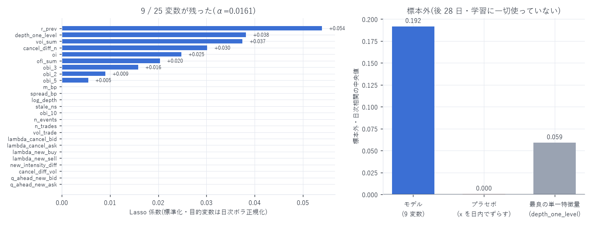
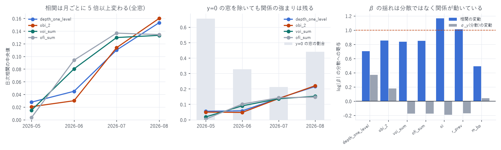

# Lasso 回帰 — 全特徴量(t−1)で価格リターン r_t を説明する

対象: `xyz:DRAM / USDC`(Hyperliquid HIP-3)、2026-05-04 〜 2026-08-10
標本: 1 秒グリッド 8,466,661 行 × 25 特徴量(98 日。板が薄すぎる初日は除外)
作成日: 2026-08-14

---

## 0. 結論

25 変数のうち 9 変数が残った。 標本外(学習に一切使っていない後 28 日)で
日次相関の中央値 0.192、28 日すべてで正。
最良の単一特徴量(`obi_2` = 0.142)より 35% 高い。

| 順位 | 特徴量 | Lasso 係数 | 単独の標本外相関 | 何を測っているか |
|---|---|---|---|---|
| 1 | `r_prev` | +0.054 | +0.102 | 直前 1 秒のリターン(継続) |
| 2 | `depth_one_level` | +0.038 | +0.140 | 最良気配の数量インバランス |
| 3 | `voi_sum` | +0.037 | +0.133 | VOI(t−1/t 最良気配ベース)の 1 秒合計 |
| 4 | `cancel_diff_n` | +0.030 | +0.041 | キャンセル件数差(ask − bid) |
| 5 | `oi` | +0.025 | +0.052 | 約定インバランス |
| 6 | `ofi_sum` | +0.020 | +0.137 | Cont 版 OFI の 1 秒合計 |
| 7 | `obi_3` | +0.016 | +0.133 | 板 3 段までのインバランス |
| 8 | `obi_2` | +0.009 | +0.142 | 板 2 段までのインバランス |
| 9 | `obi_5` | +0.005 | +0.127 | 板 5 段までのインバランス |

落ちた 16 変数: `m_bp`, `spread_bp`, `log_depth`, `stale_ns`, `obi_10`, `n_events`,
`n_trades`, `vol_trade`, `lambda_cancel_bid`, `lambda_cancel_ask`, `lambda_new_buy`,
`lambda_new_sell`, `new_intensity_diff`, `cancel_diff_vol`, `q_ahead_new_bid`, `q_ahead_new_ask`



---

## 1. 設計 — ルックアヘッドを構造的に排除する

`CLAUDE.md`「厳禁事項: ルックアヘッドバイアス」に従い、次の契約で組んだ。

```
説明変数 x : 時刻 T までに確定している情報だけ
             - 窓集計は [T−Δ, T)  … 窓が閉じるのが T なので T で判る
             - 板の状態は T 時点の直近値(backward asof のみ)
目的変数 y : r_t = ( log mid(T+Δ) − log mid(T) ) × 10⁴     Δ = 1 秒
```

x の期間と y の期間は T で接して重ならない。負のシフトは y の生成にしか使っていない。

| 対策 | 実装 |
|---|---|
| 期間分割 | 前 70 日で学習、後 28 日は一切触らない。行のシャッフルはしない |
| α の選択 | 訓練期間内の拡大窓(expanding window)5 分割。k-fold は隣接窓が相関するため不可 |
| 前処理 | ウィンザライズ(0.1%/99.9%)・標準化・y の中心化はすべて訓練期間だけから推定 |
| ボラ正規化 | 日次 σ は前日の値を使う(§2)。当日の σ を使えばルックアヘッドになる |
| 検証 | プラセボ: x を日内で 5,000 行ずらすと相関は 0.0004(28 日中 13 日で負)に消える |

プラセボが通ったことが、この結果にルックアヘッドが無いことの実証である。

---

## 2. ★ 生の y では Lasso が「何もしないモデル」を選ぶ

最初の実行では α が最大値に張り付き、25 変数すべてが 0 になった。バグではない。

拡大窓の各フォールドでの相対 MSE(1.0 = 何もしないモデルと同じ):

| フォールド | 検証日 | 最良 α | 相対 MSE |
|---|---|---|---|
| 1 | 15–26 | 1(=全ゼロ) | 1.000000 |
| 2 | 26–37 | 1 | 1.000000 |
| 3 | 37–48 | 1 | 1.000000 |
| 4 | 48–59 | 0.0161 | 0.995541 |
| 5 | 59–70 | 0.0304 | 0.982328 |

立ち上げ期(5〜6 月)はどの特徴量も予測に寄与しない。

### ★ では「分散の非定常性」が問題なのか — 分けて測った(2026-08-14 追記)

主因ではなかった。 $\beta_d = \rho_d\,\sigma_{y,d}/\sigma_{x,d}$ なので、$\log|\beta_d|$ の分散を
3 項に分解すれば、どれが β を揺らしているかが分かる。

| 特徴量 | var(log\|β\|) | 相関の寄与 | σ_y(分散)の寄与 | σ_x の寄与 | 相関と時間の相関 |
|---|---|---|---|---|---|
| `depth_one_level` | 0.877 | 0.703 | 0.367 | −0.060 | +0.754 |
| `obi_2` | 1.454 | 0.852 | 0.178 | −0.020 | +0.753 |
| `voi_sum` | 0.876 | 0.835 | −0.176 | 0.351 | +0.773 |
| `ofi_sum` | 0.856 | 0.850 | −0.177 | 0.337 | +0.750 |
| `oi` | 0.366 | 1.165 | −0.194 | 0.039 | +0.323 |
| `r_prev` | 1.237 | 1.010 | −0.173 | 0.173 | −0.151 |
| `m_bp` | 3.529 | 0.490 | 0.038 | 0.482 | +0.735 |

β の日々の揺れの 70〜116% は「相関そのものの変動」で説明され、σ_y の寄与は −19〜+37% しかない。
相関は尺度不変なので、σ_y がいくら動いても相関は 1 つも変わらない。
つまり起きているのは関係の非定常性であって、分散の非定常性ではない。



相関の月次中央値(全窓 / $y \ne 0$ の窓だけ):

| 月 | y=0 の窓 | `depth_one_level` | `obi_2` | `voi_sum` | `ofi_sum` |
|---|---|---|---|---|---|
| 2026-05 | 65.6% | 0.028 / 0.055 | 0.021 / 0.049 | 0.015 / 0.018 | 0.003 / 0.004 |
| 2026-06 | 32.6% | 0.045 / 0.058 | 0.030 / 0.047 | 0.080 / 0.090 | 0.094 / 0.102 |
| 2026-07 | 21.3% | 0.110 / 0.139 | 0.114 / 0.137 | 0.130 / 0.136 | 0.137 / 0.142 |
| 2026-08 | 44.0% | 0.153 / 0.215 | 0.160 / 0.220 | 0.133 / 0.152 | 0.134 / 0.147 |

3 つの要因の切り分け

1. 関係の非定常性(主因) — 相関は時間と +0.75 で相関し、5 月から 8 月で 5〜7 倍になる。
   ボラ正規化では消えない。だから変種 C(体制を合わせた訓練)が B に勝つ
2. 目的変数の退化(次点) — 5 月は 1 秒窓の 65.6% で y が厳密に 0。
   除くと相関は 0.028 → 0.055 と倍増するが、8 月の 0.215 には遠く及ばない。
   1 秒という窓幅が立ち上げ期の板に対して細かすぎるのであって、関係の弱さの全部は説明しない
3. 分散の非定常性(主因ではない) — 壊したのは推定量ではなく α の選び方だった。
   フォールドの MSE を単純平均すると、σ_y が桁違いに大きい日が α を独占する。
   相関そのものには何の影響も無い。「前処理の問題」であって「現象の問題」ではない

`m_bp` だけは σ_x の寄与が 48% と大きい。$m_{\mathrm{bp}} = -\tfrac{1}{2}\,\mathrm{OBI}(1)\cdot s$ で、
スプレッドが 142bp → 0.5bp と 300 倍縮んだぶん自分の尺度が動いているためで、
これは §3 で `m_bp` が落選した理由そのものである。

3 通りを比較した結果:

| 変種 | α | 選択 | 標本外 日次相関 中央値 | 負の日 |
|---|---|---|---|---|
| A: 生の y・全訓練期間 | 1 | 0 / 25 | 0.000 | 9 / 28 |
| B: ボラ正規化・全訓練期間 | 0.0062 | 10 / 25 | 0.184 | 0 / 28 |
| C: ボラ正規化・体制を合わせた訓練(後半 30 日) | 0.0161 | 9 / 25 | 0.192 | 0 / 28 |

採用は C。 立ち上げ期を学習から外すと、変数が減って標本外成績が上がる。
「データは多いほどよい」が成り立たない典型例で、市場の体制が変わっていることの裏返しである。

---

## 3. 何が選ばれ、何が落ちたか

### 選ばれた 9 変数の読み方

- 符号はすべて正で理論と一致する。買い板が厚い(`depth_one_level`↑)、
  買い方向の VOI/OFI、買い優勢の約定、売り板の取消超過(`cancel_diff_n`↑)、
  直前が上昇 — いずれも「次の 1 秒は上がる」向き
- 板の段数は 2・3・5 が残り、1 段目(`depth_one_level`)と併せて 4 本。
  互いに相関 0.5〜0.9 と高いのに複数残るのは、
  深さごとに別の情報が乗っていることを意味する(`obi_report.md` §3)
- `r_prev` が最大係数。1 秒スケールで中値に継続があるという自己相関の結果
  (`acf_report.md` §3、成熟期の ρ₁ = +0.098)と整合する

### 落ちた 16 変数の理由

| 落ちた変数 | 解釈 |
|---|---|
| `m_bp`(マイクロプライス乖離) | 単独では標本外 −0.106 で 28 日すべて同符号と強いのに落ちた。<br>`= −OBI(1)/2 × spread` なので、スプレッド倍率を外した `depth_one_level` が<br>同じ方向をより素直に表す。倍率が邪魔をしている(`obi_report.md` §4 と同じ結論) |
| `cancel_diff_vol` | 件数版 `cancel_diff_n` が残り、数量版が落ちた。<br>「何枚消えたか」より「何本消えたか」(`cancel_report.md` §4 と一致) |
| `lambda_cancel_bid/ask`<br>`lambda_new_buy/sell`<br>`new_intensity_diff` | 水準そのものは方向を持たない。差分に情報が集約されている |
| `spread_bp`, `log_depth`, `n_events`,<br>`n_trades`, `vol_trade`, `stale_ns` | 活動量・流動性の水準。方向シグナルではない(ボラ正規化で役目が消えた) |
| `obi_10` | `obi_2/3/5` と重複。Lasso が浅い方を選んだ |
| `q_ahead_new_bid/ask` | 新規注文の平均キュー位置。1 秒スケールの方向とは結びつかない。<br>キュー位置は約定確率には強く効く(`queue_qi_report.md` §3-1)が、価格方向ではない |

---

## 4. 標本外の成績

| 指標 | 値 |
|---|---|
| 日次相関の中央値 | 0.192(28 日中 0 日が負) |
| プラセボ(x を日内でずらす) | 0.0004(13 日が負)= 信号なし |
| 最良の単一特徴量(`obi_2`) | 0.142 |
| プールした R²(ボラ正規化済み) | 0.00011 |
| 検証期間で y = 0 だった窓 | 0.0000(成熟期は 1 秒あれば必ず中値が動く)|

プールした R² が 0.0001 なのに日次相関が 0.19 なのは、これまでと同じ異質性による。
日ごとに見れば安定して効いており、プールすると分散の大きい日に薄められる。
判断は日次で行う(`METHODOLOGY.md`)。

注意: これは相関であって損益ではない。1 秒先の予測幅は依然として
ハーフスプレッド(平均 1.66 bp)より小さく、単独でスプレッドを叩く根拠にはならない
(`regression_report.md` §6)。用途はパッシブ執行の傾け・逆選択回避である。

---

## 5. 限界

| 項目 | 内容 |
|---|---|
| 体制依存 | 学習は 7 月中心、検証は 8 月。立ち上げ期には当てはまらない(§2 の変種 A) |
| 線形のみ | Lasso は線形。相互作用(例: スプレッド × インバランス)は入れていない |
| 単一銘柄 | xyz:DRAM のみ・98 日。他銘柄への一般化は未検証 |
| 1 秒固定 | 窓幅は 1 秒のみ。キャンセルは 100ms が最良(`cancel_report.md`)なので、<br>マルチ地平にすると係数構成は変わる可能性が高い |
| 共線性 | `obi_*` は互いに相関 0.5〜0.9。Lasso はグループから代表を選ぶため、<br>選ばれなかった変数に情報が無いとは言えない(`obi_10` など) |

---

## 6. 成果物

```
data/panel_1s/dt=YYYY-MM-DD/part-000.parquet   1 秒パネル 8,466,661 行 × 27 列(1.4GB)
data/lasso_results.json                        3 変種の係数・CV 曲線・標本外指標・
                                               単変量の標本外相関・プラセボ
scripts/build_panel.py                         パネル構築(時間契約を docstring に明記)
scripts/lasso_analysis.py                      Lasso(拡大窓 CV・3 変種・プラセボ)
scripts/lasso_univariate_oos.py                単変量の標本外ベンチマーク
scripts/lasso_chart.py                         図 22
```

```bash
uv run python scripts/build_panel.py <出力先>    # 約 25 分
uv run python scripts/lasso_analysis.py          # 約 15 分
uv run python scripts/lasso_univariate_oos.py
uv run python scripts/lasso_chart.py
```

---

AWS 費用: 既存データのみで完結(追加 egress なし)。
EC2 \$25.05 | S3 ≈\$1.87 | 累計 ≈\$26.92 / 予算 \$60(EC2 は停止中)
