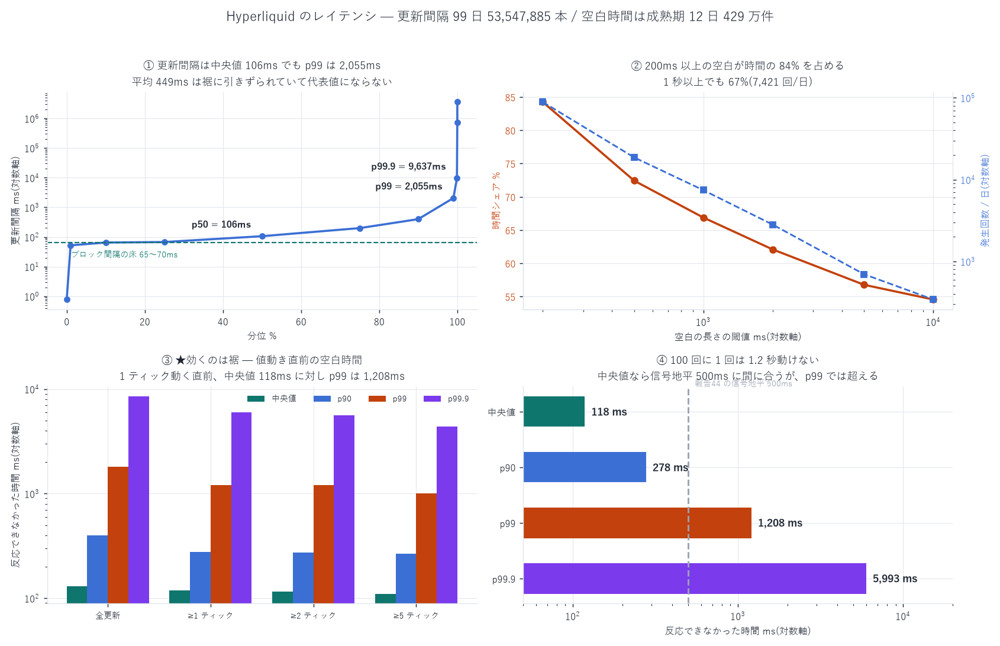

# Hyperliquid の最低遅延とテールレイテンシ — 実測

測定: (1) この機械(日本・開発機)からの live RTT / (2) live WebSocket の連続ブロック時刻
(BTC 75s・ETH 45s)/ (3) 99 日の L4 データ 5,355 万本の更新間隔 / (4) 成熟期 12 日・429 万件の
「価格が動く直前の空白時間」
作成日: 2026-08-20

---

## 0. 結論 — 3 つの数字

| | 値 | 出典 |
|---|---:|---|
| ブロック間隔(何をしても超えられない床) | 最小 44 ms / 最頻 65〜70 ms | 本報告(5 系統が一致) |
| 実務上の最低反応時間(コロケ想定) | ≈ 3 ms + ブロック待ち 0〜70 ms = 平均 ~38 ms | 本報告 + 第三者 |
| ★テールレイテンシ(効くのはこれ) | 価格が 1 ティック以上動くとき、直前に反応できなかった時間の p99 = 1,208 ms(中央値 118 ms、p99.9 = 5,993 ms、最大 55 秒) | 本報告 |

要点: 平均の遅延(~100 ms)より 裾の 1.2 秒が問題である。
100 回に 1 回、価格が動く直前に 1.2 秒以上まったく反応できない状態に置かれる。
報告 35 の遅延格子(0/50/100/300 ms)は中央値の世界しか見ていなかった。

---

## 1. 最低遅延 — ブロック間隔が床

発注も取消もブロックに取り込まれて初めて効くので、
「判断してから効くまで」はネットワークがどれだけ速くても次のブロックまでの待ちを下回れない。

5 系統の独立な測定が一致した:

| 測定 | 値 |
|---|---:|
| live WS `trades` BTC(75 秒 / 1,027 約定 / 相異なるブロック時刻 326) | 最小 44 ms / p10 66 ms |
| live WS `trades` ETH(45 秒) | 最小 61 ms / p10 79 ms |
| L4 99 日・5,355 万本の更新間隔 | p10 64.7 ms / p25 67.4 ms |
| DRAM の BBO 更新間隔(既報・成熟期) | p10 54.5 ms / 中央 82.7 ms |
| 公称(HyperBFT の最終確定) | ≈ 70 ms |

> ブロック間隔 ≈ 65〜70 ms、観測された最小は 44 ms。
> 注文はランダムな時刻に出すので、待ち時間の期待値はその半分 ≈ 33〜35 ms になる。

### ネットワーク側(この機械 = 日本の開発機、家庭回線)

| 経路 | 最小 | 中央 | p90 | p99 |
|---|---:|---:|---:|---:|
| TCP 接続 → api.hyperliquid.xyz | 16.7 ms | 30.8 | 65.4 | 111.7 |
| HTTP POST /info `allMids`(読み) | 85.8 ms | 107.5 | 158.7 | 248.6 |
| (参考)Binance fapi TCP | 17.1 | 30.0 | 41.0 | 53.4 |
| (参考)Binance fapi HTTP GET | 86.0 | 99.0 | 125.5 | 177.8 |

両取引所までの距離はこの機械からはほぼ同じである(報告 44 の
「Binance を見て HL で動く」経路を考えるうえで重要)。
コロケ(AWS ap-northeast-1)なら 2〜3 ms と報告されている(CoinDesk 2026-03、第三者)。

### 書き経路は自前で測っていない

発注 → 約定確認の往復は、実弾を出さないと測れないので本報告では測っていない。
第三者計測(Glassnode、2026-03、東京 AWS、n=120)は
中央値 884 ms(695〜1,634 ms、内訳: ネットワーク ~5 ms + サーバ側 ~879 ms)。

> ★報告 38 の限定: §1-1 で「到達可能な遅延 100ms 台以深」と書いた根拠はこの 884 ms だった。
> 本報告の実測で、読み経路は 86〜108 ms(この機械)であり、
> 884 ms は書き + 約定確認の往復という別の量だと確認できた。
> ただし書き経路を自前で検証してはいないので、884 ms は第三者値のまま残る。

## 2. ★テールレイテンシ — 効くのは「反応できなかった時間」

平均遅延ではなく、価格が動く直前にどれだけ待たされていたかが逆選択の実体である。
成熟期 12 日・BBO 更新 429 万件:

| 条件 | 出現率 | 中央値 | p90 | p99 | p99.9 | 最大 |
|---|---:|---:|---:|---:|---:|---:|
| 全更新 | 100% | 131.0 ms | 400.2 | 1,813.9 | 8,538.6 | 99.4 s |
| 値動き ≥1 ティック(0.184bp) | 43.0% | 118.3 ms | 278.1 | 1,207.9 | 5,992.6 | 55.2 s |
| 値動き ≥2 ティック | 31.2% | 116.5 | 272.9 | 1,199.8 | 5,605.0 | 46.6 s |
| 値動き ≥5 ティック(0.92bp) | 11.5% | 110.4 | 265.8 | 1,007.0 | 4,363.8 | 46.6 s |

読み方: 価格が 1 ティック動いた瞬間、その直前 中央値 118 ms は
何も観測できず・何も引けなかった。100 回に 1 回は 1.2 秒、
1,000 回に 1 回は 6 秒その状態だった。

裏返して、空白の長さ別にその間の値動きを見ると:

| 空白の長さ | 割合 | \|値動き\| 中央 | p99 | 最大 |
|---|---:|---:|---:|---:|
| < 70 ms | 31.4% | 0.112 bp | 2.285 | 83.1 |
| 70〜200 ms | 38.0% | 0.178 bp | 2.554 | 122.7 |
| 0.2〜1 s | 28.5% | 0.090 bp | 2.055 | 31.1 |
| 1〜10 s | 2.11% | 0.000 bp | 1.812 | 122.3 |
| > 10 s | 0.07% | 0.000 bp | 1.379 | 3.1 |

長い空白の大半は「閑散で誰も動いていない」時間である(中央値 0.000 bp)。
危険なのは長さそのものではなく、空白の p99 に 1〜2 bp の動きが入っていることで、
0.2〜1 秒の帯だけで全体の 28.5% を占める。

### この機械での配信ジッタ(参考)

live WS の (受信 − ブロック時刻) の最小値を 0 に正規化した超過分:

| 系列 | 中央 | p90 | p99 | 最大 |
|---|---:|---:|---:|---:|
| BTC trades(75 秒) | +66 ms | +152 | +1,120 | +1,798 |
| ETH trades(45 秒) | +57 ms | +832 | +5,773 | +7,491 |

ただしこれは家庭回線の開発機の値であり、取引所側の裾とは分離できていない。
コロケ環境では大幅に小さいはずで、参考値として扱うこと。

## 3. ★副産物 — この機械の時計が 132 ms ずれていた

Binance の `serverTime` を基準に NTP 式で測ると、
この機械の時計は中央値 +132.4 ms 遅れている(sd 6.9 ms、範囲 +127〜+157、n=25)。

含意が 2 つある:

1. §2 の WS 配信遅延の絶対値は 132 ms 分だけ過小である
   (生の最小 90 ms → 時計補正すると片道 ≈ 222 ms)
2. 報告 44 の警告の裏づけ: あちらで「HL と Binance の時計が絶対時刻で
   揃っている保証はない」と書いたが、100 ms 台の時計ずれは現実に起きることが
   手元で実証された。報告 44 のラグ(200〜250 ms)のうち、
   一定のずれ成分が含まれる可能性は引き続き排除できない
   (ただし裾の非対称による本物性の証拠は §3 の議論とは独立に成立する)

## 4. 既存報告への影響

| 報告 | 記述 | 本報告の影響 |
|---|---|---|
| 35(遅延格子 0/50/100/300ms) | 100ms で E[PnL] が消える | 中央値の世界としては妥当(実測中央 118 ms)。ただし裾を入れていない。p99 の 1.2 秒帯は未検証で、そこでの損失は格子に含まれていない = 楽観側の誤差 |
| 38 §1-1(884 ms) | 「到達可能な遅延は 100ms 台以深」 | 読み経路は 86〜108 ms と実測。884 ms は書き + 約定確認の別量と確定(§1) |
| 38 §6(未確認事項) | 「遅延の実測値は未確定」 | 本報告で解消(書き経路を除く) |
| 44(Binance リードラグ) | 信号地平 500 ms、到達可能遅延 100〜300 ms | 成立する。中央値 118 ms + ブロック待ち 35 ms ≈ 153 ms < 500 ms。ただし p99 では 1.2 秒かかり信号地平を超える → 発火の 1% は間に合わない前提で設計すべき |

## 5. 自己精査

- ★測定設計の誤りを 1 件、自分で見つけて捨てた: 最初は L4 の更新間隔をそのまま
  「ブロック間隔」として集計したが、「ブロックが無い」と「DRAM のイベントが無い」を
  区別していなかった。p99 = 2.1 秒 / p99.99 = 12 分という値が出たが、
  これは閑散時間であって遅延ではない(空白帯別の値動き中央値が 0.000 bp なのが証拠)。
  live の混雑市場(BTC)での直接測定と、活動で条件づけた再集計に置き換えた
- §C-11 中央値だけで見ない: 全表で p90 / p99 / p99.9 / 最大を併記。
  本報告の主張そのものが「中央値では足りない」である
- §A-3 指標の誤用: 「読み経路」「書き経路」「配信ジッタ」「空白時間」を分けた。
  884 ms(第三者)と 86 ms(自前)は別の量であり、混ぜていない
- 限界の明示: 書き経路は未測定。配信ジッタは家庭回線の値で取引所側と分離できていない

## 6. 限界

| 未計上・仮定 | 向き |
|---|---|
| 発注 → 約定確認の往復を自前で測っていない(実弾が要る)。884 ms は第三者値 | 不明。最大の未検証項目 |
| ジッタ測定は家庭回線の開発機。コロケとは別物 | 悲観側 |
| live の WS 測定は BTC 75 秒 / ETH 45 秒と短い。裾の推定としては標本不足 | 双方向 |
| ブロック間隔は「約定があったブロック」の間隔から推定。全ブロックではない | 上界(真の間隔はこれ以下) |
| 時計ずれの基準に Binance の `serverTime` を使った(それ自体の正確性は未検証) | 双方向 |
| ★訂正(報告 46): §3 の「片道 ≈ 222 ms」はこの機械の時計が 132 ms ずれていたことに基づく値で、信頼できない。東京 EC2 の実測では時計ずれ 4.3 ms・読み経路 13.2 ms | — |

---

計算に要した AWS 費用: EC2(stopped)\$25.12 | S3 ≈\$1.50 | 累計 ≈\$26.62 / 予算 \$60(停止閾値 \$48)
(live 測定は無料の公開 API のみ。EC2 は停止中)
