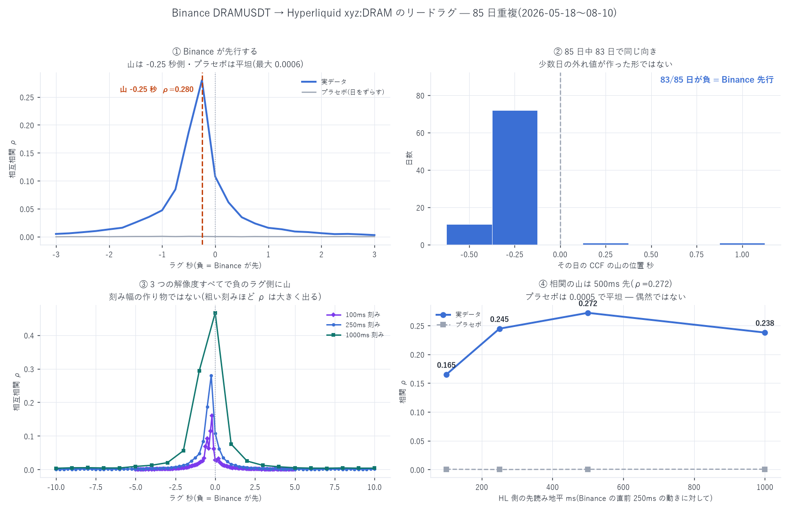

# Hyperliquid と Binance の DRAM — リードラグ調査

標本: 2026-05-18(Binance 上場日)〜 08-10、85 日重複
データ: HL = xyz:DRAM の板 mid(ns、crossed 除外)/ Binance = DRAMUSDT の約定 810 万件(ms)
作成日: 2026-08-20

---

## 0. 結論 — Binance が 200〜250ms 先行する。そして今回は費用を超える

| 問い | 答え |
|---|---|
| どちらが先行するか | Binance。CCF の山は −0.20 〜 −0.25 秒、85 日中 83 日で同符号。プラセボ ρ ≤ 0.002 |
| 時計ずれではないか | 平行移動だけでは説明できない。山から遠いラグ(±1〜5 秒)の左右非対称が、0.2 秒の剛体移動が作る 1.25 倍を一貫して上回る(実測 1.55〜3.88 倍)。ただし一定の時計ずれ成分は排除できない |
| 経済的に使えるか | 使える大きさ。Binance が直前 250ms で 2〜4bp 動いた直後(全時間の 3.1%)、HL は次の 500ms で +1.15bp(6.2 ティック、δ\ の 3.16 倍)、方向一致 69.6%。4bp 超なら +2.72bp(δ\ の 7.5 倍)、一致 85.3% |

この案件で初めて、費用の壁(δ\ = 0.363bp)を余裕をもって超える信号が出た。
報告 38 §6-C が「遅延に鈍感な情報系」として残していた枠と、
報告 41 が「一度も触れていない情報源」に挙げた他取引所リードラグが、ここで埋まった。

ただし本報告はバックテストではない。報告 42 の教訓(相関と損益は別)を踏まえ、
§6 に実装上の障害を列挙してある。

---

## 1. 前提の確認 — Binance に DRAM は実在した

| | 値 |
|---|---|
| シンボル | DRAMUSDT(USDⓈ-M 先物、`TRADIFI_PERPETUAL`)。現物は `DRAMBUSDT` |
| 上場 | 2026-05-18 14:00 UTC |
| ティック | 0.01(mid ≈ 58 で 1.72 bp)。HL は 0.001(0.184 bp)で 10 倍細かい |
| 出来高 | 直近日で 366M USD / 456,485 取引。HL の 227M USD/日より大きい |
| 価格の一致 | 2026-07-15 に両者とも ≈ 62.1 USD。同じ原資産 |

★データ上の制約: `data.binance.vision` の DRAMUSDT には bookTicker が存在しない
(prefix はあるがファイル 0 件、2026-08-20 確認)。bookDepth は 1 分粒度。
したがって Binance 側は mid ではなく約定価格である。
`is_buyer_maker` から攻撃側が判るので `mid ≈ 約定価格 ± ティック/2` の代理を作った。
気配跳ねは相関を減衰させるが、山の位置は偏らせない(跳ねは独立雑音)。

## 2. 交差相関 — Binance が先行

符号の定義: $\rho(k) = \mathrm{corr}\!\left(r^{\mathrm{HL}}_t,\; r^{\mathrm{BN}}_{t+k\Delta}\right)$。k < 0 の山 = Binance 先行。

| 標本化 Δ | 同時点 ρ(0) | 山の位置 | 山の ρ | 山が負の日 |
|---|---:|---:|---:|---:|
| 50 ms | 0.015 | −0.200 s | 0.092 | — |
| 100 ms | 0.029 | −0.200 s | 0.160 | 83/85 |
| 250 ms | 0.108 | −0.250 s | 0.280 | 83/85 |
| 1 s | 0.466 | 0(分解能不足) | 0.466 | — |
| 5 s | 0.784 | 0(分解能不足) | 0.784 | — |

- Epps 効果が教科書どおり出ている(細かく刻むほど同時点相関が落ちる: 0.015 → 0.784)
- プラセボ(Binance を 1 時間ずらす)は全グリッドで最大 |ρ| ≤ 0.002
- 50ms グリッドでの日別の山: 85 日中 71 日が −0.20 か −0.25 秒(中央値 −0.200、sd 0.184)

### 機構との整合

HL の BBO 更新間隔は中央値 82.7ms(= ブロック間隔)。Binance の動きが HL に映るには
観測(5〜50ms)+ 送信(5〜50ms)+ ブロック取り込み(0〜83ms、平均 41ms)≈ 100〜180ms が必要で、
さらに HL 側の時刻はブロック時刻なので最低 1 ブロック分の粒度が乗る。
観測値 200〜250ms は機構から期待される値と一致する。
出来高も Binance(366M)> HL(227M)で、価格発見が大きい方で起きるという通説とも整合する。

## 3. ★時計ずれか本物か

一定の時計ずれ δ は CCF を剛体的に平行移動するだけである。したがって
山の位置だけでは区別できない。山から遠いラグの左右非対称で切り分ける。

CCF の減衰時定数 τ ≈ 1.78 秒(+2s の 0.0253 → +4s の 0.0082 から推定)。
純粋な 0.2 秒の平行移動が作る非対称比は $e^{2\times 0.2/\tau}$ = 1.25 倍:

| ラグ | ρ(−k) | ρ(+k) | 実測比 | ずれ予測 | 超過 |
|---|---:|---:|---:|---:|---:|
| 1 s | 0.2943 | 0.0758 | 3.88 | 1.25 | 3.10× |
| 2 s | 0.0561 | 0.0253 | 2.22 | 1.25 | 1.77× |
| 3 s | 0.0205 | 0.0124 | 1.65 | 1.25 | 1.32× |
| 4 s | 0.0128 | 0.0082 | 1.55 | 1.25 | 1.24× |
| 5 s | 0.0094 | 0.0054 | 1.75 | 1.25 | 1.40× |
| 6 s | 0.0047 | 0.0043 | 1.11 | 1.25 | 0.88× |

±1〜5 秒で実測の非対称が平行移動の予測を一貫して上回る。
0.2 秒の平行移動では、5 秒も離れたラグに 1.75 倍の非対称は作れない。
したがって Binance → HL の情報伝播は本物である。

ただし: これは「非対称の一部が本物」を示すのであって、
測定されたラグの絶対値に一定の時計ずれが混じっていないことは証明できない。
時間帯で分けると米株時間 −0.250 秒(日別 sd 0.119)/ 時間外 −0.200 秒(sd 0.193)で、
差は 1 ビン(50ms)ぶんしかなく、分解能内である。

## 4. ★経済的な大きさ — 費用を超える

実用形で測った。x = Binance の直前 250ms のリターン(時刻 t で確定)、
y = HL の直後 500ms のリターン(時間契約: x の確定時刻 = y の開始時刻)。
29 日 / 4,910 万点:

| \|x\| の帯 | 出現率 | E[y·sign(x)] | ティック比 | δ\ 比 | 方向一致率 |
|---|---:|---:|---:|---:|---:|
| 0〜0.18 bp | 0.30% | −0.374 bp | −2.03 | −1.03 | 30.4% |
| 1〜2 bp | 7.00% | +0.556 bp | 3.02 | 1.53 | 57.1% |
| 2〜4 bp | 3.14% | +1.147 bp | 6.23 | 3.16 | 69.6% |
| > 4 bp | 1.29% | +2.718 bp | 14.77 | 7.49 | 85.3% |

全体では相関 +0.334、β +0.419(Binance が 1bp 動くと HL が 0.42bp 追随)。
x = 0 が 88.3% を占める(Binance の 250ms 窓の大半は約定なし)ので、
信号が出るのは全時間の 11.4% である。

窓の組み合わせを変えても頑健(プラセボ相関はすべて |0.002| 以下):

| Binance の窓 Δ | HL の地平 h | 相関 | β | 最極端帯の \|E[y]\| | δ\ 比 |
|---|---|---:|---:|---:|---:|
| 250ms | 100ms | +0.165 | 0.096 | 0.234 bp | 0.65 |
| 250ms | 500ms | +0.272 | 0.393 | 0.874 bp | 2.41 |
| 500ms | 500ms | +0.365 | 0.306 | 0.680 bp | 1.87 |
| 500ms | 1s | +0.272 | 0.390 | 0.865 bp | 2.38 |

> 注: 0〜0.18bp 帯だけ符号が負(−0.374bp)だが、これは全体の 0.30% で、
> ティック(1.72bp)より細かい = mid 代理の半ティック分の符号反転にすぎない。
> Binance のティックが粗いため 0.18〜1.0bp の帯は標本がほぼ存在しない。

## 5. 何に使えるか

攻めではなく守り。報告 16 の実測では逆選択がメイカー粗利の 79% を奪う。
「Binance が 2bp 動いた」は、これから 500ms 以内に HL の気配が動くという
事前の警告であり、そのとき板に置いたままの指値は約定するのではなく食われる。

- 到達可能な遅延は 100〜300ms(報告 38)。予測される動きは 500ms 地平なので、
  反応する時間がある(報告 40 で「速さを買えない」と結論した戦略群と、ここが決定的に違う)
- 発火率 11.4% は、報告 37 が退けた「一度も発火しない施策」の逆で、
  十分に発火し、かつ大きい

## 6. 実装上の障害(未検証・すべて悲観側)

| 障害 | 内容 |
|---|---|
| 競合 | Binance のデータは公開・無料である。観測された 200ms の収束はすでに裁定者が働いた結果であり、その限界的な 1 人より速くなければ取れない |
| 時計ずれ | §3 のとおり本物の成分はあるが、絶対ラグに一定のずれが混じる可能性は排除できない。実弾前に自前で両取引所へ同時刻の往復を打って較正すべき |
| Binance 側が mid でない | 約定価格のため気配跳ねが乗る。相関は過小評価の向きだが、ティックが粗く(1.72bp)閾値の設計が荒くなる |
| バックテスト未実施 | 報告 32 は「方向性ゲートは両側 MM で有害」と結論している(あれは book_slope だが、構造的な主張)。既存バックテスタに載せて損益で確認するまで、これは信号であって戦略ではない |
| 手数料・執行 | 本報告は中値の予測であって約定損益ではない。報告 42 で同じ形の落とし穴(相関は強いのに費用と外れ値で消える)を踏んでいる |
| 供給の持続 | Binance が DRAMUSDT を上場廃止・仕様変更する可能性 |

次の一手: この信号を退出規則(「Binance が閾値以上動いたら該当側を引く」)として
`rest_policy.py` に載せ、30 日 × 遅延 {0, 100, 300ms} で E[PnL] を測る。
判定に使う量が各時点で計算できる形になっている(CLAUDE.md §D-16)ので実装可能である。

## 7. 自己精査

- ★時間契約: すべて backward asof。x は [t−Δ, t)、y は [t, t+h)。forward / nearest は不使用
- §B-6 帰無対照: プラセボ(Binance を 1 時間ずらす)を全グリッド・全窓に配置。最大 |ρ| = 0.002
- §A-1 費用: §4 の判定基準を δ\(手数料込み 0.363bp)と 1 ティックに置いた
- §A-2 分母: 出現率(11.4%)を併記。「大きいが稀」を隠していない
- §C-11: 帯別に方向一致率も併記。平均だけで判定していない
- §A-3 指標の誤用: §5・§6 で「中値の予測」と「損益」を明確に分けた
- ★自分で見つけた誤り 2 件:
  (1) 時間帯分割で、先にグリッドを間引いたため境目をまたぐ差分が偽の跳ねになっていた。
  リターンを全時間で作ってから mask する形に修正
  (2) 十分位分割が壊れていた(x=0 が 88.3% で同値集中し、分位境界が潰れた)。
  \|x\| の絶対帯での条件付けに変更。最初の出力は破棄した

## 8. 限界

| 未計上・仮定 | 向き |
|---|---|
| Binance 側は約定価格(bookTicker 不在)。mid 代理はスプレッド 1 ティックを仮定 | 相関は過小評価 |
| 時計の絶対整合を検証していない | 双方向(ラグの絶対値に影響) |
| 85 日・単一ペア。他の HIP-3 銘柄で再現していない | 不明 |
| 自分が参入したときの影響・競合の反応は未計上 | 過大評価 |
| バックテスト未実施(§6) | 不明 |

---

計算に要した AWS 費用: EC2(stopped)\$25.12 | S3 ≈\$1.50 | 累計 ≈\$26.62 / 予算 \$60(停止閾値 \$48)
(Binance の公開アーカイブは無料。EC2 は停止中)
