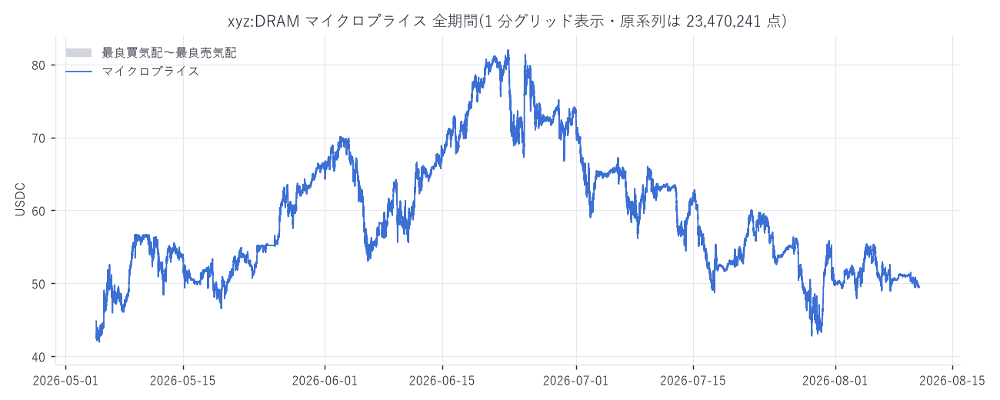
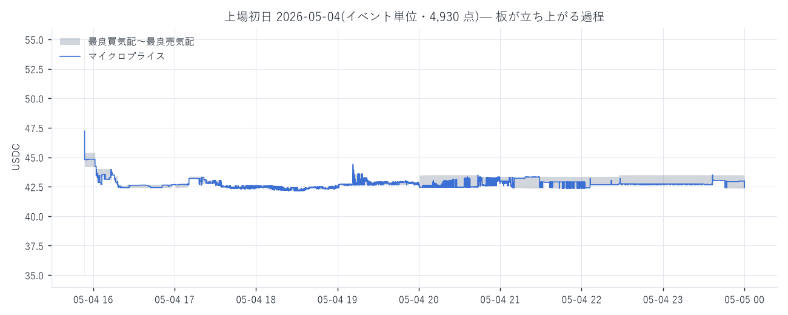
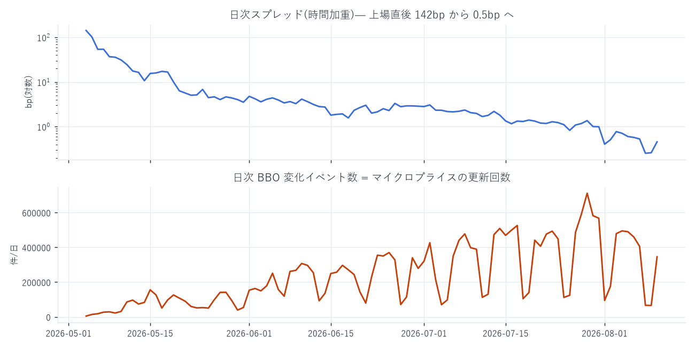
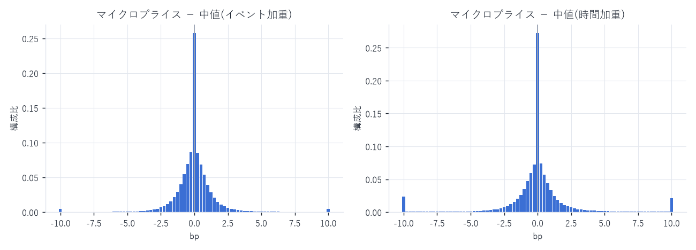
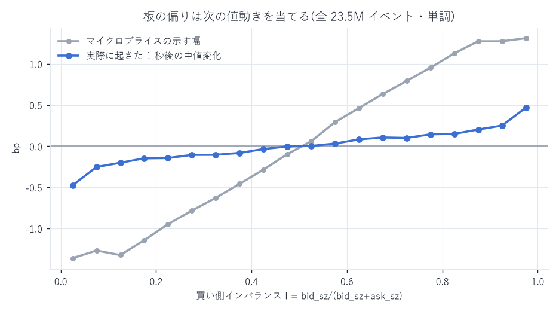
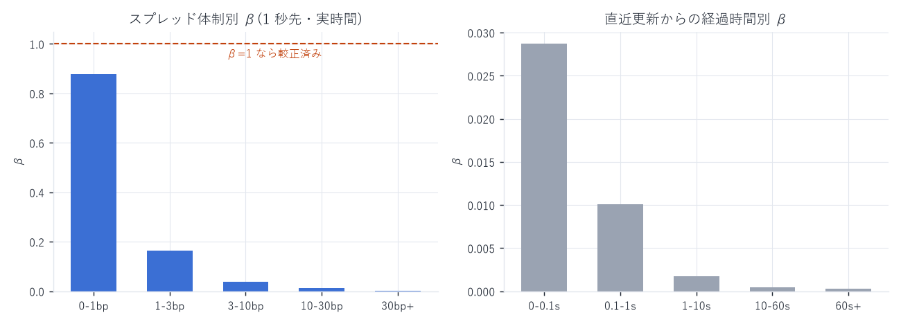

# xyz:DRAM マイクロプライス分析 — 全期間・最高解像度

対象: Hyperliquid HIP-3 ビルダー配備 perp `xyz:DRAM`(発行者 Trade.xyz、クォート USDC、market_id 100065)
期間: 2026-05-04 15:53:28 UTC(板が両側そろった最初の瞬間)〜 2026-08-10 23:59:59 UTC = 99 日
解像度: BBO(最良気配)が変化した瞬間だけを ns 精度で記録 — 23,470,241 点
作成日: 2026-08-13

---

## 1. マイクロプライスの算出式

板の最良買気配 `best_bid`(数量 `bid_sz`)と最良売気配 `best_ask`(数量 `ask_sz`)から、
厚みの薄い側へ寄せた中値を作る。

```
買い側インバランス
    I = bid_sz / (bid_sz + ask_sz)                        … 0 ≤ I ≤ 1

マイクロプライス
    MP = I · best_ask + (1 − I) · best_bid
       = (best_bid · ask_sz + best_ask · bid_sz) / (bid_sz + ask_sz)

等価な表現(中値からの乖離として書いたもの)
    mid = (best_bid + best_ask) / 2
    MP  = mid + (I − 1/2) · (best_ask − best_bid)
        = mid + (I − 1/2) · spread
```

意味は最後の行がすべてで、マイクロプライスは「中値 + (偏り) × (スプレッド)」である。

- 買い数量が売り数量より厚い(I > 1/2)→ 売り板が先に食われやすい → MP は ask 寄り
- 両側同量(I = 1/2)→ MP = mid
- 極限 I → 1 で MP → best_ask、I → 0 で MP → best_bid。MP は必ず気配の内側に入る

本レポートでは乖離を無次元化した

```
micro_dev_bp = (MP − mid) / mid × 10,000   [bp]
```

を signal として扱う。重み付けは数量 1 段目(最良気配)のみで、深い板は使っていない
(距離帯別の厚みは L2 `book_bp` 側にあるので、多段重み付けへの拡張は同じデータで可能)。

### 更新規則(なぜこれが「最高解像度」か)

`(best_bid, best_ask, bid_sz, ask_sz)` の 4 つ組が変化した ns にだけ行を出す。
4 つ組が同じなら板の内側で何が起きても MP は変わらないので、
これ以上細かい MP 系列は原理的に存在しない。約定・発注・取消・トリガー発火の
すべてを注文単位で再生した結果としての最良気配であり、
定間隔スナップショットではない。

---

## 2. 結果の要約

| 指標 | 値 |
|---|---|
| MP 更新回数(= BBO 変化) | 23,470,241 回 / 99 日 |
| 更新間隔 中央値 / 平均 | 136 ms / 362 ms |
| 更新間隔 1 パーセンタイル | 222 µs |
| MP レンジ | 25.997 → 82.009 USDC |
| スプレッド(時間加重・全期間) | 7.24 bp |
| スプレッド 初日 → 最終日 | 142.7 bp → 0.46 bp(310 分の 1) |
| \|MP − mid\|(時間加重 / イベント加重) | 2.197 bp / 0.988 bp |
| インバランス I(時間加重平均) | 0.4984(ほぼ中立) |
| 観測不能時間(片側板・板なし) | 0 秒(初出以降は常に両側そろっている) |

初日の 4,930 更新 / 142.7 bp から、7 月末には 1 日 71 万更新 / 0.5 bp まで縮んでいる。
同じ銘柄の中に「立ち上げ期の板」と「成熟した板」という別々の市場が入っている。
これが後述の予測力の解釈をすべて支配する。





---

## 3. マイクロプライスは中値と比べて何を足しているか

### 3-1. 乖離の分布



イベント加重では平均 |乖離| 0.99 bp、時間加重では 2.20 bp(いずれもクロス状態を除外)。
時間加重のほうが大きいのは、スプレッドが広く板が動かない時間帯が
時間軸上では長く居座るためで、乖離は本質的に $(I - \tfrac{1}{2})\,s$ の積だから
広スプレッド期に機械的に膨らむ。この 2 つを混ぜて 1 本の統計にしてはいけない。

### 3-2. 板の偏りは次の値動きを当てるか(イベント時間)

全 23.5M イベントを I で 20 分位に分け、1 秒後の中値変化の平均を取る。



| I | 1 秒後の中値変化(平均) |
|---|---|
| 0.00–0.05 | −0.482 bp |
| 0.25–0.30 | −0.108 bp |
| 0.45–0.50 | −0.005 bp |
| 0.50–0.55 | +0.002 bp |
| 0.70–0.75 | +0.100 bp |
| 0.95–1.00 | +0.472 bp |

20 区間すべてで単調。板の偏りは次の値動きの向きを持っている、という
マイクロストラクチャーの教科書的結果がこの市場でも成立している。

回帰 $\frac{\Delta m_{t+h}}{m}\times 10^{4} = a + \beta\,d_{\mathrm{bp}}$ の結果
(イベント時間・クロス状態を除いた 23,458,613 点):

| 地平 h | β | 相関 | R² | 中値の RMSE | 較正後 MP の RMSE |
|---|---|---|---|---|---|
| 100 ms | 0.0065 | 0.024 | 0.0006 | 0.695 bp | 0.695 bp |
| 1 s | 0.0326 | 0.032 | 0.0010 | 2.641 bp | 2.639 bp |
| 10 s | 0.0675 | 0.022 | 0.0005 | 8.040 bp | 8.038 bp |

> 【2026-08-14 訂正】 初版はここに β = 0.149 / 0.517 / 0.481、相関 0.262 / 0.393 / 0.218 と
> 記載していた。これはクロス状態(best_ask < best_bid)11,628 行(全体の 0.05%)の混入による
> もので、誤りだった。クロス時は mid が板の外に出て `|MP − mid|` が最大 7,349 bp に飛び、
> 二乗和が特定の 1 日に 47% 集中する。`best_ask > best_bid` で除外した上表が正しい。
> 詳細と影響の定量は `regression_report.md` §2。

プール推定の β が小さいのは、これが体制混合の平均だからである(§4)。
日ごとに推定すると 2026-08 の中央値は 0.59(10 秒地平で 0.85)に達する。
使うなら $m + \hat{\beta}\,(\mathrm{MP} - m)$ の形で、β̂ はスプレッド体制ごとに較正する。

---

## 4. ★ 重要な注意 — 1 本の回帰にプールしてはいけない

同じ回帰を実時間(1 秒グリッド、839 万点)で行うと β ≈ 0.004 になり、
イベント時間の 0.52 と 2 桁違う。これはどちらかが間違っているのではなく、
スプレッド体制の混合が原因である。スプレッド帯で層別すると:



| スプレッド帯 | 秒数 | β | 平均 \|MP − mid\| | 平均 \|1 秒後の中値変化\| |
|---|---|---|---|---|
| 0–1 bp(成熟期) | 2,363,658 | 0.878 | 0.125 bp | 0.629 bp |
| 1–3 bp | 2,657,842 | 0.163 | 0.580 bp | 0.669 bp |
| 3–10 bp | 2,344,052 | 0.037 | 1.484 bp | 0.658 bp |
| 10–30 bp | 624,388 | 0.012 | 4.717 bp | 0.588 bp |
| 30 bp 以上(立ち上げ期) | 405,486 | 0.002 | 20.462 bp | 0.657 bp |

読み方:

- スプレッドが 1 bp を切る成熟した板では β = 0.88 ≒ 1。
  マイクロプライスはほぼ較正済みのフェアバリューとして機能している
- スプレッドが広い体制では、乖離だけが $(I - \tfrac{1}{2})\,s$ で機械的に膨らみ(最大 20 bp)、
  実際の値動きは 0.6 bp 前後のまま。分子だけが膨らむので β が潰れる
- したがって全期間を 1 本の回帰にプールした β は「広スプレッド期の希釈」を測っているだけで、
  シグナルの強さを表さない。使うときは必ずスプレッド体制で層別すること

同じ理由で、鮮度(直近の板更新からの経過時間)別に見ると β は
0–0.1 s の 0.029 から 60 s 超の 0.0003 まで単調に落ちる。板が止まっている間の
インバランスは、すでに市場に織り込まれた古い情報である。

---

## 5. データ品質と既知の限界

| 項目 | 実測 | 扱い |
|---|---|---|
| 片側だけ / 板なしの時間 | 0 秒 | 初出以降は両側常時。欠測なし |
| 60 秒以上 BBO が動かない時間の合計 | 182,699 秒(2.11 日 = 全体の 2.2%) | 立ち上げ期に集中。1 秒グリッドの `stale_ns` で判別可能 |
| クロス(ask < bid)状態 | 11,628 件 / 2,588 秒(全時間の 0.030%) | ★必ず除外すること。`is_crossed` 列で判別できる。混入すると回帰が壊れる(`regression_report.md` §2)。1 秒以上続くクロスは 1 件もなく、1 秒グリッドには現れない |
| ロック(ask == bid)状態 | 1,063 件 / 264 秒(0.003%) | 同上。MP = mid = bid = ask になる |
| 深さ | 1 段目のみ | 多段マイクロプライスは L2 `book_px` / `book_bp` から拡張可能 |
| 約定情報 | MP の算出には未使用 | 別途 `node_fills`(1,195 万行)と突合可能 |

上流の系譜: Artemis 公開バケットの `node_order_statuses`(生イベント)を注文単位で
再生した L2 板(v99、`enforce_uncrossed` は古い側退去ルール、fills 統合済み)の
BBO テーブルを唯一の入力としている。約定の 96.97% が `node_fills` の真値と一致することを
確認済み(`hl-l4-pipeline/HANDOFF.md`)。

時刻: すべて UTC の ns。取引所側のイベント時刻(`time`)であり、受信時刻ではない。

---

## 6. 成果物

```
DRAM/
  microprice_report.md            このレポート
  charts/                         図 7 点
  data/
    microprice/dt=YYYY-MM-DD/part-000.parquet   ★全解像度 23,470,241 行(99 日 = 888MB)
    microprice_1s.parquet                       1 秒グリッド 8,496,221 行(210MB)
    microprice_1m.csv                           1 分グリッド 141,508 行(18MB)
    daily_summary.csv                           日次サマリ 99 行
    analysis.json / diagnostics.json            本文の数値の出所すべて
  scripts/
    build_microprice_dram.py           L2 BBO → マイクロプライス全解像度
    microprice_report.py          追加診断とチャート
```

### 全解像度テーブルの列

| 列 | 型 | 内容 |
|---|---|---|
| `ts` | i64 | イベント時刻(UTC ns) |
| `best_bid` / `best_ask` | f64 | 最良気配 |
| `bid_sz` / `ask_sz` | f64 | 最良気配の総数量(同一価格の全注文合計) |
| `mid` | f64 | (bid + ask) / 2 |
| `microprice` | f64 | 本レポートの主成果 |
| `imbalance` | f64 | I = bid_sz / (bid_sz + ask_sz) |
| `micro_dev_bp` | f64 | (MP − mid) / mid × 10⁴ |
| `spread_bp` | f64 | (ask − bid) / mid × 10⁴ |
| `dwell_ns` | i64 | この状態が続いた時間 = 時間加重統計に必須 |
| `is_crossed` | bool | best_ask ≤ best_bid。統計・回帰では必ず除外する(全体の 0.05%) |

1 秒 / 1 分グリッドには `stale_ns`(直近の実更新からの経過)が付く。
これが大きい行は板が止まっていた時間であり、外して使う。

### 再現手順

```bash
# 入力(WORK_BUCKET の L2 BBO、99 日 430MB)
aws s3 sync s3://$WORK_BUCKET/l2/bbo/ data/l2_v99/bbo/ --profile hl-artemis-ro --region us-east-1

uv run python scripts/build_microprice_dram.py <出力先>   # 約 4 分
uv run python scripts/microprice_report.py           # 診断 + 図
```

---

## 7. この先やるなら

1. 多段マイクロプライス — 1 段目だけでなく距離帯別の厚みで重み付ける(`book_bp` を使う)
2. Stoikov の micro-price — `(I, spread)` を状態とする吸収マルコフ連鎖で
   $E[m_{t+\infty}]$ を解く。本レポートの β による縮小は、その 1 次近似にあたる
3. 約定との突合 — `node_fills` の約定価格が MP のどちら側で起きたかで、
   実効スプレッドと逆選択コストを分解する
4. トリガー密度との結合 — L4 でしか作れない `trigger_density` を MP と重ねると、
   ストップ蓄積が値動きに転じる瞬間を直接観測できる

---

AWS 費用(本作業分の S3 egress 0.43GB を含む累計): EC2 \$25.05 | S3 ≈\$1.54 | 累計 ≈\$26.59 / 予算 \$60(EC2 は停止中、追加課金は EBS ≈\$0.05/日のみ)
