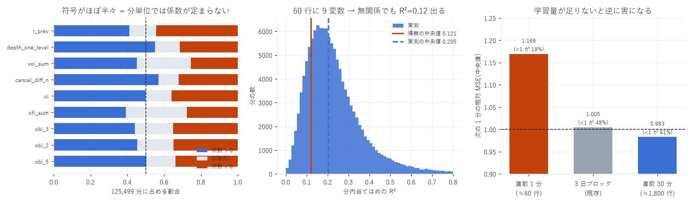

# 9 変数を 1 分刻みのフォールドで Lasso 回帰する

対象: `lasso_report.md` で残った 9 変数
(`r_prev`, `depth_one_level`, `voi_sum`, `cancel_diff_n`, `oi`, `ofi_sum`, `obi_3`, `obi_2`, `obi_5`)
標本: 99 日を 1 分刻み。有効 125,499 分(1 分 ≒ 60 行、resync 汚染行は除外)
作成日: 2026-08-14

---

## 0. 結論

| 学習に使う量 | 次の 1 分の相対 MSE(中央値) | `<1` の割合 |
|---|---|---|
| 直前 1 分(≒60 行) | 1.169 | 18.4% |
| 3 日ブロック(既存モデル) | 1.005 | 47.6% |
| 直前 30 分(≒1,800 行) | 0.983 | 60.6% |

1 分では学習量が足りず、当てはめるとかえって害になる。
一方で 直前 30 分での再推定は 3 日ブロックのモデルより良い。
局所適応そのものは効くが、必要なのは約 1,800 行であって 60 行ではない。



---

## 1. A. 分内当てはめ — 係数は分単位では定まらない

各分の 60 行だけで Lasso を推定(X・y ともその分で標準化、α = 0.0161)。

| 特徴量 | 選択率 | 係数中央値 | 四分位範囲 | 係数 > 0 | 係数 < 0 |
|---|---|---|---|---|---|
| `cancel_diff_n` | 0.890 | +0.0278 | [−0.032, +0.142] | 56.9% | 32.1% |
| `depth_one_level` | 0.864 | +0.0246 | [−0.038, +0.154] | 55.0% | 31.4% |
| `oi` | 0.859 | +0.0000 | [−0.042, +0.101] | 49.9% | 36.1% |
| `r_prev` | 0.855 | +0.0000 | [−0.114, +0.097] | 41.1% | 44.4% |
| `obi_5` | 0.840 | +0.0016 | [−0.054, +0.142] | 50.3% | 33.7% |
| `obi_2` | 0.804 | +0.0000 | [−0.070, +0.132] | 45.4% | 34.9% |
| `obi_3` | 0.793 | +0.0000 | [−0.073, +0.128] | 44.2% | 35.2% |
| `voi_sum` | 0.707 | +0.0000 | [−0.003, +0.141] | 45.3% | 25.5% |
| `ofi_sum` | 0.668 | +0.0000 | [−0.017, +0.106] | 39.3% | 27.6% |

符号がほぼ半々である。全期間では 9 変数すべて正の係数を持ち、
標本外で 28 日すべて同符号だった(`lasso_report.md` §0)のに、
1 分に切ると正と負がほぼ同数になる。`r_prev` に至っては負のほうが多い(44.4% 対 41.1%)。

正しい向きが分かっている関係でも、60 行では向きすら決まらない。

### 当てはめの R² は 6 割が「自由度」

分内 R² の中央値は 0.205(p90 = 0.414)と一見高い。
しかし 同じ手順で y を分内シャッフルして関係を壊した帰無分布は
中央値 0.121(p90 = 0.249)だった。

| | R² 中央値 | R² p90 |
|---|---|---|
| 実測 | 0.205 | 0.414 |
| 帰無(y を分内シャッフル) | 0.121 | 0.249 |
| 差(信号ぶん) | 0.084 | — |

60 行に 9 変数を当てれば、関係が皆無でも R² は 0.12 出る。
分単位の当てはめ R² を「説明力」として読んではいけない。

---

## 2. B. 分単位ウォークフォワード — 学習量が閾値を決める

分 m で推定し、分 m+1 を予測する(標準化の統計量も分 m のものだけ。ルックアヘッドなし)。

| 学習 | 有効分 | 相対 MSE 中央値 | 四分位範囲 | `<1` の割合 | 予測との相関(中央値) | 選択された変数(中央値) |
|---|---|---|---|---|---|---|
| 直前 1 分 | 124,279 | 1.169 | [1.031, 1.506] | 18.4% | 0.088 | 7 |
| 直前 30 分 | 134,784 | 0.983 | [0.935, 1.029] | 60.6% | 0.163 | 6 |
| (参考)3 日ブロック | 116,830 | 1.005 | — | 47.6% | — | 9 |

- 直前 1 分: 相対 MSE の四分位が [1.03, 1.51] と、四分位範囲がまるごと 1 を超える。
  8 割の分で何もしないより悪い
- 直前 30 分: 中央値 0.983、6 割の分で改善。3 日ブロックのモデル(1.005)を上回る
- 相関で見ても 0.088 → 0.163 と倍近い

`minute_report.md` §2 で「静かな分では予測振幅が過大で害になる」と分かっていたが、
直前 30 分で推定し直すと振幅がその局面に合うため、その問題が自動的に緩和される。
明示的な λ の縮小(§2 の λ≈0.4)より素直な解になっている。

---

## 3. 何分あれば足りるのか

相関 0.16 の関係を 9 変数で推定するのに必要な標本数の目安は、
係数の t 値が 2 を超える条件からおよそ $n > (2/0.16)^2 \approx 156$ 行。
9 変数あるので実際にはその数倍が要る。

| 学習窓 | 行数 | 結果 |
|---|---|---|
| 1 分 | ≒60 | 不足(符号すら決まらない・相対 MSE 1.17) |
| 30 分 | ≒1,800 | 十分(相対 MSE 0.983、既存モデル超え) |

30 分と 3 日ブロックの中間(5 分・10 分)は未測定。
実運用では「直前 30 分で再推定」が現時点の最良である。

---

## 4. 限界

| 項目 | 内容 |
|---|---|
| 窓幅は 2 点のみ | 1 分と 30 分しか試していない。最適な窓幅は未探索 |
| α 固定 | 0.0161(全期間で選んだ値)を流用。窓ごとの α 選択はしていない |
| 取引コスト未計上 | 相対 MSE の改善であって損益ではない(`regression_report.md` §6) |
| 30 分版の実装コスト | 1 分ごとに 9 変数の Lasso を張り直す = 1 日 1,440 回。<br>本計算で 134,784 分の推定に 118 秒(1 分あたり 0.9ms)なので実時間では問題ない |

---

## 5. 成果物

```
data/minute_lasso.json          A/B の全数値(選択率・係数分位・相対 MSE)
data/minute_lasso_coefs.parquet 125,499 分 × 9 変数の係数と R²
data/minute_lasso_null.json     分内シャッフルによる R² の帰無分布
scripts/minute_lasso.py         分内当てはめ + ウォークフォワード(A/B)
scripts/minute_lasso_null.py    帰無分布
scripts/minute_lasso_chart.py   図 26
```

```bash
uv run python scripts/minute_lasso.py        # 約 6 分
uv run python scripts/minute_lasso_null.py   # 約 2 分
uv run python scripts/minute_lasso_chart.py
```

---

AWS 費用: 既存データのみで完結(追加 egress なし)。
EC2 \$25.05 | S3 ≈\$1.87 | 累計 ≈\$26.92 / 予算 \$60(EC2 は停止中)
