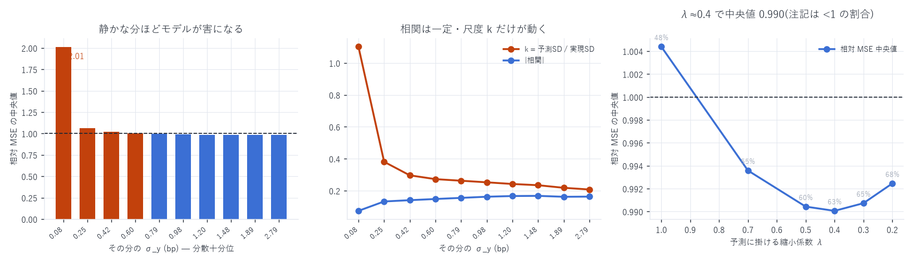

# 1 分刻みの相対 MSE — 119,169 分で見た Lasso の効き方

対象: `xyz:DRAM / USDC`、99 日を 1 分刻み(142,560 分) に分割
評価対象: 拡大窓のフォールド(3 日ブロック b の評価はブロック 0..b−1 で学習)に含まれる
119,169 分(ブロック 5〜32。1 分 ≒ 60 行)
作成日: 2026-08-14

---

## 0. 結論

1 分粒度で見ると、モデルは半分の分で「何もしないモデル」に負けている(相対 MSE の中央値 1.0044、
`< 1` の割合 47.8%)。3 日ブロックでは 0.986 だったので、粒度を細かくすると評価が反転する。

原因は関係の弱さではなく、予測振幅の較正ずれである。

| その分の σ_y | 相対 MSE 中央値 | `<1` の割合 | \|相関\| 中央値 | k = 予測SD/実現SD |
|---|---|---|---|---|
| 0.075 bp(最も静か) | 2.011 | 5.9% | 0.074 | 1.102 |
| 0.604 bp | 1.005 | 47.5% | 0.148 | 0.272 |
| 0.979 bp | 0.991 | 55.1% | 0.162 | 0.252 |
| 1.484 bp | 0.983 | 60.9% | 0.168 | 0.234 |
| 2.789 bp(最も荒い) | 0.985 | 64.8% | 0.163 | 0.207 |

相関はどの分散帯でもほぼ一定(0.15〜0.17)。動いているのは k だけ。
静かな分では予測振幅が実現変動とほぼ同じ大きさ(k = 1.10)になり、
相関が 0.074 しかないのに大振りするので、$(k-\rho)^2 = 1.08$ の罰が付いて MSE が倍になる。



---

## 1. 恒等式で分解する

`variance_report.md` §0 と同じ分解が分単位でも成り立つ。

```
相対 MSE = 1 − corr²  +  (k − corr)²
```

| その分の σ_y | 1 − corr²(関係の項) | (k − corr)²(尺度の項) | 相対 MSE |
|---|---|---|---|
| 0.075 bp | 0.9946 | 1.0833 | 2.011 |
| 0.255 bp | 0.9825 | 0.0852 | 1.062 |
| 0.604 bp | 0.9781 | 0.0327 | 1.005 |
| 0.979 bp | 0.9737 | 0.0230 | 0.991 |
| 2.789 bp | 0.9735 | 0.0185 | 0.985 |

関係の項はほぼ一定(0.974〜0.995)。相対 MSE の差はすべて尺度の項で説明できる。

訓練期の平均的な σ_y は 1.5bp 程度で、モデルの予測振幅はその ≈0.15 倍 = 0.22bp。
最も静かな十分位は σ_y = 0.075bp なので、予測が実現変動の約 2.9 倍になっている。

---

## 2. 直せるのか

### (a) 予測を一律に縮める

$\hat{y} \to \lambda \hat{y}$ としたときの分単位 相対 MSE:

| λ | 中央値 | `<1` の割合 | 分散加重(=ブロック相当) |
|---|---|---|---|
| 1.0(現状) | 1.0044 | 47.8% | 0.9915 |
| 0.7 | 0.9936 | 55.3% | 0.9690 |
| 0.5 | 0.9904 | 60.2% | 0.9660 |
| 0.4 | 0.9901 | 62.7% | 0.9680 |
| 0.3 | 0.9907 | 65.2% | 0.9724 |
| 0.2 | 0.9924 | 67.7% | 0.9792 |

λ ≈ 0.4 で中央値が最小(1.0044 → 0.9901)。
Lasso の α で縮めるのとは別に、出力側をもう一段縮める余地がある。

### (b) しかし λ も体制依存

訓練側(ブロック ≤22)で選ぶと λ = 0.20 になるが、検証側(ブロック >22)に当てると:

| | 相対 MSE 中央値 | `<1` の割合 |
|---|---|---|
| λ = 1.0(現状) | 0.9672 | 69.5% |
| λ = 0.20(訓練側で選択) | 0.9793 | 86.1% |

後半の期間では現状の振幅がすでにほぼ適正で、前半で選んだ λ は縮めすぎになる。
`lasso_report.md` §2 で見た関係の強まりと同じ話で、λ も時間とともに再較正が要る。

### (c) 直前の分のボラで動的にスケールするのは失敗した

$\hat{y} \to (\sigma_{m-1}/\bar{\sigma})\,\hat{y}$ は中央値 1.0044 → 1.0183 と悪化した。
1 分の実現ボラは翌分の予測子として雑音が大きく、掛け算の分だけ誤差が増える。
ボラ推定を細かくするほど良い、とはならない。

---

## 3. 粒度によって答えが変わることの意味

| 粒度 | 相対 MSE 中央値 | log(分散) との相関 | 主に効いている項 |
|---|---|---|---|
| 3 日ブロック(33 分割) | 0.9856 | −0.219 | 関係の項(1 − corr²) |
| 1 分(119,169 分) | 1.0044 | −0.289 | 尺度の項 (k − corr)² |

同じモデル・同じ予測でも、評価の粒度で結論が逆になる。
3 日を平均すると静かな分と荒い分が混ざり、荒い分(予測が効く)が二乗和で重みを持つので
ブロック相対 MSE は 0.986 と良く見える。1 分に割ると、静かな分での過大予測が
そのまま表に出る。

どちらが正しいかは用途で決まる。

- 執行の判断(この 1 分にシグナルを使うか)→ 分単位で見るべき。
  静かな分では現状のモデルは害になる
- 期間全体の説明力(この特徴量群は価格を説明するか)→ ブロック/日次でよい

`METHODOLOGY.md` の「日次相関の中央値」で報告してきた数字は後者にあたる。
相関は尺度不変なので §0 の問題は相関の報告には影響しない(相関は分散帯によらず 0.15〜0.17)。

---

## 4. 成果物

```
data/minute_relmse.parquet   119,169 分 × (block, n, n_bad, relmse/var/corr × raw/volnorm)
data/minute_relmse.json      分散十分位別の集計(汚染あり/なし × raw/volnorm)
data/minute_rescale.json     λ の選択と検証
scripts/minute_relmse.py     分単位の相対 MSE(拡大窓フォールド)
scripts/minute_chart.py      図 25
```

```bash
uv run python scripts/minute_relmse.py
uv run python scripts/minute_chart.py
```

注: resync アーティファクト(`variance_report.md` §2)を含む分は除外して集計した
(119,169 分中 2,688 分)。分単位では 1 分の二乗和に対する影響が限定的なため、
含めても中央値は 1.0041 と ほぼ変わらない(ブロック粒度では 2 行が Σy² の 71% を占めていた)。

---

AWS 費用: 既存データのみで完結(追加 egress なし)。
EC2 \$25.05 | S3 ≈\$1.87 | 累計 ≈\$26.92 / 予算 \$60(EC2 は停止中)
