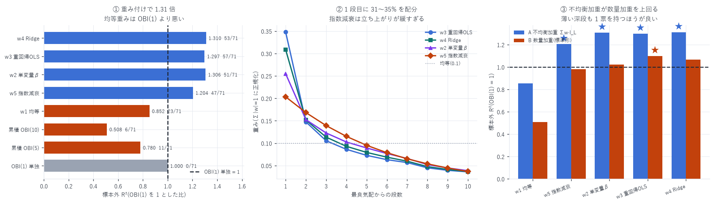

# MLOBI — レベル別 I_L を重み付けした多段不均衡指標

対象: 2026-05-11 〜 08-10(91 日、うち最初の 20 日は重み推定専用 → 評価 71 日)
粒度: 1 秒グリッド / 目的変数: $y = \left(\log m_{T+1s} - \log m_T\right)\times 10^{4}$
作成日: 2026-08-16

---

## 0. 結論 — 重み付けで 1.31 倍、ただし均等重みは逆効果

標本外 R²(OBI(1) 単独を 1 とした比、評価 71 日)

| 指標 | OOS R² | OBI(1)=1 の比 | 上回った日 | p |
|---|---|---|---|---|
| OBI(1) 単独 | 0.00915 | 1.000 | — | — |
| 累積 OBI(5) | 0.00496 | 0.780 | 11/71 | — |
| 累積 OBI(10) | 0.00363 | 0.508 | 6/71 | — |
| w1 均等 | 0.00587 | 0.852 | 23/71 | — |
| w5 指数減衰 | 0.00882 | 1.204 | 47/71 | 0.0043 ★ |
| w2 単変量β | 0.00990 | 1.306 | 51/71 | 0.0002 ★ |
| w3 重回帰OLS | 0.01054 | 1.297 | 57/71 | <0.0001 ★ |
| w4 Ridge | 0.01067 | 1.310 | 53/71 | <0.0001 ★ |

★ = OBI(1) 単独を有意に上回る

1. 重み付き MLOBI は OBI(1) を約 31% 上回り、標本外で有意
2. 均等重み(0.852)は OBI(1) より悪い。深い段を無差別に足すのは有害
3. 累積 OBI を深くするのも悪い(L=10 で 0.508)

> 多段化そのものに価値があるのではなく、重み付けに価値がある。



---

## 1. 2 つの定義を作った

```
A. 不均衡加重  MLOBI_A = Σ w_L · I_L / Σ|w_L|                          ← 本命
B. 数量加重    MLOBI_B = Σ w_L(q_b^L − q_a^L) / Σ w_L(q_b^L + q_a^L)   ← 文献の標準形
```

A はレベル別不均衡の加重平均、B は数量そのものに重みを掛ける($w \ge 0$ を課す)。

### A が B を上回る

| 重み | A 不均衡加重 | B 数量加重 |
|---|---|---|
| w1 均等 | 0.852 | 0.508 |
| w2 単変量β | 1.306 ★ | 1.022 |
| w3 重回帰OLS | 1.297 ★ | 1.097 ★ |
| w4 Ridge | 1.310 ★ | 1.066 |
| w5 指数減衰 | 1.204 ★ | 0.980 |

数量加重では深い段の薄い数量が分母に埋もれる。
不均衡加重なら薄い段も 1 票を持つので情報を拾える。

---

## 2. 重みの決め方と、★ルックアヘッドの排除

| | 重み | 狙い |
|---|---|---|
| w1 | 均等 `w_L = 1` | 基準 |
| w2 | 単変量 β | 各段を単独で回帰した係数(相関を無視) |
| w3 | 重回帰 OLS | 相関を考慮した最適線形結合 |
| w4 | Ridge | w3 に縮小(10 段は互いに相関する) |
| w5 | 指数減衰 $e^{-\lambda(L-1)}$ | λ を学習期間で当てはめる(2 母数) |

### 重みは評価日より前のデータだけで推定した

拡張窓のウォークフォワードである。最初の 20 日は推定専用で評価に使わない。

全期間で当てはめた重みで全期間を評価すれば、w3 は定義上必ず最良になる。
それは「10 個の自由度で当てはめた」だけで予測力ではない。
`obi_levels_report.md` の「10 段全部で 1.54 倍」は全期間当てはめの値であり、
標本外では 1.31 倍に落ちる。

---

## 3. ★事前の予想は外れた

予想: 10 段の `I_L` は互いに相関が強いので、
w3(重回帰 OLS)は標本外で w4(Ridge)や w5(指数減衰)に負ける。

実測: w3 は符号一貫性で最良(57/71 日、p<0.0001)、
R² 比でも w4 とほぼ同じ(1.297 対 1.310)。過学習しなかった。

理由は標本の大きさである。学習に使うのは 1 日あたり約 85,000 点 × 20 日以上で、
10 個の母数に対して標本が桁違いに大きい。
「相関があるから過学習する」は母数と標本の比を見ずに言ってはいけない。

一方 w5(指数減衰)は最下位(1.204)。全期間の推定で λ=0.190、
1 段目の重みが 0.203 にしかならず、実測の減衰は指数より立ち上がりが急である。

---

## 4. 推定された重み(全期間・実装用)

$\textstyle\sum |w| = 1$ に正規化。上の評価には使っていない(評価は拡張窓)。

| 段 | 1 | 2 | 3 | 4 | 5 | 6 | 7 | 8 | 9 | 10 |
|---|---|---|---|---|---|---|---|---|---|---|
| w3 OLS | 0.348 | 0.147 | 0.105 | 0.086 | 0.073 | 0.063 | 0.057 | 0.045 | 0.039 | 0.036 |
| w4 Ridge | 0.309 | 0.152 | 0.113 | 0.093 | 0.079 | 0.069 | 0.060 | 0.048 | 0.041 | 0.037 |
| w2 単変量β | 0.255 | 0.152 | 0.123 | 0.103 | 0.089 | 0.077 | 0.066 | 0.052 | 0.045 | 0.039 |
| w5 指数(λ=0.190) | 0.203 | 0.168 | 0.139 | 0.115 | 0.095 | 0.079 | 0.065 | 0.054 | 0.045 | 0.037 |

1 段目に 31〜35% を配分し、以降は緩やかに減る。
均等なら 0.10 なので、1 段目は均等の 3 倍以上の重みを持つ。

実装するなら w4 Ridge を勧める。R² 比で最良(1.310)、
かつ縮小が入っているぶん日々の再推定で安定しやすい。

---

## 5. 絶対値で見ると小さい

比では 1.31 倍だが、絶対値は R² 0.00915 → 0.01067、
つまり 0.92% → 1.07% である。

`slope_model_report.md` の `book_slope` 系(OOS R² 0.0399)と比べると 1/4 にとどまる。
深さを使いたいなら OBI ではなく `book_slope` という
`obi_levels_report.md` の結論は変わらない。

---

## 6. 限界

| 項目 | 内容 |
|---|---|
| 絶対値は小さい | §5。比の 1.31 倍は R² 0.0092 → 0.0107 |
| 粒度は 1 秒・地平も 1 秒 | 他の粒度では重みが変わりうる |
| 体制を分けていない | 立ち上げ期と成熟期を混ぜた 71 日 |
| 線形のみ | 重みは線形結合。非線形な統合は試していない |
| 重みの安定性を測っていない | 日々の再推定でどれだけ動くかは未確認 |
| 単一銘柄 | DRAM は HIP-3 の小型市場 |

---

## 7. 成果物

```
data/obi_levels/YYYY-MM-DD.npz   レベル別 I_L・累積 C・数量 qb/qa・y の生系列
data/mlobi.json                  8 指標の標本外 R²・全期間の推定重み
scripts/obi_levels.py            板の再生と生系列の保存
scripts/mlobi.py                 重み推定(拡張窓)と評価
scripts/mlobi_chart.py           図 41
```

```bash
uv run python scripts/obi_levels.py $(cat alldays.txt)   # 約 50 分(再開可能)
uv run python scripts/mlobi.py
uv run python scripts/mlobi_chart.py
```

---

AWS 費用: 既存データのみで完結(追加 egress なし)。
EC2 \$25.05 | S3 ≈\$1.50 | 累計 ≈\$26.55 / 予算 \$60(EC2 は停止中)
