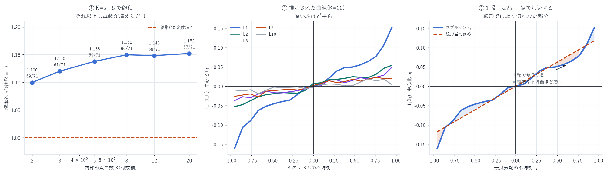

# 加法スプライン回帰 — 各レベル OBI の非線形性

模型: $y = \alpha + \sum_{L=1}^{10} f_L(I_L) + \varepsilon$ (`f_L` は 3 次 B スプライン)
対象: 2026-05-11 〜 08-10(91 日、うち最初の 20 日は推定専用 → 評価 71 日)
作成日: 2026-08-16

---

## 0. 結論 — 非線形化で標本外 R² が 15% 改善

| 模型 | 母数 | 標本外 R² | 線形 = 1 | 線形超え | 符号検定 p |
|---|---|---|---|---|---|
| 線形(10 変数) | 11 | 0.00585 | 1.000 | — | — |
| スプライン K=2 | 51 | 0.00611 | 1.100 | 59/71 | <0.0001 ★ |
| スプライン K=3 | 61 | 0.00621 | 1.120 | 61/71 | <0.0001 ★ |
| スプライン K=5 | 81 | 0.00694 | 1.138 | 59/71 | <0.0001 ★ |
| スプライン K=8 | 111 | 0.00699 | 1.150 | 60/71 | <0.0001 ★ |
| スプライン K=12 | 151 | 0.00704 | 1.148 | 59/71 | <0.0001 ★ |
| スプライン K=20 | 228 | 0.00710 | 1.152 | 57/71 | <0.0001 ★ |

K=5〜8 で飽和する。それ以上は母数が 2 倍になっても R² は 0.2% しか増えず、
符号一貫性はむしろ落ちる(60/71 → 57/71)。K=8(母数 111)を推奨する。



---

## 1. 何を変えたか

```
線形 MLOBI   y = α + Σ_L w_L · I_L        … 各段に重み 1 個
加法スプライン y = α + Σ_L f_L(I_L)        … 各段に**曲線 1 本**
```

各レベルの不均衡 `I_L` を説明変数とし、それぞれに 3 次 B スプラインを当てる。
加法モデル(GAM)なので段どうしの交互作用は含まない — そこは線形版と同じである。

---

## 2. ★見つかった非線形性 — 裾で加速する

`K=8` で推定した 1 段目の曲線 `f_1(I_1)` の区間別の傾き:

| 区間 | 傾き(bp / I 単位) |
|---|---|
| I = −0.95 → −0.47(外側) | +0.2420 |
| I = −0.47 → 0.00(内側) | +0.0963 |
| I = 0.00 → +0.48(内側) | +0.1031 |
| I = +0.48 → +0.95(外側) | +0.2159 |

外側の傾きは内側の 2.1〜2.5 倍。関係は凸であり、
極端な不均衡ほど単位あたりの効きが強い。

線形回帰はこの区間差を 1 本の傾きに潰してしまう。
$I_1 = \pm 0.9$ のような「片側がほぼ空」の局面で、線形は効果を過小評価し、
$I_1 \approx 0$ の局面では過大評価していた。

### 深い段ほど平ら

`f_L` の振れ幅(I=−0.95 → +0.95):

| 段 | 振れ幅 |
|---|---|
| L1 | 0.338 |
| L2 | 0.147 |
| L5 | 0.068 |
| L10 | 0.025 |

`obi_levels_report.md` の線形での比(1.000 / 0.305 / 0.054 / 0.026)と整合する。
非線形化しても「1 段目が圧倒的」という構図は変わらない。

---

## 3. ★ルックアヘッドの排除

| 箇所 | 措置 |
|---|---|
| 節点の位置 | 最初の 20 日の分位に固定。全評価日にとって過去のデータのみ |
| 係数 | 評価日より前のデータだけで推定(拡張窓) |
| R² の分母 | 学習期間の平均 `ȳ_train` を使う |
| 基底関数 | 節点だけで決まるので、評価日のデータは一切入らない |

節点を各窓で再推定する案もあったが、固定のほうが厳しい条件である
(相場が動いても節点は最初の 20 日のまま)。それでも 15% 改善した。

---

## 4. 母数を増やしただけではないか — 標本外で確認済み

線形 11 個 → スプライン 111 個と母数が 10 倍になる。
当てはめが良くなるのは当然なので、標本外でのみ判定した。

- K=20(母数 228)まで増やしても R² は 1.152 で頭打ち
- 符号一貫性は K=8 の 60/71 が最良で、K=20 では 57/71 に落ちる
- 過学習の兆候が出始めるのが K=12〜20 のあたり

観測は 1 日 85,000 点 × 20 日以上(170 万点超)なので、
母数 111 個は依然として十分小さい。

---

## 5. 位置づけ — 絶対値では依然小さい

| | 標本外 R² |
|---|---|
| OBI(1) 単独(線形) | 0.00400 |
| MLOBI 線形(w4 Ridge) | 0.00624 |
| MLOBI 加法スプライン(K=8) | 0.00699 |
| `book_slope` 系(参考) | 0.0399 |

OBI(1) 単独からは 1.75 倍まで来たが、
`slope_model_report.md` の `book_slope` 系(0.0399)には遠く及ばない。
「深さを使うなら OBI ではなく `book_slope`」という結論は変わらない。

ただし両者は別の情報(左右の比 vs 板の形)なので、
`book_slope` と組み合わせれば加算的な改善はありうる。未検証である。

---

## 6. 限界

| 項目 | 内容 |
|---|---|
| 交互作用なし | 加法モデルなので $I_1 \times I_2$ のような項は入っていない |
| 絶対値は小さい | §5。`book_slope` 系の 1/6 |
| 節点は固定 | 最初の 20 日の分位。相場が変われば最適位置は動きうる |
| 粒度・地平は 1 秒のみ | 他の設定では非線形性の強さが変わりうる |
| 体制を分けていない | 立ち上げ期と成熟期を混ぜた 71 日 |
| 単一銘柄 | DRAM は HIP-3 の小型市場 |

---

## 7. 成果物

```
data/mlobi_spline.json          節点数別の標本外 R²・推定形状
scripts/mlobi_spline.py         加法スプラインの推定と評価
scripts/mlobi_spline_chart.py   図 42
```

```bash
uv run python scripts/mlobi_spline.py       # 約 8 分
uv run python scripts/mlobi_spline_chart.py
```

---

AWS 費用: 既存データのみで完結(追加 egress なし)。
EC2 \$25.05 | S3 ≈\$1.50 | 累計 ≈\$26.55 / 予算 \$60(EC2 は停止中)
