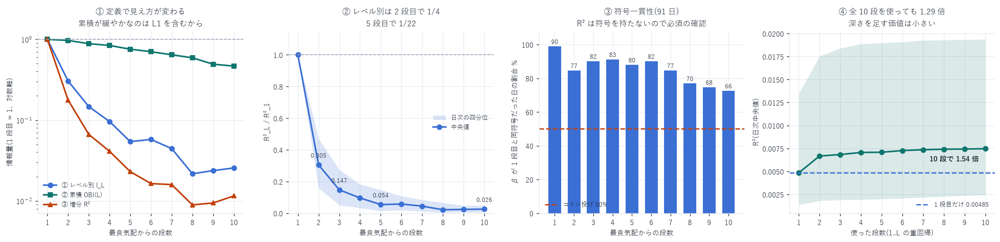

# OBI をレベル別に分解 — 各段がどれだけ情報を持つか

対象: 2026-05-11 〜 08-10(91 日、バーンイン 7 日を除く)
粒度: 1 秒グリッド × 約 85,000 点/日
目的変数: $y = \left(\log m_{T+1s} - \log m_T\right)\times 10^{4}$
作成日: 2026-08-16

---

## 0. 結論 — 1 段目が圧倒的で、10 段全部でも 1.54 倍

最良気配を 1 とした情報量(単変量 OLS の R²、日次中央値の比)

| 段 | ① レベル別 `I_L` | ② 累積 `OBI(L)` | ③ 増分 R² |
|---|---|---|---|
| 1 | 1.000 | 1.000 | 1.000 |
| 2 | 0.305 | 0.970 | 0.177 |
| 3 | 0.147 | 0.885 | 0.067 |
| 4 | 0.096 | 0.841 | 0.041 |
| 5 | 0.054 | 0.756 | 0.023 |
| 6 | 0.058 | 0.704 | 0.016 |
| 7 | 0.044 | 0.644 | 0.016 |
| 8 | 0.022 | 0.591 | 0.009 |
| 9 | 0.024 | 0.493 | 0.009 |
| 10 | 0.026 | 0.467 | 0.012 |

```
10 段全部を使った重回帰の R²(中央値) = 0.00747
1 段目だけの R²                      = 0.00485
                                     → 10 段で 1.54 倍
```

②の累積が緩やかに見えるのは 1 段目を含んでいるからで、
深い段を足すほど R² は単調に下がる(1.000 → 0.467)。
情報が増えるのではなく、1 段目の信号が希釈されている。



---

## 1. 3 つの量を区別した

「各レベルがどれだけ情報を持つか」は定義によって答えが変わる。3 通り出した。

| | 定義 | 何を答えるか |
|---|---|---|
| ① レベル別 | `I_L = (q_b^L − q_a^L)/(q_b^L + q_a^L)` | L 段目だけが持つ情報 |
| ② 累積 OBI(L) | $\frac{\sum_{i\le L} q_b - \sum_{i\le L} q_a}{\sum_{i\le L} q_b + \sum_{i\le L} q_a}$ | 1〜L 段をまとめた情報 |
| ③ 増分 R² | 1..L−1 の重回帰に L を足したときの R² の増加 | そのレベルが新たに持ち込む情報 |

①と③は別物である。①は他の段と重複した情報も含むが、③は重複を除いた純増分。
たとえば 2 段目は①では 0.305 だが、③では 0.177 — 差の 0.128 は 1 段目との重複である。

### 既存の `obi` テーブルを使わなかった理由

`obi` テーブル(99 日・ティック粒度)には `obi_1`〜`obi_10` の累積値しかなく、
各段の数量が保存されていない。`OBI(L)` から `q_b^L` を復元するには
各段の合計 `B_L + A_L` が必要だが、あるのは L=10 の分だけである。
したがって `book_px` から板を 1 秒グリッドで再生した。

---

## 2. 情報量の測り方

単変量 OLS $y = \alpha + \beta x + \varepsilon$ の R² を情報量とし、
1 段目を 1 とした比 `R²_L / R²_1` で報告する。

### 比は日ごとに作ってから中央値を取る

中央値どうしを割ると、日によって 1 段目の水準が違う影響が消えない。
実際この差は大きく、単日では 2026-07-16 の L1 の R² が 0.02356、
91 日の中央値は 0.00485 で 5 倍近い開きがある。

### R² だけでは足りない — 符号一貫性を必ず併記する

R² は符号を持たない。深い段の R² が小さくても、
β の符号が日によって反転していれば情報ではなくノイズである。

| 段 | β | β が 1 段目と同符号だった日 | p |
|---|---|---|---|
| 1 | +0.1377 | 90/91 | <0.0001 |
| 2 | +0.0620 | 77/91 | <0.0001 |
| 5 | +0.0280 | 80/91 | <0.0001 |
| 8 | +0.0134 | 70/91 | <0.0001 |
| 10 | +0.0137 | 66/91(73%) | <0.0001 |

10 段目でも符号は 66/91 日で一致し、有意である。
③の増分 R² も 10 段すべてで 91/91 日で正。

> 深い段の情報は「小さいが本物」である。「ゼロ」ではない。
> ただし ③ で 1 段目の 1〜2% しかないので、使う価値があるかは別問題である。

---

## 3. 過去の報告との整合

この案件では深さについて一見矛盾する結果が出ている。

| 報告 | 結論 |
|---|---|
| `obi_report.md` | スプレッドが狭いとき L=2 前後、10bp 超では L=10 が最良 |
| `book_slope_grain_report.md` | 情報は最良気配の直近ではなく 10〜25bp の帯にある |
| 本報告 | 1 段目が圧倒的。10 段全部でも 1.54 倍 |

測っている量が違うので矛盾しない。

- `book_slope` は「板の重心がどれだけ遠いか」= 分布の形
- OBI は「買いと売りの数量比」= 左右の非対称

> 深い板は「形」としては情報を持つが、「左右の比」としてはほとんど持たない。

これは `slope_model_report.md` で
`book_slope` 系が予測力の 9 割を占め、`obi_5` が統制変数として弱かった
(日次 t = −3.19、符号一致 40/63 日)ことと一致する。

`obi_report.md` の「10bp 超では L=10 が最良」も、
スプレッドが広い局面では 1 段目が薄く不安定になるためと解釈でき、
本報告の全期間中央値(狭い局面が大半)と両立する。

---

## 4. 実務的な含意

1. OBI を使うなら 1〜2 段で足りる。3 段目以降の増分は 1 段目の 7% 以下
2. 累積 OBI(L) を深くするのは逆効果。L=10 は L=1 の 0.467 倍まで落ちる。
   深い段を混ぜると 1 段目の信号が希釈される
3. 板の深さを使いたいなら OBI ではなく `book_slope`。
   同じ板から作っても、形を測る指標のほうが深さの情報を拾える

---

## 5. 限界

| 項目 | 内容 |
|---|---|
| 粒度は 1 秒 | 既存の `obi` はティック粒度。より短い地平では深い段の相対価値が変わりうる |
| 地平は 1 秒のみ | 10 秒・60 秒では違う可能性がある |
| 体制を分けていない | 立ち上げ期と成熟期を混ぜた 91 日の中央値 |
| スプレッド帯で分けていない | `obi_report.md` は帯別に見て結論が変わっている |
| 線形のみ | 単変量 OLS。非線形な効き方は測っていない |
| 単一銘柄 | DRAM は HIP-3 の小型市場 |

---

## 6. 成果物

```
data/obi_levels/YYYY-MM-DD.json    日次のレベル別 R²・β・増分 R²
data/obi_levels_summary.json       91 日の集計
scripts/obi_levels.py              board_px から板を再生して各段の数量を抽出
scripts/obi_levels_summary.py      集計(比は日ごとに作ってから中央値)
scripts/obi_levels_chart.py        図 40
```

```bash
uv run python scripts/obi_levels.py $(cat alldays.txt)   # 約 50 分(再開可能)
uv run python scripts/obi_levels_summary.py
uv run python scripts/obi_levels_chart.py
```

---

AWS 費用: 既存データのみで完結(追加 egress なし)。
EC2 \$25.05 | S3 ≈\$1.50 | 累計 ≈\$26.55 / 予算 \$60(EC2 は停止中)
