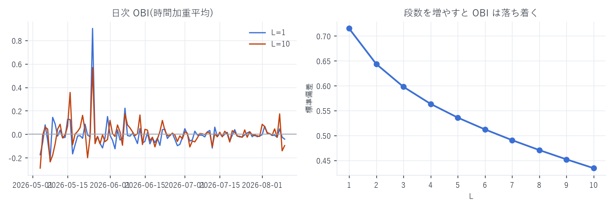
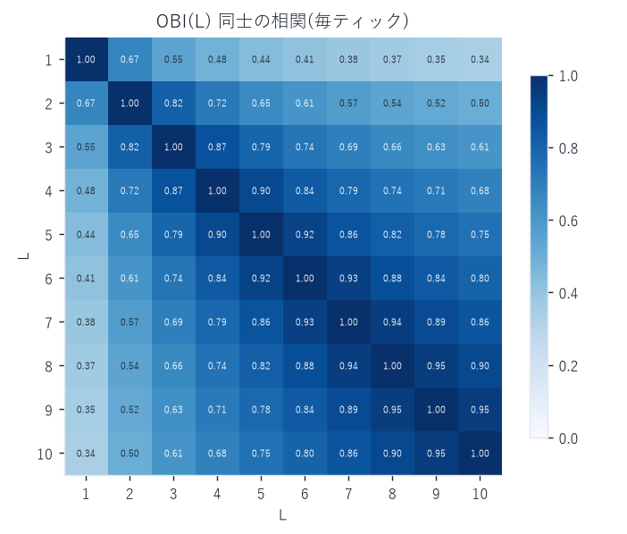
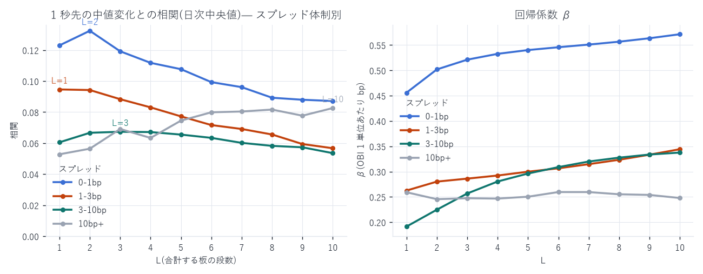
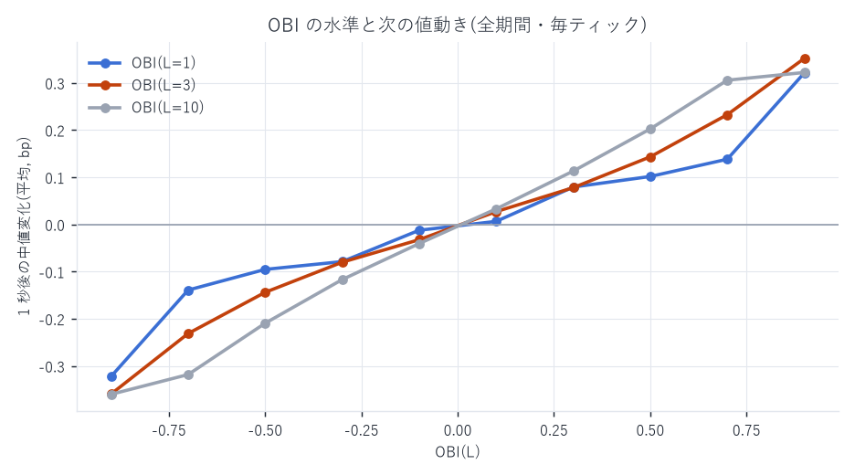

# OBI(L=1..10)— 板の厚みの偏りを全期間・毎ティックで算出

対象: `xyz:DRAM / USDC`(Hyperliquid HIP-3、発行者 Trade.xyz)
期間: 2026-05-04 〜 2026-08-10(99 日)
点数: 41,803,773 ティック × L=1..10(分析はクロス状態を除いた 41,779,829 点)
作成日: 2026-08-13

---

## 1. 定義

```
            Σ_{i=1..L} q_i^b  −  Σ_{i=1..L} q_i^a
OBI(L) = ────────────────────────────────────────────
            Σ_{i=1..L} q_i^b  +  Σ_{i=1..L} q_i^a
```

`q_i^b` / `q_i^a` は最良気配から数えて i 段目の買い板 / 売り板の総数量
(同一価格に載っている全注文の合計)。

- `OBI = +1` … その L 段までが買い板だけ、`−1` … 売り板だけ、`0` … 拮抗
- L=1 は最良気配だけの偏り。L を増やすほど深い板まで含めた偏りになる
- マイクロプライスで使った買い側比率 I とは `OBI(1) = 2I − 1`、すなわち
  $\mathrm{MP} = m + \tfrac{1}{2}\,\mathrm{OBI}(1)\cdot s$。マイクロプライスは「OBI(1) にスプレッドを掛けたもの」である
  (この一致は §5 の検証で数値的にも確認した)

段数が足りない側(例: 売り板が 6 段しかないのに L=10)は、存在する分だけを合計する。
判別できるよう `n_lv_bid` / `n_lv_ask`(10 で打ち切り)を各行に付けてある。

## 2. 「毎ティック」の定義と解像度

板の価格レベル差分(L2 `book_px`、変化したレベルだけを ns 精度で出した絶対値表現)を
注文レベルで再生し、上位 10 段の状態が変化した ts ごとに 1 行を出す。

- 11 段目より深いだけの変化は OBI(1..10) を動かさないので行にしない
  (`dwell_ns` が入っているので任意時点の値は前方補完で復元できる)
- したがって 41,803,773 行が OBI(1..10) の情報量そのものであり、
  これ以上細かい OBI 系列は存在しない
- 同一 ns に複数レベルが動いた場合は全部適用してから 1 行にまとめる
  (板の中間状態は原理的に観測できない)

参考: マイクロプライス(最良気配だけの変化)は 23,470,241 点。
OBI は深さ 10 段まで見るぶん、1.78 倍細かく動く。

---

## 3. 結果 — 段数を増やすと何が変わるか

| L | 平均(時間加重) | 標準偏差(時間加重) | 平均 \|OBI\|(時間加重) |
|---|---|---|---|
| 1 | −0.0031 | 0.7036 | 0.6240 |
| 2 | −0.0029 | 0.6466 | 0.5672 |
| 3 | +0.0005 | 0.6057 | 0.5240 |
| 4 | +0.0026 | 0.5743 | 0.4917 |
| 5 | +0.0044 | 0.5476 | 0.4650 |
| 6 | +0.0046 | 0.5242 | 0.4423 |
| 7 | +0.0040 | 0.5030 | 0.4223 |
| 8 | +0.0040 | 0.4842 | 0.4043 |
| 9 | +0.0043 | 0.4678 | 0.3882 |
| 10 | +0.0040 | 0.4516 | 0.3721 |

- 平均はどの L でもほぼ 0(±0.005)。99 日を通して買い / 売りどちらかに
  構造的に偏った板ではない
- 標準偏差は L とともに単調に縮む(0.70 → 0.45)。L=1 は 41.8M ティックのうち
  1,850 万点(44%)が \|OBI\|>0.8 に貼り付く両極端な指標である一方、
  L=10 は中央に集まる。同じ「板の偏り」でも別物と考えたほうがよい



### レベル間の相関



隣接する L 同士は 0.9 以上だが、corr(OBI(1), OBI(10)) = 0.34 しかない。
最良気配の偏りと板全体の偏りは、実質的に別の情報を運んでいる。

---

## 4. どの段数が「次の値動き」を当てるか

各ティックで OBI(L) を説明変数、1 秒後の中値変化(bp)を被説明変数とした回帰。



相関(1 秒先の中値変化との)。日次で推定した 99 日の中央値(算出方法は `METHODOLOGY.md`)。

| L | 全期間プール | spread<1bp | 1–3bp | 3–10bp | 10bp+ |
|---|---|---|---|---|---|
| 1 | 0.0715 | 0.1230 | 0.0946 | 0.0605 | 0.0528 |
| 2 | 0.0752 | 0.1324 | 0.0942 | 0.0667 | 0.0564 |
| 3 | 0.0726 | 0.1192 | 0.0883 | 0.0673 | 0.0691 |
| 4 | 0.0666 | 0.1118 | 0.0831 | 0.0671 | 0.0634 |
| 5 | 0.0642 | 0.1077 | 0.0773 | 0.0655 | 0.0745 |
| 10 | 0.0533 | 0.0872 | 0.0567 | 0.0535 | 0.0826 |
| 有効日数 | 99 | 97 | 96 | 97 | 64 |

> 【2026-08-14 訂正 2】 初版・訂正 1 はここにプール値(日をまたいで十分統計量を累積した
> 単一の相関)を載せていた。監査(`regression_report.md` §9)でプール推定が少数日に
> 支配されることを確認したため、日次中央値に統一した。参考までにプール値は
> L=1 で all 0.0942 / 0-1bp 0.1439 / 3-10bp 0.0538。
> 段数の優劣の結論は下記のとおり一部変わる。

読み取れること

1. スプレッドが狭い(板が厚い)ときは浅い段が強い。最良は L=2(0.1324)で、
   L=1(0.1230)と僅差。L=10 まで足すと 0.0872 まで落ちる
2. スプレッドが広いほど、深く数えたほうがよい。 3–10bp では L=3(0.0673)、
   10bp 超では L=10 が最良(0.0826、L=1 は 0.0528)。
   気配が飛び飛びで最良段が薄い局面では、1 段目だけ見ても情報が足りない
   (ただし 10bp+ 帯は有効日数が 64 日と少ない)
3. β(OBI 1 単位あたりの bp)は L とともに増える(狭スプレッド帯で 0.46 → 0.57 bp)。
   これは OBI(L) の分散が縮むぶん傾きが立つだけで、情報量が増えたわけではない。
   β の大小で段数を選ばないこと
4. どの体制でも 1 秒先の相関は 0.05〜0.13。単独で建玉を決められる強さではなく、
   他の特徴量と合わせる部品として扱う水準

### OBI の水準と将来リターン(全期間・毎ティック)



| OBI 区間 | L=1 | L=3 | L=10 |
|---|---|---|---|
| [−1.0, −0.8) | −0.322 bp | −0.359 bp | −0.360 bp |
| [−0.6, −0.4) | −0.095 | −0.144 | −0.209 |
| [−0.2, 0.0) | −0.012 | −0.032 | −0.041 |
| [0.0, +0.2) | +0.006 | +0.027 | +0.033 |
| [+0.4, +0.6) | +0.102 | +0.143 | +0.202 |
| [+0.8, +1.0] | +0.321 | +0.352 | +0.322 |

10 区間すべて・3 つの L すべてで単調、しかもほぼ左右対称。
到達幅(±0.33bp)はどの L でも似ているが、そこに至るまでの滑らかさが違う
(L=10 は中間区間でも素直に効き、L=1 は端に張り付いてから効く)。

### ★ マイクロプライスとの関係 — スプレッドを掛けると却って悪くなる

両者は $\mathrm{MP} - m = \tfrac{1}{2}\,\mathrm{OBI}(1)\cdot s$ で結ばれている。にもかかわらず、
1 秒先相関は OBI(1) が 0.072(日次中央値)、MP 乖離は 0.032(プール) と 2 倍以上違う。
方向だけのシグナルのほうが、値幅を掛けたものより当たる。

理由は「実現する値幅がスプレッドにほとんど比例しない」ことにある。
スプレッド体制別の平均 |1 秒後の中値変化| は

| スプレッド帯 | 0–1bp | 1–3bp | 3–10bp | 10–30bp | 30bp+ |
|---|---|---|---|---|---|
| 平均 \|1 秒後の中値変化\| | 0.63 bp | 0.67 bp | 0.66 bp | 0.59 bp | 0.66 bp |
| 平均 \|MP − mid\| | 0.12 bp | 0.58 bp | 1.48 bp | 4.72 bp | 20.46 bp |

とほぼ一定なのに、`MP − mid` はスプレッドに比例して 170 倍に膨らむ。
プールした回帰では、このスケールのずれがそのまま誤差になる。

結論: 体制を跨いで使うなら OBI(方向)を、体制内で値幅まで欲しいなら
$m + \hat{\beta}\,(\mathrm{MP} - m)$ を体制別に較正して使う(`regression_report.md` §4)。

---

## 5. 検証

- OBI(1) と独立系列の一致: 別経路で作った BBO テーブル(`l2/bbo`)から計算した
  $\frac{2\,q_b}{q_b+q_a} - 1$ と、板再生から求めた `obi_1` を dt=2026-05-17 の
  共通 50,986 点で突合 → 最大誤差 2.2 × 10⁻¹⁶(倍精度の丸め誤差の範囲)。
  最良買気配・最良売気配も完全一致
- 片側 0 レベルの行: 同日で 0 件。全期間でも `n_lv_bid` / `n_lv_ask` で判別可能
- クロス状態(ask < bid)は全ティックの 0.06%(23,943 件)存在し、
  §3〜§4 の集計では `best_ask > best_bid` で除外済み。
  parquet には残してあるので、必要なら同じ条件で除ける
  (混入させると回帰が壊れる。`regression_report.md` §2)

---

## 6. 成果物

```
data/obi/dt=YYYY-MM-DD/part-000.parquet   ★全解像度 41,803,773 行(99 日 = 3.1GB)
data/obi_1m.csv / obi_1m.parquet          1 分グリッド 141,606 行(配布用)
data/obi_analysis.json                    本文の数値の出所すべて
data/obi_daily.csv                        日次サマリ 99 行
scripts/build_obi.py                      板再生 → 毎ティック OBI
scripts/obi_analyze.py                    集計とチャート(`charts` 引数で図だけ再描画)
scripts/obi_grid.py                       1 分グリッド化
```

### 列

| 列 | 内容 |
|---|---|
| `ts` | イベント時刻(UTC ns) |
| `best_bid` / `best_ask` / `mid` | 最良気配と中値 |
| `obi_1` … `obi_10` | OBI(L=1..10) |
| `cum_bid_10` / `cum_ask_10` | 上位 10 段の累積数量(OBI の分母の内訳) |
| `n_lv_bid` / `n_lv_ask` | その側のレベル数(10 で打ち切り)。10 未満なら L が足りていない |
| `dwell_ns` | この状態が続いた時間。時間加重統計と前方補完に必須 |

### 再現手順

```bash
aws s3 sync s3://$WORK_BUCKET/l2/book_px/ data/l2_v99/book_px/ \
    --profile hl-artemis-ro --region us-east-1        # 3.72GB

uv run python scripts/build_obi.py <出力先>   # 99 日で約 6 分
uv run python scripts/obi_analyze.py          # 集計 + 図
uv run python scripts/obi_grid.py             # 1 分グリッド
```

---

AWS 費用: 今回の追加は book_px の egress 3.72GB ≈ \$0.33。
EC2 \$25.05 | S3 ≈\$1.87 | 累計 ≈\$26.92 / 予算 \$60(EC2 は停止中)
