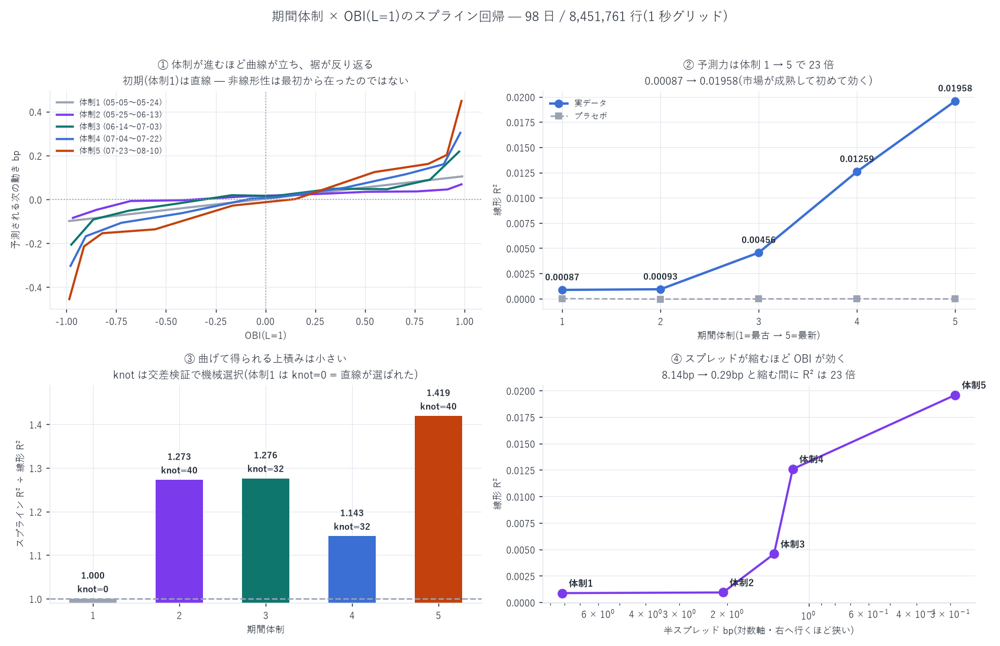

# 期間体制 5 通り × OBI 5 種のスプライン回帰(knot は機械選択)

模型: `y = α + f(OBI) + ε`、`f` は制限付き 3 次スプライン(restricted cubic spline)
標本: 98 日 / 8,451,761 行(1 秒グリッド、crossed 行と resync 汚染行は除外)
作成日: 2026-08-19

---

## 0. 結論 — 非線形性は市場が成熟するにつれて現れた

| 体制 | 期間 | 半スプレッド | OBI(L=1) の R²(線形) | 裾/中央の傾き比 | 予測幅 |
|---|---|---:|---:|---:|---:|
| 1 | 05-05〜05-24 | 8.140 bp | 0.00087 | 1.00(= 直線) | 0.203 bp |
| 2 | 05-25〜06-13 | 2.072 bp | 0.00093 | 7.75 | 0.153 bp |
| 3 | 06-14〜07-03 | 1.343 bp | 0.00456 | 11.03 | 0.424 bp |
| 4 | 07-04〜07-22 | 1.145 bp | 0.01259 | 12.27 | 0.607 bp |
| 5 | 07-23〜08-10 | 0.287 bp | 0.01958 | 13.92 | 0.903 bp |

3 つの発見:

1. OBI の予測力そのものが 22 倍になった(R² 0.00087 → 0.01958、相関 0.030 → 0.140)。
   同じ指標が、同じ銘柄で、3 ヶ月で別物になっている
2. 関係は直線から「裾で急に立つ曲線」へ変わった。体制 1 では CV が knot ゼロ(= 直線)を選ぶのに、
   体制 5 では裾の傾きが中央の 13.9 倍。非線形化で標本外 R² が +41.9%(19 日中 18 日で改善、
   25 セル中これだけが Bonferroni を通過)
3. 非線形性は最良気配にしか無い。体制 5 での非線形化の利得は
   L=1 +41.9% → L=2 +11.1% → L=3 +5.1% → L=5 +1.1% → L=10 +0.0%。
   深い板は最後まで直線のまま

プラセボ(x を日内で 1 時間ずらす)は全 25 セルで R² ≤ |0.00005|。ルックアヘッドは無い。

---

## 1. 設計

### 1-1. 期間体制 5 通り(機械的に決める)

98 日を暦順に 5 等分(20/20/20/19/19 日)。境界は日数だけで決めており、
結果を見てから選び直していない(CLAUDE.md 厳禁事項 5「期間の選別を結果を見てから行わない」)。
この市場は半スプレッドが 8.14 → 0.287 bp と 28 倍圧縮しており、暦順ブロックが
そのまま体制の推移になる。

### 1-2. OBI 5 種

`depth_one_level`(= L=1)/ `obi_2` / `obi_3` / `obi_5` / `obi_10`。
`OBI(L) = (Σ_{i≤L} q_i^b − Σ_{i≤L} q_i^a)/(Σ_{i≤L} q_i^b + Σ_{i≤L} q_i^a)`。

### 1-3. ★knot の機械的調節 — 位置と個数の両方を自動で決める

| 段 | 規則 |
|---|---|
| 位置 | 訓練分割内の x の [5%, 95%] を K 等分した分位点。分位点は訓練分割だけから計算する(全標本から作ると漏洩 — CLAUDE.md 実装義務 4) |
| 個数 | K ∈ {0(線形), 3, 4, 5, 6, 7, 9, 12, 16, 20, 25, 32, 40} を 日単位 GroupKFold(5 分割)の標本外 R² で選ぶ |

行のシャッフルによる k-fold は使っていない。隣接する 1 秒窓は相関しているため漏洩する
(CLAUDE.md 実装義務: 日単位 GroupKFold か期間分割)。日ごと丸ごと分割している。

時間契約: x = 時刻 T の板の状態、y = (log mid(T+1s) − log mid(T)) × 1e4 [bp]。
x の確定時刻 = y の期間の開始時刻。

---

## 2. 全 25 セルの結果

| 体制 | OBI | K(CV) | K(99%規則) | R² 線形 | R² spline | 改善 | 勝ち日 | 相関 |
|---|---|---:|---:|---:|---:|---:|---:|---:|
| 1 | L=1 | 0 | 0 | 0.00087 | 0.00087 | +0.0% | — | +0.0304 |
| 1 | L=2 | 16 | 0 | 0.00073 | 0.00073 | +0.8% | 12/20 | +0.0279 |
| 1 | L=3 | 25 | 9 | 0.00061 | 0.00064 | +4.6% | 14/20 | +0.0255 |
| 1 | L=5 | 0 | 0 | 0.00041 | 0.00041 | +0.0% | — | +0.0210 |
| 1 | L=10 | 0 | 0 | 0.00015 | 0.00015 | +0.0% | — | +0.0127 |
| 2 | L=1 | 40★ | 40 | 0.00093 | 0.00118 | +27.3% | 15/20 | +0.0319 |
| 2 | L=2 | 9 | 9 | 0.00020 | 0.00027 | +35.6% | 12/20 | +0.0163 |
| 2 | L=3 | 9 | 9 | 0.00018 | 0.00022 | +24.6% | 14/20 | +0.0161 |
| 2 | L=5 | 5 | 5 | 0.00026 | 0.00028 | +9.2% | 12/20 | +0.0183 |
| 2 | L=10 | 3 | 3 | 0.00022 | 0.00025 | +9.1% | 10/20 | +0.0170 |
| 3 | L=1 | 32 | 20 | 0.00456 | 0.00582 | +27.6% | 15/20 | +0.0681 |
| 3 | L=2 | 40★ | 16 | 0.00455 | 0.00515 | +13.1% | 15/20 | +0.0681 |
| 3 | L=3 | 40★ | 25 | 0.00443 | 0.00477 | +7.6% | 13/20 | +0.0672 |
| 3 | L=5 | 40★ | 25 | 0.00359 | 0.00372 | +3.4% | 12/20 | +0.0607 |
| 3 | L=10 | 4 | 0 | 0.00211 | 0.00213 | +0.7% | 11/20 | +0.0469 |
| 4 | L=1 | 32 | 20 | 0.01259 | 0.01439 | +14.3% | 15/19 | +0.1131 |
| 4 | L=2 | 40★ | 25 | 0.01278 | 0.01399 | +9.5% | 15/19 | +0.1143 |
| 4 | L=3 | 40★ | 16 | 0.01158 | 0.01218 | +5.2% | 14/19 | +0.1089 |
| 4 | L=5 | 7 | 4 | 0.00987 | 0.01006 | +1.9% | 16/19 | +0.1002 |
| 4 | L=10 | 7 | 4 | 0.00830 | 0.00856 | +3.2% | 14/19 | +0.0920 |
| 5 | L=1 | 40★ | 32 | 0.01958 | 0.02779 | +41.9% | 18/19 | +0.1404 |
| 5 | L=2 | 40★ | 20 | 0.02098 | 0.02332 | +11.1% | 17/19 | +0.1455 |
| 5 | L=3 | 20 | 5 | 0.01984 | 0.02086 | +5.1% | 16/19 | +0.1417 |
| 5 | L=5 | 4 | 4 | 0.01709 | 0.01728 | +1.1% | 15/19 | +0.1322 |
| 5 | L=10 | 0 | 0 | 0.01218 | 0.01218 | +0.0% | — | +0.1137 |

★ = CV が格子の上限(40)を選んだ = 格子が選択を拘束している(§5 で扱う)

符号検定と多重比較: 25 セル、Bonferroni 閾値 0.05/25 = 0.0020。
通過は 体制 5 の L=1(18/19、p<0.0001)と L=2(17/19、p=0.0004)の 2 セルのみ。
ただし改善率が 深さについても体制についても単調であり、
個別セルの有意性よりこの単調性のほうが強い証拠である。

---

## 3. ★当てはめ曲線の形 — 中央は平ら、両端で跳ねる

OBI(L=1) の十分位点での予測値(bp):

| 体制 | x = −0.99 | −0.91 | −0.56 | −0.17 | +0.15 | +0.55 | +0.91 | +0.99 |
|---|---:|---:|---:|---:|---:|---:|---:|---:|
| 1 | −0.099 | −0.089 | −0.036 | −0.003 | +0.008 | +0.040 | +0.094 | +0.105 |
| 5 | −0.455 | −0.214 | −0.137 | −0.028 | +0.001 | +0.124 | +0.203 | +0.449 |

体制 1 はほぼ等間隔(= 直線)。体制 5 は内側がほぼ平ら
(x が −0.82 から +0.82 まで 1.64 動く間に f は 0.32bp しか動かない)のに、
両端の最後の十分位だけで 0.24bp ずつ跳ねる。

| 体制 | 中央の傾き | 裾の傾き | 比 |
|---|---:|---:|---:|
| 1 | 0.103 bp/OBI | 0.103 | 1.00 |
| 2 | 0.041 | 0.320 | 7.75 |
| 3 | 0.086 | 0.954 | 11.03 |
| 4 | 0.142 | 1.738 | 12.27 |
| 5 | 0.237 | 3.294 | 13.92 |

「板が片側に振り切れているとき」だけが情報を持つ。中間的な不均衡はほぼ無意味である。
報告 29(MLOBI スプライン)が 71 日をまとめて「裾で加速する」と書いた現象を、
体制ごとに分けると 成熟とともに立ち上がってきたことが見える。

---

## 4. 経済的な大きさ — 予測幅が損益分岐に届いた

| 体制 | 最極端十分位の予測 | / ハーフスプレッド | / δ\(=0.363bp、報告 36) |
|---|---:|---:|---:|
| 1 | 0.105 bp | 1.3% | 0.29 |
| 2 | 0.084 | 4.1% | 0.23 |
| 3 | 0.218 | 16.2% | 0.60 |
| 4 | 0.304 | 26.5% | 0.84 |
| 5 | 0.455 | 158.5% | 1.25 |

体制 5 では、最極端十分位の OBI が予測する中値変化(0.455bp)が
ハーフスプレッド(0.287bp)を上回り、損益分岐スプレッド δ\(0.363bp)の 1.25 倍に達している。
体制 1 ではハーフスプレッドの 1.3% しかなかったものが、である。

ただしこれは「取れる」という意味ではない。tick = 0.001(= 0.184bp)で、
体制 5 のスプレッドは約 3 ティックしかない。この状態で OBI が振り切れるのは
最良気配がまさに消えようとしている瞬間であり、そこに置いてある自分の指値は
約定するのではなく食われる。報告 16 が測った「逆選択が粗利の 79% を持っていく」
機構そのもので、「中値の予測が当たる」ことと「置いた注文が儲かる」ことは別である。

---

## 5. ★正直な限界 — 格子が拘束した

9 セルで CV が格子の上限 K=40 を選んだ。「knot を機械的に調節する」以上、
上限が選ばれた状態で止めるのは誤りなので、初回の上限 12 から 40 まで広げた。
それでもまだ張り付いている。

体制 5・L=1 の CV 曲線:

| K | 0 | 4 | 7 | 12 | 20 | 32 | 40 |
|---|---:|---:|---:|---:|---:|---:|---:|
| 標本外 R² | 0.01958 | 0.02116 | 0.02367 | 0.02585 | 0.02684 | 0.02761 | 0.02779 |

単調に増えるが、増分は明確に減る。K=12 で全利得の 76%、K=20 で 88% に達する。
これは「真の関係が滑らかな曲線ではなく階段状に近い」ことを示唆する
(OBI が ±1 に張り付く点で不連続に近い挙動)。したがって

- CV の最良 K は報告するが、それを推奨値にはしない
- 併せて 「最良 R² の 99% に最初に到達する K」(機械的な飽和規則)を併記した。
  実用上は K=12〜20 で十分である

これは分析の欠陥ではなく、関係の形が滑らかでないという結果である。

---

## 6. 既存報告との整合(§D-13)

| 報告 | 記述 | 本報告との関係 |
|---|---|---|
| 29(MLOBI スプライン) | 「K=5〜8 で飽和する」(10 変数の加法模型、71 日をプール) | 矛盾しない。71 日をプールすると体制ごとの曲率が平均されて滑らかになり、少ない knot で足りる。体制別に分けると後半でより多くの knot が要る |
| 28(OBI レベル別分解) | 「OBI の情報は 1 段目に集中。10 段全部でも 1.54 倍」 | 強化。非線形性も 1 段目に集中(体制 5 で L=1 +41.9% vs L=10 +0.0%) |
| 32(バックテスタ v3) | 「シグナルはどれも効かず。方向性ゲートは両側 MM では有害」 | 直接の矛盾はない。報告 32 が試したのは book_slope のスプラインであって非線形 OBI ではない。ただし「方向性ゲートは両側 MM で有害」は形式によらない構造的な主張なので、本報告の結果が損益に翻訳される保証はない |
| 40(遅延前提) | 「成熟期のプールは遅延下で負」 | 矛盾しない。本報告は中値の条件付き期待値であって約定損益ではない。§4 の但し書きを参照 |

---

## 7. 自己精査

- §C-10 多重比較: 25 セル全件を表に掲載し、Bonferroni 閾値 0.0020 と通過数(2)を明示
- §C-11 中央値だけで見ない: 全セルで日別の勝ち日数を併記。R² だけで判定していない
- §B-6 帰無対照: プラセボ(日内 1 時間ずらし)を全セルに配置。最大でも |R²| = 0.00005
- ★時間契約: x は T 時点、y は [T, T+1s)。knot・ウィンザ限界・係数はすべて訓練分割のみから推定
- ★体制の選び方: 暦順 5 等分。結果を見てからの境界調整をしていない(厳禁事項 5)
- §A-3 指標の誤用: §4 で「中値の予測」と「約定損益」を明確に分け、前者から後者を主張していない
- ★自分で見つけた問題: 初回は K の上限 12 で 9 セルが張り付いた。
  上限が選ばれている状態は「機械選択」として不完全なので格子を 40 まで広げ、
  それでも張り付くことを §5 で明示した上で飽和規則を併記した

## 8. 限界

| 未計上・仮定 | 向き |
|---|---|
| 体制は暦順の等分割。市場状態(スプレッド・ボラ)による分割は試していない | 双方向 |
| K=40 でも CV が飽和しきらない。真の形は階段関数の可能性(§5) | 双方向 |
| 極端 OBI の観測が「板が消える直前」に偏っている可能性を分離していない(`stale_ns` との交絡は未検証) | 楽観側(見かけの予測力を膨らませうる) |
| 1 秒地平のみ。他の地平では形が違いうる | 不明 |
| 単変量(加法模型でも交互作用モデルでもない)。他の特徴量で説明できる分を除いていない | 楽観側 |
| 単一銘柄・98 日 | 不明 |

---

計算に要した AWS 費用: EC2(stopped)\$25.12 | S3 ≈\$1.50 | 累計 ≈\$26.62 / 予算 \$60(停止閾値 \$48)
(本報告は既存パネルからのローカル計算のみ。EC2 は停止中)
