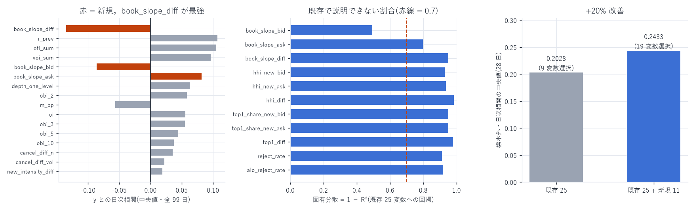

# 新特徴量 11 個の追加と全 99 日での検証

追加した特徴量: `book_slope_bid/_ask/_diff`、`hhi_new_bid/_ask/hhi_diff`、
`top1_share_new_bid/_ask/top1_diff`、`reject_rate`、`alo_reject_rate`
標本: 全 99 日・8,451,761 行(resync 汚染行は除外)
作成日: 2026-08-15

---

## 0. 結論

| | 既存 25 変数 | 既存 25 + 新規 11 |
|---|---|---|
| Lasso が選んだ変数 | 9 / 25 | 19 / 36 |
| 標本外(後 28 日)の日次相関 中央値 | 0.2028 | 0.2433 |
| 符号が逆だった日 | 0 / 28 | 0 / 28 |

標本外で +20% 改善。 `book_slope_diff` が最大の係数(−0.134)で、
2 位の `r_prev`(+0.074)のほぼ 2 倍。

---

## 1. `book_slope_diff` — 8 日での発見は全期間でも成立した

```
book_slope_side = Σ_i (レベル i の最良気配からの距離[bp] × 数量_i) / Σ_i 数量_i
book_slope_diff = book_slope_bid − book_slope_ask
```

| 指標 | 8 日(前回) | 全 99 日(今回) |
|---|---|---|
| y との日次相関(中央値) | −0.2313 | −0.1348 |
| 符号の一貫性 | 8 / 8 | 98 / 98 日 |
| 既存 25 変数への R² | 0.236 | 0.0498 |
| 固有分散 | 76.4% | 95.0% |

- 相関は 8 日での −0.231 から −0.135 に下がった。 前回の 8 日は成熟期中心で、
  どの特徴量も強く出る期間だったため。過大評価だったと認めるべき数字
- しかし符号は 98 日すべてで負。これは本プロジェクトで測ったどの特徴量よりも一貫している
- 固有分散はむしろ上がった(95.0%)。全期間で見ると既存 25 変数とほぼ直交している
- 既存で最良の単一特徴量(全期間の `obi_1` = +0.072、`depth_one_level` = +0.079)に対し、
  1.7〜1.9 倍の相関

### 片側単独でも効くが、差が最も強い

| | y との相関 | 符号一貫性 | 既存への R² |
|---|---|---|---|
| `book_slope_diff` | −0.1348 | 98/98 | 0.0498 |
| `book_slope_bid` | −0.0859 | 98/98 | 0.5066 |
| `book_slope_ask` | +0.0820 | 97/98 | 0.2011 |

片側は既存(特に板の厚み系)と半分ほど重なる(bid の R² = 0.51)が、
差を取ると既存成分が打ち消し合って 95% が固有分になる。
Lasso も `book_slope_diff` と `book_slope_ask` の 2 本を選んだ。

---

## 2. ウォレット系 — 効果は小さいが方向は一貫

| 特徴量 | y との相関 | 符号一貫性 | 既存への R² | Lasso |
|---|---|---|---|---|
| `hhi_diff` | −0.0067 | 77/98 | 0.0167 | 選択(−0.0064) |
| `top1_diff` | −0.0037 | 65/98 | 0.0194 | 落選 |
| `hhi_new_ask` | +0.0045 | 77/98 が正 | 0.0637 | 落選 |
| `hhi_new_bid` | −0.0039 | 71/98 | 0.0715 | 落選 |

- 8 日での −0.0273(8/8)は全期間で −0.0067(77/98)まで落ちた。過大評価だった
- ただし 固有分散 98.3% と極端に高く、Lasso も `hhi_diff` を残した
- 解釈は変わらない: 買い側の新規注文が 1 者に集中しているほど価格は下がる。
  「多数による厚み」と「1 者による厚み」の区別が、わずかだが独立した情報を持つ

---

## 3. `reject_rate` の修正 — 算出できるようになった

前回は全期間ゼロだった。原因は棄却注文が `ts_open` を持たないことで、
`ts_open` 基準の窓割り当てから全部脱落していた。`ts_close` 基準に直して算出した。

| 特徴量 | 定義 | y との相関 | Lasso |
|---|---|---|---|
| `reject_rate` | 棄却数 / (棄却 + 受理) | −0.0010(57/98) | 落選 |
| `alo_reject_rate` | `badAloPxRejected` / (Alo 受理 + 同拒否) | −0.0021(57/98) | 選択(−0.0052) |

単独では方向性がほぼ無い(57/98 = コイン投げに近い)が、
他の変数と組み合わせると `alo_reject_rate` は残った。
ALO 拒否は「最良気配に置きに行ったが、その瞬間に相手側へ食い込んでいた」ことを意味し、
キュー先頭の争奪が激しい局面の指標として、他が捉えていない情報を持っているとみられる。

---

## 4. Lasso の再選抜(標本外 28 日)



`lasso_report.md` の変種 C と同じ手順(ボラ正規化・体制を合わせた訓練・拡大窓 CV)。

| 係数(絶対値順) | 値 | |
|---|---|---|
| `book_slope_diff` | −0.13392 | ★新規 |
| `r_prev` | +0.07383 | |
| `depth_one_level` | +0.05721 | |
| `voi_sum` | +0.05697 | |
| `cancel_diff_n` | +0.04859 | |
| `oi` | +0.03556 | |
| `m_bp` | +0.01923 | (前回は落選) |
| `obi_10` | −0.01422 | (前回は落選・符号が負) |
| `obi_2` / `obi_3` | +0.01035 / +0.00987 | |
| `ofi_sum` | +0.00849 | |
| `book_slope_ask` | +0.00803 | ★新規 |
| `cancel_diff_vol` | +0.00786 | (前回は落選) |
| `n_events` | −0.00747 | (前回は落選) |
| `hhi_diff` | −0.00640 | ★新規 |
| `alo_reject_rate` | −0.00516 | ★新規 |
| `q_ahead_new_ask` | −0.00320 | (前回は落選) |
| `n_trades` / `log_depth` | −0.00026 / −0.00010 | |

α が 0.0161 → 0.00452 に下がり、選ばれる変数が 9 → 19 に増えた。
`book_slope_diff` が最大の説明力を引き受けたことで正則化を緩められ、
それまで埋もれていた変数(`m_bp`、`obi_10`、`cancel_diff_vol`、`n_events`)が
役割を持つようになった。`obi_10` が負で入っているのは、
`depth_one_level`(正)との差 = 「深部と浅部の偏りの差」を Lasso が組み立てているためで、
`orthogonal_features.md` で提案した直交対比を、Lasso が自力で作っている。

---

## 5. 前回の推定値の訂正

| | 8 日での推定 | 全 99 日 | 判定 |
|---|---|---|---|
| `book_slope_diff` の相関 | −0.2313 | −0.1348 | 過大評価。ただし符号一貫性は 98/98 と極めて強い |
| `book_slope_diff` の固有分散 | 0.764 | 0.950 | 過小評価。全期間ではより直交 |
| `hhi_diff` の相関 | −0.0273 | −0.0067 | 過大評価(8/8 → 77/98) |

8 日(成熟期中心)での測定は、相関を 1.7〜4 倍に過大評価していた。
特徴量の探索は少数日で行ってよいが、採否は全期間で確認すること。

---

## 6. 成果物

```
data/new_features/YYYY-MM-DD.parquet   新特徴量 12 列 × 99 日(432MB)
data/panel_v2/dt=*/part-000.parquet    統合パネル 36 変数 × 8,451,761 行(1.1GB)
data/panel_v2_results.json             全数値(日次相関・R²・Lasso 新旧比較)
scripts/build_new_features.py          算出(途中再開に対応)
scripts/panel_v2.py                    統合・検証・Lasso 再実行
scripts/panel_v2_chart.py              図 27
```

```bash
uv run python scripts/build_new_features.py   # 約 35 分(book_px の再生が主)
uv run python scripts/panel_v2.py             # 約 10 分
uv run python scripts/panel_v2_chart.py
```

---

## 7. 次にやるとよいこと

1. `book_slope` を距離帯別に分解 — 今は上位 60 レベルの数量加重平均 1 本。
   「5bp 以内の傾き」「25bp 以内の傾き」に分ければ、どの距離の配置が効くか分かる
2. `book_slope_diff` を DML で推定 — 係数 −0.134 は Lasso の縮小後の値。
   不偏推定値と信頼区間は `analysis_proposal.md` の Step 2 で
3. トリガー系を別の目的変数で — 1 秒リターンでは無関係だった(`orthogonal_features.md`)。
   大きな価格変化の発生確率や実現ボラを目的変数にすべき
