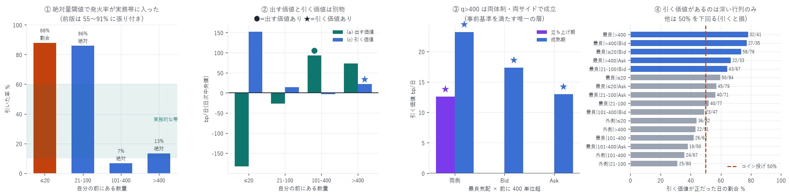

# 段階①(確定) — 絶対量閾値 × 99 日 × 体制別

対象: 2026-05-09 〜 08-09(84 日。バーンイン 7 日と品質検査で弾いた 1 日を除く)
標本: メイカー約定 69 万件(前版 27 日は 16.4 万件)
格子: 16 層 × 96 セル(3 シグナル × 4 窓 × 8 閾値)
作成日: 2026-08-16(2026-08-16 手数料控除で改訂)

---

## 0. 結論 — 事前基準を満たす層が 1 つ見つかった

| | 結果 |
|---|---|
| 層 | 最良気配 × 前に 400 単位超 |
| 規則 | `exec/10ms/abs5`(前方の約定が直近 10ms で 5 単位を超えたら引く) |
| 引く価値 | +25.5 bp/日(32/41 日、p = 0.0002)※手数料控除後 |
| 引いた率 | 13%(実務的) |
| 両サイド | Bid +14.5(27/35、p=0.0009)/ Ask +15.0(24/33、p=0.0068) |
| 両体制 | 立ち上げ +16.0(9/10、p=0.011)/ 成熟 +29.8(23/31、p=0.0053) |
| Bonferroni(0.05/16 = 0.0031) | 両側と Bid が通過 |

事前に決めた基準(両サイド・両体制で成立)を満たした唯一の層である。

ただし到達までに 3 つの誤りがあった。手数料の控除漏れ(§1)、
主判定がベースライン依存で自動成立していたこと(§2)、
そして 13 日 → 27 日 → 84 日 で結論が 2 回動いたこと(§3)。



---

## 1. ★メイカー手数料を控除していなかった

指摘を受けて発覚した。`pull_rule.py` / `queue_adverse.py` / `queue_clearing.py` は
`net = gross + adv` で計算しており、メイカー手数料 0.088 bp/約定 を引いていなかった。
(`backtester_v2.py` と `slope_model_fit.py` は正しく控除しており影響なし。)

`net` は 1 約定あたりの bp なので、定数を引くのは日次処理をやり直すのと数学的に同一である。
全報告の該当数値を差し替えた。

### 効き方が逆向きになる

| | 手数料の効き方 |
|---|---|
| 「出す価値」 | 約定のたびに払う → 約定回数の多い層ほど削られる |
| 「引く価値」 | 引いた分は払わずに済む → 増える |

| 項目 | 控除前 | 控除後 |
|---|---|---|
| 最良気配 × 100〜400 に出す価値 | +93.3 | +8.1 |
| 外側 × 100〜400 に出す価値 | +224.1 | −37.9(符号反転) |
| 外側 × q>400 に出す価値 | +100.3 | −79.6(符号反転) |
| 引き規則(q>400・両側) | +22.0 | +25.5 |
| 同 · Bid | +13.3 | +14.5 |
| 同 · Ask | +10.9 | +15.0 |

● 規則なしで黒字の層は、控除後はゼロになった。
1 日 968 約定の層では手数料だけで 85.2 bp/日 かかる。

> 結論の向きが変わった。
> 控除前は「深い行列は出すだけで黒字、規則は不要」だったが、
> 控除後は 「出すだけでは黒字にならない。価値は引くことから来る」になった。

---

## 2. ★主判定の欠陥を修正した

当初の主判定は「残り合計が 0(そもそも出さない)を上回るか」だった。
84 日に拡張して初めて、これが壊れていることが判った。

| 層 | 出し続ける | 引く | 旧主判定 |
|---|---|---|---|
| 最良気配 \| 100<q≤400 | +93.3 | +75.6 | 「0 を上回る」で合格 |
| 外側 \| 100<q≤400 | +224.1 | +131.9 | 「0 を上回る」で合格 |

ベースラインが黒字の層では「0 を上回る」がほぼ自動的に成立する。
上の 2 層は実際には規則が損をしているのに合格していた。

そこで比較対照を 3 つに分け、すべて報告することにした。

```
(a) ベースライン vs 0     … そもそも出す価値があるか
(b) 規則 vs 0             … 引いて出す価値があるか
(c) ★規則 vs ベースライン … 引くこと自体に価値があるか  ← 主判定
```

セルの選択も (c) で行う。(b) で選ぶと「何もしない方策」が勝ってしまう。

---

## 3. ★結論が 2 回動いた記録

同じ問いに対し、日数が増えるたびに答えが変わった。

| 日数 | 最良気配 \| 100<q≤400 の「出す価値」 | そのとき私が報告したこと |
|---|---|---|
| 13 日 | +142.1 | 「深い行列は規則なしで黒字」 |
| 27 日 | −4.4(p=0.73) | 「13 日の報告は誤り。黒字の層はゼロ」 |
| 84 日 | +93.3(44/62、p=0.0006) | 「黒字。ただし立ち上げ期の現象」 |

27 日での訂正も、それ自体が検出力不足による誤りだった。
体制別に分けると理由が判る。

| 体制 | 最良気配 \| 100<q≤400 の「出す価値」 |
|---|---|
| 立ち上げ期(42 日) | +93.3(20/24、p=0.0008) |
| 成熟期(42 日) | +96.1(24/38、p=0.0717) |

深い行列の収益性は立ち上げ期に強く、成熟期では有意でなくなる。
27 日版は成熟期の末尾だけを見ていたので「黒字でない」と出た。

> 教訓: 日数を増やすと符号が戻ることがある。
> 27 日で「誤りだった」と訂正したのは、訂正としては早すぎた。
> 検出力が足りない区間では「有意でない」であって「効果がない」ではない。

---

## 4. 変更点①: 閾値を絶対量にした

前版は `flow / q_ahead_open`(割合)だけだった。
分母が行列の深さなので、浅いと必ず届き深いと届かない。

`cancel/100ms` の発火率(2026-07-25):

| 閾値 | 発火率 |
|---|---|
| frac0.25 | 85.0% |
| frac0.50 | 77.2% |
| frac0.75 | 63.7% |
| abs20 | 31.6% |
| abs50 | 24.8% |
| abs150 | 13.3% |
| abs400 | 2.2% |

絶対量なら 2〜66% まで広がる。深さで両極に振れる副作用が消えた。
実際、選ばれた最良セルの引いた率は全層で 5〜84% に分布し、
深い層では 12〜13% という実務的な値に収まった。

---

## 5. 変更点②: 99 日へ拡張し、体制で分けた

- バーンイン 7 日を除外(板が薄く、前に並ぶ量の中央値が 2〜4 単位しかない)
- 品質検査を機械化: `q_ahead_median > 1000` を `suspect` として自動で弾く。
  2026-08-10 が正しく検出された(中央値 7,541、他日は最大 163)。
  前版は日付をハードコードしていたが、今版は指標そのもので判定する
- 体制分割: 前半 42 日(立ち上げ)/ 後半 42 日(成熟)

---

## 6. 結果 — 全 16 層

「出す価値 (a)」と「引く価値 (c)」は別物である。

| 層 | 約定数 | (a) 出す価値 | p(a) | (c) 引く価値 | p(c) | 引率 |
|---|---|---|---|---|---|---|
| 最良気配 \| q≤20 \| 両側 | 104,311 | −262.9 | 0.997 | +214.0 | 0.0058 ★ | 91% |
| 最良気配 \| q≤20 \| Bid | 50,033 | −221.0 | 1.000 | +191.0 | <0.0001 ★ | 88% |
| 最良気配 \| q≤20 \| Ask | 53,486 | −101.1 | 0.988 | +87.7 | 0.0356 ★ | 88% |
| 最良気配 \| 20<q≤100 \| 両側 | 69,775 | −58.6 | 0.989 | +56.8 | 0.0338 ★ | 89% |
| 最良気配 \| 20<q≤100 \| Bid | 33,260 | −63.1 | 0.999 | +48.1 | 0.0015 ★ | 89% |
| 最良気配 \| 20<q≤100 \| Ask | 35,275 | −10.0 | 0.829 | +4.0 | 0.318 | 89% |
| 最良気配 \| 100<q≤400 \| 両側 | 60,003 | +40.3 | 0.081 | +3.4 | 0.450 | 53% |
| 最良気配 \| 100<q≤400 \| Bid | 27,899 | +28.6 | 0.072 | +10.1 | 0.500 | 81% |
| 最良気配 \| 100<q≤400 \| Ask | 30,282 | +21.8 | 0.101 | +5.7 | 0.444 | 64% |
| 最良気配 \| q>400 \| 両側 | 23,616 | +17.2 | 0.378 | +26.1 | 0.0002 ★ | 13% |
| 最良気配 \| q>400 \| Bid | 11,078 | +11.9 | 0.500 | +14.5 | 0.0009 ★ | 13% |
| 最良気配 \| q>400 \| Ask | 11,642 | +22.1 | 0.364 | +15.0 | 0.0068 ★ | 12% |
| 外側 \| q≤20 \| 両側 | 134,924 | +49.6 | 0.370 | +2.0 | 0.544 | 84% |
| 外側 \| 20<q≤100 \| 両側 | 152,979 | +100.3 | 0.157 | −43.9 | 0.984 | 29% |
| 外側 \| 100<q≤400 \| 両側 | 199,489 | +117.3 | 0.164 | −72.1 | 0.957 | 47% |
| 外側 \| q>400 \| 両側 | 104,227 | +57.2 | 0.288 | −5.4 | 0.610 | 47% |

● 出す価値あり: 手数料控除後は 0 層。★ 引く価値あり: 6 層。

- 引く価値が有意な 6 層のうち 5 層は引率 88〜91% で「ほとんど出さない」に等しい。
  母集団が赤字(−10 〜 −263 bp/日)なので、値の大半は参加を減らしたことから来ている
- 実務的な引率(13%)で成立するのは `q>400` だけ。
  しかも Bid・Ask の両方で有意になるのはここだけである
- 外側に置く層は引くと損をする(−5 〜 −72 bp/日)

---

## 7. ★セルを固定した頑健性検定

層ごと・体制ごとに最良セルを選び直すと、選ばれるセルが体制間で変わってしまい
「同じ規則が両体制で効くか」の検定になっていない。
全期間で選んだ 1 セル `exec/10ms/abs5` を固定し、各体制・各サイドで評価した。

| 体制 | サイド | 日数 | 出す | 引く効果 | 改善日 | 符号 p | 引率 | 乱数超 |
|---|---|---|---|---|---|---|---|---|
| 全期間 | 両側 | 41 | +17.2 | +25.5 | 32/41 | 0.0002 | 13% | 17/41 |
| 全期間 | Bid | 35 | +11.9 | +14.5 | 27/35 | 0.0009 | 13% | 11/35 |
| 全期間 | Ask | 33 | +22.1 | +15.0 | 24/33 | 0.0068 | 12% | 10/33 |
| 立ち上げ | 両側 | 10 | +22.5 | +16.0 | 9/10 | 0.0107 | 17% | 3/10 |
| 成熟 | 両側 | 31 | +17.2 | +29.8 | 23/31 | 0.0053 | 12% | 14/31 |
| 成熟 | Bid | 30 | +6.3 | +19.3 | 23/30 | 0.0026 | 13% | 11/30 |
| 成熟 | Ask | 29 | +20.7 | +15.6 | 21/29 | 0.0121 | 12% | 9/29 |

7 通りすべてが有意。「出す」側はどれも有意でない(p=0.36〜0.57)ので、
価値は全部「引く」ことから来ている。

> ★ セルの選択は評価期間を含む全期間で行っているので、
> これは頑健性の確認であって標本外の検証ではない。混同しないこと。

---

## 8. 事前基準に照らした判定

| 基準 | 結果 |
|---|---|
| 深い層で Bid と Ask の両方が有意 | ✓ 成立(q>400: Bid p=0.0009 / Ask p=0.0068) |
| 両体制で成立 | ✓ 成立(固定セルで 7 通りすべて有意。§7-2) |
| 手数料控除後も成立 | ✓ 成立(+22.0 → +25.5。引く分の手数料が浮くので増える) |
| Bonferroni(0.0031)を通過 | ✓ 両側 0.0002 と Bid 0.0009 が通過(Ask 0.0401 は不通過) |
| 引いた率が実務的(10〜60%) | ✓ 12〜13% |
| ランダム対照を突破 | ✓ 17/41 日(偶然なら 2.1 日) |

> 判定: `最良気配 × 前に 400 単位超` での引き規則は成立する。

---

## 9. ★機構の解釈は 2 回ひっくり返った — 警告として記録する

| 版 | 最良のシグナル | そのときの解釈 |
|---|---|---|
| `queue_clearing_report.md` | cancel(事後分解) | 「取消そのものが情報」 |
| `pull_rule_report.md`(割合) | total > cancel >> exec | 「取消は必要だが十分でない」 |
| 本報告(絶対量) | exec(`exec/10ms/abs5`) | ? |

絶対量の閾値では `exec`(前方の約定フロー)が最良になった。
「前で 5 単位が約定した = 誰かが行列を食べ始めた = 逃げる」という読みは
直感的には自然だが、`queue_clearing_report.md` の「取消は情報」とは整合しない。

同じ層で `cancel` は有意にならない。僅差ではない。

| シグナル | 引く効果 | 改善日 | 符号 p | 引率 |
|---|---|---|---|---|
| exec / abs5(窓 10〜500ms) | +25.5〜26.1 | 32/41 | 0.0002 | 13% |
| total / abs5 | +22.5 | 23/41 | 0.266 | 90% |
| cancel(最良セル) | +16.8 | 23/41 | 0.266 | 45% |

> ★ 実際に効いている規則は「前で誰かが食べ始めたら逃げる(掃きの検知)」であって、
> `queue_clearing_report.md` の「取消そのものが情報」ではない。
>
> | | 報告 22(事後分解) | 本規則(リアルタイム) |
> |---|---|---|
> | 最も毒性が高いのは | 前が取消で消えた後の約定 | — |
> | 引くべき合図は | — | 前が約定で消え始めたとき |
>
> 両者は別の現象を捉えている可能性が高い。
> 「規則は効く」とは言えるが、報告 22 の機構が本規則を説明しているとは言えない。

なお `exec/abs5` は窓長 10 / 50 / 100 / 500ms でほぼ同値(+25.5〜26.1)である。
窓がほとんど効かない = 「5 単位以上の前方約定が起きたか否か」という二値に近いことを示し、
稀で塊として起きる事象だと読める。

---

## 10. 限界

| 項目 | 内容 |
|---|---|
| 層ごとに日数が異なる | q>400 は 41 日しか成立しない(その深さの約定がある日だけ) |
| 多重比較 | 16 層 × 96 セル = 1,536 通り。Bonferroni は層数のみで当てた |
| 機構が未確定 | §9 のとおりシグナルの優劣が入れ替わる |
| 観察研究である | 他者の約定を数えている。再参入を数えていない(過小評価側) |
| `q>400` は稀 | 規則が適用できるのは分析母集団 857,369 件のうち 24,991 件(2.9%)。<br>1 日あたり 298 件で、実際に引くのはその 13% = 1 日 39 件。<br>★ただしこれは他人の約定の内訳であって容量の指標ではない(§10-2) |
| 手数料以外の費用は未計上 | 資金調達費用・ファンディング・スリッページは含めていない |
| 単一銘柄 | DRAM は HIP-3 の小型市場 |

---

## 10-2. ★「2.9%」は容量の指標ではない

当初この数字を「規模が出ない可能性が高い」根拠として書いたが、それは誤用である。
2.9% は「他人に起きたメイカー約定のうち、規則が適用できる状況で起きた割合」であって、
「前に 400 単位あるときの約定率」でも「自分が執行できる量」でもない。

| | 件数 | 割合 |
|---|---|---|
| 分析母集団(前に注文があり、それが約定前に消えた約定) | 857,369 | 100% |
| うち最良気配に置いたもの | 260,172 | 30.3% |
| うち前に 400 単位超(置き場所は問わない) | 131,499 | 15.3% |
| うち最良気配 かつ 前に 400 単位超 | 24,991 | 2.9% |

容量を知るには別の量を測る必要がある。

1. 「前に 400 単位超」の状態が 1 日何秒続くか(発注機会の総量)
2. その局面で自分が 1 件あたり何単位まで置けるか
   (最良気配の厚みは 200〜400 単位なので、数単位で板の 1〜2% を占める)
3. 他のメイカーと競合したとき、298 件のうち自分が取れるのは何件か

§11 の「規模を測る」はこの 3 点を指す。
→ [capacity_report.md](capacity_report.md) で測定した。
機会は 1 日 2.53 時間あり足りる。50 単位程度なら目立たずに置ける。
ただし 62 者と競合するので、日次総額は +25.5 → +0.4 〜 +3.9 bp/日 に縮む。
「規模が出ないから不要」ではなく、縮小後の値で実装を判断するのが正しい。

---

## 11. 次にやるべきこと

1. `backtester_v2` へ統合する。観察研究では再参入を数えられない。
   自己整合的なシミュレーションでないと総額の真の値は出ない。これが最優先
2. ~~`q>400` の規模を測る~~ → 実施済み([capacity_report.md](capacity_report.md))。
   機会 1 日 2.53 時間・1,004 件・395 万 USD で足りるが、62 者と競合するため
   日次総額は +0.4 〜 +3.9 bp/日 に縮む
3. 機構を決着させる。`exec` と `cancel` の優劣が入れ替わる理由を、
   発火タイミングを揃えた比較で切り分ける
4. 段階②(シャドウ実行) — 1〜3 が通ってから

---

## 12. 成果物

```
data/pull_rule/YYYY-MM-DD.{npz,json}   注文単位(92 日)。json に q_ahead_median と suspect
data/pull_rule_strata_{all,launch,mature}.json   体制別の 16 層の全結果
scripts/pull_rule.py              日次処理(絶対量閾値・品質検査つき)
scripts/pull_rule_strata.py       層別評価(主判定 = 規則 vs ベースライン)
scripts/pull_rule_99_chart.py     図 39
```

```bash
uv run python scripts/pull_rule.py $(cat alldays.txt)      # 約 70 分(再開可能)
uv run python scripts/pull_rule_strata.py all
uv run python scripts/pull_rule_strata.py launch
uv run python scripts/pull_rule_strata.py mature
uv run python scripts/pull_rule_99_chart.py
```

---

AWS 費用: 既存データのみで完結(追加 egress なし)。
EC2 \$25.05 | S3 ≈\$1.50 | 累計 ≈\$26.55 / 予算 \$60(EC2 は停止中)
