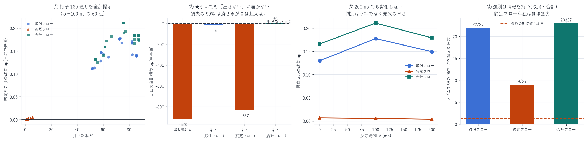

# 段階①: 前方取消フローによる「引き規則」のオフライン検証

対象: 2026-07-14 〜 08-09(27 日。08-10 は `queue_qi` 破損のため除外)
標本: 最良気配に置いた注文のうち、前に注文があり、それが約定前に消えたもの 163,510 件
格子: 3 シグナル × 4 窓 × 5 閾値 × 3 反応時間 = 180 通り(全件を報告)
作成日: 2026-08-15

---

## 0. 結論 — 規則は機能するが、「そもそも出さない」に勝てない

| | 1 日の合計損益(中央値) | 0 を上回った日 |
|---|---|---|
| 出し続ける | −922.9 bp | 3 / 27 |
| 引く(最良の合計フロー規則) | +4.6 bp | 14 / 27(符号検定 p = 0.50) |
| 引く(最良の取消フロー規則) | −16.5 bp | 10 / 27(p = 0.94) |
| そもそも出さない | 0.0 bp(定義) | — |

規則は損失の 99.5% を消すが、ゼロを統計的に超えられない。

1 約定あたりでは明確に効いている(改善 +0.18 bp、25/27 日で正、ランダム対照を 22/27 日で突破)。
しかし引いた率が 73% で、しかも母集団そのものが赤字(−0.206 bp、24/27 日)なので、
最善手は「この局面では最良気配に置かない」という結論になる。



---

## 1. 検証したもの

### 1-1. 規則

```
シグナル  flow(t, N) = Σ_{a ∈ A} (a が (t−N, t] に消えた数量)
          signal(t)  = flow(t, N) / q_ahead_open
判定      signal(t) > 閾値 で発火 → 取消が板に届くのは t + δ
          t + δ < t_fill なら約定を回避できたとする
```

`A` = 発注時 `t0` に自分より前に並んでいた注文の集合。
「前の行列の何割が直近 N ミリ秒で消えたか」を表す。

### 1-2. 3 種のシグナル(これが機構の検定になる)

| シグナル | 中身 |
|---|---|
| cancel | 前の注文が取消で消えた数量(本命) |
| exec | 前の注文が約定で消えた数量 |
| total | 両方の合計 |

`queue_clearing_report.md` の解釈(「取消そのものが情報」)が正しければ、
cancel だけが効くはずである。「前で何か起きたら危ない」という一般論なら 3 種とも効く。

### 1-3. 時間契約(CLAUDE.md 厳禁事項)

| 箇所 | 措置 |
|---|---|
| 前方集合 `A` | 発注時点で確定。以降変えない |
| 窓 | `(t−N, t]` の後ろ向きのみ |
| 判定 | `t + δ < t_fill`。発火時刻が約定より δ 以上前でなければ回避不可 |
| δ の当て方 | `margin = t_fill − t_trigger` を保存し事後に適用。再計算不要 |

未来の情報は構造的に入らない。

---

## 2. 用いた検定手法(9 つ・すべて事前に決めた)

| # | 手法 | 何のために |
|---|---|---|
| 1 | 推論の単位を「日」にする | 1 秒観測の実効標本は n/14(`regression_report.md` §9 T5)。プールした t 統計量は使わない |
| 2 | 符号検定(二項検定) | 分布の仮定を置かない |
| 3 | ブロック・ブートストラップ(長さ 2 日 × 5,000 回) | 日次系列の自己相関を壊さずに 95% CI と p(≤0) |
| 4 | ★ランダム対照(解析解) | 下記 §2-1 |
| 5 | ★シグナル対照 | 3 種のフローを同一手順で比較。機構の解釈を検定にかける |
| 6 | 全格子を報告 | 180 通り。良い組合せだけを拾わない |
| 7 | ★標本外の方策選択 | k 日目の組合せを 1〜k−1 日だけで選び k 日目で評価 |
| 8 | ★総額でも評価 | 下記 §2-2 |
| 9 | ★引いた率を揃えた比較 | シグナル間で引いた率が違うと不公平 |

### 2-1. ランダム対照を解析解で出した(手法 4)

「単に約定数を減らせば平均が動く」可能性を排除する必要がある。
同じ日に同じ件数 k を無作為に引いた場合の「残った約定の平均」の分布は、
有限母集団からの非復元抽出の理論値で厳密に出せる。

```
E[S_k] = k·μ
Var[S_k] = k·σ² · (n−k)/(n−1)          ← 有限母集団修正
残りの平均 = (S − S_k)/(n−k) ,  E = μ
z = (rule_mean − μ) / ( √Var[S_k] / (n−k) )
```

モンテカルロではなく解析解なので抽出誤差がない。
当初 1,000 回のモンテカルロで実装したが、180 セル × 27 日で計算量が破綻したため
解析解に置き換えた。統計的にもこちらが正しい。

### 2-2. 総額でも評価した理由(手法 8)

`fill_prob_backtest_report.md` で「単価は 68% 改善するが約定機会を 38% 失うので
総額は 8.5% 減る」という落とし穴を既に踏んでいる。
1 約定あたりの改善(lift)だけを見ると「引きまくって単価を上げた」方策が必ず勝つ。
そこで 1 日の合計損益 = Σ net(引かなかった約定) を必ず併記し、
ランダム対照も総額で行った。

さらに『そもそも出さない』(総額 0)を対照に加えた。
母集団の平均が負である以上、これが最も強い代替案になりうるためである。

---

## 3. 結果

### 3-1. 1 約定あたり(δ = 100ms、lift の日次中央値で最良セルを選択)

| シグナル | 窓 | 閾値 | 引いた率 | 改善 lift | 正の日 | 符号検定 p | 95% CI | ランダム超え |
|---|---|---|---|---|---|---|---|---|
| cancel | 100ms | 0.50 | 73.3% | +0.1778 | 25/27 | <0.0001 | [+0.125, +0.196] | 22/27 |
| exec | 10ms | 0.10 | 5.7% | +0.0053 | 17/27 | 0.124 | [−0.004, +0.012] | 9/27 |
| total | 10ms | 0.50 | 75.6% | +0.2112 | 25/27 | <0.0001 | [+0.153, +0.242] | 23/27 |

- ランダム対照を突破している。偶然なら 27 日 × 5% = 1.35 日のはずが、22〜23 日。
  選別は確かに情報を持っている
- `exec` 単独はほぼ無力(+0.0053、17/27 日、p=0.124、ランダム超え 9/27)

### 3-2. ★機構の検定 — 解釈は部分的にしか支持されない

引いた率を揃えて比較すると:

| 引いた率 | cancel | exec | total |
|---|---|---|---|
| ≈ 50% | +0.1118(実 52%) | +0.0053(実 6%) | +0.1321(実 54%) |
| ≈ 80% | +0.1669(実 82%) | +0.0053(実 6%) | +0.1933(実 77%) |

- `exec` 単独が無力なので、取消成分は必要である(解釈と整合)
- しかし `total` が `cancel` を一貫して上回る。
  「取消だけが情報」という単純な解釈では説明できない

もっともらしい理由: `total` は取消量と約定量の合計なので閾値に早く到達する。
判別力の源が「水準」ではなく「発火の早さ(δ 以上前に発火できるか)」にあるなら、
早く発火するシグナルが有利になる。§3-3 の δ 依存性がこれを裏づける。

> 判定: 「取消は情報」という解釈は必要条件としては支持されるが、十分ではない。
> `total` が勝つ理由は機構というより発火タイミングの可能性が高い。

### 3-3. 反応時間 δ への頑健性

| δ | 最良の窓 / 閾値 | 引いた率 | 改善 | 正の日 |
|---|---|---|---|---|
| 0 ms | 500ms / 0.75 | 70.0% | +0.1298 | 24/27 |
| 100 ms | 100ms / 0.50 | 73.3% | +0.1778 | 25/27 |
| 200 ms | 10ms / 0.50 | 64.4% | +0.1494 | 25/27 |

200ms でも劣化しない。δ=0 が最良でないのは、
判別力が「水準」でなく「発火が約定より十分前に来るか」に依存するためと考えられる。
`cancel_latency_report.md` の「200ms までなら選別の利益は残る」と整合する。

### 3-4. 全格子(cancel、δ=100ms)

| 窓 \ 閾値 | 0.10 | 0.25 | 0.50 | 0.75 | 0.90 |
|---|---|---|---|---|---|
| 10ms | +0.1408 (25/27) | +0.1669 (26/27) | +0.1759 (25/27) | +0.1467 (25/27) | +0.1118 (24/27) |
| 50ms | +0.1408 (25/27) | +0.1707 (26/27) | +0.1759 (25/27) | +0.1467 (25/27) | +0.1118 (24/27) |
| 100ms | +0.1385 (25/27) | +0.1681 (26/27) | +0.1778 (25/27) | +0.1430 (25/27) | +0.1130 (24/27) |
| 500ms | +0.1389 (25/27) | +0.1420 (26/27) | +0.1676 (26/27) | +0.1365 (25/27) | +0.1282 (25/27) |

20 セルすべてで正、24〜26/27 日で正。特定の組合せを引き当てたのではない。
窓長にほとんど依存しないことも読み取れる(10ms と 50ms がほぼ同一)。

### 3-5. 標本外の方策選択(24 日)

| | 値 |
|---|---|
| 過去だけで選んだ組合せの当日 lift | +0.1788(中央値) |
| 正だった日 | 22 / 24(符号検定 p < 0.0001) |
| 95% CI | [+0.146, +0.297] |
| 全期間を見て選んだ最良 | +0.2112 |
| 選択バイアス | +0.0324(15%) |
| 選ばれた組合せ | `total\|10ms\|0.1\|δ100` × 22 日 / `total\|500ms\|0.1\|δ200` × 2 日 |

方策選択の手続き自体は破綻していない。選択バイアスは 15%。

### 3-6. ★総額での評価 — ここで結論が変わる

| | 1 日の合計損益(中央値) | 0 を上回った日 | 符号検定 p |
|---|---|---|---|
| 出し続ける | −922.9 bp | 3/27 | — |
| 引く(total、窓 10ms、閾値 0.10、引いた率 87.6%) | +4.6 bp | 14/27 | 0.50 |
| 引く(cancel、窓 10ms、閾値 0.10、引いた率 85.7%) | −16.5 bp | 10/27 | 0.94 |
| そもそも出さない | 0.0 bp | — | — |

規則は損失の 99.5% を消す(−922.9 → +4.6)が、0 を統計的に超えない。
14/27 日はコイン投げと区別できない。

---

## 4. なぜこうなるのか — シグナルの構造的な限界

自分が約定するには、前の行列がほぼ全部消えている必要がある。
したがって「前の行列が消えた」というシグナルは、
約定した注文についてはほぼ必ず発火する(引いた率 73〜88%)。

つまりこのシグナルの判別力は「発火したか」ではなく、
「発火が約定より δ 以上前だったか」という時間差だけから来ている。

- 行列が消えた直後に約定が来る場合 → 回避できない
- 行列が消えてから間があって約定が来る場合 → 回避できる

そして後者のほうが損益が悪い。これが lift の正体である。

この構造ゆえに、閾値を上げても選択的にならない(閾値 0.90 でも引いた率は 52% を下回らない)。
「たまに引く」規則にはできず、「ほとんど引く」規則にしかならない。

---

## 5. 何が言えて、何が言えないか

### 言えること

1. 前方フローの選別は情報を持つ。ランダム対照を 22〜23/27 日で突破(偶然なら 1.35 日)
2. 1 約定あたり +0.18 bp の改善は、25/27 日・20 セル全部・標本外選択でも一貫している
3. 反応時間 200ms でも劣化しない。実装可能な範囲に収まる
4. `exec` 単独は無力。取消成分が判別の中心である
5. この母集団(最良気配・前に行列あり)は赤字(−0.206 bp、24/27 日)

### 言えないこと

1. 「この規則で儲かる」とは言えない。総額で「出さない」を超えられない(14/27 日、p=0.50)
2. 「取消は情報」という機構は証明されていない。`total` が `cancel` を上回るため、
   発火タイミングの効果と区別できていない
3. 選択的な運用はできない。構造上、引いた率を 50% 未満にできない

---

## 6. 限界

| 項目 | 内容 |
|---|---|
| 母集団が狭い | 最良気配 × 前に行列あり × それが約定前に消えた、の 16.4 万件。<br>先頭の注文(監視対象なし)と気配改善は対象外 |
| 再参入を数えていない | 引いた後に出し直して別の約定を捉える機会は未計上(過小評価側) |
| 自分の存在の影響 | 他者の注文の約定を数えている。自分が居ることで行列の挙動は変わる |
| 取消が必ず通る前提 | 取消の拒否・レート制限・API 障害は未考慮(楽観側) |
| 1 秒地平の損益 | 在庫を 1 秒で落とせる前提 |
| 単一銘柄・27 日 | DRAM は HIP-3 の小型市場 |

---

## 7. 次にやるべきこと

段階①の判定は 「規則は機能するが、この使い方では儲からない」。
資金を投じる段階②へ進む前に、オフラインでやるべきことが残っている。

1. 母集団を変える。この検証が示したのは「最良気配で行列の後ろに付くな」であって
   「シグナルが無効」ではない。`queue_clearing_report.md` §4 の 2 元表では
   深い行列(100 超)はどの消え方でも黒字だった。そちらを母集団にして再検証する
2. 気配改善と組み合わせる。`gate_optimization_report.md` で唯一確立した施策は
   「内側に置く」(+1,521〜2,162 bp/日)。そこに本規則を乗せる
3. `backtester_v2` に統合する。本検証は「他者の約定を数える」観察研究であり、
   自己整合的なシミュレーションではない。再参入も含めた総額はそちらでないと出せない
4. 発火タイミング仮説を直接検定する。`total` が勝つ理由が発火の早さなら、
   発火時刻を揃えた比較で差が消えるはずである

---

## 8. 成果物

```
data/pull_rule/YYYY-MM-DD.npz    注文単位(margin[3×4×5], net, gross, adv, q_ahead, at_best)
data/pull_rule_eval.json         180 セルの全結果・標本外選択・総額評価
scripts/pull_rule.py             日次処理(margin を保存するので δ は事後に当てられる)
scripts/pull_rule_eval.py        統計的評価(手法 1〜9)
scripts/pull_rule_chart.py       図 37
```

```bash
uv run python scripts/pull_rule.py 2026-07-14 ... 2026-08-10   # 約 20 分
uv run python scripts/pull_rule_eval.py                        # 約 3 分
uv run python scripts/pull_rule_chart.py
```

---

AWS 費用: 既存データのみで完結(追加 egress なし)。
EC2 \$25.05 | S3 ≈\$1.50 | 累計 ≈\$26.55 / 予算 \$60(EC2 は停止中)
