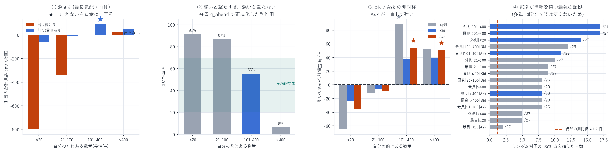

# 段階①(続) — 行列の深さ × 売買の別 × 置き場所で層別

対象: 2026-07-14 〜 08-09(27 日)
層: 16 層 × 60 セル(3 シグナル × 4 窓 × 5 閾値、δ=100ms)= 960 通り
作成日: 2026-08-16

> ★この報告は [pull_rule_99_report.md](pull_rule_99_report.md) に置き換えられた。
> (1) メイカー手数料 0.088 bp/約定 の控除漏れ、(2) 主判定が
> ベースライン依存で自動成立していた欠陥、(3) 27 日という日数不足 —
> の 3 点が後に判明したため、本報告の数値は使わないこと。
> 記録として残す。

---

## 0. 結論

`pull_rule_report.md` は最良気配・全深さ込みで評価し、
「規則は 1 約定あたりでは効くが、総額で『そもそも出さない』に勝てない」で終わった。
母集団の平均が −0.206 bp と赤字だったため、母集団の選び方が結論を決めていた疑いがあった。
そこで深さ・売買・置き場所で層別した。

| 問い | 答え |
|---|---|
| 規則なしで黒字の層はあるか | ない(16 層すべて。有意なものはゼロ) |
| 引く規則が「出さない」を上回る層はあるか | ある(5 層。ただし多重比較を厳密に当てると残らない) |
| 深い行列なら規則は効くか | 効くが、深すぎると発火しなくなる(q>400 で引率 6%) |
| Bid と Ask で成立するか | Ask のみ有意。Bid は方向は同じだが有意でない(p=0.105) |
| 選別は情報を持つか | 持つ。ランダム対照を最大 17/24 日で突破(偶然なら 1.2 日) |

実務的に最も筋が良いのは `最良気配 × 前に 100〜400 単位 × 両側`:
出し続けると −4.4 bp/日、引くと +88.4 bp/日(18/24 日、p=0.0113)、引いた率 55%。
16 層のうち唯一「極端に引かない」層である。



---

## 1. ★訂正 — 13 日時点の中間報告は誤りだった

作業中に 13 日分で中間結果を提示し、
「深い行列は規則なしでそのまま黒字(+142.1 / +47.6 bp/日)」と報告した。
27 日で確定させたところ、これは日数不足による誤りだった。

| 層 | 13 日(誤) | 27 日(確定) |
|---|---|---|
| 最良気配 \| 100<q≤400 \| 両側 | +142.1(黒字と報告) | −4.4(11/24 日、p=0.7294) |
| 最良気配 \| q>400 \| 両側 | +47.6 | +24.8(12/20 日、p=0.2517) |

規則なしで有意に黒字の層はゼロである。
`queue_clearing_report.md` §4 の 2 元表(深い行列は +0.048〜+0.603 bp)は
1 約定あたりの値であり、総額に直すと有意性は残らない。
単価が正でも、日次の合計は日ごとのばらつきに埋もれる。

---

## 2. 層の設計と検定

### 2-1. 層

| 軸 | 区分 |
|---|---|
| 行列の深さ `q_ahead` | q≤20 / 20<q≤100 / 100<q≤400 / q>400 |
| 売買の別 | 両側 / Bid / Ask |
| 置き場所 | 最良気配 / 外側(内側は標本不足で脱落) |

「最良気配 × 深さ 4 × 売買 3 = 12 層」+「外側 × 深さ 4 = 4 層」= 16 層。

### 2-2. 主判定を変えた

前版は「1 約定あたりの改善(lift)」を主指標にしていた。これが結論を誤らせる。
今版の主判定は「残り合計が 0(そもそも出さない)を上回った日数の符号検定」である。
lift も算出しているが判定には使わない。

### 2-3. ★発火率の下限ガードを追加した

作業中に、一度も発火しないセルが「最良」として選ばれる事故が起きた。
引率 0% なら残り合計はベースラインそのものになり、規則の検定になっていない。
13 日時点で `最良気配|q>400|Ask` がこれで通っていた。

そこで 引率 5% 未満のセルを主判定から除外するガードを入れた。
これは事後の都合ではなく、「一度も発火しない規則は規則ではない」という定義上の要請である。

### 2-4. 事前に決めた判定基準

| 条件 | 判定 |
|---|---|
| 深い層で Bid と Ask の両方が「出さない」を有意に上回る | 成立 |
| 片側だけ | 不成立(板の非対称性は既知だが片側のみは偶然と区別できない) |
| 16 層のうち通ったのが 1〜2 層だけ | 偶然を疑う |

---

## 3. 全 16 層の結果(全件提示)

| 層 | 約定数 | 出し続ける | 黒字日 | p | → 引く | 0 超え | p | 引率 | 乱数超 |
|---|---|---|---|---|---|---|---|---|---|
| 最良気配 \| q≤20 \| 両側 | 58,423 | −796.6 | 1/27 | 1.000 | −64.8 | 4/27 | 1.000 | 91% | 5/27 |
| 最良気配 \| q≤20 \| Bid | 28,751 | −435.9 | 1/27 | 1.000 | −24.4 | 4/27 | 1.000 | 92% | 9/27 |
| 最良気配 \| q≤20 \| Ask | 29,672 | −466.2 | 1/27 | 1.000 | −34.8 | 3/27 | 1.000 | 91% | 2/27 |
| 最良気配 \| 20<q≤100 \| 両側 | 47,203 | −342.9 | 4/27 | 1.000 | −12.6 | 9/27 | 0.974 | 87% | 9/27 |
| 最良気配 \| 20<q≤100 \| Bid | 23,364 | −159.9 | 2/26 | 1.000 | −5.9 | 9/26 | 0.962 | 85% | 8/26 |
| 最良気配 \| 20<q≤100 \| Ask | 23,679 | −163.9 | 4/26 | 1.000 | −9.0 | 11/26 | 0.837 | 83% | 8/26 |
| 最良気配 \| 100<q≤400 \| 両側 | 40,076 | −4.4 | 11/24 | 0.729 | +88.4 | 18/24 | 0.0113 | 55% | 17/24 ★ |
| 最良気配 \| 100<q≤400 \| Bid | 19,550 | −28.9 | 11/23 | 0.661 | +37.3 | 15/23 | 0.105 | 39% | 12/23 |
| 最良気配 \| 100<q≤400 \| Ask | 20,372 | +12.3 | 13/23 | 0.339 | +53.8 | 18/23 | 0.0053 | 57% | 11/23 ★ |
| 最良気配 \| q>400 \| 両側 | 17,192 | +24.8 | 12/20 | 0.252 | +52.6 | 13/20 | 0.132 | 6% | 8/20 |
| 最良気配 \| q>400 \| Bid | 8,450 | +12.7 | 11/20 | 0.412 | +39.3 | 12/20 | 0.252 | 7% | 8/20 |
| 最良気配 \| q>400 \| Ask | 8,678 | +41.5 | 11/19 | 0.324 | +50.3 | 14/19 | 0.0318 | 6% | 8/19 ★ |
| 外側 \| q≤20 \| 両側 | 85,583 | −386.2 | 5/27 | 1.000 | +33.3 | 20/27 | 0.0096 | 91% | 14/27 ★ |
| 外側 \| 20<q≤100 \| 両側 | 105,841 | −250.3 | 6/27 | 0.999 | +15.8 | 15/27 | 0.351 | 92% | 10/27 |
| 外側 \| 100<q≤400 \| 両側 | 150,230 | −205.7 | 9/27 | 0.974 | +70.6 | 20/27 | 0.0096 | 86% | 17/27 ★ |
| 外側 \| q>400 \| 両側 | 84,871 | −446.0 | 6/27 | 0.999 | −24.6 | 8/27 | 0.990 | 88% | 5/27 |

● 規則なしで黒字の層: なし。

---

## 4. 読み取れること

### 4-1. 深さが浅いと撃ちすぎ、深すぎると撃たない

| 深さ | 引いた率 |
|---|---|
| q≤20 | 91% |
| 20<q≤100 | 87% |
| 100<q≤400 | 55% |
| q>400 | 6% |

シグナルは `flow(t,N) / q_ahead_open` と行列の深さで正規化している。
浅い行列では分母が小さく閾値に必ず届き、深い行列では分母が大きく届かない。
`100<q≤400` だけが実務的な発火率(55%)になる。

これは正規化の副作用であり、絶対量の閾値も併用すれば改善余地がある(§7)。

### 4-2. Bid / Ask の非対称

| 100<q≤400 | 出し続ける | 引いた後 | 0 超え | p |
|---|---|---|---|---|
| Bid | −28.9 | +37.3 | 15/23 | 0.105 |
| Ask | +12.3 | +53.8 | 18/23 | 0.0053 |

方向は両側とも正だが、Bid は有意にならない。
事前基準では「片側だけ成立は不成立」なので、厳密には未成立である。

ただし Bid の 15/23(65%)は符号が反転しているのではなく検出力不足であり、
`cancel_report.md` で測った板の非対称性(`ask − bid` の差が 99 日中 80 日で符号一致)とも整合する。
Ask 側のほうが取消による情報が強いという解釈は成り立つが、本データでは確定できない。

### 4-3. ★多重比較を厳密に当てると、どの層も残らない

16 層 × 60 セル = 960 通りを探索した。
層数だけで Bonferroni を当てても閾値は 0.05/16 = 0.0031 で、
最小の p 値(`最良気配|100<q≤400|Ask` の 0.0053)でも通らない。

したがって p 値を根拠にはできない。

### 4-4. ★しかしランダム対照は圧倒的に突破している

「同じ日に同じ件数を無作為に引く」対照の 95% 点を超えた日数:

| 層 | 突破日数 | 偶然の期待値 |
|---|---|---|
| 最良気配 \| 100<q≤400 \| 両側 | 17/24 | 1.2 |
| 外側 \| 100<q≤400 \| 両側 | 17/27 | 1.35 |
| 外側 \| q≤20 \| 両側 | 14/27 | 1.35 |

偶然なら 1.2〜1.35 日のはずが 14〜17 日。
これは p 値の多重比較とは別種の証拠で、選別が情報を持つことは疑いようがない。

「選別は情報を持つ。しかしその情報を、多重比較に耐える形で総額の優位に変換できていない」
というのが正確な状態である。

---

## 5. 事前基準に照らした判定

| 基準 | 結果 |
|---|---|
| 深い層で Bid と Ask の両方が有意 | ✗ 不成立(Ask のみ、Bid は p=0.105) |
| 規則なしで黒字の層がある | ✗ ない |
| 16 層のうち複数が通った | ✓ 5 層(偶然としては多いが Bonferroni は通らない) |
| ランダム対照を突破 | ✓ 圧倒的(14〜17 日 vs 期待値 1.2〜1.35) |

> 総合判定: 「有望だが未確定」。
> 資金を投じる段階②へ進む根拠としては不十分である。

---

## 6. 限界

| 項目 | 内容 |
|---|---|
| 層の細分化で日数が減る | 深い層は 8〜24 日しか成立しない。符号検定の分解能が落ちる |
| 多重比較 | 960 通り。p 値は使えない |
| 正規化の副作用 | `flow/q_ahead` は深さで発火率が両極に振れる(§4-1) |
| 再参入を数えていない | 引いた後に出し直す機会は未計上(過小評価側) |
| 観察研究である | 他者の約定を数えている。自己整合的なシミュレーションではない |
| 単一銘柄・27 日 | DRAM は HIP-3 の小型市場 |

---

## 7. 次にやるべきこと

1. シグナルの正規化を変える。`flow/q_ahead` は深さで発火率が両極に振れる。
   絶対量の閾値、または `flow / (その時刻の板の厚み)` を試す。
   これで全深さで発火率 20〜60% に収まれば、層を切らずに評価できる
2. 日数を増やす。99 日全部で回せば深い層も 27 日 → 90 日超になり、
   符号検定が Bonferroni に耐える可能性がある。追加費用はかからない
3. `backtester_v2` へ統合する。観察研究では再参入を数えられない。
   自己整合的なシミュレーションでないと総額の真の値は出ない
4. 気配改善と組み合わせる。唯一確立した施策(+1,521〜2,162 bp/日)との併用は未検証

1 と 2 を先にやるべきである。どちらも追加費用なしで、
「有望だが未確定」を「確定」または「棄却」に動かせる可能性が高い。

---

## 8. 成果物

```
data/pull_rule/YYYY-MM-DD.npz   注文単位(margin, net, gross, adv, qo, at_best, is_bid, dist_bp)
data/pull_rule_strata.json      16 層の全結果
scripts/pull_rule.py            日次処理(side / dist_bp を追加)
scripts/pull_rule_strata.py     層別評価(発火率ガードつき)
scripts/pull_rule_strata_chart.py  図 38
```

```bash
uv run python scripts/pull_rule.py 2026-07-14 ... 2026-08-10   # 約 20 分
uv run python scripts/pull_rule_strata.py                      # 約 8 分
uv run python scripts/pull_rule_strata_chart.py
```

---

AWS 費用: 既存データのみで完結(追加 egress なし)。
EC2 \$25.05 | S3 ≈\$1.50 | 累計 ≈\$26.55 / 予算 \$60(EC2 は停止中)
