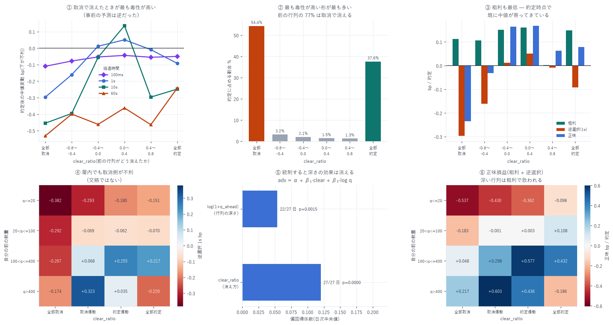

# 前の行列は「約定で消えたか / 取消で消えたか」— 逆選択と期待損益の関係

対象: 2026-07-14 〜 08-09(27 日。08-10 は除外、理由は §6)
標本: メイカー約定のうち前に注文があったもの 103 万 2,880 件
作成日: 2026-08-15

> ★訂正(2026-08-16)— メイカー手数料の控除漏れ
> 当初 `net = gross + adv` で 0.088 bp/約定 のメイカー手数料を控除していなかった。
> 本報告の「正味」列はすべて控除後の値に差し替えた。
> 手数料は約定のたびに払うので約定回数の多い層ほど削られる。
> 経緯と全体への影響は [pull_rule_99_report.md](pull_rule_99_report.md) §1 を参照。

---

## 0. 結論 — 予想はまた外れ、しかも逆方向だった

`queue_position_report.md` で見つけたキュー順位の非単調性の機構を突き止めるために、
自分の前の行列がどう消えたかを注文単位で追った。

```
exec_vol    = 前の注文が t0 < ts ≤ t_f に約定した数量
cancel_vol  = 前の注文が t_f までに消滅した分のうち約定しなかった数量
clear_ratio = (exec_vol − cancel_vol) / (exec_vol + cancel_vol)   ∈ [−1, +1]
```

事前の予測: `clear_ratio ≈ +1`(大口が板を食い破った)は
「自分は掃きの一部として約定した」ことを意味するので強く逆選択されるはず。

| | 予測 | 実測(逆選択 1s) | 判定 |
|---|---|---|---|
| 全部取消(`clear_ratio < −0.8`) | 無害なはず | −0.296 bp | 27/27 日で負(p<0.0001) |
| 全部約定(`clear_ratio > +0.8`) | 強く不利なはず | −0.092 bp | 22/27 日で負(p=0.0015) |

逆だった。「前が取消で消えた後の約定」のほうが 3.2 倍毒性が高い。

そしてこの形が最も多い — 前の行列の 77.2% は取消で消えており、
`clear_ratio < −0.8` が約定全体の 62.9% を占める。



---

## 1. なぜそうなるのか(解釈)

前に並んでいたメイカーが取消して逃げた直後に自分が約定したなら、それは

> 彼らは何かを察知して引いた。自分だけ気づかずに残っていた。

という状況である。取消そのものが情報であり、逃げ遅れた者が掴まされる。
一方、掃きによる約定は「誰かが大きさを執行したかった」だけかもしれず、
単位あたりの毒性は低い。

この解釈を裏づける独立の証拠が粗利にある。

| clear_ratio | 粗利 | 逆選択 1s | 正味 1s |
|---|---|---|---|
| 全部取消 | 0.112 | −0.296 | −0.323 |
| −0.8〜−0.4 | 0.107 | −0.160 | −0.119 |
| −0.4〜0.0 | 0.152 | +0.012 | +0.077 |
| 0.0〜0.4 | 0.160 | +0.051 | +0.081 |
| 0.4〜0.8 | 0.003 | −0.009 | −0.025 |
| 全部約定 | 0.150 | −0.092 | −0.010 |

粗利 = `s × (mid(t_f) − 約定価格) / mid` は約定した瞬間の中値との差である。
全部取消のとき粗利が最低(0.112)ということは、
約定した時点で既に中値が自分の価格まで寄ってきていたことを意味する。
つまり前のメイカーが引いた時点で、価格はもう動き始めていた。

手数料控除後は、全部取消が −0.323 bp と突出して悪く、中間の 2 区分(+0.077 / +0.081)以外はすべて赤字になる。

---

## 2. 逆選択が現れる時間スケール

| clear_ratio | 100ms | 1s | 10s | 60s |
|---|---|---|---|---|
| 全部取消 | −0.109 | −0.296 | −0.454 | −0.531 |
| −0.8〜−0.4 | −0.077 | −0.160 | −0.395 | −0.399 |
| −0.4〜0.0 | −0.053 | +0.012 | −0.055 | −0.461 |
| 0.0〜0.4 | −0.043 | +0.051 | +0.136 | −0.362 |
| 0.4〜0.8 | −0.055 | −0.009 | −0.296 | −0.463 |
| 全部約定 | −0.050 | −0.092 | −0.248 | −0.242 |

- 100ms ではほぼ差がない(−0.043 〜 −0.109)。判別は 1 秒スケールで立ち上がる
- 60 秒まで持てば全区分が負。この優劣は 1〜10 秒の窓の話である

---

## 3. ★交絡の切り分け — `clear_ratio` は `q_ahead` の言い換えか

`clear_ratio` と行列の深さ `q_ahead` は相関する
(小さい行列は 1 回の約定で消えやすく、大きい行列は取消で消えやすい)。
前報告で `q_ahead` 自体が逆選択と関係することが判っている以上、
`clear_ratio` の効果が `q_ahead` の言い換えである可能性を潰す必要がある。

### 【A】2 元表 — 逆選択 1s(日次中央値 bp、括弧は負だった日数)

| 前の数量 | 全部取消 | 取消優勢 | 約定優勢 | 全部約定 |
|---|---|---|---|---|
| q≤20 | −0.382 (27/27) | −0.293 (25/26) | −0.180 (21/24) | −0.151 (26/27) |
| 20<q≤100 | −0.292 (27/27) | −0.070 (17/22) | −0.062 (11/18) | −0.070 (16/27) |
| 100<q≤400 | −0.267 (25/26) | +0.068 (8/19) | +0.255 (1/16) | +0.217 (5/23) |
| q>400 | −0.174 (23/24) | +0.323 (6/17) | +0.035 (3/9) | −0.220 (14/20) |

全部取消の列は 4 層すべてで負、しかも符号一貫性が 23/24 〜 27/27 と圧倒的である。

### 【B】各深さ層での「全部取消 − 全部約定」

| 前の数量 | 差 |
|---|---|
| q≤20 | −0.231 |
| 20<q≤100 | −0.222 |
| 100<q≤400 | −0.484 |
| q>400 | +0.046 |

4 層中 3 層で負。深さを固定しても `clear_ratio` の効果は残る。

### 【C】各 clear_ratio 層での「浅い(q≤20)− 深い(q>400)」

| clear_ratio | 差 |
|---|---|
| 全部取消 | −0.208 |
| 取消優勢 | −0.616 |
| 約定優勢 | −0.216 |
| 全部約定 | +0.068 |

こちらも 4 層中 3 層で負。深さの効果も独立に存在する。

### 【D】偏回帰(連続値・バケット分割に依存しない検証)

日ごとに次を当てはめ、27 日の係数の中央値と符号一貫性を見る。

```
adv_1s = α + β₁·clear_ratio + β₂·log(1 + q_ahead)
```

| 係数 | 中央値 | 正の日 | 符号検定 p |
|---|---|---|---|
| β₁(clear_ratio) | +0.1202 | 27/27 | <0.0001 |
| β₂(log q_ahead) | +0.0536 | 22/27 | 0.0015 |

両方が有意だが、`clear_ratio` の効果は 2.2 倍大きく、符号一貫性も完全(27/27 対 22/27)。

> 判定: `clear_ratio` は `q_ahead` の言い換えではない。
> 両方が独立に効いており、主役は「どう消えたか」、脇役が「どれだけ深かったか」である。
> `queue_position_report.md` のキュー順位の非単調性は、
> 相当部分がこの「消え方」の代理として現れていたと解釈できる。

---

## 4. 正味損益の 2 元表 — 実務的な含意

| 前の数量 | 全部取消 | 取消優勢 | 約定優勢 | 全部約定 |
|---|---|---|---|---|
| q≤20 | −0.625 | −0.518 | −0.450 | −0.186 |
| 20<q≤100 | −0.271 | −0.089 | −0.085 | +0.020 |
| 100<q≤400 | −0.040 | +0.210 | +0.489 | +0.344 |
| q>400 | +0.129 | +0.515 | +0.348 | −0.274 |

- 浅い行列(q≤20)は全区分で赤字。最悪は「浅い × 全部取消」の −0.625 bp
- 深い行列(100 超)は取消優勢・約定優勢で黒字。ただし手数料控除で
  「100-400 × 全部取消」は +0.048 → −0.040 と符号が反転した
- 最良は「q>400 × 取消優勢」の +0.515 bp と「100-400 × 約定優勢」の +0.489 bp

---

## 5. ★この指標は予測に使えない

`clear_ratio` は `t0` から `t_f` までの情報で決まるため、発注時点では判らない。
「取消で消えたら不利」と判っても、それは約定した後に振り返って初めて計算できる。
したがってこれは機構を説明するための事後分解であって、
説明変数として回帰に入れてはならない(CLAUDE.md 厳禁事項 1 に抵触する)。

実務に翻訳するには、リアルタイムに観測できる代理指標が要る。具体的には:

> 発注後も自分の前の注文を追い続け、直近 N ミリ秒での取消量が閾値を超えたら自分も引く。

これは時刻 `t` で計算可能なので予測に使える。
`cancel_latency_report.md` で「100ms の反応時間があれば不利な約定の 76%・
損失額の 82% を回避できる」と測った枠組みに、そのまま乗る。
これが次の一手として最も筋が良い。

---

## 6. ★実装のバグと、データの欠陥を 1 件ずつ見つけた

### 6-1. 実装のバグ(整合性検査が捕まえた)

最初の実行で整合性検査が 46.7(1.0 であるべき)で失敗した。

> この市場には `ts_open == ts_close`(同一 ns で発注即取消)の注文が大量にある。
> 同時刻で「消滅を先に」処理していたため `pop` が空振りし、
> その注文が生存集合に永久に残り続けていた。前の行列が 8 倍(中央値 8 対 1)に膨張。

`build_queue_qi` と同じ「到着を先に」の規約へ直したところ 整合性 1.0000 になった。
検査を仕込んでいなければ、そのまま誤った結論を出していた。

整合性検査の定義: 自分が約定するには前がほぼ全部消えている必要があるので、
`exec_vol + cancel_vol` は独立計算の `q_ahead_open` と一致するはずである。

### 6-2. データの欠陥 — `queue_qi` の 2026-08-10 は使用不可

整合性検査が 2026-08-10 だけ 0.006 を示した。原因を追ったところ:

> `lifecycle` の `ts_close` に null がある日は、`build_queue_qi` の出力が壊れる。
> polars の `to_numpy()` が null を含む Int64 列に対し float64 を返すため、
> ns タイムスタンプ(~1.79e18)が 2^53 の 199 倍で精度を失い、隣接 ns が区別できなくなる。
> 到着/消滅のマージが破綻し、価格レベルの注文列が除去されずに膨張する。

実際 `q_ahead_open` の中央値は 08-10 が 7,947、前日は 7(1,135 倍)。

全 99 日を走査した結果、`ts_close` に null があるのは 2026-08-10 の 1 日だけ
(13,458 件)。データ窓の終端で結果が未確定な注文である。
したがって影響は当日に限定される。本報告および `queue_position_report.md` から
2026-08-10 を除外した。

他の成果物への影響

| 成果物 | 影響 |
|---|---|
| `queue_position_report.md` | 28 → 27 日に修正。結論は不変(§6-3) |
| `fill_prob_backtest_report.md` | 対象は 07-16〜08-09 で 08-10 を含まない。影響なし |
| `slope_model_report.md` | `panel_v2` の `q_ahead_new_bid/ask` が 08-10 だけ汚染。<br>ただし 91 日中 1 日・30 特徴量中 2 個で、当日の OOS R² は 0.0232<br>(全 28 日の p10=0.0202 / p90=0.0743 の範囲内)。外れ値ではなく影響は無視できる |

### 6-3. `queue_position_report.md` の数値訂正(結論は不変)

| 項目 | 28 日(旧) | 27 日(訂正後) |
|---|---|---|
| 約定確率 先頭 @最良気配 | 7.45% | 7.41% |
| 約定確率 q>1000 @最良気配 | 2.32% | 2.28% |
| 逆選択 先頭 | −0.088 | −0.087(23/27 日で負、p=0.0003) |
| 逆選択 0<q≤20 | −0.187 | −0.191(26/27 日、p<0.0001) |
| 逆選択 100<q≤400 | +0.218 | +0.220(19/26 日で正、p=0.029) |
| 逆選択 400<q≤1000 | +0.245 | +0.296(19/23 日、p=0.0026) |
| 逆選択 q>1000 | −0.134 | −0.141(17/21 日で負、p=0.0072) |

非単調性・交絡の棄却・待ち時間の知見はすべて変わらない。

### 6-4. 自分の報告の仕方の誤り

整合性を中央値だけで報告していたため、1 日の破綻(0.006)を見逃していた。
27 日が 1.000 なら中央値は 1.000 のままである。
最悪値(1.0 からの最大乖離)も併記するよう集計を修正した。
検査を作っても、集計の仕方で無効になりうる。

---

## 7. 限界

| 項目 | 内容 |
|---|---|
| 先頭の注文は対象外 | 前に何も並んでいない注文(全体の 35.3%)は定義上 `clear_ratio` を持たない |
| 予測に使えない | §5 のとおり事後分解である |
| 機構は解釈 | 「取消は情報」は係数の符号と粗利の低さと整合するが、直接証拠ではない。<br>取り消した主体の識別(ウォレット別)まで踏み込めば検証できる |
| `t_f` は最初の約定時刻 | 部分約定を複数回する注文は最初の 1 回で代表させている |
| 単一銘柄・27 日 | DRAM は HIP-3 の小型市場 |

---

## 8. 成果物

```
data/queue_clearing/YYYY-MM-DD.json   日次集計(整合性・区分別の逆選択/損益)
data/queue_clearing/YYYY-MM-DD.npy    注文単位の生データ(11 行 × 約定数)
                                       行: clear_ratio, q_ahead, exec, cancel, gross,
                                           at_best, adv100ms, adv1s, adv10s, adv60s, good
data/queue_clearing_summary.json      27 日の集計・日次推論・ブートストラップ
data/queue_clearing_cross.json        2 元表・偏回帰
scripts/queue_clearing.py             日次処理(整合性検査つき)
scripts/queue_clearing_summary.py     集計
scripts/queue_clearing_cross.py       交絡の切り分け
scripts/queue_clearing_chart.py       図 36
```

```bash
uv run python scripts/queue_clearing.py 2026-07-14 ... 2026-08-10   # 約 25 分
uv run python scripts/queue_clearing_summary.py
uv run python scripts/queue_clearing_cross.py
uv run python scripts/queue_clearing_chart.py
```

注文単位の `.npy` を保存してあるので、追加の交差集計は掃き直しなしで数秒で終わる。

---

AWS 費用: 既存データのみで完結(追加 egress なし)。
EC2 \$25.05 | S3 ≈\$1.50 | 累計 ≈\$26.55 / 予算 \$60(EC2 は停止中)
