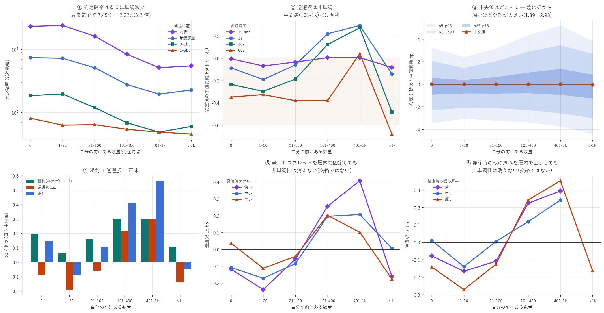

# キュー順位ごとの約定確率・約定後の価格変動・その分布

対象: 2026-07-14 〜 08-09(27 日)
標本: 注文 2 億 1,220 万件 / メイカー約定 335 万 6,795 件

> ★訂正(2026-08-15): 当初 28 日で集計していたが、2026-08-10 の `queue_qi` が壊れている
> ことが判明したため除外し、全数値を再計算した(経緯は
> [queue_clearing_report.md](queue_clearing_report.md) §6-2)。結論は変わらない。
作成日: 2026-08-15

> ★訂正(2026-08-16)— メイカー手数料の控除漏れ
> 当初 `net = gross + adv` で 0.088 bp/約定 のメイカー手数料を控除していなかった。
> 本報告の「正味」列はすべて控除後の値に差し替えた。
> 手数料は約定のたびに払うので約定回数の多い層ほど削られる。
> 経緯と全体への影響は [pull_rule_99_report.md](pull_rule_99_report.md) §1 を参照。

---

## 0. 結論 — 予想は外れた

問い: キューの先頭に居ることは、逆選択から守ってくれるのか。

事前の予想: 行列の最後尾は「板が薙ぎ払われるとき」しか約定が届かないので、
後ろほど不利になるはずである。

結果: 外れ。 逆選択はキュー順位に対して非単調で、
中間層(前に 100〜1000 単位)がむしろ有利だった。
交絡(板の厚み・スプレッド)を層内に固定しても消えない。

| | 約定確率 | 逆選択 1s | 判定 |
|---|---|---|---|
| 0(先頭) | 7.41% | −0.087 bp | 不利(23/27 日で負、p=0.0003) |
| 0<q≤20 | 7.25% | −0.191 bp | 不利(26/27 日、p<0.0001) |
| 20<q≤100 | 5.14% | −0.060 bp | 有意でない(p=0.122) |
| 100<q≤400 | 2.77% | +0.220 bp | 有利(19/26 日で正、p=0.029) |
| 400<q≤1000 | 1.97% | +0.296 bp | 有利(19/23 日、p=0.0026) |
| q>1000 | 2.28% | −0.141 bp | 不利(17/21 日で負、p=0.0072) |

約定確率は素直に単調減少するが、約定の「質」は単調ではない。



---

## 1. 測ったもの

メイカー約定 1 件あたり、bp:

```
粗利    gross = s × (mid(t) − px_fill) / mid(t) × 10⁴   … 約定した瞬間の実質半スプレッド
逆選択  adv   = s × (mid(t+Δ) − mid(t)) / mid(t) × 10⁴   … 約定後に中値がどう動いたか
正味    net   = gross + adv
s = +1(メイカーが買った) / −1(メイカーが売った)
```

`adv < 0` = 約定直後に価格が自分と逆へ動いた = 逆選択された。

### 時間契約

| 項目 | 措置 |
|---|---|
| キュー順位 | 発注時点の `q_ahead_open`。約定より前に確定している |
| 価格変動 | 約定時刻から前向きに測る(これは結果であって説明変数ではない) |
| 中値の参照 | backward asof のみ(`t+Δ` 以前の最後の中値) |
| クロス状態 | `is_crossed` を除外 |
| 右打ち切り | データ窓終端で結果不明な注文(2026-08-10 の 0.14%)は除外 |

### 交絡の処理

キュー順位と置き場所は交絡する。最良気配から 5bp 離れた注文はその価格帯で
先頭になりやすいが、約定確率は 10〜30 倍低い。そこで:

- 約定確率は キュー順位 × 距離(内側/最良気配/0-1bp/1-5bp)で層別
- 約定後の価格変動は最良気配に置いた注文だけに絞り、キュー順位だけを動かす

---

## 2. 【1】キュー順位ごとの約定確率

日次中央値。

| 自分の前の数量 | 内側(気配改善) | 最良気配 | 0-1bp 外 | 1-5bp 外 |
|---|---|---|---|---|
| 0(先頭) | 23.26% | 7.41% | 1.85% | 0.81% |
| 0<q≤20 | 24.10% | 7.25% | 1.97% | 0.63% |
| 20<q≤100 | 16.22% | 5.14% | 1.19% | 0.64% |
| 100<q≤400 | 8.37% | 2.77% | 0.69% | 0.54% |
| 400<q≤1000 | 5.16% | 1.97% | 0.49% | 0.49% |
| q>1000 | 5.50% | 2.28% | 0.60% | 0.45% |

- キュー順位の効果は 3.2 倍(最良気配で 7.41% → 2.28%)
- 置き場所の効果は 29 倍(内側 23.26% → 1-5bp 外 0.81%)
- どこに置くかのほうが、何番目に並ぶかより圧倒的に効く

内側(気配改善)で 23.26% は、`fill_prob_backtest_report.md` の実測 22.8% と整合する。

---

## 3. 【2】約定後の平均価格変動

最良気配に置いた注文のみ、日次中央値 bp。

| 前の数量 | 件数 | 粗利 | 逆選択 100ms | 逆選択 1s | 逆選択 10s | 逆選択 60s | 正味 1s | 不利率 1s |
|---|---|---|---|---|---|---|---|---|
| 0(先頭) | 970,643 | 0.197 | −0.005 | −0.087 | −0.235 | −0.349 | +0.058 | 47.7% |
| 0<q≤20 | 220,662 | 0.061 | −0.069 | −0.191 | −0.297 | −0.327 | −0.180 | 49.1% |
| 20<q≤100 | 171,967 | 0.159 | −0.034 | −0.060 | −0.187 | −0.381 | +0.016 | 47.5% |
| 100<q≤400 | 144,961 | 0.301 | +0.005 | +0.220 | +0.124 | −0.381 | +0.325 | 43.7% |
| 400<q≤1000 | 42,108 | 0.295 | +0.006 | +0.296 | +0.274 | +0.041 | +0.476 | 43.4% |
| q>1000 | 17,060 | 0.108 | −0.082 | −0.141 | −0.484 | −0.682 | −0.138 | 50.2% |

### 読み取れること

1. 100ms ではほとんど何も起きていない(−0.082 〜 +0.006)。
   逆選択は 1 秒スケールで顕在化する。
   これは `cancel_latency_report.md` の「警告時間の中央値 1,011ms」と整合する
2. 60 秒まで伸ばすとほぼ全バケットが負(400<q≤1000 の +0.041 以外)。
   中間層の優位は 1〜10 秒の窓に限られ、長く持てば誰も勝てない
3. 不利率(adv<0 の割合)は 43.4〜50.2% で、バケット間の差は小さい。
   平均の差は頻度ではなく大きさから来ている

### 統計的裏づけ(逆選択 1s)

| 前の数量 | 中央値 | 平均 | 負だった日 | 符号検定 p | 95% CI |
|---|---|---|---|---|---|
| 0(先頭) | −0.087 | −0.096 | 23/27 | 0.0003 | [−0.139, −0.059] |
| 0<q≤20 | −0.191 | −0.149 | 26/27 | <0.0001 | [−0.222, −0.096] |
| 20<q≤100 | −0.060 | −0.068 | 18/27 | 0.122 | [−0.108, −0.025] |
| 100<q≤400 | +0.220 | +0.188 | 7/26 | 0.029 | [+0.075, +0.317] |
| 400<q≤1000 | +0.296 | +0.288 | 4/23 | 0.0026 | [+0.116, +0.478] |
| q>1000 | −0.141 | −0.142 | 17/21 | 0.0072 | [−0.261, −0.012] |

符号検定でも成立している。少数日の外れ値が作った形ではない。

---

## 4. 【3】価格変動の分布

約定 1 秒後、最良気配、日次分位の中央値 bp。

| 前の数量 | p1 | p5 | p10 | p25 | p50 | p75 | p90 | p95 | p99 | 標準偏差 |
|---|---|---|---|---|---|---|---|---|---|---|
| 0(先頭) | −6.23 | −3.46 | −2.30 | −0.91 | 0.00 | 0.58 | 2.07 | 3.24 | 6.78 | 2.29 |
| 0<q≤20 | −5.86 | −3.05 | −2.07 | −0.79 | 0.00 | 0.39 | 1.46 | 2.41 | 4.82 | 1.88 |
| 20<q≤100 | −6.04 | −3.22 | −2.11 | −0.80 | 0.00 | 0.65 | 2.06 | 3.19 | 6.27 | 2.16 |
| 100<q≤400 | −6.32 | −3.37 | −2.28 | −0.78 | 0.00 | 1.04 | 2.90 | 4.35 | 7.91 | 2.53 |
| 400<q≤1000 | −7.32 | −3.71 | −2.56 | −0.93 | 0.00 | 1.37 | 3.46 | 5.21 | 10.45 | 3.00 |
| q>1000 | −7.15 | −4.42 | −2.98 | −1.25 | −0.05 | 0.86 | 2.71 | 3.83 | 7.57 | 2.80 |

### ★ここが本質 — 平均の差は「裾」から来ている

中央値はどのバケットも 0.00 である。 平均が正負に分かれるのは分布の非対称による。

- 深いキューほど分散が大きい(1.88 → 3.00、1.6 倍)。
  深い列で約定すると当たりも外れも大きい
- 100〜1000 は上側の裾が厚い(p75 が +1.04 / +1.37 に対し、先頭は +0.58)。
  下側(p25)はほぼ同じ −0.78 〜 −0.93 なので、上振れだけが伸びている
- q>1000 だけ中央値が負(−0.05)で p25 も最悪(−1.25)。
  巨大な壁の後ろは分布全体が下にずれる

平均だけを見ると「中間層が有利」だが、実態は「中間層は上振れが大きい」である。
分散も 1.6 倍なので、シャープレシオで見れば優位はかなり薄まる。

---

## 5. ★交絡の切り分け — 仮説を立て、棄却された

### 立てた仮説

`q_ahead` は「行列の順番」であると同時に発注時の板の厚みの代理でもある。
厚い板 = 穏やかな相場 = 逆選択が少ない、という経路がありうる。

> 仮説: これは構成効果である。スプレッド/厚みを層内に固定すれば非単調性は消える。

粗利がバケット間で 0.052 〜 0.296 bp と 6 倍動いていたことが、
バケットごとに異なる局面の約定を見ている疑いを裏づけていた。

### 各バケットは「どういう局面の約定」か

| 前の数量 | 発注時スプレッド | 発注時の厚み | 約定待ち(中央値) | 待ち(平均) |
|---|---|---|---|---|
| 0(先頭) | 1.090 | 360 | 0.34 s | 1.5 s |
| 0<q≤20 | 0.975 | 202 | 0.40 s | 1.4 s |
| 20<q≤100 | 0.906 | 280 | 0.39 s | 1.4 s |
| 100<q≤400 | 1.167 | 442 | 0.34 s | 1.3 s |
| 400<q≤1000 | 1.086 | 923 | 0.40 s | 1.9 s |
| q>1000 | 0.832 | 1635 | 0.49 s | 1.9 s |

★ここで別の重要な事実が出た。約定までの待ち時間がキューの深さでほとんど変わらない
(中央値 0.34 〜 0.49 秒)。

前に 1,635 単位ある注文が中央値 0.49 秒で約定する。
これが約定によって捌けているなら膨大な出来高が必要だが、そんな出来高はない。
つまり 自分の前の行列は、約定ではなく取消で蒸発している。

> この市場では「キュー順位」は伝統的な意味を持たない。
> 前に並ぶ注文の大半は瞬時に取り消される見せ玉的な注文であり、
> 順位を待つコストがほとんど発生しない。
> `cancel_report.md` で測った膨大な取消率と整合する。

同時に「長く待った注文だけを見ている生存バイアス」の説明も排除された
(待ち時間に差がないため)。

### 層別の結果 — 仮説は棄却

発注時スプレッドを層内に固定(日次中央値 bp、括弧内は正だった日数):

| 前の数量 | 狭い | 中 | 広い |
|---|---|---|---|
| 0(先頭) | −0.117 (1/27) | −0.108 (2/27) | +0.037 (15/27) |
| 0<q≤20 | −0.239 (1/27) | −0.172 (1/27) | −0.112 (1/27) |
| 20<q≤100 | −0.057 (9/27) | −0.085 (5/27) | −0.042 (10/27) |
| 100<q≤400 | +0.257 (20/25) | +0.197 (16/23) | +0.202 (18/24) |
| 400<q≤1000 | +0.407 (18/21) | +0.207 (14/20) | +0.102 (14/19) |
| q>1000 | −0.161 (5/20) | +0.006 (7/12) | −0.176 (5/14) |

発注時の板の厚みを層内に固定:

| 前の数量 | 薄い | 中 | 厚い |
|---|---|---|---|
| 0(先頭) | −0.078 (3/27) | +0.011 (16/27) | −0.141 (1/27) |
| 0<q≤20 | −0.166 (0/27) | −0.140 (2/27) | −0.271 (1/27) |
| 20<q≤100 | −0.108 (3/21) | +0.005 (13/26) | −0.126 (7/27) |
| 100<q≤400 | +0.224 (17/20) | +0.118 (14/22) | +0.243 (20/26) |
| 400<q≤1000 | +0.294 (4/6) | +0.242 (12/16) | +0.353 (18/22) |
| q>1000 | — | — | −0.162 (5/20) |

「中間層(101-400)− 先頭」の差:

| 層別の軸 | 層 1 | 層 2 | 層 3 |
|---|---|---|---|
| スプレッド | 狭 +0.374 | 中 +0.304 | 広 +0.165 |
| 厚み | 薄 +0.302 | 中 +0.108 | 厚 +0.384 |

6 層すべてで正。仮説は棄却する。
非単調性は板の厚みでもスプレッドでも説明されず、キュー順位そのものに紐づいている。

---

## 6. 発注 1 件あたりの期待値 — 差はほぼ消える

約定確率と約定単価は逆向きに動くので、発注 1 件あたりで見ると差が縮む。

| 前の数量 | P(約定) | 正味 / 約定 | 期待値 / 発注 |
|---|---|---|---|
| 0(先頭) | 7.41% | +0.058 | +0.00430 |
| 0<q≤20 | 7.25% | −0.180 | −0.01305 |
| 20<q≤100 | 5.14% | +0.016 | +0.00082 |
| 100<q≤400 | 2.77% | +0.325 | +0.00900 |
| 400<q≤1000 | 1.97% | +0.476 | +0.00938 |
| q>1000 | 2.28% | −0.138 | −0.00315 |

手数料控除後は中間層(+0.0090、+0.0094)が先頭(+0.0043)の 2 倍である。
中間層は「単価は良いが約定しない」、先頭は「単価は薄いがよく約定する」で釣り合っている。
均衡として自然な姿であり、`gate_optimization_report.md` で見た
「単価 × 回数のトレードオフ」がここでも成立している。

赤字は `0<q≤20`(−0.0131)と `q>1000`(−0.0032) で、この 2 つは
どちらの意味でも損をしている。

---

## 7. 何が言えるか

1. 約定確率はキュー順位に対して単調(最良気配で 3.2 倍)。
   ただし置き場所の効果(29 倍)のほうが圧倒的に大きい
2. 逆選択は非単調で、中間層(101〜1000)だけが有利。
   板の厚み・スプレッドで層別しても消えないので構成効果ではない
3. 平均の差は分布の裾から来ている。中央値はどこも 0 で、
   中間層は上側の裾が厚いだけ。分散も 1.6 倍なので優位は見た目ほど頑健でない
4. 逆選択は 1 秒スケールで顕在化する(100ms ではほぼゼロ)。
   60 秒まで持てば全バケットが負
5. この市場ではキューが約定でなく取消で蒸発する(前に 1,634 単位あっても
   中央値 0.5 秒で約定)。順位を待つコストがほとんど無い
6. 発注 1 件あたりの期待値で見ると先頭と中間層はほぼ同じ

---

## 8. 限界 — わかっていないこと

| 項目 | 内容 |
|---|---|
| 非単調性の機構が未解明 | 「なぜ中間層が有利か」を説明できていない。<br>交絡は 2 つ潰したが、機構の直接証拠はない |
| 前の行列がどう消えたか未測定 | 約定で消えたか取消で消えたかを注文単位で追えば機構が判る。<br>待ち時間から取消が主と推定しているだけで、直接測っていない |
| 自分の注文の影響 | 観測は他者の注文。自分が入ることで行列の挙動が変わる効果は未モデル化 |
| 分散を考慮した評価をしていない | 平均で比べている。分散が 1.6 倍違うので、<br>シャープレシオで比べれば中間層の優位はかなり縮むはず |
| `q_ahead` は数量ベース | 本数(`n_ahead`)での層別は本報告に含めていない |
| 単一銘柄・27 日 | DRAM は HIP-3 の小型市場。他銘柄で再現するかは未確認 |

---

## 9. 次にやること

1. ~~前の行列の消え方を測る~~ → 実施済み。
   [queue_clearing_report.md](queue_clearing_report.md) を参照。
   「取消で消えた後の約定」が最も毒性が高く(−0.296 bp、27/27 日)、
   偏回帰では `clear_ratio` の効果が `q_ahead` の 2.2 倍だった。
   本報告の非単調性は相当部分が「消え方」の代理として現れていた
2. シャープレシオで比較する — 平均 ÷ 標準偏差で見ると順位が変わるはず
3. `n_ahead`(本数)でも層別する — 数量と本数で結論が違うかを確認
4. バックテスタに反映する — `backtester_v2` は最良気配の最後尾に付く前提。
   本結果が正しければ、わざと中間の深さに置く方策を試す価値がある

---

## 10. 成果物

```
data/queue_adverse2/YYYY-MM-DD.json   日次の生集計(約定確率・価格変動・層別)
data/queue_adverse_summary.json       27 日の集計・日次推論・ブートストラップ
data/queue_confound.json              交絡の切り分け(層別・待ち時間・局面記述)
scripts/queue_adverse.py              日次処理
scripts/queue_adverse_summary.py      集計と統計的裏づけ
scripts/queue_adverse_confound.py     交絡の切り分け
scripts/queue_adverse_chart.py        図 35
```

```bash
uv run python scripts/queue_adverse.py 2026-07-14 ... 2026-08-10   # 約 25 分
#   集計は 2026-08-10 を除外する(EXCLUDE 定数。理由は queue_clearing_report.md §6-2)
uv run python scripts/queue_adverse_summary.py
uv run python scripts/queue_adverse_confound.py
uv run python scripts/queue_adverse_chart.py
```

---

AWS 費用: 既存データのみで完結(追加 egress なし)。
EC2 \$25.05 | S3 ≈\$1.50 | 累計 ≈\$26.55 / 予算 \$60(EC2 は停止中)
