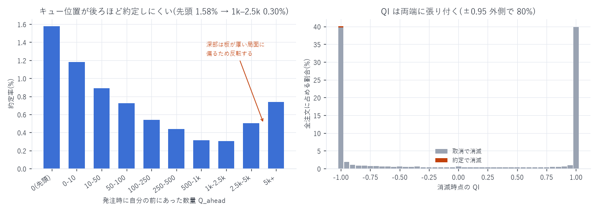

# QI — 注文のキュー内位置(L4 でしか作れない指標)

対象: `xyz:DRAM / USDC`(Hyperliquid HIP-3)、2026-05-04 〜 2026-08-10(99 日)
標本: 板に載った注文 343,703,060 件(うち約定 3,455,356 件 = 1.005%)
作成日: 2026-08-14

---

## 1. 定義

```
QI(o, t) = (Q_ahead − Q_behind) / (Q_ahead + Q_behind)

Q_ahead  : 注文 o と同じ (side, px) の板に並んでいて、o より先に到着した注文の残量合計
Q_behind : 同じ板で o より後に到着した注文の残量合計
```

価格・時間優先の板なので「先に到着した注文」= 自分より先に約定する注文。
個別注文の待ち行列内での位置を表し、板の集計量(`depth_one_level` / `OBI`)とは別物である。

各注文について 2 時点で算出した。

| 時点 | 出力 | 意味 |
|---|---|---|
| 発注時 | `q_ahead_open`, `n_ahead_open` | 自分の前にあった数量と件数 = キュー位置。<br>`Q_behind = 0` なので QI 自体は +1 で自明 |
| 消滅時 | `qi_close`, `q_ahead_close`, `q_behind_close` | 約定 / 取消の瞬間に、前後がどうなっていたか |

### 算出方式

(side, px) ごとに「生存中の注文を到着順に並べたリスト」を保持し、到着・消滅イベントを
時刻順に流す。到着は必ず末尾に付くので追加は O(1)、消滅は二分探索で位置を出して前後を合計する。
板 1 段あたりの同時生存数は数十なので、3.44 億注文を 12 分で処理できる。

近似: 残量は `orig_sz` 一定として扱う。取消で終わる注文が 99.0% を占め、
その残量は発注数量そのものなので影響は小さい。部分約定後に取り消された注文だけ過大評価になる。

---

## 2. 検証 — 約定した注文は「前が捌けている」はず

価格・時間優先の板では、自分より前の注文がすべて消えない限り約定しない。
したがって約定で消えた注文の `Q_ahead` は 0、`qi_close` は −1 に張り付くはずである。

| | 件数 | `qi_close` 中央値 | `qi_close < −0.9` | `q_ahead_close = 0` |
|---|---|---|---|---|
| 約定で消滅 | 3,455,356 | −1.0000 | 92.6% | 98.0% |
| 取消で消滅 | 340,236,484 | −0.2733 | 42.4% | 61.0% |

98.0% の約定注文で「前に誰もいない」。残り 2% は同一 ns に前の注文と同時に約定した
ケース(掃きで複数注文がまとめて食われる)で、優先順位の破れではない。
これはキュー追跡が正しく動いていることの端点検証になる。

---

## 3. 結果



### 3-1. キュー位置は約定率を 5 倍動かす

| 発注時の `Q_ahead` | 件数 | 約定率 |
|---|---|---|
| 0(先頭) | 128,797,570 | 1.579% |
| 0–10 | 31,911,544 | 1.182% |
| 10–50 | 34,823,633 | 0.890% |
| 50–100 | 24,395,477 | 0.725% |
| 100–250 | 48,246,410 | 0.540% |
| 250–500 | 27,928,945 | 0.438% |
| 500–1,000 | 24,502,480 | 0.314% |
| 1,000–2,500 | 15,055,902 | 0.302% |
| 2,500–5,000 | 2,759,532 | 0.502% |
| 5,000+ | 5,278,030 | 0.736% |

- 先頭で並べるかどうかで約定率が 5.2 倍違う(1.579% → 0.302%)。
  キュー位置は「取れるか取れないか」を左右する一次要因である
- 37.5% の注文は前が空の状態で発注している(`Q_ahead = 0`)。
  Alo(post-only)で新しい価格に最初に置きに行く動きが多い
- 最深部で反転する(2,500 以上で 0.50% → 0.74%)。`Q_ahead` が数千になるのは
  板が極端に厚い局面で、そこは同時に出来高も大きい。
  キュー位置と流動性局面が交絡しているので、厳密には最良気配からの距離で
  層別してから比較する必要がある(本レポートは未実施)

### 3-2. QI は両端に張り付く

消滅時点の `qi_close` の分布:

| 区間 | 割合 |
|---|---|
| ≤ −0.95 | 40.1% |
| −0.95 〜 −0.5 | 7.7% |
| −0.5 〜 +0.5 | 7.7% |
| +0.5 〜 +0.95 | 4.7% |
| ≥ +0.95 | 39.8% |

80% が ±0.95 の外側にある。注文は「前に誰もいない状態」か
「後ろに誰もいない状態」のどちらかで消えるのが普通で、中間はまれ。
連続量として回帰に入れるより、3 値(前が空 / 中間 / 後ろが空)として扱うほうが実態に近い。

さらに 37.6%(1 億 2,913 万件)は消滅時に自分ひとりだけで、
`Q_ahead + Q_behind = 0` のため QI が定義できない(`qi_close` は null)。
分母が消える標本がこれだけあることは、平均を取る前に必ず確認すること。

---

## 4. 既知の限界

| 項目 | 内容 |
|---|---|
| 残量の近似 | `orig_sz` 一定。部分約定後の取消は過大評価(全体の 1% 未満) |
| 日跨ぎ | lifecycle は `ts_close` 基準の日次分割。「当日発注・翌日消滅」の注文は<br>その日の板状態から漏れる(2026-07-29 で 0.007%) |
| 発注時刻不明 | 3,537 件(0.001%)は `ts_open` が null。板には「当日の全注文より先」として<br>載せ、自身の `q_ahead_open` は null(`open_unknown = true`)にした |
| 交絡 | §3-1 のとおりキュー位置と流動性局面が交絡。距離帯別の層別は未実施 |
| 時点 | 生存期間中の時間加重平均 QI は未算出(発注時と消滅時の 2 点のみ)。<br>同じ走査に問い合わせイベントを足せば算出可能 |

---

## 5. 成果物

```
data/queue_qi/dt=YYYY-MM-DD/part-000.parquet   注文単位 343,703,060 行(2.2GB)
data/queue_qi_summary.json                     本文の数値の出所すべて
scripts/build_queue_qi.py                      キュー追跡(12 分)
scripts/queue_qi_summary.py / queue_qi_chart.py 集計と図 20
```

| 列 | 内容 |
|---|---|
| `oid` | 注文 ID(`data/DRAM/l2_v99/lifecycle` と結合できる) |
| `is_filled` | 終端が `filled` か |
| `open_unknown` | 発注時刻が不明(`q_ahead_open` は null) |
| `q_ahead_open` / `n_ahead_open` | 発注時に自分の前にあった数量 / 件数 |
| `q_ahead_close` / `q_behind_close` | 消滅時の前後の数量 |
| `qi_close` | 消滅時の QI。前後とも 0 なら null |

```bash
uv run python scripts/build_queue_qi.py <出力先>   # 約 12 分
uv run python scripts/queue_qi_summary.py
uv run python scripts/queue_qi_chart.py
```

---

AWS 費用: 既存データのみで完結(追加 egress なし)。
EC2 \$25.05 | S3 ≈\$1.87 | 累計 ≈\$26.92 / 予算 \$60(EC2 は停止中)
