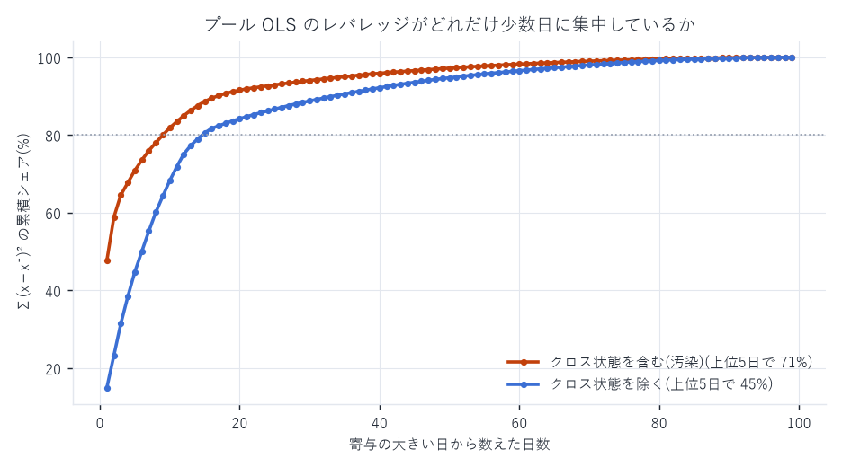
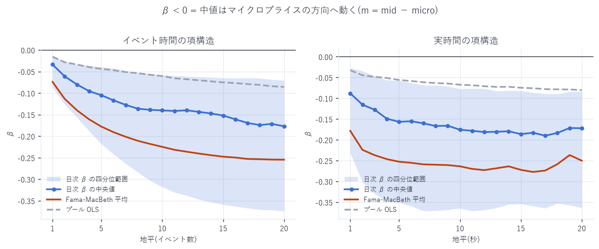
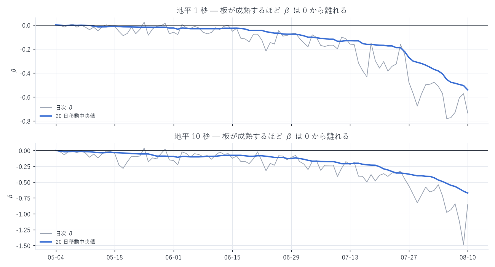
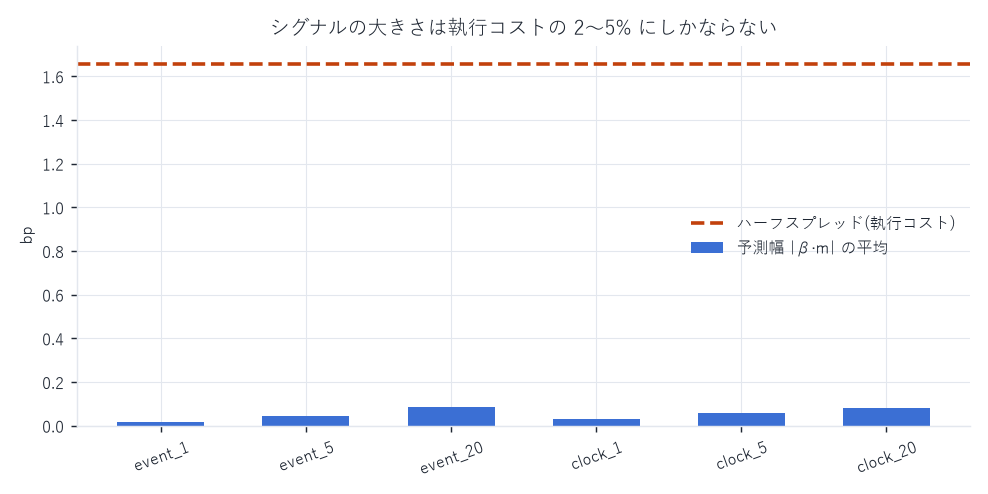
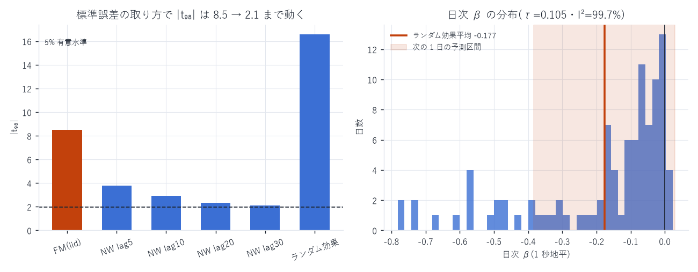

# r_{t+i} = α + β m_t + ε の検定 — 設計の評価と推定結果

対象: `xyz:DRAM / USDC`(Hyperliquid HIP-3)、2026-05-04 〜 2026-08-10(99 日)
標本: 23,458,514 ティック(BBO 変化ごと。クロス状態を除外後)
作成日: 2026-08-14

---

## 0. 結論

m は r の決定因子である。ただし「方向」としてであって、「幅」としてではない。

| 問い | 答え |
|---|---|
| β ≠ 0 か | yes。日次推定 99 日中 93〜97 日で β < 0。ブロック・ブートストラップの<br>95% CI が 0 を除外(p(平均≥0) = 0.0000)。ただし t の大きさは §9 参照 |
| 符号 | β < 0(= 中値はマイクロプライスの方向へ動く)。指示の `m = mid − micro` 定義での符号 |
| 大きさ | 1 秒地平で日次中央値 β = −0.088、成熟期(2026-08)は −0.59 |
| 経済的に使えるか | 単独では不可。ただし理由は体制による(§6 を 2026-08-14 に訂正) |
| 検定方法は妥当か | 構造は妥当。ただし 2 点の修正が必須(§2 と §3)。監査結果は §9 |
| 統計的正当性 | プラセボは通過(β≈0)、外れ値依存なし、標本外でも符号は転移。<br>ただし 検定統計量は SE の取り方で 8.5 → 2.1 まで動き、次の 1 日の β の予測区間は 0 を跨ぐ |

---

## 1. 推定した仕様

```
x = m_t     = (mid_t − MP_t) / mid_t × 10⁴          [bp]   ※指示どおり mid − micro
y = r_{t+i} = (log mid_{t+i} − log mid_t) × 10⁴     [bp]

spec A:  y = α + β x + ε
spec B:  y = α + β x + γ r_{t−1} + ε                (直前 1 イベントのリターンを統制)

地平 i:  1..20 イベント / 1..20 秒(計 40 本 × 2 仕様)
```

### 記号(2026-08-14 追記 — 初版は検定統計量にも `t` を使っており、時刻添字と衝突していた)

| 記号 | 意味 |
|---|---|
| `t` | 時刻添字のみ。BBO が変化したティックを指す |
| `i` | 先読み地平(イベント数 または 秒) |
| `m_t`, `r_{t+i}` | 説明変数・目的変数(上の定義) |
| `α, β, γ, ε` | 回帰の係数と誤差 |
| `z` | Wald 統計量 `β̂ / SE(β̂)`。プール推定(n = 2,345 万)の参照分布は標準正規 |
| `t₉₈` | 同じ比だが参照分布が自由度 98 の t 分布。日次クラスター(G = 99)と<br>Fama-MacBeth(99 日)のように「日」が実効的な標本単位になる推定に使う |

初版はすべてを「t 統計量」と呼び、p 値は標準正規から計算していた(`erfc(|·|/√2)`)。
本版では上表のとおり呼び分け、日次量には t(98) を用い、
クラスター頑健分散に小標本補正 `G/(G−1)·(N−1)/(N−K)` を入れて計算し直している。
自由度 98 と正規の差は臨界値で 1.2%(1.960 → 1.984)しかなく、結論はいずれも変わらない。

`MP = mid + (I − 1/2)·spread` なので `m_t = −(I − 1/2)·spread`、
すなわち `|m_t| ≤ spread/2` が定義から常に成り立つ。この上限が §6 の結論を決める。

標準誤差は 2 系統を併記した。

- Newey-West: 重複リターンは MA 誤差を作るので、イベント地平は L = 2i、
  時間地平は L = 2i × その日の毎秒ティック数(上限 400)
- 日次クラスター(99 クラスター): 日内の任意の系列相関・不均一分散を許す。
  重複次数の指定を誤っても壊れないので、こちらを主として読む

---

## 2. ★ 修正点 1 — 前処理: クロス状態が推定を乗っ取る

最初の推定で `|m|` の最大値が 7,349 bp になった。定義上 `|m| ≤ spread/2` なので
ありえない。正体はクロス状態(best_bid 54.289 / best_ask 5.290 → spread = −16,448 bp)で、
mid が板の外側に出て意味を失っている行だった。

| | 件数 | 全体比 | プール OLS のレバレッジ Σ(x−x̄)² |
|---|---|---|---|
| クロス状態 | 11,628 | 0.050% | 上位 1 日で 47%、上位 5 日で 71% |
| 除外後 | 23,458,514 | — | 上位 5 日で 45%(有効日数 16.6) |



除外前後で推定値はこれだけ動く(イベント時間・プール OLS・`x = MP − mid` 表記):

| 地平 | 汚染時 β | 除外後 β | 汚染時 corr | 除外後 corr |
|---|---|---|---|---|
| 100 ms | 0.149 | 0.0065 | 0.262 | 0.024 |
| 1 s | 0.517 | 0.0326 | 0.393 | 0.032 |
| 10 s | 0.482 | 0.0675 | 0.022 | 0.022 |

0.05% の行が β を 16 倍にしていた。`best_ask > best_bid` によるフィルタは
この分析の必須手順であり、データ側にも `is_crossed` 列を追加した。

参考: このクロス状態は 1 秒境界を一度も跨がない(2026-08-05 で 106 件中 0 件)。
L2 再構成の `enforce_uncrossed` が 1 秒スナップショット時点で解消するためで、
1 秒グリッド上の分析は構造的に汚染されない。汚染を受けるのはティック単位の分析だけである。

---

## 3. ★ 修正点 2 — n = 2,345 万では「有意性」は判定基準にならない

除外後のプール OLS:

| 地平 | β | z(Newey-West) | p(z) | t₉₈(日次クラスター) | p(t₉₈) | R² |
|---|---|---|---|---|---|---|
| 1 イベント | −0.0155 | −14.12 | 2.9e-45 | −4.11 | 8.2e-05 | 0.00029 |
| 5 イベント | −0.0439 | −20.09 | 8.3e-90 | −5.68 | 1.3e-07 | 0.00139 |
| 20 イベント | −0.0857 | −15.05 | 3.4e-51 | −6.16 | 1.6e-08 | 0.00197 |
| 1 秒 | −0.0326 | −25.62 | 8.7e-145 | −4.42 | 2.6e-05 | 0.00090 |
| 5 秒 | −0.0561 | −25.74 | 4.2e-146 | −5.15 | 1.4e-06 | 0.00071 |
| 20 秒 | −0.0802 | −17.89 | 1.4e-71 | −6.17 | 1.5e-08 | 0.00035 |

R² が 0.0003 でも z は 14〜26 に達する。H₀ : β = 0 の棄却は情報を持たない。
判断は R² と bp 換算(§6)で行うべきで、指示の手順 4 が実質的に唯一の判定基準になる。

なお Newey-West の z は日次クラスターの t₉₈ の 3〜4 倍大きい。重複の次数を読み違えると
NW は楽観的に出るので、両方出して小さい方を採るのが安全。

---

## 4. 推定結果 — プール OLS ではなく日次推定で読む

プール OLS は依然としてレバレッジが上位 5 日に 45% 集中する(§2)。
そこで日ごとに推定して分布を見る(Fama-MacBeth)。



| 地平 | プール OLS | FM 平均 | FM の t₉₈(iid・※) | p(t₉₈) | 日次中央値 | 四分位範囲 |
|---|---|---|---|---|---|---|
| 1 イベント | −0.0155 | −0.0739 | −4.38 | 3.0e-05 | −0.0336 | [−0.087, −0.017] |
| 5 イベント | −0.0439 | −0.1777 | −7.49 | 3.1e-11 | −0.1049 | [−0.218, −0.039] |
| 20 イベント | −0.0857 | −0.2546 | −9.47 | 1.7e-15 | −0.1771 | [−0.374, −0.071] |
| 1 秒 | −0.0326 | −0.1783 | −8.47 | 2.5e-13 | −0.0880 | [−0.232, −0.027] |
| 5 秒 | −0.0561 | −0.2526 | −8.42 | 3.2e-13 | −0.1566 | [−0.351, −0.058] |
| 20 秒 | −0.0802 | −0.2501 | −9.77 | 3.8e-16 | −0.1721 | [−0.364, −0.084] |

> ※ この t₉₈ は「日次 β が独立」を仮定した値で、過大である。日次 β の ACF(1) は 0.90 あり、
> 自己相関に頑健な SE では 2〜4 倍小さくなる(§9 T1)。符号の頑健性はブロック・
> ブートストラップで別途確認している。

- 符号は 99 日中 93〜97 日で負(1 秒地平 93 日、10 秒地平 97 日、1 イベント地平 96 日)。
  順位相関でも 95 / 99 日が負(§9 T3)
- β の絶対値は地平とともに増え、5〜10 イベント / 5 秒あたりで頭打ちになる。
  マイクロプライスが示す情報は数秒で中値に取り込まれ、そこで止まる

### スプレッド体制別(1 秒地平・イベント単位)

| スプレッド帯 | β | 相関 | n |
|---|---|---|---|
| 0–1 bp | −1.737 | −0.092 | 6,871,713 |
| 1–3 bp | −0.303 | −0.100 | 9,035,668 |
| 3–10 bp | −0.088 | −0.059 | 6,480,034 |
| 10 bp+ | −0.013 | −0.031 | 1,070,885 |

狭スプレッド帯では |β| > 1、つまり中値はマイクロプライスの示す幅を超えて動く
(m が 1 ティック幅に押し込められる一方、中値は 1 ティック丸ごと跳ぶため)。
広スプレッド帯では逆に β ≈ 0 に潰れる。単一の β を全期間に当てはめる前提は成り立たない。

### モメンタムを統制しても β は残る(spec B)

| 地平 | β(spec A) | β(spec B) | γ(r_{t−1}) | R²(A) | R²(B) |
|---|---|---|---|---|---|
| 1 イベント | −0.0155 | −0.0145 | −0.408 | 0.00029 | 0.167 |
| 1 秒 | −0.0326 | −0.0326 | −0.031 | 0.00090 | 0.00092 |
| 20 秒 | −0.0802 | −0.0793 | −0.392 | 0.00035 | 0.155 |

直前リターンには強い反転(γ = −0.41)があり、R² の大半はそれで説明される。
しかし β はほとんど動かない(−6%)。m は短期反転の写しではなく、独立した情報を持つ。

---

## 5. 安定性 — レジーム依存は「時間」ではなく「板の成熟度」



| 月 | β 中央値(1 秒) | β 中央値(10 秒) |
|---|---|---|
| 2026-05 | −0.018 | −0.057 |
| 2026-06 | −0.066 | −0.101 |
| 2026-07 | −0.200 | −0.361 |
| 2026-08 | −0.591 | −0.848 |

板が厚くスプレッドが縮むほど β は 1 に近づく。8 月には 10 秒地平で −0.85、
つまりマイクロプライスの示す幅の 85% が実際に中値へ実現している。
立ち上げ期の板ではこの関係は存在しない(β ≈ −0.02)。

ローリングで見ると単調な強まりに見えるが、これは時間の効果ではなくスプレッド体制の効果である
(§4 の体制別表が同じ構造を横断面で示している)。ローリングより体制別層別のほうが直接的。

---

## 6. 経済的有意性 — ここが結論を決める

> 【2026-08-14 訂正】 初版は「2,345 万ティックすべてで `|β·m| ≤ ハーフスプレッド`、
> `|m| ≤ spread/2` と `|β| < 1` から構造的にそうなる」と書いた。
> 体制平均の β(−0.03)を全体に当てた誤りだった。狭スプレッド帯の β は −1.74 で
> `|β| < 1` の前提が崩れる。体制別に測り直した下表が正しい。



体制別に、その体制の β で予測幅を測る(1 秒地平):

| スプレッド帯 | β | 平均 \|m\| | 予測幅 \|β·m\| | ハーフスプレッド | \|β·m\| > 半値幅 | n |
|---|---|---|---|---|---|---|
| 0–1 bp | −1.737 | 0.139 bp | 0.241 bp | 0.201 bp | 71.3% | 6,871,531 |
| 1–3 bp | −0.303 | 0.602 bp | 0.182 bp | 0.968 bp | 0% | 9,035,446 |
| 3–10 bp | −0.088 | 1.451 bp | 0.127 bp | 2.413 bp | 0% | 6,479,941 |
| 10 bp+ | −0.014 | 6.751 bp | 0.093 bp | 12.061 bp | 0% | 1,065,483 |

読み方が体制で割れる。

- スプレッドが 1bp 未満の体制(全体の 29%)では、予測幅がハーフスプレッドを
  71% のティックで上回る。 `|β| > 1` なので構造的な上限が効かない。
  `m` は 1 ティック幅の半分に押し込められる一方、中値は 1 ティック丸ごと跳ぶため
- それ以外の体制では 0%。 `|β| < 1` なので `|m| ≤ spread/2` の上限がそのまま効く

ただし狭スプレッド体制の「71%」を実行可能な優位と読んではいけない。

1. 期待値の差は 0.241 − 0.201 = 0.04 bp しかない。手数料・キュー・逆選択は未計上
2. 標本外では消える。前半 50 日で推定した β は −0.749(後半の in-sample は −1.842)。
   β = −0.749 なら `|β·m| > ハーフスプレッド` となるには `|I − 1/2| > 0.668` が必要で、
   I ∈ [0,1] では定義上ありえない → 0%
3. この帯の相関は −0.095(R² < 1%)。β が 1 を超えるのは σ_x が小さいことの帰結でもあり、
   点推定の不確実性が大きい

結論は変わらない: 単独でスプレッドを叩く根拠にはならない。
根拠が「構造的に不可能」から「in-sample では僅かに超えるが標本外で消える」に変わった。
使い道はパッシブ執行の傾け・逆選択回避・他シグナルとの合成である。

---

## 7. 検定方法の評価(指示の 5 手順への回答)

| 手順 | 評価 | コメント |
|---|---|---|
| 1. m の定義 | ○ | ただし `m = mid − micro` なので反応があれば β < 0。文献の多い `micro − mid` と符号が逆 |
| 2. OLS 点推定 | △ | プールは不可。レバレッジが上位 5 日に 45% 集中する。日次推定 → Fama-MacBeth、または体制別層別が必要 |
| 3. HAC 検定 | △ | 方向は正しいが、(a) 重複次数に合わせたラグ長が必須、(b) n = 2,345 万では棄却が自明。日次クラスターを併記し、判定は R² と bp で |
| 4. 経済的有意性 | ◎ | ここが唯一の実質的な判定基準。ただし体制平均の β で判定してはいけない(初版の誤り)。体制別の β で測ると狭スプレッド帯だけ様相が変わる(§6) |
| 5. 安定性検証 | ○→◎ | ローリングは有効だが、スプレッド体制での層別のほうが直接的。時間軸のローリングは成熟度と交絡する |

さらに、この 5 手順には「見せかけでないこと」を確かめる仕組みが無い。
プラセボ(説明変数を時間方向にずらす)と標本外検証を足すべきで、実際に足した結果が §9 の T4 / T6 である。

### 追加すべきだった前処理・仕様

- クロス状態の除外(§2)。これを外すと結論が 16 倍変わる
- spec B(直前リターンの統制)。m がモメンタムの写しでないことの確認
- x の標準化: 日次または体制ごとに `m/σ_m` へ直すと、係数が体制間で比較可能になる
- `m` の代わりに `OBI(1) = 2I − 1` を使う版: スプレッド倍率を外した「方向だけ」の
  シグナル。両者は `m = −OBI(1)/2 · spread` で結ばれる(→ `obi_report.md`)

---

## 8. 成果物

```
data/regression.json      全 40 地平 × 2 仕様の推定値・HAC/クラスター SE・
                          Fama-MacBeth・体制別 β・日次 β・経済的有意性
scripts/regress_micro.py  2 パス推定(パス 1 で X'X、パス 2 で HAC の meat)
scripts/regress_charts.py 図 12〜15
scripts/recheck_microprice_pred.py  クロス除外の影響を測る検証スクリプト
scripts/audit_regression.py         統計的正当性の監査(T1〜T7)
scripts/audit_chart.py              図 16
scripts/fix_notation.py             参照分布の訂正(z / t₉₈・クラスター小標本補正)
data/notation_fix.json              訂正後の統計量と p 値
data/audit.json, data/audit_daily.csv  監査の全数値
```

---

## 9. 統計的正当性の監査(2026-08-14)

7 つの脅威を立てて検定した。スクリプトは `scripts/audit_regression.py`、
結果の全数値は `data/DRAM/audit.json` / `data/DRAM/audit_daily.csv`。



### T1 Fama-MacBeth の SE は楽観的すぎた

日次 β は強く自己相関している(ACF: 0.90, 0.83, 0.77, 0.72, 0.69)。
FM の「日次 β は独立」という仮定は成り立たない。

| SE の取り方 | SE | t₉₈ | p(t₉₈) |
|---|---|---|---|
| FM(iid)— 初版で使用 | 0.0212 | −8.50 | 2.1e-13 |
| Newey-West(日次, lag 5) | 0.0476 | −3.78 | 2.7e-04 |
| Newey-West(日次, lag 10) | 0.0614 | −2.93 | 4.2e-03 |
| Newey-West(日次, lag 20) | 0.0774 | −2.33 | 2.2e-02 |
| Newey-West(日次, lag 30) | 0.0859 | −2.10 | 3.8e-02 |

ブロック・ブートストラップ(ブロック長 5 / 10 / 20 日、各 5,000 回):
平均の 95% CI は [−0.265, −0.096] / [−0.274, −0.071] / [−0.282, −0.051]、
いずれも 0 を含まず、p(平均 ≥ 0) = 0.0000。中央値の CI も 0 を含まない。

判定: 有意性は残るが、初版の t₉₈ = −8.5 は過大。正しくは t₉₈ ≈ −2.1 〜 −3.8。

### T2 日次 β は「同じ母数の反復推定」ではない

各日の HAC SE で異質性を測ると Cochran の Q = 35,887(df 97)、I² = 99.7%。
99 日中 82 日が有意に負、1 日が有意に正。共通の β は存在しない。

したがって逆分散加重平均(z = −83)は報告してはならない値である。
正しくはランダム効果モデル:

- 日間標準偏差 τ = 0.105、平均 μ = −0.177(95% CI [−0.198, −0.156])
- 次の 1 日の β の予測区間 = [−0.383, +0.029] — 0 を跨ぐ

判定: 「平均として負」は言えるが、「明日の β は負」とは言えない。

### T3 外れ値依存ではない

| 推定量 | 値(日次中央値) | 負の日数 |
|---|---|---|
| 素の β | −0.089 | 93 / 99 |
| ウィンザライズ β(上下 1%) | −0.070 | — |
| Spearman 順位相関 | −0.100 | 95 / 99 |
| 符号不一致率(sign(y) ≠ sign(x)) | 0.561 | — |

順位相関でも符号が変わらない。クロス状態を除いた後は外れ値駆動ではない。

### T4 プラセボは通過した(最も重要)

同じ日の `m` を日内で 5,000 ティックずらして同じ回帰を回す。
分布も体制も同一で、時点の対応だけが壊れる。

| | 中央値 β | 平均 β | t₉₈ | 負の日数 |
|---|---|---|---|---|
| 本来の m | −0.089 | −0.180 | −2.1〜−3.8 | 93 / 99 |
| プラセボ(ずらした m) | +0.0002 | +0.0013 | +1.08(p = 0.28) | 48 / 99 |

判定: 機械的な相関やサンプリング由来の見せかけではない。
なお `m = −(I − 1/2)·spread` は解析的に `mid` が消えるので、
x と y が同じ mid を共有することによる見せかけの相関は構造上も生じない。

### T5 有効標本サイズは n の 1/14

`m` の自己相関(ACF: 0.49, 0.34, 0.26, 0.23, 0.21)から分散膨張係数 = 14.4。
実効的な独立標本数は 23,458,514 ではなく約 163 万。
結論は変わらないが、「n = 2,345 万」を根拠に精度を語るのは誤り。

### T6 標本外: 符号は転移するが大きさは転移しない

前半 50 日で推定した β を後半 49 日に当てる(体制別):

| 帯 | β(前半) | β(後半) | 標本外 R² |
|---|---|---|---|
| 0–1 bp | −0.749 | −1.842 | 0.0058 |
| 1–3 bp | −0.131 | −0.341 | 0.0077 |
| 3–10 bp | −0.043 | −0.159 | 0.0034 |
| 10 bp+ | −0.012 | −0.274 | 0.0021 |

標本外 R² は 4 帯すべてで正 = 符号と大まかな水準は転移する。
一方 β の絶対値は 2〜20 倍ずれる = 大きさは転移しない。
体制で層別しても板の成熟という時間変化は残るため。

### T7 経済的有意性の判定を訂正

§6 のとおり。初版の「0 件」は体制平均の β を使った誤りだった。

### 総合判定

| 論点 | 判定 |
|---|---|
| m と r の関係は実在するか | yes(プラセボ通過・順位相関でも同符号・95/99 日) |
| 符号は負か | yes(ブロック・ブートストラップで CI が 0 を除外) |
| 単一の β があるか | no(I² = 99.7%、予測区間が 0 を跨ぐ) |
| 初版の「t = −8.5」は妥当か | no(記号も値も誤り。正しくは t₉₈ ≈ −2.1 〜 −3.8) |
| 単独で執行コストを超えるか | no(標本外では 0%) |

「m は r の決定因子である」は統計的に支持される。
「β はこの値である」という主張は支持されない。

---

AWS 費用: 本節は既存データのみで完結(追加 egress なし)。
EC2 \$25.05 | S3 ≈\$1.87 | 累計 ≈\$26.92 / 予算 \$60(EC2 は停止中)
