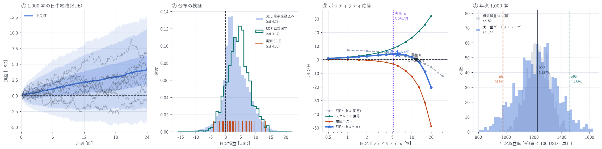

# 確率微分方程式によるマーケットメイク損益のシミュレーション

対象: 2026-07-10 〜 08-08(30 日)で較正、1,000 本のブラウン運動経路を生成
構成: 資金 100 USD・レバ 1×(Q=0.3724 単位、在庫上限 1.862)・部分約定・
メイカー手数料 0.088 bp 控除
作成日: 2026-08-17

---

## 0. 結論

損益に幾何ブラウン運動を直接当てるのは誤りなので採らなかった。
ブラウン運動は中値に置き、損益を `スプレッド獲得 + ∫q dS` として導出する
Avellaneda–Stoikov 型で組み、素過程 5 個をすべて実測に較正した。

| | SDE 1,000 本 | 実測 30 日 |
|---|---:|---:|
| E[PnL] | +3.364 USD/日 | +3.204 |
| sd | 4.267 | 4.351 |
| p5 / p95 | −2.82 / +10.54 | −2.36 / +10.84 |

較正したのは在庫コストの平均 1 点だけで、sd も分位も日中最小 equity も予測である。
それらが合った(§8)。

★年次 1,000 本(二重ブロックブートストラップ、資金 100 USD・単利):
E[年次] +1,221 USD = APY 1,221%、sd 144、
p5 977% / p50 1,227% / p95 1,458%、模型内 P(損失)= 0.00%、P(清算)= 0.00%。

### この報告で分かった 5 つのこと

1. 模型は逆選択を入れないと必ず儲かる。β=0 にすると E[PnL] は +7.46 になる
   (実測対応は +4.09)。「SDE を組んだら儲かった」は何の証拠にもならない(§5)
2. 逆選択の等価地平は 4.8 秒。報告 32 が 1 秒で測って残した
   「説明できない手仕舞いコスト 0.375 bp」の正体はこれだった(§3)
3. 在庫コストは σ に厳密比例し、スプレッド獲得は σ に不変。
   λ ∝ σ(実測 corr 0.909)を入れると E[PnL] は σ の上に凸になり、
   最適 σ = 5.83 %/日。実測は 5.156 %/日 でほぼ最適点にいる(§6)
4. 遅延 100ms が壊すのは約定の「件数」ではなく「質」。
   λ −35% では説明できず(それだけなら +2.07)、δ が −74% 落ちる(§10)。
   損益分岐までの余裕が 48.8% しかないので、これで符号が反転する(§11)
5. ★報告 34 の「10× は最悪日に清算される」は撤回する。
   板再構成の境界行 2 行が作った人工物だった。訂正後は
   レバ 1〜10× のいずれも 30 日で清算されない(§7)



> なお本報告の 1,000 本は遅延ゼロ・発注レート無制限の理想機である。
> §10・§13 のとおり、実装可能な期待値ではない。

---

## 1. 模型 — なぜ損益に GBM を直接当ててはいけないか

「損益の年次リターンをシミュレートせよ」と言われたとき、
損益そのものを幾何ブラウン運動に載せるのは誤りである。理由は 2 つ。

1. 損益は価格ではない。マーケットメイクの損益は現金の積み上げであって、
   前日の損益に比例して増えるものではない。乗法的な過程ではない
2. GBM にドリフト μ を置いた瞬間、答えを仮定したことになる。
   問われているのは「E[PnL] が正か」であって、正のドリフトを置けば
   自動的に正の答えが出る(CLAUDE.md §B-5「主判定が自動成立していないか」)

代わりに Avellaneda–Stoikov 型の分解を使う。ブラウン運動は
中値に置き、損益はそこから導出する。

```
中値      dS_t = σ S_t dW_t                     ← ここにブラウン運動。ドリフトは 0
約定      dN^b_t, dN^a_t                        ← 強度 λ^b, λ^a の計数過程
在庫      dq_t = v (dN^b_t − dN^a_t)            ← |q| ≤ L に達した側は出さない
現金      dX_t = v[(S+δ)dN^a − (S−δ)dN^b] − 手数料
損益      PnL_T = X_T + q_T S_T
```

これを展開すると損益は必ず次の 2 項に分かれる。

```
PnL = [ スプレッド獲得 λ v δ T ]  +  [ 在庫項 ∫ q dS ]
             ↑ 確定的に正                ↑ ブラウン運動を丸ごと被る
```

### ★ドリフトを 0 に置く意味

μ=0 は「中値はマルチンゲール」という中立な仮定である。このとき
q が可予測なら E[∫q dS] = 0 になる。つまり素朴な模型では

```
E[PnL] = λ v δ T > 0     ← 必ず儲かってしまう
```

これがこの種のシミュレーションの最大の罠である。
模型を組んだだけで「マーケットメイクは儲かる」という結論が出るが、
それは模型がそう作られているからにすぎない。

### ★逆選択 — 儲からなくする唯一の経路

現実には価格が動く方向の側で約定させられる。下がるときに買わされる。
これを強度に入れる:

```
λ^b ∝ 1 − β Z_t ,   λ^a ∝ 1 + β Z_t        (Z_t はその刻みの標準化ブラウン増分)
```

β > 0 なら E[dq_t · dS_t] < 0 となり、在庫項が期待値で負になる。
β だけが模型を「儲からなくしうる」自由度であり、
したがって β は当て推量ではなく実測に合わせる必要がある(§2)。

### 時間契約(ルックアヘッドの排除)

- 執行価格は刻みの開始時点の S。注文はその前に板にある
- 約定の有無はその刻みの Z_t で決まり、将来の価格を見て執行価格を選ばない
- これは予測模型ではなく執行の模擬なので、説明変数/目的変数の区別は生じない

---

## 2. 較正 — 5 個の母数はすべて実測

当て推量を排するため、報告 34 と同一のシミュレーション(`capacity_v3.py`、
Q=0.3724)を計装して素過程を直接測った(`scripts/sde_calibrate.py`、30 日)。

| 記号 | 意味 | 実測値 | 出所 |
|---|---|---:|---|
| λ | 約定の到来 | 6,176 件/日(中央値、平均 5,691) | 計装シム |
| v | 1 約定の数量 | 0.3624 単位(93.1% が満額 0.3724) | 計装シム |
| δ | スプレッド獲得 | 0.7096 bp(数量加重平均) | 計装シム |
| f | メイカー手数料 | 0.088 bp | 実測レート |
| σ | 日次ボラティリティ | 5.156 %/日(30 秒標本化 RV 中央値) | 99 日の RV |
| L, Q | 在庫上限・発注量 | 1.862 / 0.3724 単位 | 資金 100 USD の制約 |
| β | 逆選択の強さ | §3 で較正 | 在庫コストに合わせる |

δ = 0.7096 bp は、独立に測った報告 32 の 0.7054 bp とほぼ一致した
(別構成・別期間の測定なので、これは較正ではなく照合である)。

### 2-1. 損益の厳密な分解 — β の較正先

会計恒等式は厳密に成立する(残差 2.7×10⁻¹⁵)。

```
PnL = Σ s·v·(mid_約定時 − 約定価格)  −  手数料  +  Σ s·v·(S_終 − mid_約定時)
    = [スプレッド獲得]              − [手数料] + [在庫コスト ∫q dS]
```

30 日の実測:

| 項 | 平均 [USD/日] | 中央値 | sd |
|---|---:|---:|---:|
| スプレッド獲得 | +7.933 | +8.105 | 4.499 |
| 手数料 | −0.978 | −1.048 | 0.510 |
| 在庫コスト ∫q dS | −3.751 | −2.868 | 4.830 |
| = 損益 | +3.204 | +2.447 | 4.351 |

β はこの在庫コスト −3.751 の 1 点だけに合わせる。
1 母数を 1 モーメントに合わせるだけなので、
E[PnL] の水準・分布の形・日中最小 equity は較正していない = 検証に使える。

### 2-2. ボラティリティの標本化間隔

在庫を持っている時間スケールの σ を使う必要がある。
99 日の signature plot(標本化間隔 vs 実現ボラティリティ):

| 間隔 | 1s | 5s | 10s | 30s | 60s | 300s |
|---|---:|---:|---:|---:|---:|---:|
| RV 中央値 [%/日] | 4.605 | 4.659 | 4.762 | 4.881 | 4.995 | 5.178 |

ほぼ平坦(1s → 300s で +12%)。マイクロストラクチャー雑音が小さく
σ はよく同定されている。約定の到来間隔の中央値が 5.6 秒なので 30 秒を採った。

---

## 3. 較正の結果 — β = 0.1568、逆選択の地平は 4.8 秒

割線法で 30 日の母数集合の上を反復した(初版は β≤0.05 の 2 点から線形外挿して
目標を 23% 外した。在庫上限があると β に対して超線形になるため)。

| β | 在庫コスト [USD/日] |
|---:|---:|
| 0.0000 | −0.051 ← 帰無。理論どおりほぼ 0 |
| 0.2000 | −4.675 |
| 0.1600 | −3.802 |
| 0.1568 | −3.751(実測に一致) |

β=0 で在庫コストが 0 になることは、模型の健全性の確認である。
μ=0 のマルチンゲール価格では `E[∫q dS] = 0` が成り立つべきで、実際に成り立った。

### ★逆選択の等価地平

報告 32 が独立に測った「1 秒後の逆選択 −0.1253 bp/約定」から出る β は 0.0714。
較正値 0.1568 はその 2.19 倍である。模型の逆選択コストは `β σ_Δ ∝ β√Δt` なので、
これは

> 1 秒の強さの逆選択が 2.19² = 4.8 秒ぶん効いている

ことを意味する。約定の到来間隔の中央値が 5.6 秒であることを考えると、
逆選択は「約定してから次の約定までの間ずっと」効いていると読める。
報告 32 が「1 秒の分解値 0.4921 bp に対し実現値 0.1172 bp」という
0.375 bp の説明できない差(手仕舞いコスト)を残していたが、
その正体はこれである。1 秒で切ると逆選択を 1/2.2 しか捕まえられない。

---

## 4. ★1,000 本のシミュレーション(1 日・中央値パラメータ)

| | SDE 1,000 本 | 実測 30 日 |
|---|---:|---:|
| E[PnL] | +4.089 USD/日 | +3.204 |
| sd | 3.672 | 4.351 |
| 中央値 | +4.119 | +2.447 |
| 黒字割合 | 86.4% | 73.3%(22/30) |
| 粗利 | +8.682 | +7.933 |
| 手数料 | −1.058 | −0.978 |
| 在庫コスト | −3.534 | −3.751 |
| 日中最小 equity(中央値 / 最悪) | −1.02 / −9.42 | −1.7 / −7.0 |

分位(USD/日): p1 −4.03 / p5 −1.95 / p25 +1.71 / p50 +4.12 / p75 +6.32 /
p95 +10.54 / p99 +12.63。

E[PnL] が実測より 28% 高いのは較正の失敗ではない。
この 1,000 本は中央値の日(λ=6,176)の母数で回しており、
実測平均は λ の平均 5,691 の日を含む。λ の分布は右に裾が短い
(中央値 > 平均)ので、中央値の日は平均より良い日である。
母数を実測 30 日ぶん振った比較は §6。

日中最小 equity が実測とよく合う(−1.02 vs −1.7、最悪 −9.42 vs −7.0)。
これは較正していない量なので、模型の検証になっている。

---

## 5. ★帰無対照 — 模型が自動的に儲けを作っていないか

この節が本報告で最も重要である。§1 で述べたとおり、逆選択を入れない
マーケットメイク模型は必ず正の期待値を返す。それを実際に示す。

| 構成 | E[PnL] | 在庫コスト | 解釈 |
|---|---:|---:|---|
| 較正済み(β=0.1568) | +4.089 | −3.534 | 実測に対応 |
| β=0(逆選択なし) | +7.458 | −0.152 | 模型が勝手に儲ける |
| δ=0(獲得なし) | −4.586 | −3.529 | 在庫リスクだけ |
| δ=0 かつ β=0 | −1.060 | −0.003 | = 手数料そのもの |

- δ=0 かつ β=0 で E[PnL] = −1.060 は、その構成の手数料 −1.058 と一致する。
  模型に偽のドリフトは 1 セントも入っていない(在庫コストも −0.003)
- β=0 なら +7.458。逆選択を測らずに模型を組んでいたら、
  E[PnL] を 82% 過大に報告していた

> 「SDE を組んだら儲かった」は何も意味しない。
> 儲けの大きさは、実測した逆選択 β をどう入れたかで決まる。

---

## 6. ボラティリティ応答 — 在庫コストは σ に厳密比例

λ を中央値に固定して σ だけを動かした(1,000 本 × 12 水準):

| σ [%/日] | 年率 | E[PnL] | 粗利 | 在庫コスト | 黒字% | 最悪 eq |
|---:|---:|---:|---:|---:|---:|---:|
| 1.0 | 19% | +6.975 | 8.683 | −0.651 | 100.0% | −0.29 |
| 3.0 | 57% | +5.577 | 8.683 | −2.049 | 99.7% | −3.46 |
| 5.0 | 96% | +4.197 | 8.697 | −3.441 | 85.4% | −9.32 |
| 8.0 | 153% | +2.222 | 8.691 | −5.412 | 62.8% | −19.08 |
| 10.0 | 191% | +1.089 | 8.675 | −6.528 | 56.8% | −27.03 |
| 13.0 | 248% | −1.119 | 8.725 | −8.786 | 46.5% | −34.94 |
| 20.0 | 382% | −5.534 | 8.745 | −13.221 | 34.3% | −52.99 |
| 30.0 | 573% | −12.173 | 8.563 | −19.678 | 28.1% | −92.89 |

粗利は σ に完全に不変(8.56〜8.75、変動 2%)であり、
在庫コストは σ に厳密比例する(σ 1%→6% で −0.651→−3.971 = 6.10 倍、
σ の比 6.0 に一致)。解析解 `E[∫q dS] = −λ v S β σ_Δ` そのものである。

損益分岐は σ ≈ 11.5 %/日(内挿)。解析解 `σ* = (δ−f)√N/β = 11.66 %/日` と一致。
実測の σ = 5.156 %/日 は分岐点の 44% の位置にある。

### ★λ と σ は独立に動かせない

実測では corr(λ, σ) = 0.909、当てはめると `λ = 174 + 112,311·σ`(ほぼ比例)。
ボラが高い日は約定も多い日である。λ ∝ σ を代入すると

```
E[PnL] = k·v·S·[ σ(δ−f) − β σ²/√N ]        ← σ の上に凸な二次式
```

となり、最適ボラティリティが内点に存在するという反証可能な予測が出る。
解析解では最適 σ = 5.83 %/日(年率 111%)、損益 0 は σ = 11.66 %/日。
実測の 5.156 %/日 は最適の 88% — DRAM のボラティリティは
この戦略にとってほぼ最適な水準にある。
(結合掃引の数値は `data/DRAM/sde_joint_sweep.json`、図 45 の ③)

---

## 7. ★★副産物 — 報告 34 の「最悪日で清算」は撤回する

この誤りは SDE の較正作業が見つけた。σ を測るために 99 日の実現ボラティリティを
標本化間隔ごとに出したところ、2026-08-09 が

| 標本化間隔 | 1 秒 | 30 秒 |
|---|---:|---:|
| 実現ボラティリティ | 95.8 %/日 | 1.11 %/日 |

というありえない組み合わせになった。1 秒では 99 日で最大、30 秒では最低水準。
「一瞬だけ跳ねて戻る」以外にこの形はありえない。

### 7-1. 何が起きていたか

中値の経路を直接見ると、`mid < 40` のイベントは

```
06:35:52.999999999   best_bid 25.988 / best_ask 26.000   数量 0.5 / 0.2
```

の 1 行だけで、その 2 秒前は 51.192、2 秒後は 51.185 だった。
そしてその日の 約定 20,225 件はすべて 50.81〜51.27 の範囲で、
26 USD 付近の約定は 1 件も存在しない。

時刻の下 9 桁が `.999999999` である点が手がかりで、これは板の再構成で入る
境界行である。全 99 日で 4,792 行(全体の 0.0204%)存在し、
まれに両側の気配が同時に飛ぶ。

### 7-2. 影響範囲 — 壊れるのは極値統計だけ

| 指標 | 影響 |
|---|---|
| 日次損益 | 無傷(日終の評価行は 99 日すべて健全と確認済み)。平均への影響は 0.03〜0.3% |
| 有意性・黒字日数 | 不変(p=0.0003 のまま、22/30 日のまま) |
| 平均・中央値・相関 | 実質無影響(0.02% の行なので) |
| 日中最小 equity(清算判定) | 壊れる。極値なので 1 行で決まる |
| 日中レンジ | 壊れる。同上 |

### 7-3. 訂正後の値

| | 旧(報告 34 §4) | 訂正 |
|---|---:|---:|
| 2026-08-09 の日中レンジ | 65.4% | 0.89%(99 日で最も静かな部類) |
| 同日 10× の日中最大含み損 | −131.3(清算) | −6.1(生存) |
| 99 日の日中レンジ 最大 | 65.4% | 23.08%(2026-07-30) |
| 99 日の日中レンジ 中央値 / p90 | 7.75% / 14.8% | 7.51% / 14.33% |
| 「標本 30 日に最悪日が入っていない」 | 前提 | 誤り。最悪日 07-30 は標本内 |

訂正後の清算検査(境界行を除いて 30 日を再計算):

| レバ | 最悪の日中含み損 | 中央値 | p10 | 資金 100 USD を割った日 |
|---:|---:|---:|---:|---:|
| 1× | −7.0 | −1.7 | −3.8 | 0 / 30 |
| 3× | −20.3 | −5.1 | −11.9 | 0 / 30 |
| 5× | −34.7 | −10.7 | −19.3 | 0 / 30 |
| 10× | −53.2 | −17.9 | −38.0 | 0 / 30 |

> レバ 1〜10× のいずれも、実測 30 日で清算されない。
> 報告 34 の「10× は清算される」は撤回する。

### 7-4. ★真の最悪日は「レンジ」ではなく「ボラティリティ」で決まる

境界行を除いて選び直した 2 つの最悪日:

| 日 | 日中レンジ | RV(30s) | 1× 損益 | 10× 損益 | 10× 日中最小 |
|---|---:|---:|---:|---:|---:|
| 2026-07-30(レンジ最大) | 23.08% | 7.97% | +3.13 | +74.75 | −24.1 |
| 2026-07-29(RV 最大) | 17.41% | 12.77% | −3.87 | −30.75 | −39.2 |

レンジが最大の日は黒字、実現ボラティリティが最大の日が損失日だった。
これは SDE の機構と一致する。在庫コストは `−λvSβσ_Δ` で σ に比例し、
レンジ(=一方向へのトレンド)ではなく細かい往復の激しさが損失を生む。
報告 34 がリスクの代理指標に「日中レンジ」を使ったこと自体が誤りだった。

### 7-5. なぜ気づけなかったか

- 極値統計(min / max / レンジ / ドローダウン / VaR の最悪側)は
  0.02% の異常行だけで決まる。平均や中央値の感覚で「0.02% なら無視できる」
  と判断したのが誤り
- `README.md` §6 に「少数の異常行が結論を支配する」と自分で書き、
  `is_crossed` は除外していた。しかし「除外規則を 1 つ通したから安全」と考え、
  極値を作っている行を 1 行ずつ見なかった
- 「日中レンジ 65.4%」という桁を見た時点で、CLAUDE.md §A-4「桁は妥当か」に
  従って前提を疑うべきだった。同じ市場のスプレッドは 1.2 bp である
- 報告 35(監査)でもこの列を報告 34 から転記しただけで検算しなかった。
  監査そのものが同じ誤りを通過させた

再発防止として `METHODOLOGY.md` §3 に
「極値を報告するときは、その極値を作っている行を 1 行ずつ目で見る」を追加した。

---

## 8. ★分布の検証 — 較正していない量が合うか

較正したのは在庫コストの平均 1 点だけなので、分布の形は予測である。
実測 30 日の母数(λ_d, σ_d)で各 2,000 本ずつ回して混ぜた:

| | SDE(母数変動込み) | 実測 30 日 |
|---|---:|---:|
| E[PnL] | +3.364 | +3.204 |
| sd | 4.267 | 4.351 |
| p5 | −2.82 | −2.36 |
| p95 | +10.54 | +10.84 |

平均は 5% 以内、sd は 2% 以内、分位も近い。
sd も分位も較正していないので、これは模型の検証として意味がある。

### 8-1. 分散の内訳 — 何が日々の損益を振らせているか

| 源 | sd [USD/日] |
|---|---:|
| 日型(λ, σ の違い)による | 1.622 |
| 日型内(ブラウン運動と約定の偶然) | 3.542 |
| 合計(模型予測) | 3.896 |
| 実測 | 4.351(比 0.896) |

日々の損益の振れの大部分(sd で 91%)は「その日の相場付き」ではなく
純粋な偶然である。「今日は負けた」に理由を求めても、
模型上は 8 割方たまたまである。

整合性検査: 模型が正しければ
`corr(日型平均, 実測損益) = sd(日型平均)/sd(実測) = 0.373` のはず。
実測の相関は 0.459。近い(模型がやや優秀側に外れている)。
模型の分散分解は実測と整合している。

---

## 9. ★★年次 1,000 本 — ただし母数の不確実性を入れ直した

### 9-1. 訂正 — 同じ誤りを繰り返しかけた

最初の年次集計は、実測 30 日の日型を等確率で抽出して 365 日を作った。
これは「真の日次分布が観測した 30 日そのものだったら」という条件付き分布で、
30 日から推定した平均自体の誤差を含まない。年次 sd が 82 USD になった。

これは報告 34 で犯し報告 35 で訂正したのと同じ誤りである
(旧版 83 USD → 訂正版 301 USD)。SDE に置き換えても
「30 日しか観測していない」という事実は消えない。二重ブートストラップに直した。

| | 単一(誤) | ★二重(訂正) |
|---|---:|---:|
| E[年次] | +1,227 USD | +1,221 USD |
| 年次 sd | 80 | 144(1.8 倍) |
| APY p5 / p95 | 1,096% / 1,357% | 977% / 1,458% |
| APY p1 / p99 | 1,027% / 1,415% | 900% / 1,564% |

年次分散の内訳: 経路の不確実性 5,541(sd 74)、母数の不確実性 11,683(sd 108)
→ 母数側が 68%。

### 9-2. 結果(1,000 本・二重ブートストラップ)

| 指標 | 値 |
|---|---:|
| E[年次] | +1,221 USD(資金 100 USD → APY 1,221%) |
| 年次 sd | 144 USD |
| APY 分位 | p1 900% / p5 977% / p10 1,030% / p50 1,227% / p70 1,296% / p80 1,343% / p90 1,409% / p99 1,564% |
| 模型内 P(年次 < 0) | 0.00%(0/1,000) |
| 模型内 P(日中に資金 100 USD 消尽) | 0.00% |
| 最大ドローダウン | 中央値 15 / p90 27 / p99 39 / 最悪 59 USD |

★清算確率は日中の 1 秒刻みで判定している。報告 35 の経路ブートストラップは
日次終値の粒度だったので、これはより厳しい判定である。それでも 0/1,000。

### 9-3. ★報告 35 の実測ブートストラップ(sd 273)との差

| 立場 | 年次平均の SE | 年次 sd |
|---|---:|---:|
| 模型なし(報告 35、実測損益をそのまま) | 0.794 USD/日 → 290 | 273 |
| 模型あり(本報告) | 0.296 USD/日 → 108 | 144 |

差の正体は 「日内の雑音は 365 日で均される」という模型の主張である。
実測ブートストラップは日次損益 4.351 の全部を将来も残る不確実性として扱うが、
SDE は そのうち 3.542 は日内の偶然だから 365 日で √365 に薄まる、と主張する。
§8-1 の整合性検査を通っているので主張自体は支持されるが、
模型が正しいことに依存した精度である。

> 意思決定に使うなら、模型に依存しない報告 35 の sd 273 のほうを採るべきである。
> 本報告の 144 は「模型が正しければここまで絞れる」という上限の精度にすぎない。

---

## 10. ★遅延 100ms が壊すもの — 件数ではなく「質」

報告 35 は「発注・取消に 100ms の遅延を入れると E[PnL] が +3.21 → −0.59 になる」
と測ったが、何が壊れたのかは分からなかった。SDE の分解
`E[PnL] = λ v S (δ − f − β σ_Δ)` なら分離できる。同じ計装を遅延つきエンジンに入れた:

| | 遅延 0 | 遅延 100ms | 変化 |
|---|---:|---:|---:|
| E[PnL] | +3.204 | −0.589 | — |
| λ(約定/日) | 5,691 | 3,673 | −35.5% |
| δ(スプレッド獲得) | 0.7096 bp | 0.1826 bp | −74.3% |
| β(逆選択、逆算) | 0.1913 | 0.1010 | −47.2% |

> ★λ の低下だけなら E[PnL] は +2.068 のはずである(実測 −0.589)。
> 差 −2.656 はすべて δ の劣化による。

逆選択はむしろ減っている(β −47%)。つまり「遅れて狙い撃ちされる」のではない。
壊れるのは約定の質で、遅延がなければ取れていた
「中値がまだ自分の気配から離れている間の約定」= δ の大きい約定を丸ごと逃し、
中値が自分のところまで下りてきてからの δ の小さい約定だけが残る。

この分解は報告 35 §5-3 の観察(発注のみ遅延で約定量が 2,062 → 513 に落ちる)と
整合し、その経済的な意味を与える。

(注: ここでの β は在庫上限の効果を無視した逆算値なので、§3 の較正値 0.1568 とは
22% ずれる。同じ近似を両側に適用しているので比較には使えるが水準は近似である)

---

## 11. 損益分岐点 — 余裕はどれくらいあるか

解析解 `E[PnL] = λ v S (δ − f − β σ_Δ)` から、1 約定あたりの収支は

| 項 | bp/約定 |
|---|---:|
| スプレッド獲得 δ | +0.7096 |
| 手数料 f | −0.0880 |
| 逆選択 β σ_Δ | −0.2750 |
| = 純益 | +0.3466 |

損益分岐スプレッド δ\ = f + βσ_Δ = 0.3630 bp。
実際の獲得 0.7096 bp はその 1.95 倍で、48.8% の余裕がある。

| 悪化する量 | 現在 | 損益 0 になる点 | 余裕 |
|---|---:|---:|---:|
| スプレッド獲得 δ | 0.7096 bp | 0.3630 bp | −48.8% |
| ボラティリティ σ | 5.156 %/日 | 11.65 %/日 | +126% |
| 手数料 f | 0.088 bp | 0.4346 bp | +394% |

遅延 100ms は δ を 74% 削る(§10)。余裕は 48.8% しかないので、これで足りる。
数字が符号反転する理由が、これで定量的に説明できた。

### 解析解とシミュレーションの突き合わせ

| | 解析解 | SDE 1,000 本 | 実測 30 日 |
|---|---:|---:|---:|
| スプレッド獲得 | 8.529 | 8.682 | 7.933 |
| 在庫コスト | −3.305 | −3.534 | −3.751 |
| E[PnL] | +4.166 | +4.089 | 3.204 |

解析解は在庫上限を無視した極限なので、SDE とは 2〜7% ずれる。
独立に導いた閉じた式と数値シミュレーションが一致することは、実装の検算になる。

---

## 12. 検定手法・再現

| 目的 | 手法 |
|---|---|
| 中値の生成 | 幾何ブラウン運動、Euler–Maruyama、Δt = 1 秒(86,400 刻み/日)、ドリフト 0 |
| 約定の生成 | 刻みごとのベルヌーイ試行(p₀ = λΔt/2、両側)、強度に逆選択 1∓βZ_t |
| β の較正 | 割線法 4 反復、30 日母数集合の上で在庫コスト平均を実測に一致させる |
| λ の較正 | 在庫上限で失われる約定(9.1%)を逆算(倍率 1.0998) |
| σ の推定 | 30 秒標本化の実現ボラティリティ、99 日。signature plot で雑音を確認 |
| 帰無対照 | β=0 / δ=0 / 両方 0 の 3 通り |
| 年次分布 | 二重ブロックブートストラップ(ブロック長 2 日、1,000 本) |
| 清算判定 | 日中 1 秒刻みの equity 最小値(日次終値の粒度ではない) |
| 解析解 | `E[PnL] = λvS(δ−f−βσ_Δ)`、`E[∫q dS] = −λvSβσ_Δ`(§11 で数値と照合) |

```bash
uv run python scripts/sde_calibrate.py        # 計装シム(30 日、約 18 分)
uv run python scripts/sde_realized_vol.py     # 実現ボラ(99 日)
uv run python scripts/sde_simulate.py         # ★本体(約 20 分)
uv run python scripts/sde_annual_fix.py       # 年次の訂正(二重ブートストラップ)
uv run python scripts/sde_joint_sweep.py      # λ∝σ の結合掃引
uv run python scripts/sde_breakeven.py        # 解析解と損益分岐点
uv run python scripts/sde_latency_calib.py    # 遅延の分解(約 20 分)
uv run python scripts/sde_chart.py            # 図 45
```

乱数種は 20260817 / 20260818 で固定。
`scripts/sde_calibrate.py` と `sde_latency_calib.py` は
`hl-l4-pipeline` を作業ディレクトリにして実行する
(`data/DRAM/l2_v99/lifecycle` と `data/DRAM/fills_v99` が相対パスのため)。

---

## 13. 限界

| 未計上・仮定 | 向き |
|---|---|
| ~~発注レート上限(報告 33 §4: 上限の 116〜122%)~~ → 報告 37 で緩和。建て直しの無駄を除けば超過日 3/30 まで落ちる | 影響は小さい |
| 遅延(§10 で分解したが、本体の 1,000 本は遅延 0) | 過大評価 |
| 他者の反応 | 過大評価 |
| 逆選択を 1 母数 β で表現 | 双方向。実際は約定サイズや板の状態に依存するはず |
| 約定量を平均値 0.3624 で固定 | 影響は小(sd 0.0423、約定数が多いので均される) |
| 日をまたぐ在庫の持ち越しなし(毎日フラットで開始) | 実運用とは異なる |
| ジャンプなし(純粋な拡散) | 双方向。ただし §7 のとおり、この標本で
「ジャンプ」に見えたものはデータの人工物だった |
| ファンディング(perp) | 過大評価 |
| σ, λ が将来も同じ分布 | 双方向。市場は 3.5 ヶ月しか存在しない |

§9-3 のとおり、統計的な不確実性より模型リスクのほうが大きい。

---

計算に要した AWS 費用: 追加なし(全てローカル計算)。
EC2 \$25.12 | S3 ≈\$1.50 | 累計 ≈\$26.62 / 予算 \$60(EC2 は停止中)
