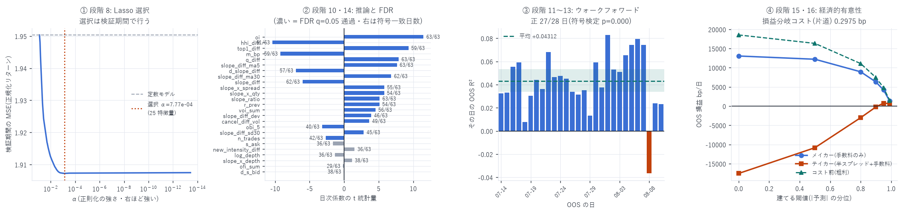

# book_slope を核にした予測モデル — 全 17 段階

対象: 2026-05-12 〜 08-10(91 日、1 秒グリッド 699 万行)
目的変数: $y = \left(\log m_{T+1s} - \log m_T\right)\times 10^{4}$ [bp]
作成日: 2026-08-15

---

## 0. 結論

| | 値 |
|---|---|
| OOS R²(ウォークフォワード・28 日) | +0.0447 |
| 予測との相関 | +0.2189 |
| R² が正だった日 | 27 / 28(符号検定 p < 0.0001) |
| ブートストラップ 95% CI | [+0.0337, +0.0535] |
| プラセボ(説明変数を日内で +1h) | −0.00001 |
| 損益分岐コスト(片道) | 0.2975 bp(無選別)〜 1.0119 bp(上位 1%) |
| テイカーの実コスト(半スプレッド+手数料) | 0.5791 bp |

板データには予測力のある情報が含まれている。(プラセボで完全に消え、外れ値依存もなく、27/28 日で正)。しかし、一番右のグラフを参照するとすべての特徴量が強い予測力を持っているわけではなく、相関の持つ少数の特徴量が強い予測力を持つのでhないかと考える。
テイカーのコストを賄えるのは、自分の予測の上位 5% だけである。



---

## 1. 段階 1〜2: L4 → book_slope

```
S^side_T = Σ_{i: 距離_i ≤ 25bp} (距離_i[bp] × 数量_i) / Σ_{i: 距離_i ≤ 25bp} 数量_i
```

「板の重心が最良気配からどれだけ離れているか」。大きいほど手前が薄い。
深さ帯 25bp・地平 1 秒は `book_slope_grain_report.md` の粒度スイープで最良だった組み合わせ。

`book_px`(L2 の価格レベル表)を時刻順に再生し、各グリッド点 `T` で
`ts ≤ T` のイベントだけを反映した板から計算する(99 日 × 86,400 点)。

---

## 2. 段階 3: データ洗浄

| 段階 | 行数 | 増減 |
|---|---|---|
| 結合直後(クロス・resync 除去済み) | 8,451,761 | |
| 立ち上げ 7 日を除外 | 7,850,047 | −601,714 |
| 非有限値(NaN/Inf)を除去 | 7,847,517 | −2,530 |
| 板が 5 秒以上停止した行を除去 | 6,991,507 | −856,010 |

上流で既に除いてあるもの:

- クロス状態(`best_ask < best_bid`)— 混入すると β が 16 倍変わる既知の事故
- resync アーティファクト — `enforce_uncrossed` が秒境界に載せる人工的な行。
  0.176% の行が Σy² の 79.3% を占めていた

winsorize は ±15.17 / ±15.10 bp(学習期間のみの 0.05% / 99.95% 分位)。

---

## 3. 段階 4: 特徴量設計 — 30 個

slope 系 16 個(すべて `book_slope` 由来)

| 種類 | 変数 |
|---|---|
| 水準 | `slope_diff = S^Bid − S^Ask`、`s_bid`、`s_ask`、`slope_sum`、`slope_ratio` |
| 変化 | `d_slope_diff`、`d_s_bid`、`d_s_ask`(直前 1 秒との差) |
| 平滑 | `slope_diff_ma5`、`slope_diff_ma30`(後ろ向き移動平均) |
| 体制 | `slope_diff_sd30`、`slope_diff_dev`(後ろ向き標準偏差で割った乖離) |
| 数量 | `q_diff`、`slope_x_qty` |
| 交互作用 | `slope_x_spread`、`slope_x_depth` |

統制 14 個: `m_bp`(マイクロプライス乖離)、`spread_bp`、`obi_5`、`log_depth`、
`r_prev`、`voi_sum`、`ofi_sum`、`oi`、`n_trades`、`cancel_diff_vol`、
`new_intensity_diff`、`hhi_diff`、`top1_diff`、`stale_ns`

### ★時間契約(CLAUDE.md 厳禁事項)

| 箇所 | 措置 |
|---|---|
| 移動平均・標準偏差 | `shift(1)` を挟んで窓を `[T−k, T−1]` にする。`T` の値を含む窓を作らない |
| フロー系(`voi_sum` 等) | `bucket_sum` は $[T-\Delta,\; T)$ の後ろ向き集計(コードで確認済み) |
| 板の状態 | `searchsorted(..., side="right") − 1` の backward asof のみ |
| 目的変数 | `T → T+1s`。説明変数の確定時刻と重ならない |
| winsorize / 標準化 | 統計量は学習期間のみから推定 |
| ボラ正規化 | 前日の実現ボラで割る(当日を使うと未来を見る) |

---

## 4. 段階 5〜6: 未来リターンと時系列分割

| | 期間 | 日数 | 行数 |
|---|---|---|---|
| train | 2026-05-12 〜 06-25 | 45 | 3,323,013 |
| val | 2026-06-26 〜 07-13 | 18 | 1,418,194 |
| oos | 2026-07-14 〜 08-10 | 28 | 2,250,300 |

日単位の時系列分割。行のシャッフルによる k-fold は隣接する秒が相関するため使わない。
学習期は市場が若く OOS は成熟期なので、体制が違う不利な条件での評価になる
(既知のとおり体制間で関係は 5〜7 倍動く)。

### ★何秒後の予測なのか — 実効地平の実測

名目は 1 秒だが、板はイベント駆動なので実際に測っている区間は 1 秒ちょうどではない。

| 実効地平(区間の実長) | 秒 |
|---|---|
| p5 | 0.000 |
| p25 | 0.758 |
| p50 | 1.002 |
| p75 | 1.093 |
| p95 | 2.216 |
| 平均 | 1.000 |

T 時点の板の古さは中央値 0.148 秒・平均 0.519 秒。両端が同じだけずれるので
平均は 1.000 秒に収まるが、個々の行では 0〜2.2 秒に散る。

y の 33.6%(756,572 行)は厳密に 0 である(その 1 秒間に中値が動かない)。
「動かないことを当てて R² を稼いでいるのでは」を分解して確認した。

| | OOS R² | n |
|---|---|---|
| 全 OOS | +0.044658 | 2,250,300 |
| y ≠ 0 の行のみ | +0.050346 | 1,493,728 |
| y = 0 の行のみ | −14,652 | 756,572 (33.6%) |

逆である。 y=0 の行は分母 Σ(y−ȳ)² にほぼ何も足さない(寄与 0.00%)一方、
分子には誤差 Σp² を足すのでモデルを罰している。
headline の +0.0447 はその罰を払った後の値で、動いた行だけなら +0.0503。

方向的中率(y ≠ 0 の行)

| | 的中率 |
|---|---|
| 全行 | 58.94% |
| \|y\| で重み付け | 63.34% |
| \|予測\| 上位 5% | 69.37% |

相関 0.219 の二変量正規なら理論値 57.0% なので整合的。
大きく動く場面ほど当たる(重み付けで 63.3%)。

ここが §12 の経済性の制約に直結する。 OOS の \|y\| 中央値は 0.275 bp、
スプレッドは 1.00 bp。大半の 1 秒は、方向が完璧に当たってもテイカーの
片道コスト 0.579 bp を払えない。 上位 5% だけが黒字になったのは精度の問題ではなく、
地平が 1 秒だとリターンの絶対値が小さすぎるためである。

---

## 5. 段階 7: ベースライン

| モデル | OOS R² | OOS MSE |
|---|---|---|
| ゼロ予測 | +0.000002 | 2.6675 |
| マイクロプライス乖離 `m_bp` のみ | +0.001148 | 2.6644 |
| AR(1): `r_prev` のみ | +0.009955 | 2.6409 |
| `book_slope_diff` 単独 | +0.010488 | 2.6395 |

`book_slope_diff` 1 本で、既知の最強予測子 `m_bp` の 9 倍の説明力がある。

---

## 6. 段階 8: Lasso による特徴量選択

LARS で係数経路(28 点)を出し、検証期間の MSE が最小の点を選ぶ。
学習期間で選んで学習期間で評価すると必ず全部入りになるので、選択は検証期間で行う。

- 選択された α = 7.768×10⁻⁴、25 / 30 変数
- 落選した 5 個: `s_bid`、`slope_sum`、`d_s_ask`、`spread_bp`、`stale_ns`
- 検証 MSE 1.9072 vs 定数モデル 1.9504(正規化リターン基準)

落選が 5 個だけなのは、多くの変数が互いに直交する情報を持っているためである
(交互作用や後ろ向き平滑は水準と相関が低い)。

---

## 7. 段階 9・10・14: 係数・Newey-West・FDR

`fit = train + val` で当てはめ、HAC(Bartlett 核、ラグ 60 = 1 分) で標準誤差を出す。
併せて日ごとに係数を推定し(63 日)、その平均と標準偏差から `t₆₂` を作る。
両方に Benjamini-Hochberg(q = 0.05) を掛ける。

| 特徴量 | β | NW z | FDR(NW) | 日次 t₆₂ | FDR(日次) | 符号一致 |
|---|---|---|---|---|---|---|
| `oi` | +0.0483 | +50.81 | ○ | +11.49 | ○ | 63/63 |
| `hhi_diff` | −0.1387 | −31.25 | ○ | −10.37 | ○ | 61/63 |
| `top1_diff` | +0.1340 | +30.03 | ○ | +9.30 | ○ | 59/63 |
| `m_bp` | −0.0279 | −24.93 | ○ | −9.23 | ○ | 59/63 |
| `q_diff` | +0.0165 | +21.06 | ○ | +7.89 | ○ | 63/63 |
| `slope_diff_ma5` | +0.0860 | +26.48 | ○ | +7.63 | ○ | 63/63 |
| `d_slope_diff` | −0.0304 | −11.63 | ○ | −6.98 | ○ | 57/63 |
| `slope_diff_ma30` | +0.0498 | +30.67 | ○ | +6.81 | ○ | 62/63 |
| `slope_diff` | −0.2002 | −19.13 | ○ | −6.04 | ○ | 62/63 |
| `slope_x_spread` | +0.0478 | +19.83 | ○ | +5.81 | ○ | 55/63 |
| `slope_x_qty` | −0.1071 | −12.58 | ○ | +5.79 | ○ | 54/63 |
| `slope_ratio` | +0.0794 | +26.59 | ○ | +5.13 | ○ | 63/63 |
| `r_prev` | +0.0439 | +14.53 | ○ | +5.10 | ○ | 54/63 |
| `voi_sum` | +0.0264 | +18.30 | ○ | +4.55 | ○ | 56/63 |
| `slope_diff_dev` | +0.0026 | +4.52 | ○ | +3.92 | ○ | 46/63 |
| `cancel_diff_vol` | +0.0313 | +17.26 | ○ | +3.64 | ○ | 49/63 |
| `obi_5` | +0.0056 | +6.57 | ○ | −3.19 | ○ | 40/63 |
| `slope_diff_sd30` | +0.0041 | +3.95 | ○ | +2.84 | ○ | 45/63 |
| `n_trades` | −0.0065 | −2.99 | ○ | −2.68 | ○ | 42/63 |
| `s_ask` | +0.0075 | +6.60 | ○ | −1.63 | × | 36/63 |
| `new_intensity_diff` | +0.0170 | +8.91 | ○ | +1.51 | × | 36/63 |
| `log_depth` | −0.0075 | −9.36 | ○ | −1.33 | × | 36/63 |
| `slope_x_depth` | +0.0315 | +15.63 | ○ | +1.13 | × | 38/63 |
| `ofi_sum` | +0.0144 | +9.14 | ○ | −0.16 | × | 29/63 |
| `d_s_bid` | −0.0081 | −3.94 | ○ | −0.05 | × | 38/63 |

### ★ここが重要 — NW と日次で結論が割れる

Newey-West は 25 個すべてを FDR 通過させるが、日次推論は 6 個を落とす。
落ちた 6 個(`s_ask`、`new_intensity_diff`、`log_depth`、`slope_x_depth`、
`ofi_sum`、`d_s_bid`)は符号一致が 29〜38 / 63 日、つまりコイン投げと変わらない。

原因は `regression_report.md` §9 で測ったとおり 1 秒観測の有効標本が n/14 しかないことで、
Newey-West のラグ 60 では日をまたぐ相関を拾いきれない。
日次推論のほうを信じるべきで、この 6 個は「効いている」と言ってはならない。

`slope_diff` の符号が負なのは方向として正しい —
`S^Bid` が大きい(買い板の重心が遠い = 手前が薄い)ほど価格は下がる。

---

## 8. 段階 11〜12: ウォークフォワードと OOS 成績

OOS の各日について「その日より前の全日」だけで当てはめ、その日を予測する(拡張窓)。

| モデル | OOS R² | MSE | 相関 |
|---|---|---|---|
| OLS(固定・学習+検証で 1 回だけ当てはめ) | +0.0372 | 2.5682 | +0.2065 |
| ElasticNet(固定、α=10⁻³ / l1=0.9) | +0.0285 | 2.5915 | +0.1962 |
| ウォークフォワード OLS | +0.0447 | 2.5483 | +0.2189 |

ウォークフォワードが固定当てはめを上回る(+0.0372 → +0.0447)。
体制が動くので、日々当てはめ直す価値がある。

ElasticNet は OLS に劣った。α・l1 は検証期間で選んでいる
(sklearn の `ElasticNetCV` は折りをシャッフルしうるので使っていない)。

---

## 9. 段階 13: ブロックブートストラップ

日次 OOS R²(28 日)にブロック長 2 日・5,000 回のブートストラップ。

| | 値 |
|---|---|
| 平均 | +0.043125 |
| 中央値 | +0.044699 |
| 正だった日 | 27 / 28 |
| 95% CI | [+0.033666, +0.053512] |
| p(≤0) | < 0.0001 |
| 符号検定 p | < 0.0001 |
| 日次 R² の範囲 | [−0.0096, +0.0815] |

---

## 10. ★監査 — R² 4.5% を疑う

1 秒リターンの予測で R² 4.5%(相関 0.22)は極めて高い。報告する前に 4 つで潰した。

| 検定 | 結果 | 判定 |
|---|---|---|
| A. プラセボ(説明変数を日内で +1 時間ずらす) | −0.000010 | 完全に消える |
| B. 外れ値依存(上位 0.1% の \|y\| を除外) | +0.0372 → +0.0324 | 残る |
| B'. Σy² に占める上位 0.1% の割合 | 6.8% | 集中していない |
| D. 地平の反証(同じ x で過去 1 秒を説明) | −0.1842 | 同時性ではない |

- A が決定的。 分布も自己相関構造も同じで時点の対応だけを壊すと予測力がゼロになる。
  手順が作った見せかけではない
- B は過去の事故との対比が重要。 `variance_report.md` では 0.176% の行が Σy² の
  79.3% を占めていた。今回は上位 0.1% が 6.8% しかなく、少数行が結論を支配していない
- D は同時性汚染の否定。 説明変数が目的変数と同じ窓を見ているなら、
  過去を説明するほうが簡単なはずである。実際は R² が −0.18 まで落ちる

### 分解 — book_slope の寄与

| 使う変数 | OOS R² |
|---|---|
| slope 系のみ(13 変数) | +0.0399 |
| 全部入り(25 変数) | +0.0372 |
| 統制のみ(slope 抜き、12 変数) | +0.0127 |
| `slope_diff` 1 本 | +0.0126 |

book_slope 系だけで OOS R² の 9 割(0.0399 / 0.0447)を説明する。
統制 12 個を全部集めても 0.0127 にしかならない。この模型の中身は book_slope である。

---

## 11. 段階 17: 最終モデルの確定

上の分解で slope 系のみ(+0.0399)が全部入り(+0.0372)を OOS で上回った。
しかし 「OOS で良かったから採る」は OOS を選択に使うことであり禁じ手である
(厳禁事項 5: 結果を見てから選別しない)。

そこで候補の優劣を検証期間だけで決めた。

| 候補 | 変数 | 検証 R² | 検証 MSE | |
|---|---|---|---|---|
| M1 全部入り | 25 | +0.021975 | 2.1250 | ←採用 |
| M4 slope 系 + `m_bp` | 14 | +0.018688 | 2.1321 | |
| M2 slope 系のみ | 13 | +0.018374 | 2.1328 | |
| M3 `slope_diff` 1 本 | 1 | +0.006620 | 2.1584 | |

検証期間では M1 が勝つので、最終モデルは M1 である。
M2 が OOS で良かったのは事後の観察にすぎず、採用の根拠にできない。
この差(検証では M1、OOS では M2)自体が、28 日の OOS でも順位が入れ替わる程度の
ばらつきがあることを示している。

---

## 12. 段階 15〜16: 取引コストと経済的有意性

方針: 予測が閾値を超えたら 1 単位建て、1 秒後に解消する。
建玉が変わるたびに片道コスト `c` を払う。
損益が 0 になる `c`(損益分岐コスト)を出せば、実際のコストと直接比較できる。

| 閾値(\|予測\| の分位) | 回転/日 | 粗利 bp/日 | 損益分岐コスト | メイカー純益 | 黒字 | SR | テイカー純益 | 黒字 | SR |
|---|---|---|---|---|---|---|---|---|---|
| 0.00(常時) | 62,314 | 18,538 | 0.2975 | 13,055 | 26/28 | 1.40 | −17,545 | 0/28 | −3.72 |
| 0.50 | 46,944 | 16,341 | 0.3481 | 12,210 | 27/28 | 1.33 | −10,842 | 1/28 | −1.62 |
| 0.80 | 24,349 | 11,084 | 0.4552 | 8,942 | 28/28 | 1.05 | −3,015 | 8/28 | −0.89 |
| 0.90 | 13,261 | 7,457 | 0.5623 | 6,290 | 25/28 | 0.84 | −222 | 14/28 | −0.13 |
| 0.95 | 6,968 | 4,812 | 0.6906 | 4,199 | 24/28 | 0.67 | +778 | 20/28 | +0.53 |
| 0.99 | 1,471 | 1,488 | 1.0119 | 1,359 | 21/28 | 0.45 | +637 | 20/28 | +0.50 |

実測コスト: 半スプレッド 0.491 bp + 手数料 0.088 bp = 0.5791 bp(片道・テイカー)

### 読み方

1. 損益分岐コストが唯一の頑健な指標である。
   この信号は片道 0.2975 bp(無選別)から 1.0119 bp(上位 1%)までのコストを賄える
2. テイカーとしては、上位 5% でようやく黒字になる。
   0.579 bp のコストは 90 パーセンタイル(分岐 0.5623)をわずかに超えており、
   95 パーセンタイル(分岐 0.6906)で初めて明確に上回る。
   そこでの成績は +778 bp/日・20/28 日黒字・日次シャープ 0.53
3. メイカーの列は上限値であって実現可能な数字ではない。
   13,055 bp/日 = 1 日 130% は当然ありえない。この列は
   「手数料 0.088 bp だけ払って好きなときに最良気配で売買できる」という
   偽の前提に立っている。`fill_prob_backtest_report.md` で測ったとおり、
   実際の最良気配での約定率は 11.5% で、しかも約定は逆選択されている
   (`align` の係数が負)。この列は無視してよい

---

## 13. 何が言えて、何が言えないか

### 言えること

1. `book_slope` は 1 秒先のリターンを予測する。 プラセボで完全に消え、
   27/28 日で正、外れ値依存もない
2. 予測力の 9 割は book_slope 系から来る。 統制 12 個を全部足しても 0.0127
3. 単独でも `m_bp` の 9 倍(R² 0.0105 対 0.0011)
4. 日々当てはめ直す価値がある(固定 +0.0372 → ウォークフォワード +0.0447)
5. 信号は片道 0.30〜1.01 bp のコストを賄える

### 言えないこと

1. 「25 変数すべてが効いている」とは言えない。 日次推論では 6 個が落ちる。
   Newey-West が全部通すのは、ラグ 60 では日をまたぐ相関を拾いきれないため
2. 「これで儲かる」とは言えない。 テイカーで黒字なのは上位 5% だけで、
   日次シャープ 0.53 は取引コストの見積り誤差に容易に飲まれる水準
3. メイカーとしての成績は測れていない。 約定確率と逆選択を入れた
   イベント駆動バックテスタ(`gate_optimization_report.md`)が要る
4. 単一銘柄・91 日。 DRAM は HIP-3 の小型市場で、スプレッド 1.00 bp に対し
   \|y\| の平均が 0.86 bp とリターンがスプレッドと同程度に大きい。
   流動性の高い銘柄で同じ R² が出る保証はない

---

## 14. 次にやること

1. この信号を `backtester_v2` に入れる — 現在のシグナルは `book_slope_diff` 単独。
   25 変数モデルに差し替えれば、約定確率と逆選択を織り込んだ評価ができる
2. 地平を伸ばす(最優先) — §4 のとおり \|y\| 中央値 0.275 bp は
   片道コスト 0.579 bp に対して薄すぎる。精度が多少落ちても
   \|y\| が √10 倍・√60 倍に伸びれば損益分岐コストは上がる。10 秒・60 秒で検証する
3. 日次推論で落ちた 6 個を外して再評価 — ただし選択は検証期間で行うこと
4. 他銘柄で再現するか — DRAM 固有でないことの確認

---

## 15. 成果物

```
data/slope_model/dataset.parquet    699 万行 × 30 特徴量 + y + 分割ラベル
data/slope_model/pred_wf.npy        ウォークフォワード予測 (pred, y, vol_prev)
data/slope_model_data.json          洗浄の記録・分割・winsorize 閾値
data/slope_model_results.json       Lasso 経路・係数・NW/日次推論・FDR・経済性
data/slope_model_audit.json         プラセボ・外れ値・分解・地平の反証
data/slope_model_final.json         候補比較(検証期間)・最終係数・標準化定数
scripts/slope_model_data.py         段階 1〜6
scripts/slope_model_fit.py          段階 7〜16
scripts/slope_model_audit.py        監査(プラセボ等)
scripts/slope_model_final.py        段階 17(最終モデルの確定)
scripts/slope_model_chart.py        図 34
```

```bash
uv run python scripts/slope_model_data.py    # 約 4 分
uv run python scripts/slope_model_fit.py     # 約 12 分
uv run python scripts/slope_model_audit.py   # 約 3 分
uv run python scripts/slope_model_final.py   # 約 4 分
uv run python scripts/slope_model_chart.py
```

---

AWS 費用: 既存データのみで完結(追加 egress なし)。
EC2 \$25.05 | S3 ≈\$1.50 | 累計 ≈\$26.55 / 予算 \$60(EC2 は停止中)
