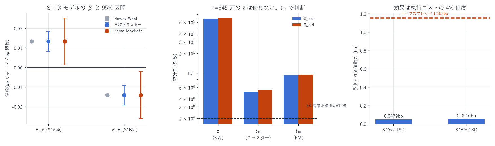

# r_{t+h} = α + β_A·S^Ask_t + β_B·S^Bid_t + γ·X_t + ε の推定と検定

粒度: 1 秒グリッド、深さ帯 25bp、地平 h = 1 秒
標本: 全 99 日・8,451,761 行(resync 汚染とクロス行は除外、y はウィンザライズ)
作成日: 2026-08-15

---

## 0. 結論

| | β_A(S^Ask) | β_B(S^Bid) |
|---|---|---|
| 係数(S + X モデル) | +0.013345 | −0.014203 |
| z(Newey-West) | +68.8 | −70.5 |
| t₉₈(日次クラスター) | +5.13 | −5.55 |
| p 値(t₉₈) | 1.5 × 10⁻⁶ | 2.5 × 10⁻⁷ |
| t₉₈(Fama-MacBeth) | +9.24 | −9.46 |
| p 値(FM) | 6.0 × 10⁻¹⁵ | 2.0 × 10⁻¹⁵ |
| 日次推定で符号が逆だった日 | 6 / 98 | 8 / 98 |
| ブロック・ブートストラップ 95% CI | [+0.0393, +0.0774] | [−0.0781, −0.0415] |

β_A > 0、β_B < 0 はいずれも 3 系統すべてで有意。ランダムではない。

- 符号は理論と一致: 売り板が最良気配から遠い(= 上値が薄い)と価格は上がる。
  買い板が遠い(= 下値が薄い)と価格は下がる
- どの検定でも 5% 水準を大きく超える。最も保守的な日次クラスターでも t₉₈ = 5.1〜5.6
- 日次推定の符号一貫性が最も強い証拠: 98 日中 90〜92 日で期待どおりの符号



---

## 1. 推定式と時間契約

```
r_{t+h} = α + β_A·S^Ask_t + β_B·S^Bid_t + γ·X_t + ε_{t+h}

S^side_t = Σ_{i: 距離_i ≤ 25bp} (距離_i[bp] × 数量_i) / Σ_{i: 距離_i ≤ 25bp} 数量_i
r_{t+h}  = ( log mid(T+1s) − log mid(T) ) × 10⁴   [bp]
X_t      = 既存のマイクロストラクチャー特徴量 33 個
```

- `S^Ask_t`, `S^Bid_t`, `X_t` はすべて T 時点までに確定した情報のみ
- `r_{t+h}` は T から先だけ。x の期間と y の期間は T で接して重ならない
- 深さ帯 25bp・地平 1 秒は `book_slope_grain_report.md` の実測(最良)に基づく

---

## 2. 推定結果

### (a) S のみ(R² = 0.00423)

| | β | z(NW) | t₉₈(クラスター) | t₉₈(FM) | FM 日次中央値 | 符号逆 |
|---|---|---|---|---|---|---|
| S^Ask | +0.021686 | +121.7 | +5.80 | +8.73 | +0.0318 | 6 / 98 |
| S^Bid | −0.022845 | −131.4 | −6.19 | −8.90 | −0.0372 | 92 / 98 が負 |

### (b) S + X(R² = 0.02439、X は 33 変数)

| | β | z(NW) | t₉₈(クラスター) | t₉₈(FM) | FM 日次中央値 | 符号逆 |
|---|---|---|---|---|---|---|
| S^Ask | +0.013345 | +68.8 | +5.13 | +9.24 | +0.0310 | 6 / 98 |
| S^Bid | −0.014203 | −70.5 | −5.55 | −9.46 | −0.0370 | 90 / 98 が負 |

X を入れると係数は 38% 縮むが、有意性は保たれる。
他の 33 変数で説明できる部分を除いても、板の傾きは独立した寄与を持つ。

### 検定手法ごとの読み方

| 手法 | t / z | 使いどころ |
|---|---|---|
| Newey-West(L=5) | ±69〜131 | 使わない。n = 845 万ではどんな微小値も有意になる |
| 日次クラスター(G=99, 自由度 98) | ±5.1〜6.2 | 最も保守的。日内の任意の系列相関を許容。これを主に見る |
| Fama-MacBeth(日ごとに推定して平均) | ±8.7〜9.5 | 日を独立標本とみなす。クラスターより緩い |
| 符号の一貫日数 | 90〜92 / 98 | 分布に依存しない。最も直感的な証拠 |

---

## 3. 対称性の検定 — β_A = −β_B か

`book_slope_diff = S^Bid − S^Ask` という 1 本にまとめてよいかを検定した。

```
H₀: β_A + β_B = 0
```

| | 値 |
|---|---|
| β_A | +0.021686 |
| β_B | −0.022845 |
| 和 | −0.001158 |
| SE(日次クラスター) | 0.000827 |
| t₉₈ | −1.40 |

棄却されない(和は個々の係数の大きさの 5.2% にすぎない)。
左右は対称であり、差 `S^Bid − S^Ask` の 1 本にまとめて情報を失わない。
`panel_v2_report.md` で `book_slope_diff` を使ったのは正当だったことになる。

なお S^Ask と S^Bid の相関は +0.302 しかなく、両者を同時に入れても共線性の問題はない。

---

## 4. 経済的大きさ

| | 値 |
|---|---|
| SD(S^Ask) | 3.592 bp |
| SD(S^Bid) | 3.636 bp |
| 1 SD あたりの予測値動き(S^Ask) | 0.0479 bp |
| 1 SD あたりの予測値動き(S^Bid) | 0.0516 bp |
| ハーフスプレッドの中央値 | 1.1533 bp |
| 比 | 約 4.2 〜 4.5% |

統計的には極めて有意だが、経済的には執行コストの 4% 程度。
これまでのすべての特徴量と同じ結論で、単独でスプレッドを叩く根拠にはならない
(`regression_report.md` §6)。用途はパッシブ執行の傾け・逆選択回避である。

---

## 5. 注意 — X 側の係数は読まないこと

標準化係数の上位は `hhi_diff`(−0.177)と `top1_diff`(+0.174)だが、
この 2 つの相関は +0.9896 で、OLS が大きさの近い逆符号を割り当てる典型的な共線性の症状である。

X の中で相関 0.9 を超える組:

| 組 | 相関 |
|---|---|
| `hhi_diff` ↔ `top1_diff` | +0.9896 |
| `hhi_new_bid` ↔ `top1_share_new_bid` | +0.9808 |
| `hhi_new_ask` ↔ `top1_share_new_ask` | +0.9806 |
| `lambda_cancel_bid` ↔ `lambda_new_buy` | +0.9702 |
| `lambda_cancel_ask` ↔ `lambda_new_sell` | +0.9687 |

本レポートの対象である β_A / β_B は影響を受けない(S^Ask ↔ S^Bid の相関は 0.302、
X との相関も 0.9 を超える組は無い)。しかし γ の各要素を個別に解釈してはいけない。
X の中の効果を知りたい場合は、重複する変数を 1 本化するか
`analysis_proposal.md` の DML を使うこと。

---

## 6. 成果物

```
data/slope25/YYYY-MM-DD.parquet     25bp 帯の傾きと数量(1 秒 × 99 日)
data/slope_regression.json          3 モデル × 全係数 × 3 系統の検定
data/slope_regression_extra.json    対称性検定・共線性・経済的大きさ
scripts/build_slope25.py            25bp 傾きの算出(途中再開可)
scripts/slope_regression.py         推定と検定
scripts/slope_regression_extra.py   対称性・共線性・経済的大きさ
scripts/slope_regression_chart.py   図 29
```

```bash
uv run python scripts/build_slope25.py        # 約 20 分(99 日)
uv run python scripts/slope_regression.py     # 約 8 分
uv run python scripts/slope_regression_extra.py
uv run python scripts/slope_regression_chart.py
```

---

AWS 費用: 既存データのみで完結(追加 egress なし)。
EC2 \$25.05 | S3 ≈\$1.87 | 累計 ≈\$26.92 / 予算 \$60(EC2 は停止中)
