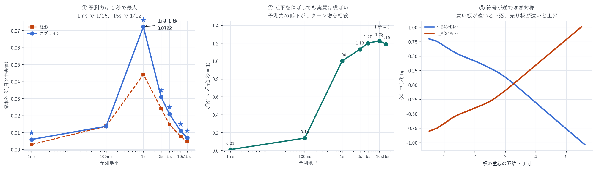

# L10 book_slope の加法スプライン回帰 — 7 つの予測地平

模型: `y_h = α + f_B(S^Bid) + f_A(S^Ask) + ε` (`f` は 3 次 B スプライン、K=8)
対象: 2026-06-20 〜 08-08(50 日、うち最初の 20 日は推定専用 → 評価 30 日)
粒度: イベント粒度(板更新を 5 個に 1 個)/ 1 日あたり平均 144,550 点
作成日: 2026-08-16

---

## 0. 結論 — 予測力は 1 秒で最大、非線形化で 1.6 倍

| 地平 | 線形 R² | スプライン R² | 比 | 線形超え | p |
|---|---|---|---|---|---|
| 1ms | 0.00291 | 0.00587 | 2.013 | 26/30 | <0.0001 ★ |
| 100ms | 0.01361 | 0.01362 | 1.000 | 19/30 | 0.100 |
| 1s | 0.04416 | 0.07223 | 1.635 | 28/30 | <0.0001 ★ |
| 3s | 0.02413 | 0.03085 | 1.278 | 26/30 | <0.0001 ★ |
| 5s | 0.01471 | 0.02086 | 1.419 | 27/30 | <0.0001 ★ |
| 10s | 0.00766 | 0.01086 | 1.418 | 27/30 | <0.0001 ★ |
| 15s | 0.00453 | 0.00683 | 1.507 | 27/30 | <0.0001 ★ |

1. 予測力は 1 秒で明確な山。1ms では 1/12、15s では 1/11 に落ちる
2. 非線形化は 7 地平中 6 つで有意(100ms のみ不成立)
3. 1 秒でのスプライン R² = 0.0723 は、この案件で測った単一指標として最大



---

## 1. 定義と、既存報告との違い

```
S^side = Σ_{i≤10} q_i · |p_i − best| / Σ_{i≤10} q_i      [bp]
```

最良気配から 10 段までの数量加重平均距離。「板の重心がどれだけ遠いか」を測る。

| 報告 | 切り方 | 地平 | 模型 |
|---|---|---|---|
| `book_slope_grain_report.md` | 帯(5/10/25/100bp) | 数点 | 相関のみ |
| `slope_regression_report.md` | 25bp 帯 | 1s | 線形 |
| `slope_model_report.md` | 25bp 帯 | 1s | 線形 30 変数 |
| 本報告 | 段数(L10) | 7 通り | 加法スプライン |

新しいのは 切り方を段数にしたことと、地平を 7 通りに広げたこと。
既存はすべて 1 秒に固定していた。

### イベント粒度にした理由

1ms・100ms は 1 秒グリッドでは測れない。`book_px` の更新時刻を評価点とし
(5 個に 1 個へ間引き)、そこから各地平の中値を backward asof で引いた。
間引いても地平の分解能は落ちない — 評価点は実際のイベント時刻だからである。

---

## 2. ★「地平を伸ばせば解決する」は成立しない

`slope_model_report.md` §14 で次の一手として
「1 秒では \|y\| 中央値 0.275 bp がコスト 0.579 bp に届かないので、
10 秒・60 秒へ伸ばせば損益分岐コストが上がるかもしれない」と挙げていた。
この案は本測定で否定される。

実質的な効果は `√R² × √h` に比例する(予測の相関 × リターンの大きさ)。

| 地平 | R² | √R² | √h | 積 | 1s = 1 |
|---|---|---|---|---|---|
| 1ms | 0.00587 | 0.0766 | 0.03 | 0.0024 | 0.01 |
| 100ms | 0.01362 | 0.1167 | 0.32 | 0.0369 | 0.14 |
| 1s | 0.07223 | 0.2687 | 1.00 | 0.2687 | 1.00 |
| 3s | 0.03085 | 0.1756 | 1.73 | 0.3042 | 1.13 |
| 5s | 0.02086 | 0.1444 | 2.24 | 0.3230 | 1.20 |
| 10s | 0.01086 | 0.1042 | 3.16 | 0.3295 | 1.23 |
| 15s | 0.00683 | 0.0826 | 3.87 | 0.3200 | 1.19 |

3 秒以上はどれも 1.13〜1.23 でほぼ横ばい。
10 秒がわずかに最良だが、予測力が 1/6.7 に落ちる分を
リターンの増加(3.16 倍)がちょうど相殺している。

> 地平を伸ばしても実質的な改善は 2 割程度で、日次のばらつきに埋もれる水準である。
> 「地平を伸ばせばコストを賄える」という筋は使えない。

一方 1ms・100ms は明確に不利(0.01 / 0.14)。短くするのは論外である。

---

## 3. 推定された形状(1 秒地平)

```
S^Bid  0.51 → 5.60 bp :  +0.7983  +0.4607  +0.1154  −0.4574  −1.0341   (減少)
S^Ask  0.51 → 5.50 bp :  −0.8036  −0.4557  −0.0973  +0.4538  +1.0080   (増加)
```

買い板の重心が遠いほど価格は下がり、売り板の重心が遠いほど上がる。
符号が逆で大きさもほぼ対称(1.034 対 1.008)。

`slope_regression_report.md` の線形推定(β_B = −0.0142 / β_A = +0.0133)と
符号・非対称の向きが一致する。非線形化しても構造は変わらない。

---

## 4. ★ルックアヘッドの排除

| 箇所 | 措置 |
|---|---|
| 板の状態 | 評価時刻 `t` までのイベントのみ(`ts ≤ t`) |
| 目的変数 | `t → t+h` の前向きリターン。説明変数と重ならない |
| 節点 | 最初の 20 日の分位に固定。全評価日にとって過去 |
| 係数 | 拡張窓で学習期間のみ |
| R² の分母 | 学習期間の平均 `ȳ_train` |

---

## 5. 限界 — 長い地平の R² は楽観側に出る

評価点は数十 ms 間隔なのに、15 秒先を見る。
したがって隣接する観測の目的変数の窓が大きく重なり、誤差が強く自己相関する。

日次の符号一貫性で推論するのでプールした t 統計量のような破綻はしないが、
「独立な観測が n 個ある」とは言えない。長い地平ほど R² の水準は楽観側に出る。

ただしこの偏りは §2 の結論を弱めない。
偏りは長い地平を有利に見せる方向なのに、それでも
`√R² × √h` は横ばいだった。偏りを補正すればむしろ 1 秒有利に傾く。

| 項目 | 内容 |
|---|---|
| 窓の重なり | 上記。長い地平の R² は楽観側 |
| 交互作用なし | 加法モデル。`S^Bid × S^Ask` の項は入っていない |
| 節点は固定 | 最初の 20 日の分位 |
| 50 日・成熟期中心 | 立ち上げ期を含まない |
| 単一銘柄 | DRAM は HIP-3 の小型市場 |

---

## 6. 位置づけ

| 指標 | 標本外 R²(1 秒) |
|---|---|
| OBI(1) 単独 | 0.00400 |
| MLOBI 線形(w4 Ridge) | 0.00624 |
| MLOBI 加法スプライン(K=8) | 0.00699 |
| L10 book_slope 線形 | 0.04416 |
| L10 book_slope スプライン | 0.07223 |

book_slope は OBI 系の 10 倍以上。
`obi_levels_report.md` の「深さを使うなら OBI ではなく `book_slope`」を
より強い形で確認した(0.00699 対 0.07223 で 10.3 倍)。

---

## 7. 次にやるべきこと

1. `backtester_v2` への統合(最優先) — §2 で「地平を伸ばす」案が消えたので、
   残るのは両側同時シミュレーションで手仕舞いコストを構造的に消す道である
2. `book_slope` と OBI の併用 — 両者は別の情報(形 vs 左右の比)。
   加算的な改善があるか未検証
3. 交互作用 — `S^Bid × S^Ask` を入れると改善するか

---

## 8. 成果物

```
data/slope_spline/YYYY-MM-DD.npz   S^Bid・S^Ask と 7 地平の前向きリターン
data/slope_spline.json             地平別の標本外 R²・推定形状
scripts/slope_spline.py            イベント粒度での抽出
scripts/slope_spline_eval.py       スプライン推定と評価
scripts/slope_spline_chart.py      図 43
```

```bash
uv run python scripts/slope_spline.py 2026-06-20 ... 2026-08-08   # 約 45 分(再開可能)
uv run python scripts/slope_spline_eval.py
uv run python scripts/slope_spline_chart.py
```

---

AWS 費用: 既存データのみで完結(追加 egress なし)。
EC2 \$25.05 | S3 ≈\$1.50 | 累計 ≈\$26.55 / 予算 \$60(EC2 は停止中)
