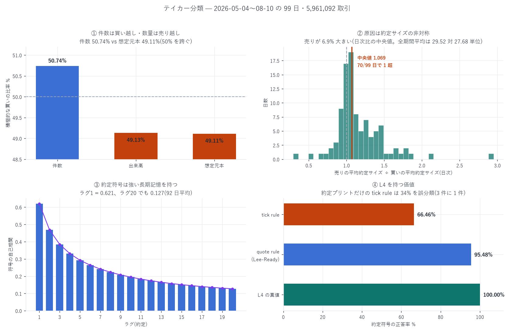

# 全期間・全約定のテイカー分類 — Aggressive Buy / Aggressive Sell

対象: 2026-05-04 〜 08-10(99 日)、5,961,092 取引(README の「約定 596 万」と一致)
作成日: 2026-08-21

---

## 0. 結論

| | Aggressive Buy | Aggressive Sell | 買い比率 |
|---|---:|---:|---:|
| 件数 | 3,024,746 | 2,936,346 | 50.74% |
| 出来高(単位) | 83,717,544 | 86,683,660 | 49.13% |
| 想定元本(USD) | 4,717,402,948 | 4,888,487,579 | 49.11% |
| 平均約定サイズ | 27.678 単位 | 29.521 単位 | — |

★件数では買いが多いのに、数量では売りが多い。この符号の逆転が本報告の中心である。
原因は約定サイズの非対称で、積極的な売りは積極的な買いより 6.9% 大きい
(日次比の中央値 1.069、99 日中 70 日で 1 超、対数比の t 検定 p=0.0001)。

そして統計の単位を正すと、件数の買い越しは有意でなく、数量の売り越しは有意である(§3)。

副産物として L4 の値段が測れた: 真値があるので推定則の正答率を出せる。
tick rule 66.46% / quote rule(Lee-Ready)95.48% — 約定プリントだけなら 3 件に 1 件を誤分類する(§6)。



---

## 1. 分類の根拠 — 推定ではなく真値である

一般のマイクロストラクチャー研究は約定の符号を tick rule / Lee-Ready で推定する。
本案件の `node_fills` は構造上それが要らない。本日、全件で検証した:

| 検証項目 | 結果 |
|---|---|
| 1 取引(`tid`)あたりの行数 | 131,800 件すべてが「crossed=True 1 本 + crossed=False 1 本」の 2 行(標本日) |
| taker と maker の `side` | 完全に相補(true/B 67,634 = false/A 67,634、逆も同様) |
| `dir` との整合 | side=B は {Open Long, Close Short, Short>Long} と 100% 一致、side=A は {Open Short, Close Long, Long>Short} と 100% 一致 |

```
crossed = True の行 = テイカー
  その side = "B" → Aggressive Buy(買い手が板を叩いた)
  その side = "A" → Aggressive Sell
```

> 訂正: 作業中に `liquidation` の非 null 件数(27,515)を清算件数と読み違えた。
> この列は null / false / true の 3 値で、真の清算は 71 件(0.05%)だった。
> 全期間では 17,557 件(0.295%)。

## 2. 日次の分布

| | 平均 | 中央値 | sd | 範囲 |
|---|---:|---:|---:|---:|
| 件数の買い比率 | 0.5056 | 0.5079 | 0.0734 | [0.054, 0.683] |
| 出来高の買い比率 | 0.4782 | 0.4897 | — | — |
| 元本の買い比率 | 0.4787 | 0.4900 | — | — |

範囲の下限 0.054(= その日は 94.6% が売り)が示すとおり、日によって極端に片寄る。

## 3. ★統計の単位 — ここで結論が変わる

素の二項検定は p = 4.7e-287 を出す。だがこれは使ってはいけない値である。

| 段階 | 内容 |
|---|---|
| 素の二項検定(取引単位) | n=5,961,092 → p=4.7e-287 |
| 自己相関を入れると | lag20 までの分散膨張係数 VIF ≥ 10.48 → 有効標本 ≤ 568,891 |
| 実際の集塊は日単位 | 日次の買い比率 sd は 0.0734。独立な取引なら 0.0020 のはずで、実測は 36 倍 |

日を単位にした検定が正しい:

| 指標 | 平均 | t 検定 p | Wilcoxon p | 0.5 超の日 |
|---|---:|---:|---:|---:|
| 件数の買い比率 | 0.5056 | 0.4506 | 0.0099 | 62/99 |
| 出来高の買い比率 | 0.4782 | 0.0079 | — | 39/99 |
| 元本の買い比率 | 0.4787 | 0.0094 | — | 38/99 |

- 件数の買い越し(+0.74pp)は平均の検定では有意でない(p=0.45)。
  ただし Wilcoxon は p=0.0099 で 62/99 日 — 中央値の日には買い越しがあるが、
  少数の極端な売り越し日が平均を引き戻している(§C-11 の典型)
- 数量・元本の売り越しは有意(p=0.008〜0.009、39/99・38/99 日)

> 報告 42 で踏んだ罠と同じ形である。標本が数百万あっても、
> 集塊を無視した p 値は意味を持たない。

## 4. ★約定サイズの非対称 — 最も頑健な発見

| | 値 |
|---|---:|
| 売り/買い の平均約定サイズ比(全期間) | 29.521 / 27.678 = 1.0666 |
| 日次比の中央値 | 1.0694 |
| 1 を超えた日 | 70/99 |
| 対数比の t 検定 | p = 0.0001 |
| 同 Wilcoxon | p < 0.0001 |

積極的な売りは積極的な買いより一貫して大きい。
件数の買い越しと数量の売り越しが両立するのはこのためである。

これは funding の実測(報告 38 §3-3: 年率 +28.6%、84.8% の時間で正 = 群衆はロング)と整合する。
群衆は小口で買い、大口が売るという構図で、清算の内訳(§7)もこれを裏づける。

## 5. 符号の自己相関 — 教科書どおりの長期記憶

取引時間での自己相関(92 日平均):

| ラグ | 1 | 2 | 3 | 5 | 10 | 20 |
|---|---:|---:|---:|---:|---:|---:|
| ρ | +0.6206 | +0.4691 | +0.3849 | +0.2926 | +0.1948 | +0.1272 |

- べき則 `C(L) ~ L^(−γ)` を当てると γ = 0.553。
  文献値(Bouchaud らの注文フロー長期記憶、γ ≈ 0.5)とほぼ一致する
- lag1 の 0.6206 は「次の取引も同じ方向である確率 81.0%」に相当
- 上場 99 日の HIP-3 市場で、成熟市場と同じ統計則が成立している

## 6. ★L4 の値段 — 推定則はどれだけ当たるか

真値があるので、公開データしか無い場合の誤差を直接測れる。全 5,961,092 取引:

| 推定則 | 正答率 | 誤分類率 |
|---|---:|---:|
| tick rule(直前の約定価格と比較) | 66.46% | 33.54% |
| quote rule / Lee-Ready(mid と比較) | 95.48% | 4.52% |
| うち mid ちょうどで tick rule に落ちた割合 | 0.40% | — |

約定プリントだけしか無ければ 3 件に 1 件を間違える。板(mid)があれば 95.5% まで届く。
L4 が最後に埋めるのはその残り 4.52% である。

### tick rule が振るわない機構(私の当初の仮説は外れた)

「同値の取引が多く、前の符号を継承するだけだから当たらない」と考えたが、逆だった
(成熟期 11 日で分解):

| 直前の約定価格との関係 | 割合 | 正答率 |
|---|---:|---:|
| 価格上昇 | 35.65% | 64.81% |
| 価格下落 | 35.72% | 63.90% |
| 同値(前を継承) | 28.63% | 73.70% |

同値の場合がいちばん正確で、価格が動いた場合こそ外れる。理由は
取引と取引の間に気配そのものが動くため。前の約定価格との差は、
テイカーの方向ではなく気配の移動を映してしまう。
Lee-Ready が圧勝するのは、比較対象が「その時点の mid」だからである。

## 7. 層別

| 層 | 件数 | 全体比 | 買い比率(件) | 買い比率(元本) |
|---|---:|---:|---:|---:|
| 通常(清算・TWAP・優先料なし) | 5,026,118 | 84.32% | 49.52% | 49.47% |
| TWAP | 597,263 | 10.02% | 65.23% | 54.70% |
| 優先手数料つき | 320,154 | 5.37% | 44.91% | 46.98% |
| 清算 | 17,557 | 0.295% | 13.40% | 8.62% |

- 清算は 86.6% が売り(元本では 91.4%)。清算されたのは圧倒的にロングで、
  funding が 84.8% の時間で正だったこと(群衆はロング)と独立に一致する
- TWAP は 65.23% が買い。報告 42 の activated 実測(5,499 B vs 2,829 A = 66% 買い)と一致。
  ただし元本では 54.70% で、買い TWAP のほうが小口
- 優先手数料つきが 5.37%。報告 38 で見つけた IOC 優先料が実際に使われている規模で、
  やや売り寄り(44.91%)

`dir` 別(side との対応が定義上一対一なので分類の検証):
Open Short 27.44% / Open Long 25.10% / Close Short 24.95% / Close Long 21.11% /
Long>Short 0.71% / Short>Long 0.70%。新規建てが 52.5%、決済が 46.1%。

## 8. 体制別・時間帯別

| 体制 | 期間 | 取引 | 買い(件) | 買い(元本) | TWAP% | 優先% |
|---|---|---:|---:|---:|---:|---:|
| 1 | 05-04〜05-23 | 290,039 | 49.32% | 47.12% | 22.02% | 4.75% |
| 2 | 05-24〜06-12 | 519,302 | 52.15% | 47.46% | 13.27% | 4.52% |
| 3 | 06-13〜07-02 | 975,584 | 52.36% | 48.07% | 20.54% | 6.29% |
| 4 | 07-03〜07-22 | 1,755,651 | 50.90% | 49.07% | 8.45% | 4.76% |
| 5 | 07-23〜08-10 | 2,420,516 | 49.84% | 49.82% | 4.78% | 5.70% |

- 元本の買い比率が 47.12% → 49.82% と単調に 50% へ近づく。市場が成熟するほど方向は均衡する
- TWAP の比率が 22.02% → 4.78% へ低下。初期は約定の 2 割が TWAP だった

時間帯: 買い比率は 48.63%(00 時)〜 53.39%(09 時)。
米株時間 50.758% vs 時間外 50.730% で差がない。
報告 41 で出来高が時間帯で 8.2 倍振れることを示したが、方向は振れない。
やや買い寄りなのはアジア時間(07〜11 時 UTC で 52.7〜53.4%)。

## 9. 自己精査

- ★自分の誤りを 2 件見つけた: (1) `liquidation` の null と false を取り違え、
  清算を 20.9% と読んだ(正: 0.295%)。(2) tick rule が振るわない機構を
  「同値の継承が悪い」と推測したが、分解したら逆だった(§6)。
  どちらも推測を測定に置き換えた
- §C-10/C-11 統計の単位: 素の二項検定 p=4.7e-287 を使わず、
  日単位の検定に置き換えた。t 検定と Wilcoxon が食い違う件も隠さず併記した
- §A-2 分母: 件数・出来高・元本の 3 つを分けて表示。符号が逆転することが結論なので
  どれか 1 つだけを出すのは誤りになる
- §B-6 対照: すべて 0.5(方向が無情報)との比較
- ★独立な裏づけ: 清算の売り偏り(86.6%)は funding の符号(報告 38)と、
  TWAP の買い偏り(65.2%)は報告 42 の activated 集計と、それぞれ別経路で一致した

## 10. 限界

| 未計上・仮定 | 向き |
|---|---|
| `crossed` がテイカーを表すという解釈。全件で構造検証したが、公式仕様の明文は未確認 | 低リスク |
| 1 つの成行注文が複数の `tid` に分かれる場合、注文単位ではなく約定単位の分類である | 定義の問題。注文単位が要るなら `oid` で束ねる必要がある |
| 自己相関は日内のみ(日跨ぎは繋いでいない) | 過小評価(長期記憶はさらに続く) |
| quote rule の mid は約定時刻より厳密に前の板を使用。同時刻の板を使えば数字は変わる | 保守側 |
| 単一銘柄・99 日 | 不明 |

---

計算に要した AWS 費用: EC2(us-east-1、停止中)\$25.12 | 東京の測定 ≈\$0.01(削除済み)
| S3 ≈\$1.50 | 累計 ≈\$26.63 / 予算 \$60(停止閾値 \$48)(本報告はローカル計算のみ)
