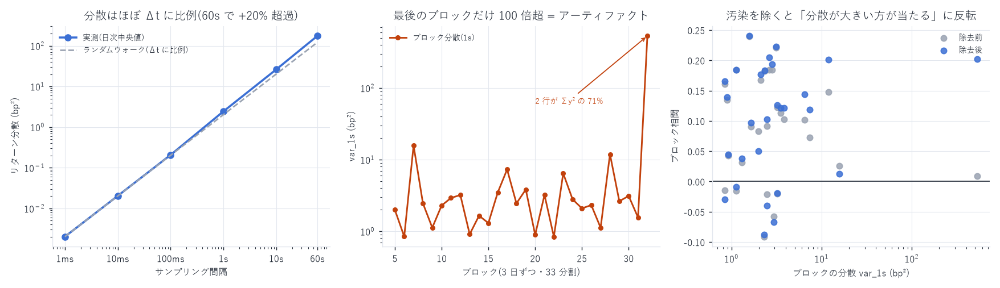

# 分散は相対 MSE を動かしているのか — 99 日を 33 分割して検証

対象: `xyz:DRAM / USDC`、2026-05-04 〜 2026-08-10 を 3 日ずつ 33 ブロックに分割
作成日: 2026-08-14

---

## 0. 結論

分散の水準は相対 MSE をほとんど動かしていない。 相対 MSE は次の恒等式で完全に説明できる。

```
相対 MSE = 1 − corr²  +  (k − corr)²          k = 予測の標準偏差 / 目的変数の標準偏差
           ↑関係の強さ    ↑予測振幅の較正ずれ
```

33 ブロックで検算したところ誤差は中央値 0.00002(最大 0.0021)。
第 1 項が支配的で、第 2 項(尺度のずれ)の中央値は 0.0020 しかない。

| 関係 | 相関係数 |
|---|---|
| log(ブロック分散) vs 相対 MSE | −0.046 |
| (1 − corr²) vs 相対 MSE | +0.808 |
| log(ブロック分散) vs 尺度ずれ項 (k−corr)² | −0.240 |

ただし、その「分散」自体が壊れて測られていた。
8,466,661 行のうち 2 行が Σy² の約 71% を占めており、それは値動きではなく
板再構成のアーティファクトだった(§2)。除去すると結論の一部が反転する(§3)。

---

## 1. 最高解像度の分散(6 通り + イベント単位)

99 日の日次中央値。単位は bp²。

| 解像度 | 分散 | Δt 比例からの倍率 |
|---|---|---|
| イベント単位(BBO 変化ごと) | 0.705 | — |
| 1 ms | 0.00202 | 基準 |
| 10 ms | 0.0203 | ×10.07 |
| 100 ms | 0.2065 | ×10.15 |
| 1 s | 2.432 | ×11.78 |
| 10 s | 26.16 | ×10.75 |
| 60 s | 174.35 | ×6.67(比例なら 6.0) |



分散はほぼ Δt に比例する(ランダムウォークの性質)が、1 秒と 60 秒でわずかに超過する。
`var(60s) / (60 × var(1s)) = 1.195`、`var(1s) / (10 × var(100ms)) = 1.178` で、
約 18〜20% の超過 = その時間帯にリターンの継続があることを意味する。
これは自己相関の結果(`acf_report.md`: 成熟期の中値 ρ₁ が 1 秒で +0.098)と独立に整合する。

---

## 2. ★ 分散を作っていたのは値動きではなく再構成のアーティファクト

最も分散の大きいブロック 32(2026-08-09〜10)は `var_1s = 532` と、
他ブロック(0.8〜16)の 30〜600 倍だった。ところが同じブロックの
`var_60s = 8.9` で、1 秒の分散が 60 秒の分散より 2 桁大きい。
時間とともに分散が増えない = 往復する一過性の跳ねである。

板を追うと原因が特定できた。

```
ts …352.008000000   bid 51.192 / ask 51.193      正常(スプレッド 0.20bp)
ts …352.008611810   bid 51.192 / ask 26.000      ★売り注文が 26.0 に出てクロス(0.99 秒継続)
ts …352.999999999   bid 25.988 / ask 26.000      ← enforce_uncrossed が **秒境界** で買い板を退去
ts …354.999999999   bid 51.185 / ask 51.189      ← 次の秒境界で復帰
```

`enforce_uncrossed`(古い側退去ルール)は 1 秒スナップショット時刻に走り、
`ts = 秒境界 − 1ns` のティックを出す。1 秒グリッドはちょうどその点を拾うため、
片側が退去した直後の異常な mid(51.19 → 25.99)がグリッドに載る。
結果として `|y| = 6,777 bp` の窓が 2 つできた。

### 全期間での規模

| 指標 | 値 |
|---|---|
| resync ティック(`ts mod 1s == 999999999`) | 4,792 / 23,470,241(0.020%) |
| 汚染された 1 秒グリッド行(T か T+Δ が resync) | 14,900 / 8,466,661(0.176%) |
| その 14,900 行が Σy² に占める割合 | 79.3% |
| うち 2026-08-09 の 2 行だけで | 約 71% |

0.0000236% の行が全分散の 7 割を作っていた。
クロス状態(全体の 0.05% で係数を 16 倍歪めた、`regression_report.md` §2)と同型の事故で、
本プロジェクトで 2 度目である。

> 【README §6 の訂正】 「クロス状態は 1 秒境界を跨がないので 1 秒グリッドは
> 構造的に汚染されない」と書いていたが、不正確だった。クロス状態そのものは
> 境界を跨がないが、その解消(resync)がちょうど境界に載る。
> 1 秒グリッドを使う分析では `ts mod 1s == 999999999` のティックに紐づく行を除くこと。

---

## 3. 汚染を除くと結論が反転する

同じ 33 ブロック・同じ拡大窓(ブロック k の評価はブロック 0..k−1 で学習)で再計算。

| 指標 | 除去前 | 除去後 |
|---|---|---|
| log(分散) vs ブロック相関 | −0.145 | +0.215(符号が反転) |
| log(分散) vs 相対 MSE | −0.046 | −0.219 |
| 分散比(検証/訓練) vs 相対 MSE | −0.172 | −0.576 |
| ブロック相関の中央値 | 0.096 | 0.121 |
| 後半 10 ブロックの相関中央値 | 0.183 | 0.197 |
| ブロック 32 の相関 | +0.009 | +0.202 |
| ブロック 32 の相対 MSE | 0.9999 | 0.9593 |

ブロック 32 は 86,395 行のうち 2 行を除いただけで、相関が 0.009 から 0.202 へ回復した。

除去後に見えてくる関係は素直である。

- 分散が大きいブロックほど相関が高い(+0.215)。値動きが多い = 予測できる材料が多い
- 分散が大きいブロックほど相対 MSE が低い(−0.219)= モデルがよく効く
- 検証ブロックの分散が訓練期より大きいほど相対 MSE が下がる(−0.576)。
  §0 の恒等式で言えば、`k` が相対的に小さくなっても `corr` の改善がそれを上回る

---

## 4. 「分散の非定常性が問題なのか」への回答

| 問い | 答え |
|---|---|
| 分散の水準が相対 MSE を動かしているか | ほぼ動かしていない(−0.046、汚染除去後でも −0.219)。<br>相対 MSE を決めるのは相関(+0.808) |
| 分散はどこで効くのか | 生の MSE を平均するときだけ。相対化すれば消える。<br>固定モデルを別期間に当てる場合は尺度ずれ項 (k−corr)² を通じて効くが、中央値 0.0020 と小さい |
| では Lasso が全ゼロを選んだ原因は | ① CV で生の MSE を単純平均していた(前処理の問題)<br>② 立ち上げ期は関係そのものが無い(`lasso_report.md` §2 の分解: β の揺れの 70〜116% は相関の変動)<br>③ 分散の測り方が壊れていた(本レポート §2) |
| 「分散が大きい期間は当たらない」は正しいか | 逆。汚染を除けば分散が大きいブロックほど当たる(+0.215)。<br>汚染前に負に見えていたのは、分散の大きいブロック = アーティファクトの多いブロックだったため |

---

## 5. 成果物

```
data/variance_daily.csv          日次の分散(イベント単位 + 6 解像度)
data/variance_blocks.csv         33 ブロックの分散・相対 MSE・相関・尺度 k
data/variance_blocks_clean.csv   同上(resync 汚染を除去)
data/variance_blocks{,_clean}.json  分散と相対 MSE の関係
data/resync_artifact.json        アーティファクトの規模
data/resync_artifact_daily.csv   日次の汚染行数と σ の変化
data/panel_1s/dt=*/resync_flag.parquet   行単位の汚染フラグ(再利用可)
scripts/variance_blocks.py       33 分割の分散と相対 MSE(--clean で汚染除去)
scripts/resync_artifact.py       アーティファクトの検出とフラグ生成
scripts/variance_chart.py        図 24
```

```bash
uv run python scripts/resync_artifact.py            # 汚染フラグ生成
uv run python scripts/variance_blocks.py            # 除去前
uv run python scripts/variance_blocks.py --clean    # 除去後
uv run python scripts/variance_chart.py
```

---

AWS 費用: 既存データのみで完結(追加 egress なし)。
EC2 \$25.05 | S3 ≈\$1.87 | 累計 ≈\$26.92 / 予算 \$60(EC2 は停止中)
