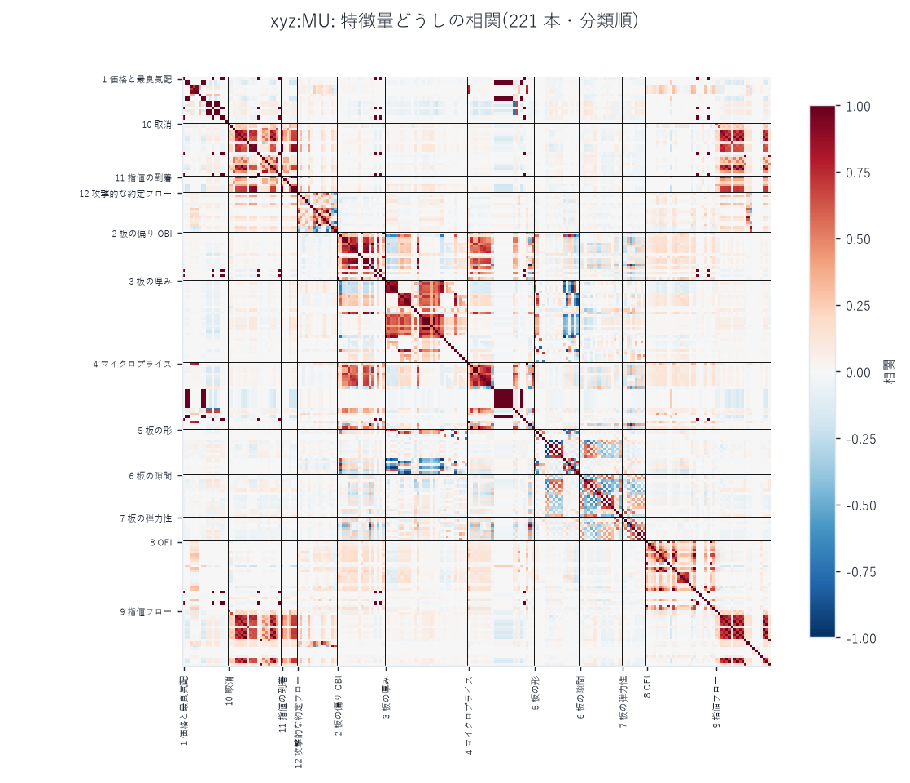

# `xyz:INTC` 分析索引

[← ホーム](../../../README.md) / [Hyperliquid の分析](../README.md)

| 項目 | 内容 |
|---|---|
| 銘柄コード | `xyz:INTC` |
| 原資産 | インテル(Intel Corporation)。米国ナスダック上場、ティッカー INTC |
| 事業 | プロセッサ(CPU)の設計・製造と、他社向けの半導体受託製造(ファウンドリ) |
| 商品の種別 | 無期限先物(perp)。満期がなく、24 時間 365 日取引される |
| 取引所 | [Hyperliquid](https://hyperliquid.xyz/)([Trade.xyz](https://trade.xyz/) が配備) |
| 標本期間 | 2026 年 5 月 4 日 〜 8 月 10 日(99 日間) |
| 公式サイト | https://www.intel.com/ |

このリポジトリの主な対象は**メモリ半導体**の 6 銘柄
(`xyz:DRAM` / `KIOXIA` / `MU` / `SKHX` / `SMSN` / `SNDK`)ですが、
`xyz:INTC` は**メモリではなくロジックとファウンドリ**の銘柄です。
同じ配備元・同じ期間で、板の作られ方がどれだけ違うのかを見る対照として置いています。
出来高は `xyz:MU` のおよそ 1/4 で、この 2 つは「同じ市場の大小」ではなく
**別の混み方をした市場**でした(下のレポート参照)。

---

## レポート

| レポート | 内容 |
|---|---|
| [特徴量ライブラリ 229 本の設計と検証](intc_featlib_report.md) | 板と注文フローから 12 分類 229 本の特徴量を 1 秒格子で作り、欠損・重複・予測力・標本外・帰無対照まで通しで検証する。**冗長性の実測**(\|r\|>0.99 のペアと単連結クラスタ)、δ = microprice − mid の分解、`xyz:MU` との突合を含む。 |
| [板の出どころを l2 から l1 へ移す](intc_bbo_l1_report.md) | `l2/bbo` が DEEP_ARCHIVE で読めないため、最良気配を `l1` から組み直した。**素直に組むと板は 100% クロスする**(黙って約定した注文が残るため)。older-loses の退去規則と負の丸めで解き、`xyz:MU` の 98 日で実物と突き合わせて誤差を測る。 |
| [指値 1 本ごとの寿命とキュー位置](intc_orderlife_report.md) | L2 では作れない層。指値 **2 億 7,846 万本**を 1 本ずつ追い、発注の瞬間に判る 2 条件(最良からの距離・同じ価格に前から居た数量)で層別した約定確率、寿命の分布、束の間の注文の割合、そして口座別の集中度と癖。**9.53% の注文は 1 ナノ秒も板に居ない**。 |
| [板と注文フローの特徴量 972 本 — 100ms 格子で 7 つのホライズンを測る](intc_l4feat_report.md) | 分類表 75 節のうち **42 節・972 本**を 100ms 格子で作り、**100ms / 500ms / 1s / 5s / 10s / 30s / 60s** で予測力を測る。**山は 1 秒**で、100ms では 80.7% が動かないため落ちる。「予測」と呼べる上位はほぼ全部が**流動性の持続**(置かれて 10 秒未満の数量の偏り)で、δ 系と違い **mid 建てでも強くなる**。板の再構成は独立な経路と厳密に一致(30/30)。★順位づけの同順位を平均せず偽の r = 0.66 を一度出した経緯も記録。 |
| [7 銘柄の横並び](../cross_coin_report.md) | MU の分析一式(microprice / OBI・OFI / book slope / cancel rate / 符号の持続 / ACF / spread-flow / markout / resilience ほか 17 本)を INTC を含む全所有銘柄に適用した比較。INTC の図は `charts/xyz_INTC_{microprice_matrix, obi_ofi_matrix, book_slope, ...}.png`。 |

---

## 図

**約定から見た銘柄の素性** — 価格・日次の想定元本・取引の頻度と参加者・時刻ごとの出来高。解説: [特徴量ライブラリ](intc_featlib_report.md)


**特徴量ライブラリの棚卸しと予測力** — 分類ごとの到達点、前向き vs 後ろ向き、上位 15 本、標本外、ホライズン、欠損。解説: [特徴量ライブラリ](intc_featlib_report.md)


**特徴量どうしの相関** — 分類順に並べた相関行列。解説: [特徴量ライブラリ](intc_featlib_report.md)


**δ = microprice − mid の分解** — 五分位の用量反応、OBI 由来か幅由来か、係数の日ごとの安定性。解説: [特徴量ライブラリ](intc_featlib_report.md)


**xyz:MU との比較** — 共通日で見た水準の違いと予測相関の違い。解説: [特徴量ライブラリ](intc_featlib_report.md)


**指値の寿命とキュー位置別の約定確率** — 寿命分布、束の間の注文、2 条件の格子、置いた場所と寿命。解説: [指値 1 本ごとの寿命とキュー位置](intc_orderlife_report.md)


**指値を出した口座の集中度と癖** — 何者が板を作っているか、集中度、上位 60 者の置き方と引きの速さ。解説: [指値 1 本ごとの寿命とキュー位置](intc_orderlife_report.md)


**分類ごとの到達点と予測力(972 本 × 7 ホライズン)** — 分類 × ホライズンの到達点、10 秒の上位 18 本、帰無対照との比較。解説: [板と注文フローの特徴量 972 本](intc_l4feat_report.md)


**ホライズン依存と、標本外・日ごとの安定性** — 山は 1 秒。目的変数が動かない割合、予測 vs 同時性、前半/後半、99 日の符号一致。解説: [同上](intc_l4feat_report.md)


**上位の用量反応と、板の主要量の分布** — 十分位ごとの将来リターン、スプレッド・厚み・注文の年齢の分布。解説: [同上](intc_l4feat_report.md)


**972 本の冗長性** — 分類順に並べた相関行列と、\|r\| > 0.99 で束ねた群の数。解説: [同上](intc_l4feat_report.md)


**`xyz:MU` の同じ棚卸し(参考)** — 同じ手順を MU の 21 日に当てたもの。解説: [特徴量ライブラリ](intc_featlib_report.md)


**`xyz:MU` の δ の分解(参考)** — 解説: [特徴量ライブラリ](intc_featlib_report.md)


**`xyz:MU` の特徴量どうしの相関(参考)** — 解説: [特徴量ライブラリ](intc_featlib_report.md)



**板の組み直しと実物の突合(`xyz:MU`)** — 一致率・mid のずれ・スプレッド・OBI。解説: [板の出どころを l2 から l1 へ移す](intc_bbo_l1_report.md)


**板の出どころが特徴量に与える影響(`xyz:MU`)** — 同じ特徴量を 2 通りの板から作って突き合わせる。解説: [板の出どころを l2 から l1 へ移す](intc_bbo_l1_report.md)


---

## 数値データ

| ファイル | 中身 | 作るスクリプト |
|---|---|---|
| [mmgate_fit_xyz_INTC.csv](../../../data/mmgate_fit_xyz_INTC.csv) | 入口の門の学習・評価の別と通過率 |
| [inv_days_xyz_INTC_q1.csv](../../../data/inv_days_xyz_INTC_q1.csv) | 在庫つきメイカーの日次(門なし・幽霊注文) |
| [decile_null_xyz_INTC_bbo.csv](../../../data/decile_null_xyz_INTC_bbo.csv) | 同じ表のプラセボ(1 営業日ずらし) |
| [decile_sum_xyz_INTC_bbo.csv](../../../data/decile_sum_xyz_INTC_bbo.csv) | 84 本 × 18 目的変数の十分位要約(`build_decile.py`) |
| [profile_xyz_INTC.csv](../../../data/profile_xyz_INTC.csv) | 日次の出来高・取引件数・価格・参加者数 | `coin_profile.py` |
| [featlib_stats_xyz_INTC.csv](../../../data/featlib_stats_xyz_INTC.csv) | 特徴量ごとの分類・有限率・分位 | `analyze_featlib.py` |
| [featlib_pred_xyz_INTC.csv](../../../data/featlib_pred_xyz_INTC.csv) | 特徴量ごとの前向き / 後ろ向き / 帰無対照の相関 | `analyze_featlib.py` |
| [featlib_dup_xyz_INTC.csv](../../../data/featlib_dup_xyz_INTC.csv) | \|r\| > 0.99 の重複ペア | `analyze_featlib.py` |
| [featlib_fam_xyz_INTC.csv](../../../data/featlib_fam_xyz_INTC.csv) | 分類ごとの要約 | `analyze_featlib.py` |
| [featlib_delta_xyz_INTC.csv](../../../data/featlib_delta_xyz_INTC.csv) | δ の五分位表 | `featlib_delta.py` |
| [featlib_delta_coef_xyz_INTC.csv](../../../data/featlib_delta_coef_xyz_INTC.csv) | δ の分解回帰の日次係数 | `featlib_delta.py` |
| [featlib_cmp_xyz_INTC_xyz_MU.csv](../../../data/featlib_cmp_xyz_INTC_xyz_MU.csv) | `xyz:MU` との比較 | `featlib_compare.py` |
| [orderlife_summary_xyz_INTC.csv](../../../data/orderlife_summary_xyz_INTC.csv) | 指値の寿命と約定率の要約 | `analyze_orderlife.py` |
| [orderlife_grid_xyz_INTC.csv](../../../data/orderlife_grid_xyz_INTC.csv) | 距離 × 前に居た量の約定確率 | `analyze_orderlife.py` |
| [wallet_conc_daily_xyz_INTC.csv](../../../data/wallet_conc_daily_xyz_INTC.csv) | 日次の口座集中度(HHI・上位シェア) | `analyze_wallet_orders.py` |
| [wallet_profile_xyz_INTC.csv](../../../data/wallet_profile_xyz_INTC.csv) | 口座ごとの癖(通し番号のみ) | `analyze_wallet_orders.py` |
| [bbo_l1_check_xyz_MU.csv](../../../data/bbo_l1_check_xyz_MU.csv) | 板の組み直しと実物の日次突合 | `validate_bbo_l1.py` |
| [featlib_bbo_effect_xyz_MU.csv](../../../data/featlib_bbo_effect_xyz_MU.csv) | 板の出どころが特徴量に与える影響 | `featlib_bbo_effect.py` |
| [l4feat_pred_xyz_INTC.csv](../../../data/l4feat_pred_xyz_INTC.csv) | 972 本 × 7 ホライズンの前向き / 後ろ向き / mid 建て / 帰無対照 / 前半後半 | `fit_l4feat.py --stage pool` |
| [l4feat_daily_xyz_INTC.csv](../../../data/l4feat_daily_xyz_INTC.csv) | 上位特徴量の日ごとの r(平均・中央値・最悪・符号一致) | `fit_l4feat.py --stage daily` |
| [l4feat_cols_xyz_INTC.csv](../../../data/l4feat_cols_xyz_INTC.csv) | 板とフロー層 577 列 → 分類表の節 | `build_l4feat.py` |
| [l4life_cols_xyz_INTC.csv](../../../data/l4life_cols_xyz_INTC.csv) | 寿命層 105 列 → 同 | `build_l4life.py` |
| [l4post_cols_xyz_INTC.csv](../../../data/l4post_cols_xyz_INTC.csv) | 派生層 290 列 → 同 | `build_l4post.py` |
| [leadlag_xyz_INTC_xyz_MU.csv](../../../data/leadlag_xyz_INTC_xyz_MU.csv) | `xyz:MU` との先行・遅行(7 ホライズン、99 日) | `fit_leadlag_l4.py` |

版管理外(大きいので手元にだけ置く): `data/l1_xyz_INTC/`(99 日 4.8GB)、
`data/l1u_xyz_INTC/`(372MB)、`data/bbo_xyz_INTC.parquet`(228MB)、
`data/featlib_xyz_INTC/`(825MB)、`data/orderlife_xyz_INTC/`、
`data/wallet_orders_xyz_INTC.csv`(口座 × 日の明細 6.9MB。要約は上の 2 本)。


## 2 銘柄にまたがるレポート

| レポート | 内容 |
|---|---|
| [特徴量 229 本 × 9 ホライズンの十分位分析](../decile_report.md)(2 銘柄共通) | 特徴量ライブラリ全 229 本を十分位に切り、**100ms / 300ms / 500ms / 1s / 3s / 5s / 10s / 30s / 60s** の 9 ホライズン × mid/micro の将来リターンと突き合わせる。十分位の境目は**前日の分布**、標準誤差は日でクラスタ、帰無対照は 1 営業日ずらし。★**Bonferroni を通るのは MU 27.9% / INTC 35.9%(プラセボ 0.0% / 0.1%)と豊富だが、その最大の \|D10 − D1\| は 2.785bp / 1.630bp で往復費用 2.83bp に届かない**。2.83bp を越えるセルは 36 / 180 本あるが、どれも有意でない(\|t\| の中央 1.63 / 1.03)。効く帯は **300ms〜5 秒の台地**。**どのホライズンでも mid 建てのほうが micro 建てより通過本数が多い**。白色雑音を同じ配管に通して機械を検算し、polars の `NaN > 数値` が真になる罠で一度偽の結論を出した経緯も記録。 |
| [7 銘柄 × 84 本の十分位分析](../decile_all_report.md)(7 銘柄共通) | 最良気配と約定だけで作れる 84 本 × 9 ホライズン(100ms〜60 秒) × mid/micro。十分位の境目は**前日の分布**、標準誤差は日でクラスタ、帰無対照は 1 営業日ずらし。有意 40.0%(プラセボ 0.0%)で 7 銘柄の最低。最良は `obi1 → mid_60s` の片側 0.65bp で、費用 3.63bp の 18%。**229 本版で使った費用 2.83bp はこの銘柄には 0.8bp 甘かった**。 ★費用は銘柄ごとに違い、判定は \|D10 − D1\| ではなく**片側 max(\|D1\|,\|D10\|)** で行う。**7 銘柄 4,530 本の有意なセルのうち費用を越えたものはゼロ**。 |
| [7 銘柄のメイカー検証](../mm_all_report.md)(7 銘柄共通) | 在庫つきメイカー(両側に指値・\|q\|≤1 で FIFO 相殺・BBO 追随)を `xyz:MU` と同じ設定で当て、1 組あたり損益を恒等式で分解する。入口の門・無作為の門(帰無対照)・発注遅延 130 ms・執行できる数量を順に入れる。半スプレッドの劣化は **21% と 7 銘柄で最小**だが、保有中の drift が −3.717bp と最大で −1.628 bp。**門の中身の価値がゼロ**の唯一の銘柄(無作為の門との差 +0.057、t=0.08)。 ★7 銘柄のどれも、費用を引く前ですら**出す価値が無い**。 |

---

## 再現手順

上から順に実行すると、このページの図と数値がすべて再現できます。
初回のみ、リポジトリの直下で `uv sync` を実行してください。
`~/.hlpipe.env` を `source` して `WORK_BUCKET` と `AWS_PROFILE` を通しておきます。

```bash
uv run python scripts/inventory_s3.py --coin xyz:INTC        # 在庫の確認(任意)
uv run python scripts/fetch_fills.py  --coin xyz:INTC        # 約定 (0.3 GiB)
uv run python scripts/fetch_l1.py     --coin xyz:INTC        # 注文イベント (19.2 GiB のうち約 35%)
uv run python scripts/coin_profile.py --coin xyz:INTC --ref xyz:MU

# ★l2/bbo は DEEP_ARCHIVE で読めないので、板は l1 から組み直す
uv run python scripts/build_bbo_l1.py --coin xyz:INTC

uv run python scripts/build_featlib.py    --coin xyz:INTC
uv run python scripts/analyze_featlib.py  --coin xyz:INTC
uv run python scripts/plot_featlib.py     --coin xyz:INTC
uv run python scripts/featlib_delta.py    --coin xyz:INTC
uv run python scripts/featlib_compare.py  --a xyz:INTC --b xyz:MU

uv run python scripts/fetch_l1_user.py     --coin xyz:INTC   # user 列だけ追加取得 (0.42 GB)
uv run python scripts/build_orderlife.py   --coin xyz:INTC
uv run python scripts/analyze_orderlife.py --coin xyz:INTC
uv run python scripts/analyze_wallet_orders.py --coin xyz:INTC

# 組み直しの検証(xyz:MU に実物の bbo が残っているうちだけできる)
uv run python scripts/build_bbo_l1.py     --coin xyz:MU --suffix _l1
uv run python scripts/validate_bbo_l1.py  --coin xyz:MU
uv run python scripts/build_featlib.py    --coin xyz:MU --bbo-suffix _l1 --out-suffix _l1 --days 21
uv run python scripts/featlib_bbo_effect.py --coin xyz:MU

# ★分類表 42 節・972 本の特徴量パネル(100ms 格子)。出力は E:/Memory-l4feat/
uv run python scripts/build_l4feat.py  --coin xyz:INTC     # 板とフロー 577 列
uv run python scripts/build_l4life.py  --coin xyz:INTC     # 寿命・口座 105 列
uv run python scripts/build_l4post.py  --coin xyz:INTC     # 派生 290 列
uv run python scripts/audit_l4feat.py  --coin xyz:INTC --dt 2026-05-05 -n 30
uv run python scripts/fit_l4feat.py    --coin xyz:INTC --stage pool
uv run python scripts/fit_l4feat.py    --coin xyz:INTC --stage daily
uv run python scripts/fit_l4feat.py    --coin xyz:INTC --stage corr
uv run python scripts/fit_leadlag_l4.py --a xyz:INTC --b xyz:MU
uv run python scripts/plot_l4feat.py   --coin xyz:INTC
uv run python scripts/build_featbbo.py --coin xyz:INTC                    # 84 本(bbo + fills のみ)
uv run python scripts/build_fwd.py      --coin xyz:INTC --src featbbo --suffix _bbo
uv run python scripts/build_decile.py   --coin xyz:INTC --src featbbo --suffix _bbo
uv run python scripts/build_inventory.py --coin xyz:INTC --qmax 1 --posts
uv run python scripts/build_mmgate.py      --coin xyz:INTC
uv run python scripts/build_mmgate_null.py --coin xyz:INTC
uv run python scripts/build_inventory.py --coin xyz:INTC --qmax 1 --gate data/entrygate_xyz_INTC_mmg.parquet
```
