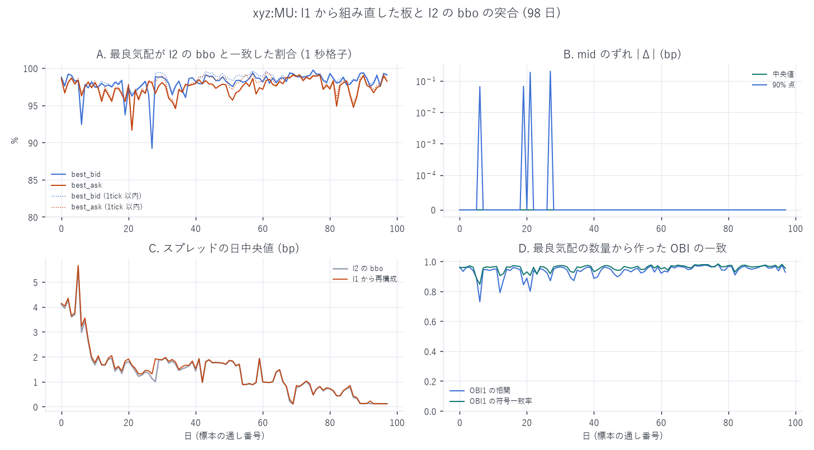
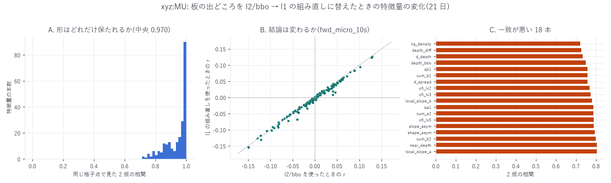

# 板の出どころを l2 から l1 へ移す — 最良気配の組み直しと、その誤差の実測

[← xyz:INTC の分析索引](README.md) ／ [用語辞書](../../../GLOSSARY.md)

対象 `xyz:INTC` ／ 標本 2026-05-04 〜 2026-08-10 の 99 日
／ 検証は `xyz:MU`(両方の板がそろっている唯一の銘柄)

`xyz:INTC` の特徴量を作るには最良気配の時系列が要りますが、
それを収めた `l2/bbo` は **DEEP_ARCHIVE へ移行済み**で読めません。
そこで注文イベント `l1` から板を組み直しました。このレポートは
**その組み直しがどれだけ実物と一致するか**を数字で示すためのものです。

**x が確定する時刻 / y の期間**: 該当しません(板の再構成であって予測ではない)。

---

## 1. なぜ組み直しが要るのか

作業用バケットの保存階級を数えると、`l2` だけが DEEP_ARCHIVE に落ちています
(2026-09-05 実測)。

| 層 | 保存階級 | 直接読めるか |
|---|---|---|
| `l1`(注文イベント) | GLACIER_IR 19.22 GiB | ○ 読める(取り出し \$0.03/GB) |
| `l2/bbo`(最良気配) | STANDARD 99 / **DEEP_ARCHIVE 135**(0.49 GiB) | ✕ 復元に 12〜48 時間 |
| `l2/book_px` | STANDARD 99 / **DEEP_ARCHIVE 135**(4.40 GiB) | ✕ |
| `l2/lifecycle` | STANDARD 99 / **DEEP_ARCHIVE 135**(9.29 GiB) | ✕ |
| `fills`(約定) | GLACIER_IR 0.30 GiB | ○ |
| `l3`(バー) | GLACIER_IR 0.87 GiB | ○ |

`fetch_bbo.py` はこの状態で

```
OSError: AWS Error [code 133] during GetObject operation:
The operation is not valid for the object's storage class
```

を返して止まります。`xyz:MU` の `l2/bbo` も今日ではもう同じ状態で、
手元にある `data/bbo_xyz_MU.parquet` は**階級が落ちる前に取っておいたもの**です。
つまり新しい銘柄については、この経路はもう使えません。

復元(RestoreObject)は費用こそ \$0.05 未満ですが 12〜48 時間かかります。
`l1` は読めるので、板はそこから組み直せます。

## 2. 組み直しの規則

`build_bbo_l1.py`。板に載せる規則は既存の `build_obi_levels.py` と 1 行ずつ同じです。

- `tif` が `Alo` / `Gtc` の注文だけ(`Ioc` などのテイカーは板に留まらない)
- トリガー注文は除く(発火するまで板に載らない。入れると板がクロスする)
- `...Rejected` 系は `open` を経ない終端なので除く
- 数量は **0.001 を 1 とする整数**で足し引きする(浮動小数だと空の価格水準に
  1e−13 の残りかすが残り、それが「深さあり」と読まれる)
- 同一 ns の行順は論理順と逆なので、`open`(0) → `filled`(2) → 終端(3) を明示して並べる
- 日を跨いで残る注文は繰越として翌日へ渡す

これで注文ごとの「板に置かれている数量」の階段関数ができ、その差分を時刻順に
当てれば板になります。最良気配の更新は 2 通りしかないので、走査は 1 回で足ります。

- 今の最良より内側に数量が入った → その場で更新
- 今の最良の数量が 0 になった → 1 つずつ外へ探す(通常 数ティック)

## 3. ★そのままでは板が 100% クロスする

素直に組むと、`xyz:MU` の 2026-05-05 12:00 の板はこうなりました。

```
私の best bid 上位: [(603.99, 24.834), (603.96, 0.082), (603.93, 155.338), …]
私の best ask 下位: [(549.52, 0.029), (550.00, 0.011), (561.50, 0.001), (587.23, 8.521), …]
```

買いが 603.99 なのに売りが 549.52 で、**54 ドル(9%)ぶんクロス**しています。
1 秒格子で測ると **クロス率 100.0%**、スプレッドの中央値は **−949 bp** でした。

原因は判っています。約定の一部は `filled` イベントを出さず、後日の取消イベントの
`orig_sz − remaining_sz` にしか現れません(hl-l4-pipeline の実測で**取引数量の 29.17%**)。
その間その注文は板に残り続けます。上の 0.029 / 0.011 / 0.001 という
極小の数量がまさにその残りかすです。

### 解いた方法 — older-loses

買い ≥ 売り になったら、**最後に動いたのが古いほうの価格水準**を板から落とします。
板に残っている注文が実は約定済みなら、それは古い側だからです。

これは hl-l4-pipeline のゲート3 で確定した規則と同じ向きです。
逆向き(newer-loses)は 82.4 万件の退去を起こして暴走し、older-loses は 798 件で
収束しました(`CLAUDE.md` の L2 確定版 v5b)。

### ★退去させた注文の取消が後から来る

これを入れた直後の突合で、最良の数量に **負の値が 68,135 行(全体の 15%、最小 −27,612 枚)**
出ました。退去で価格水準を 0 にしても、そこに居た注文の取消イベントは後から来るので、
その差分がそのまま負に振れます。深さは負になりえないので 0 で止めます。
この 1 行を入れる前と後で、OBI の一致は **相関 0.01 → 0.93〜0.96** に変わりました。
**「クロスは消えたので直った」で止めていたら気づけませんでした。**

## 4. 実物との突合(`xyz:MU`・98 日)

`xyz:MU` は `l2/bbo` を階級が落ちる前に取ってあるので、同じ 99 日を `l1` から
組み直して 1 秒格子(後ろ向き・厳密に $`t`$ 以前の最後の行)で突き合わせられます。
共通する 98 日、1 日あたり 86,399 点です。



### 4.1 価格

| 量 | 中央値 | 10% 点 | 最小の日 |
|---|---:|---:|---:|
| `best_bid` が完全に一致 | **98.25%** | 97.28% | 89.19% |
| `best_ask` が完全に一致 | **97.64%** | 95.85% | 91.64% |
| `best_bid` が 1 ティック以内 | 98.63% | 97.47% | 89.49% |
| `best_ask` が 1 ティック以内 | 98.12% | 96.33% | 92.15% |
| クロスした格子点 | **0.000%** | 0.000% | 0.000%(全 98 日) |

mid の差は、中央値も 90% 点も **0.000 bp**(浮動小数の丸め 1.3e−12 まで一致)です。

### 4.2 ★中央値だけ見てはいけない

上の行だけを見ると「ほぼ完全に一致」と書きたくなりますが、裾は別の姿です。

| mid の差 | 1 日の格子点に占める割合(中央値) | 最悪の日 |
|---|---:|---:|
| 1 bp を超える | **1.07%** | 3.48% |
| 10 bp を超える | 0.043% | 0.275% |
| 99% 点 | 1.12 bp | 4.13 bp |
| **その日の最大** | **501 bp** | 7,299 bp |

1 日 86,399 点のうち **900 点前後は 1 bp 以上ずれ、40 点前後は 10 bp 以上ずれます**。
ずれる瞬間は、まさに「黙って約定した注文が最良に居座っている間」です。
平均や中央値で丸めるとこの穴は見えません。

### 4.3 数量と OBI

| 量 | 中央値 | 10% 点 | 最悪の日 |
|---|---:|---:|---:|
| OBI₁ の相関 | **0.9476** | 0.8921 | 0.7300 |
| OBI₁ の符号一致率 | 96.35% | 92.98% | 84.66% |
| $`\|\Delta \mathrm{OBI}_1\| \gt 0.2`$ の格子点 | 6.87% | — | 24.3% |

水準のずれ(日ごとの相対差の中央値)は

| 量 | 中央値 | 10% 点 | 90% 点 |
|---|---:|---:|---:|
| 最良買いの数量 | **+1.17%** | −0.73% | +4.10% |
| 最良売りの数量 | +0.77% | −1.51% | +4.13% |
| スプレッド | **+1.35%** | +0.06% | +8.00% |

組み直した板は**わずかに厚く、わずかに広く**出ます。厚いのは約定済みの注文が
残っているから、広いのは退去で最良を落としたときに 1 段外へずれるからです。

### 4.4 処理量

| | 値 |
|---|---:|
| 組み直した bbo の行数 | 32,937,993(実物 35,188,572 の 93.6%) |
| 退去(older-loses)した回数 | 4,887,942 |
| 深さを 0 で止めた回数 | 7,663,163 |
| 1 日あたりの処理時間 | 1〜46 秒(差分 90 万〜2,100 万行) |

## 5. ★本当に知りたいのは「特徴量がどれだけ変わるか」

最良気配が 98% 一致することは判りました。しかし使うのは最良気配そのものではなく、
そこから作る特徴量です。そこで `xyz:MU` の同じ 21 日について、
**板の出どころだけを差し替えて同じ 229 本を作り直し**、1 本ずつ突き合わせました
(`featlib_bbo_effect.py`)。



### 5.1 形はどれだけ保たれるか

同じ格子点で見た 2 版の相関は **中央 0.9705**、下位 5% で 0.7864。
229 本のうち **68 本が 0.9 を下回りました**。一致が悪いのは規則的で、
**最良気配の「数量」に直接依存する特徴量**です。

| 特徴量 | 2 版の相関 | 水準の相対差 |
|---|---:|---:|
| `liq_density`(板厚 ÷ スプレッド) | 0.722 | −8.4% |
| `depth_diff`(最良の買い − 売り) | 0.727 | −5.5% |
| `d_depth` | 0.733 | +4.7% |
| `depth_bbo`(最良の買い + 売り) | 0.748 | −4.0% |
| `qb1` / `cum_b1` | 0.757 | −4.0% |
| `d_spread` | 0.757 | +7.1% |

理由は 3 節と同じです。約定済みの注文が板に残るあいだ最良の数量が過大になり、
退去でそれを落とすと今度は一段外へずれます。**価格は合っていても数量はぶれる。**

### 5.2 結論は変わるか

一方、`fwd_micro_10s` との相関で並べ替えると、2 版の順位はほぼ同じでした。

| 量 | 値 |
|---|---:|
| 229 本の $`r`$ の順位相関 | **0.9920** |
| $`\|\Delta r\|`$ の中央値 | 0.00232 |
| $`\|\Delta r\|`$ の最大 | 0.03154 |

差が大きかった 5 本は次のとおりで、**すべて「直前の変化量」そのもの**です。

| 特徴量 | l2/bbo | l1 の組み直し | 差 |
|---|---:|---:|---:|
| `d_ask` | +0.0401 | +0.0086 | −0.0315 |
| `d_mid` | +0.0461 | +0.0162 | −0.0299 |
| `d_micro` | −0.0395 | −0.0679 | −0.0284 |
| `micro_ret` | −0.0395 | −0.0678 | −0.0283 |
| `d_bid` | +0.0400 | +0.0188 | −0.0212 |

1 秒あたりの差分は、板の更新が 1 つずれるだけで符号が変わりうる量なので、
組み直しの影響が最も出ます。**`d_*` と `micro_ret` の水準は INTC では信用しない**
のが妥当です。

## 6. この結果の使い方 — 何を信じ、何を信じないか

| 使い道 | 判定 | 根拠 |
|---|---|---|
| mid / スプレッド / 価格水準の特徴量 | **使える** | 完全一致 98%、mid のずれは中央値 0.000 bp |
| OBI・板の偏り・マイクロプライス乖離 | **使える(誤差込みで)** | OBI₁ の相関 0.948、予測相関の順位相関 0.992 |
| 最良気配の**数量そのもの**(`qb1` / `depth_bbo` / `liq_density`) | **水準は信用しない** | 2 版の相関 0.72〜0.76、水準が 4〜8% ずれる |
| 1 秒差分(`d_mid` / `d_ask` / `micro_ret`) | **水準は信用しない** | 相関が最大 0.032 動く |
| 「1 bp 未満の効果」の主張 | **しない** | 1 日 86,399 点のうち 1.07% が 1 bp 以上ずれる |

そして最後にひとつ。**この検証ができるのは `xyz:MU` の `l2/bbo` が手元に残っている
あいだだけ**です。`l2` は既に DEEP_ARCHIVE なので、
`data/bbo_xyz_MU.parquet` を消したら二度と測り直せません。
