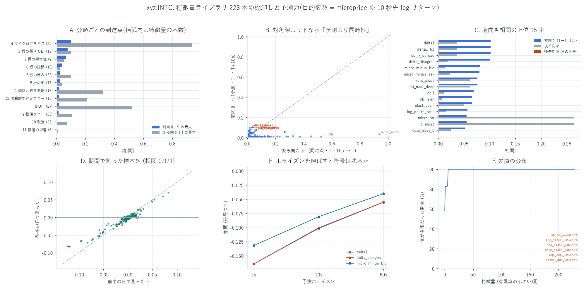
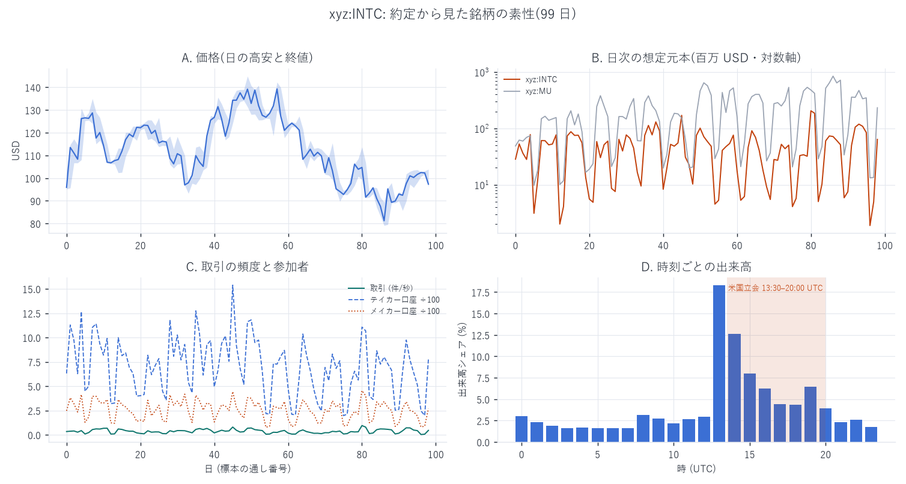
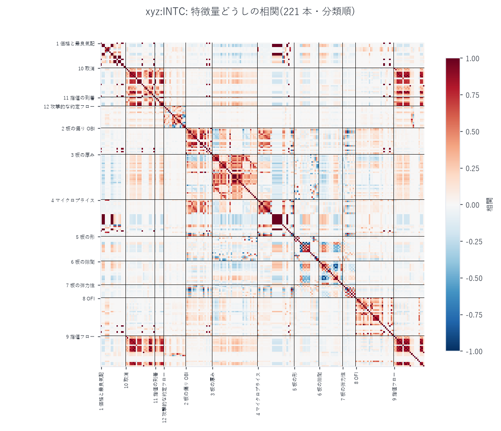
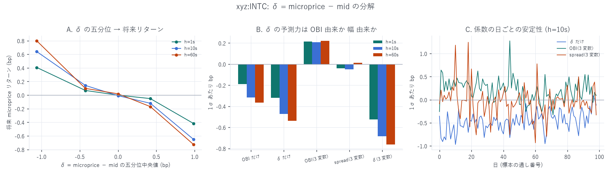
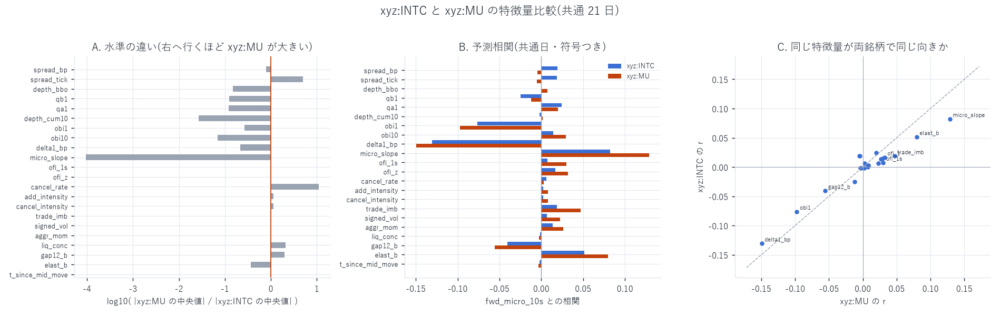
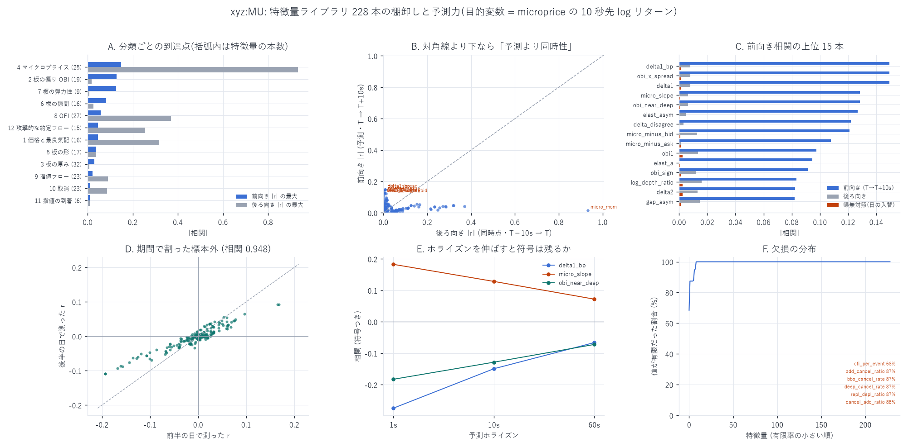
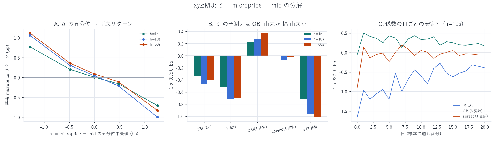

# 特徴量ライブラリ 229 本の設計と検証

[← xyz:INTC の分析索引](README.md) ／ [用語辞書](../../../GLOSSARY.md)
／ [予測の定義](../../predicting_definition.md)

対象 `xyz:INTC` ／ 標本 2026-05-04 〜 2026-08-10 の 99 日

板と注文フローから **12 分類 229 本**の特徴量を 1 秒格子で作り、
欠損・重複・予測力・標本外・帰無対照まで通しで検証しました。
狙いは「新しい alpha を増やすこと」ではなく、
**同じことを測っている変数を見分けられる状態にすること**です。



## 先に結論

- **229 本のうち独立な情報は 157 群ぶんしかない。** $`\|r\| \gt 0.99`$ のペアが
  130 組あり、`delta1_bp` と `obi_x_spread` のように定義上同一のものが混ざっている(5 節)。
- **効くのは板の状態で、流量ではない。** 前向き相関の最大は
  マイクロプライス 0.102 → OBI 0.076 → 弾力性 0.066 に対し、
  取消 0.006・到着 0.004。ただし **`xyz:INTC` は 1 秒に 0.37 件しか約定しない**ので、
  流量の列は 85.5% がちょうど 0 —— 「効かない」のではなく「入っていない」(4・6 節)。
- **δ = microprice − mid は平均回帰する。** δ が大きいほど、その後 microprice は
  **逆へ**動く(Q5 で 10 秒先 −0.651 bp、t=−23.5)。しかも
  **スプレッド幅そのものには予測力が無く**(t=−1.5)、δ を入れると OBI の符号が
  反転する(7 節)。
- **帰無対照はほぼ 0**($`\|r\|`$ 最大 0.0036)、**標本外も崩れない**
  (前半 49 日と後半 50 日の $`r`$ の相関 0.971)。ただし
  **228 本中 160 本は「予測より同時性のほうが強い」**(6 節)。
- **`xyz:MU` と板の姿はまるで違うのに、効く特徴量と符号はほぼ同じ。**
  相関 0.965、大きさは INTC が 6 割程度。INTC は**厚くて遅い板**
  (10 水準の累積が 37 倍厚く、取消の速さは 1/11)、MU は薄くて速い板(8 節)。
- ★**この検証中に、既存の特徴量ライブラリの時間契約違反を 2 件見つけて直した。**
  フロー系 約 60 本が 1 秒ぶん未来を見ており、直すと `xyz:MU` での見かけの予測力が
  **ほぼ半減**した(`trade_imb` 0.089 → 0.047)。減った分は後ろ向き相関へ移った(1 節)。

---

## 1. 時間契約

説明変数 $`x`$ は格子点 $`T`$ **までの**情報だけで作ります。目的変数は

```math
y_h \;=\; \log \mathrm{micro}(T+h) - \log \mathrm{micro}(T)
\qquad h \in \{1\mathrm{s},\, 10\mathrm{s},\, 60\mathrm{s}\}
```

で、$`x`$ の確定時刻 $`T`$ ≤ $`y`$ の期間の開始時刻 $`T`$ を満たします。
mid 建ての $`y`$ も同時に持ちますが、**mid で測ると「既に判っている microprice に
mid が追いつく動き」を予測力と取り違える**ので、主として microprice 建てで報告します
(`xyz:MU` の予測レポートで実証済み)。

比較のために**後ろ向き**リターン

```math
b_{10\mathrm{s}} \;=\; \log \mathrm{mid}(T) - \log \mathrm{mid}(T-10\mathrm{s})
```

も作りますが、これは**同時点の関係**を測るためだけに使い、予測力とは別の欄に書きます。

`shift(-k)` は目的変数にしか使っていません。板がクロスしている行は
`clean_bbo` で除外しています。

### ★この検証で見つけて直した 2 つの先読み

このライブラリは `xyz:MU` 向けに先に書かれていたもので、`xyz:INTC` に流用する前に
読み直したところ、**時間契約に反する箇所が 2 つ**ありました。両方とも直してから
INTC を作っています。

**(1) フロー系の 1 秒ぶんの重なり(9〜12 分類・約 60 本)**
指値の追加・取消・約定・攻撃的な約定の各カウントを、
イベントが起きた**その秒**の格子点に入れていました。つまり格子点 $`T`$ の値が
$`[T, T{+}1)`$ を集計する一方、目的変数は $`(T, T{+}h]`$ を見ます。
$`h = 1\mathrm{s}`$ では**窓が丸ごと同じ**で、予測ではなく同時性を測っていたことになります。
集計先を 1 つ後ろへずらし、格子点 $`T`$ には $`[T{-}1\mathrm{s},\, T)`$ だけを入れるよう直しました。

直す前と後で `xyz:MU` の同じ 21 日を作り直し、1 本ずつ突き合わせた結果です
(目的変数 `fwd_micro_10s`)。

| 特徴量 | 修正前 | 修正後 | 変化 | 後ろ向き(前 → 後) |
|---|---:|---:|---:|---|
| `signed_cnt` | 0.1019 | **0.0445** | −56% | 0.0597 → 0.1398 |
| `exec_cnt_a` | 0.0643 | 0.0207 | −68% | 0.0266 → 0.0811 |
| `trade_buy_cnt` | 0.0723 | 0.0292 | −60% | 0.0377 → 0.0885 |
| `trade_imb` | 0.0891 | **0.0468** | −47% | 0.0654 → 0.1264 |
| `add_bbo_a` | −0.0628 | −0.0138 | −78% | −0.0389 → −0.0657 |

**見かけの予測力はほぼ半減しました。** そして**減った分だけ後ろ向き相関が増えて**
います。取り除いた 1 秒は予測ではなく同時性だった、という直接の証拠です。
影響は 9〜12 分類に限られ($`\|\Delta r\|`$ の中央値は 0.0)、最大でも 0.0574 でした。

なお、同じ秒割りを使う他のスクリプトも読み直しましたが、
`build_cancel_rate.py` は mid を**区間の終端**に asof しているため
$`x`$ と $`y`$ の基準時刻が一致しており、問題ありませんでした。
ずれていたのは featlib が mid を**区間の始点**に合わせていたためです。
また、このライブラリを使った公開レポートは今回の 3 本が最初なので、
既に公開されている数字は変わりません。

**(2) `ofi_pct` の分位が全標本から作られていた(1 本)**
OFI の順位を **その日全体の分布**に対して取っていました。
「標準化・分位のパラメータを全標本から作らない」という規則に反します。
**前日の分布**に対する順位へ直しました(初日は基準が無いので欠損)。
`xyz:MU` の 21 日で測った限り、旧版の相関 0.0568 は、
同じく単調変換で先読みのない `ofi_sign` の 0.0572 とほぼ同じでした。
**効果は小さかったのですが、小さいことは残す理由になりません。**

## 2. データ経路 — 板は `l1` から組み直した

`xyz:INTC` の最良気配を収めた `l2/bbo` は **DEEP_ARCHIVE へ移行済み**で読めません。
そこで注文イベント `l1` から板を組み直しています。手順とその誤差の実測は
[板の出どころを l2 から l1 へ移す](intc_bbo_l1_report.md) にあります。要点だけ:

- 素直に組むと板は **100% クロス**する(黙って約定した注文が残るため)。
  買い ≥ 売り になったら古いほうの価格水準を落とす(older-loses)ことで解いた
- `xyz:MU` の 98 日で実物と突き合わせると、`best_bid` は **98.25%**、
  `best_ask` は **97.64%** が完全一致。mid のずれは中央値も 90% 点も 0.000 bp
- ただし **1 日 86,399 点のうち 1.07% は 1 bp 以上ずれ**、0.043% は 10 bp 以上ずれる
- OBI₁ の相関は中央 **0.948**、符号一致 96.4%

## 3. 何を作ったか — 12 分類 229 本

1 秒格子で作り、**5 秒おきに書き出し**ます(1 日 17,280 行 × 99 日 = 171 万行)。
板は最良から 10 ティック奥までの 10 水準。刻みは価格で変わります
(1000 未満は 0.01、以上は 0.1)。

| # | 分類 | 本数 | 例 | 出どころ |
|---|---|---:|---|---|
| 1 | 価格と最良気配 | 17 | `mid` `spread_bp` `spread_tick` `t_since_mid_move` `bbo_age` | 組み直した bbo |
| 2 | 板の偏り(OBI) | 19 | `obi1` … `obi10`、距離重み `obi_dw`、指数重み `obi_ew`、想定元本 `obi_notional`、`obi_streak` | 板 10 水準 |
| 3 | 板の厚み | 32 | `qb1` … `qa10`、累積 `cum_b5`、`near_depth` / `deep_depth`、`dollar_depth`、`depth_vol` | 板 10 水準 |
| 4 | マイクロプライス | 25 | `micro1` … `micro10`、乖離 `delta1_bp`、`micro_slope`、**`obi_x_spread`** | 1 と 2 |
| 5 | 板の形 | 17 | 傾き `slope_b`、曲率 `curv_a`、集中度 `hhi_b` / `gini_b` / `entropy_b` | 板 10 水準 |
| 6 | 板の隙間 | 16 | 最初の空き `gap12_b`、最大の空き、空水準数、壁までの距離 `wall_dist_b` | 板 10 水準 |
| 7 | 板の弾力性 | 9 | %Δ深さ ÷ %Δ距離 を近傍・遠方・限界で | 板 10 水準 |
| 8 | OFI | 27 | 7 つの窓(0.1s〜10s)、多水準 `ofi_lv5`、`ofi_z`、`ofi_streak`、`ofi_pct` | bbo のイベント列 |
| 9 | 指値フロー | 23 | 追加・約定の数量と本数(買い売り別)、`net_lof`、補充/枯渇の比 | l1 の注文イベント |
| 10 | 取消 | 23 | 取消の数量・本数・強度、最良と奥の内訳、`cancel_rate`、`cancel_burst` | l1 の注文イベント |
| 11 | 指値の到着 | 6 | 到着強度、最良/奥の内訳、加速、群れ | l1 の注文イベント |
| 12 | 攻撃的な約定フロー | 15 | テイカーの買い売り数量・本数、`trade_imb`、`aggr_mom`、`size_wgt_imb` | fills |

目的変数は 6 本(`fwd_mid_*` / `fwd_micro_*` の 1s / 10s / 60s)で、
**説明変数には一切混ぜていません**。

### 設計の意図 — δ を分解できるようにする

このライブラリは alpha を増やすためではなく、
**δ = microprice − mid が何を代理しているのかを分解できる**ようにするためのものです。
定義から

```math
\delta_{\rm bp} \;=\; \frac{s_{\rm bp}}{2}\,\mathrm{OBI}_1
```

という恒等式が成り立つので、`obi1`(偏り)と `spread_bp`(幅)と
`obi_x_spread`(その積)を**必ず別々に持って**います。
片方だけを見ていると「厚みの偏り」と「幅の広さ」を取り違えます。

## 4. どんな市場か — 分布から見える `xyz:INTC`

99 日 × 17,280 行 = **171 万行**。全 229 列が有限だった行は **99.0%** です。



| 量 | 5% 点 | 中央値 | 95% 点 |
|---|---:|---:|---:|
| mid | 108.79 | **111.43** | 115.26 |
| スプレッド(bp) | 0.89 | **2.00** | 4.27 |
| スプレッド(ティック) | 1 | **2** | 5 |
| 最良の厚み 買+売(枚) | 9.73 | **104.94** | 791.36 |
| 10 水準の累積の厚み(枚) | 1,574 | **3,043** | 6,530 |
| OBI₁ | −0.964 | 0.002 | 0.967 |
| δ = microprice − mid(bp) | −1.278 | 0.001 | 1.249 |
| 最初の空き水準までの距離 | 1 | 1 | 2 |

刻みは 99 日すべて 0.01(価格が 1000 を超えないため)。板は詰まっていて、
**買い側 10 水準に空きが 1 つも無い格子点が 65.4%** あります。

### ★1 秒格子だと約定フローはほとんど空になる

`xyz:INTC` の約定は **0.37 件/秒**しかありません。したがって

| 特徴量 | ちょうど 0 だった割合 |
|---|---:|
| `trade_imb` / `signed_vol`(12 分類) | **85.5%** |
| `ofi_1s`(8 分類) | 44.1% |
| `cancel_rate`(10 分類) | 17.4% |
| `bbo_age` / `t_since_mid_move` | 39.0% / 38.0% |

12 分類はほぼ空の列です。**「効かなかった」のではなく「ほとんど値が入っていない」**
ので、後の予測力の表もそのつもりで読む必要があります。

### 欠損は分母が 0 になる比に集中する

| 特徴量 | 有限率 | 理由 |
|---|---:|---|
| `ofi_per_event` | 58.4% | 窓にイベントが 1 件も無いと 0 除算 |
| `add_cancel_ratio` / `cancel_add_ratio` | 82.6% / 83.5% | 同上 |
| `bbo_cancel_rate` / `deep_cancel_rate` / `repl_depl_ratio` | 82.6% | 同上 |
| `ofi_pct` | 99.0% | **初日は前日の分布が無いので定義できない**(1 節の修正の副作用。意図どおり) |

## 5. ★229 本のうち、実質いくつあるか

作った本数と、独立に情報を持っている本数は別です。常時ほぼ有限な 221 本で
相関行列を作りました。

| 量 | 値 |
|---|---:|
| $`\|r\| \gt 0.99`$ のペア | **130 組** |
| 単連結クラスタ($`\|r\| \gt 0.95`$) | 221 本 → **157 群** |



$`r = 1.000`$ のペアは、名前が違うだけで同じ量です。

| 組 | なぜ同じか |
|---|---|
| `spread_abs` = `spread_tick` | 刻みが 99 日とも 0.01 で一定 |
| `delta1_bp` = `obi_x_spread` | 恒等式そのもの |
| `qa1` = `cum_a1`、`depth_cum10` = `depth_per_tick` | 水準数が固定 |
| `ofi_1s` = `ofi_per_time` | 窓が 1 秒なので割っても同じ |
| `add_vol_b` = `repl_b`、`d_ofi` = `ofi_vel`、`t_since_bbo_chg` = `bbo_age` | 定義が同一 |
| `obi10` = `depth_asym` | 10 水準の累積 OBI と同じ式 |
| `micro_slope` = **−**`obi_near_deep` | 符号だけ反転($`r = -1`$) |

**229 本と書いてありますが、独立な情報は 157 群ぶんしかありません。**
回帰や機械学習にそのまま全部入れると、共線性で係数が意味を失います。

## 6. 予測力 — 前向き・後ろ向き・帰無対照・標本外

目的変数は $`\log \mathrm{micro}(T{+}10\mathrm{s}) - \log \mathrm{micro}(T)`$。
**1 日を 1 観測**として日ごとの相関を出し、99 日で t 検定しています
(行を独立とみなすと標準誤差が最大 15.8 倍過小になるため)。

### 6.1 まず帰無対照と標本外

| 検査 | 結果 |
|---|---|
| **帰無対照**(x を日 $`d`$、y を日 $`d{+}1`$ の同じ秒から取る) | $`\|r\|`$ の最大 **0.0036**、中央 0.0008 |
| **標本外**(前半 49 日で測った $`r`$ 対 後半 50 日) | 228 本の相関 **0.971** |
| 前向き $`\|r\|`$ < 後ろ向き $`\|r\|`$ だった本数 | **160 / 228** |

帰無対照はほぼ 0 に潰れ、標本内・標本外の順位はほぼ変わりません。
一方で **7 割の特徴量は「予測より同時性のほうが強い」**ことも同時に見えます。

### 6.2 分類ごとの到達点

| 分類 | 本数 | 前向き $`\|r\|`$ の最大 | 後ろ向き $`\|r\|`$ の最大 |
|---|---:|---:|---:|
| 4 マイクロプライス | 25 | **0.1016** | 0.9383 |
| 2 板の偏り OBI | 19 | **0.0763** | 0.0979 |
| 7 板の弾力性 | 9 | **0.0655** | 0.0494 |
| 6 板の隙間 | 16 | 0.0402 | 0.0250 |
| 3 板の厚み | 32 | 0.0238 | 0.0979 |
| 5 板の形 | 17 | 0.0230 | 0.0403 |
| 1 価格と最良気配 | 17 | 0.0186 | 0.3241 |
| 12 攻撃的な約定フロー | 15 | 0.0167 | 0.2120 |
| 8 OFI | 27 | 0.0153 | 0.5237 |
| 9 指値フロー | 23 | 0.0141 | 0.1049 |
| 10 取消 | 23 | 0.0062 | 0.0711 |
| 11 指値の到着 | 6 | 0.0038 | 0.0086 |

**板の状態(2・4・7)が上位を占め、流量(8〜12)は下位**です。
後ろ向きの列に大きな値が並ぶのは当然で、`micro_ret` や `ofi_cum` は
定義上「直前のリターンそのもの」だからです(この列は検算に使うもので、
予測力ではありません)。

### 6.3 上位の特徴量

| 特徴量 | 分類 | 1s | 10s | t(日クラスタ) | 後ろ向き | 帰無対照 | 前半 | 後半 |
|---|---|---:|---:|---:|---:|---:|---:|---:|
| `delta1` / `delta1_bp` / `obi_x_spread` | 4 | −0.1643 | **−0.1016** | −24.0 | −0.0359 | +0.0011 | −0.1217 | −0.0818 |
| `delta_disagree` | 4 | −0.1643 | −0.1005 | −23.7 | +0.0180 | +0.0003 | −0.1184 | −0.0830 |
| `micro_minus_bid` | 4 | −0.1317 | −0.0809 | −22.4 | −0.0132 | +0.0013 | −0.0946 | −0.0676 |
| `micro_slope` | 4 | +0.1102 | +0.0763 | **+27.0** | −0.0613 | −0.0010 | +0.0820 | +0.0708 |
| `obi1` | 2 | −0.0985 | −0.0689 | −21.6 | +0.0106 | +0.0021 | −0.0734 | −0.0645 |
| `elast_asym` | 7 | +0.0937 | +0.0655 | +23.4 | −0.0494 | −0.0014 | +0.0717 | +0.0595 |
| `marg_elast_a` | 7 | −0.0651 | −0.0460 | −27.1 | +0.0189 | −0.0009 | −0.0489 | −0.0431 |

t は日クラスタで 21〜27。標本の大きさ(171 万行)を考えれば当然で、
**t が大きいことは効果が大きいことを意味しません**。効果の大きさは $`r \le 0.10`$、
決定係数にすると 1% 程度です。

**多重比較の規模**: 229 本 × 3 ホライズン × 2 目的変数 = 1,374 通りを見ています。
Bonferroni なら $`\alpha = 0.05`$ に対する閾値は $`|t| \gt 4.03`$。
上表の 7 本はいずれもこれを大きく超えますが、**弱い本を「有意だった」と拾うときは
この閾値で切る必要があります**。

**取引の話ではありません**。10 秒先で $`r = 0.10`$ は、10 秒リターンの標準偏差の
1 割ぶんしか説明しないという意味です。`xyz:INTC` のスプレッドは中央 2.0 bp なので、
往復すれば 4 bp。ここで扱っているのは**その 1/10 以下の粒度の量**で、
そのまま執行して利益が出る水準ではありません。費用を引いた採否は別のレポートの仕事です。

**符号の意味**: δ が正(microprice が mid より上)のとき、
その後の microprice は**下がり**ます。板の偏りが示す方向へ価格が進むのではなく、
**偏りのほうが戻る**。次節でこれを分解します。

## 7. δ = microprice − mid の分解



まず恒等式 $`\delta_{\rm bp} = (s_{\rm bp}/2)\,\mathrm{OBI}_1`$ を数値で確認しました。
171 万行での**最大誤差 3.69e−06 bp**。定義どおりです。

### 7.1 五分位の用量反応

閾値は**その日より前の日の分布**から決めています(全標本から作らない)。

| 五分位 | 件数 | δ の中央値 | 1s 先(bp) | 10s 先(bp) | 60s 先(bp) |
|---|---:|---:|---:|---:|---:|
| Q1 | 331,072 | −1.061 | **+0.407** (t=+17.5) | **+0.640** (t=+21.8) | +0.798 (t=+13.7) |
| Q2 | 349,581 | −0.426 | +0.068 (t=+9.8) | +0.142 (t=+10.0) | +0.099 (t=+2.1) |
| Q3 | 337,177 | +0.002 | −0.001 (t=−0.3) | −0.009 (t=−0.9) | +0.018 (t=+0.4) |
| Q4 | 351,832 | +0.421 | −0.051 (t=−7.3) | −0.120 (t=−8.2) | −0.169 (t=−3.8) |
| Q5 | 323,680 | +0.985 | **−0.417** (t=−19.2) | **−0.651** (t=−23.5) | −0.726 (t=−13.3) |

きれいな単調で、中央の帯は 0 と区別できません。**Q1 と Q5 は対称**です。

### 7.2 効いているのは偏りか、幅か

1σ あたりの bp で、3 通りの当て方を並べます(日クラスタ t)。

| 説明変数 | 1s | 10s | 60s |
|---|---:|---:|---:|
| OBI₁ だけ | −0.189 (t=−17.4) | −0.318 (t=−22.2) | −0.364 (t=−17.2) |
| δ だけ | −0.320 (t=−16.8) | **−0.472** (t=−22.1) | −0.538 (t=−20.7) |
| 3 変数: OBI₁ | +0.215 (t=+10.0) | **+0.209** (t=+8.6) | +0.221 (t=+5.7) |
| 3 変数: スプレッド幅 | −0.038 (t=−1.5) | −0.050 (**t=−1.5**) | +0.014 (t=+0.3) |
| 3 変数: δ | −0.524 (t=−15.5) | **−0.685** (t=−20.0) | −0.762 (t=−16.9) |

読み方は 3 つです。

1. **δ 単独が OBI 単独より強い**(−0.472 対 −0.318)。偏りだけでなく、
   それが**どれだけ広いスプレッドの中での偏りか**が効いている。
2. **スプレッド幅そのものの係数は 0 と区別できない**(t=−1.5 / −1.5 / +0.3)。
   ただしこれは「幅に情報が無い」という意味ではありません。幅は δ の因数として
   既に入っており、**δ を除いた残差としては 0 と区別できない**というだけです。
   検出力の問題でないことは、同じ 99 日で OBI 側が t=+8.6 を出していることから判ります。
3. **δ を入れると OBI の符号が反転する**(−0.318 → **+0.209**)。
   δ で説明しきった残りの OBI は、逆向きの成分になっている。
   **OBI と δ を同時に入れた回帰の係数を「板の偏りの効果」と読んではいけません。**

## 8. `xyz:MU` と並べる — 同じ物差しで測ると何が違うか

標本期間が違うまま比べると地合いの違いを銘柄の違いと取り違えるので、
**両方がそろっている 21 日**(2026-05-04 〜 05-24)だけに揃えました。
比べる 22 本は**結果を見る前に**決めてあります。



同じ手順を `xyz:MU` の 21 日にも当てたもの(参考)。
分類ごとの並びが `xyz:INTC` とよく似ていることが見て取れます。





### 8.1 板の姿はまるで違う

| 量 | `xyz:INTC` | `xyz:MU` | MU ÷ INTC |
|---|---:|---:|---:|
| mid | 115.70 | 743.77 | 6.4 |
| スプレッド(bp) | 2.449 | 1.931 | 0.79 |
| **スプレッド(ティック)** | **3** | **15** | **5.0** |
| 最良の厚み(枚) | 61.46 | 9.18 | 0.15 |
| 10 水準の累積の厚み(枚) | 1,659.8 | 44.2 | **0.027** |
| 最初の空き水準までの距離 | 1 | 2 | 2.0 |
| 板の集中度 `liq_conc` | 0.292 | 0.611 | 2.1 |
| **`cancel_rate`(取消数量 ÷ 板厚)** | **0.473** | **5.179** | **11.0** |
| `elast_b`(奥へ行くほど厚くなる度合い) | 1.554 | 0.566 | 0.36 |

同じ取引所・同じ配備元・同じ 21 日でも、**板の作られ方が別物**でした。

- 刻みは両方 0.01 ですが、価格が 6.4 倍違うので**相対的な刻みは INTC が 6.4 倍粗い**
  (INTC は 1 ティック ≈ 0.86 bp、MU は ≈ 0.13 bp)。結果、
  **INTC のスプレッドは 3 ティックしかなく、MU は 15 ティック**あります。
  INTC は**刻みに張り付いた市場**、MU は刻みが自由に使える市場です。
- そのぶん INTC の板は詰まっていて、10 水準の累積で **37 倍厚い**。
  一方 MU は数量が最良近辺に集中していて(`liq_conc` 0.611 対 0.292)、
  奥はほとんど空です(`gap12_b` の中央値が 2 = 隣の水準が既に空)。
- **入れ替わりの速さが桁で違います。** 板厚に対する取消の比は MU が **11 倍**。
  INTC は厚くて遅い板、MU は薄くて速い板です。

### 8.2 それでも効く特徴量は同じ

| | 値 |
|---|---:|
| 22 本の $`r`$ どうしの相関 | **0.9654** |
| 符号が一致した本数 | **18 / 22** |
| 回帰 | $`r_{\rm INTC} = 0.733\,r_{\rm MU} - 0.0035`$ |
| $`\|r_{\rm INTC}\| / \|r_{\rm MU}\|`$ の中央値 | **0.642** |

**板の姿が別物でも、効く特徴量と符号はほぼ同じ**で、大きさだけ INTC のほうが
3〜4 割小さいという関係でした。符号が違った 4 本はいずれも
$`\|r\| \lt 0.01`$ の弱い本で、実質は一致とみなせます。

主な本の比較(共通 21 日・`fwd_micro_10s` との相関、日クラスタ t):

| 特徴量 | INTC | MU |
|---|---:|---:|
| `delta1_bp` | **−0.1306** (t=−12.1) | **−0.1494** (t=−8.0) |
| `micro_slope` | +0.0820 (t=+14.3) | +0.1285 (t=+9.8) |
| `obi1` | −0.0761 (t=−13.9) | −0.0974 (t=−6.4) |
| `elast_b` | +0.0513 (t=+10.7) | +0.0795 (t=+14.9) |
| `gap12_b` | −0.0406 (t=−9.1) | −0.0556 (t=−18.0) |
| `trade_imb` | +0.0185 (t=+4.6) | +0.0468 (t=+5.6) |
| `ofi_1s` | +0.0075 (t=+2.0) | +0.0302 (t=+6.5) |
| `spread_bp` | +0.0191 (t=+1.1) | −0.0045 (t=−1.4) |
| `cancel_rate` | +0.0061 (t=+0.8) | +0.0027 (t=+1.0) |

流量系(`trade_imb` / `ofi_1s`)は INTC で MU の 1/3 以下です。
4 節で見たとおり **INTC は 1 秒に 0.37 件しか約定しないので、
1 秒格子ではこれらの列がほとんど空**になります。
`xyz:INTC` で流量を使いたいなら、時間バーではなく**イベントバー**にすべきです。

## 99. 何を作っていないか

L4 から作れる特徴量のうち、今回**作らなかったもの**を明示しておきます。
「無かった」のか「作らなかった」のかが後から判らなくなるためです。

| 作らなかったもの | 理由 |
|---|---|
| 口座どうしの**同期**・クラスタ・共通メイカー | 口座別の癖と集中度までは作った([指値 1 本ごとの寿命とキュー位置](intc_orderlife_report.md))。ペア単位の同期は帰無対照の設計が別問題になるので分けた |
| Hawkes 過程・自己励起の枝分かれ比 | 推定量の帰無対照(系列の並べ替えで上振れするか)を別に用意する必要がある |
| 銘柄横断のリード・ラグ回帰 | `xyz:MU` との**水準と符号の比較**まで。時差相関はこのリポジトリの銘柄横断側の主題 |
| メイカーの markout / 逆選択 | `fills` に `oid` が無く、自分の指値と約定を 1 対 1 で結べない。`xyz:MU` では別経路で作っている |
| 実現分散・二乗変動などのボラティリティ族 | `depth_vol` 以外は入れていない |
| 板の粗さ(全変動・ウェーブレット) | 未着手 |

また、**この標本には自分の注文が 1 本も入っていません**。すべて他者の板です。
「置いたら約定したか」は他者の注文で測った確率であって、
自分が同じ場所に置いたときの確率ではありません(自分が入ると待ち行列が変わります)。
