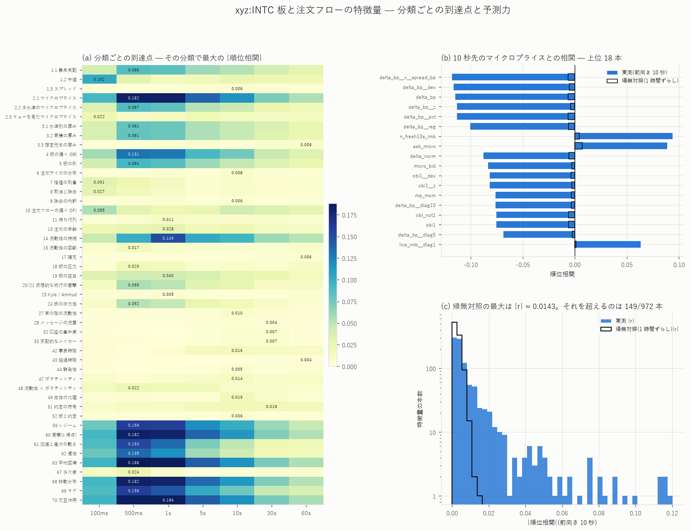
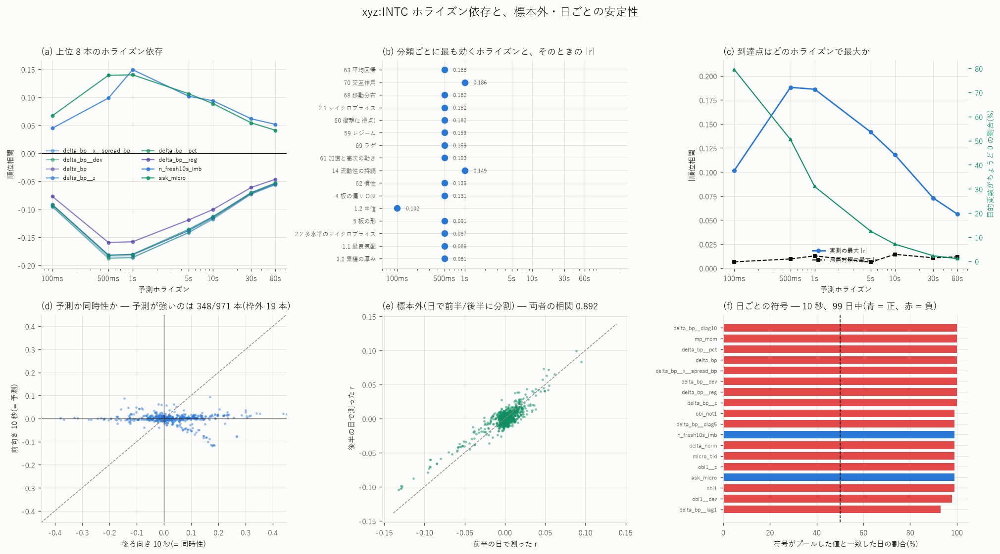
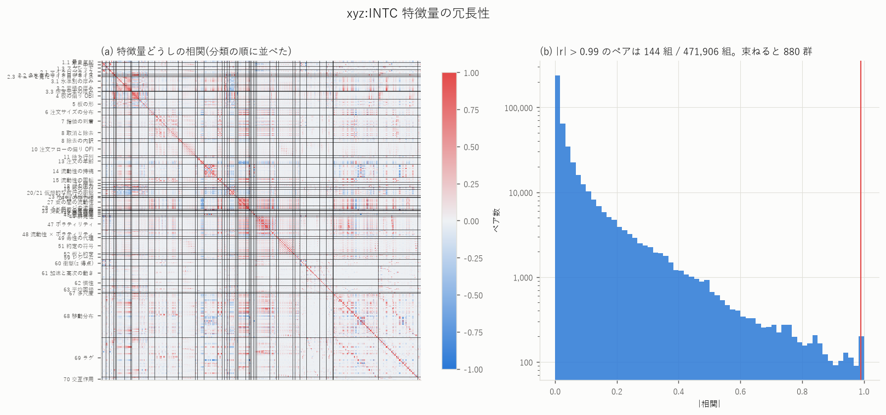
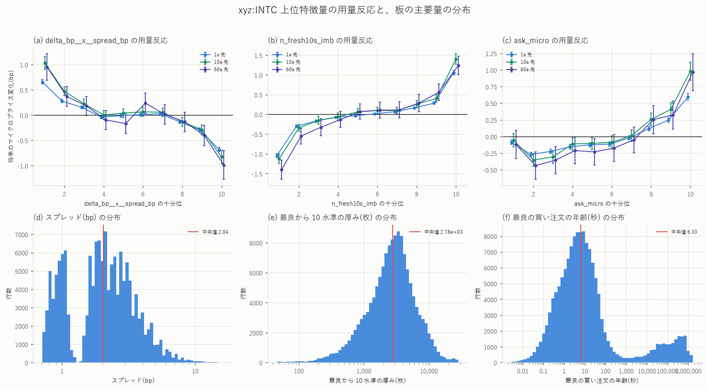

# 板と注文フローの特徴量 972 本 — 100ms 格子で 7 つのホライズンを測る

[← xyz:INTC の分析索引](README.md) ／ [用語辞書](../../../GLOSSARY.md)
／ [予測の定義](../../predicting_definition.md)

対象 `xyz:INTC` ／ 標本 2026-05-04 〜 2026-08-10 の 99 日

板と注文フローから **972 本**の特徴量を **100ms 格子**で作り、
**100ms / 500ms / 1s / 5s / 10s / 30s / 60s** の 7 つのホライズンで
予測力・同時性・帰無対照・標本外・日ごとの符号を通しで測りました。
分類表 75 節のうち **42 節**を作っています(12 節に全件の対応表)。



## 先に結論

- **予測力の山は 500ms 〜 1 秒にあり、100ms では落ちる。**最大 \|順位相関\| は
  100ms で 0.102、500ms で 0.188、1s で 0.186、60s で 0.056。
  理由は目的変数の側で、**100ms ではマイクロプライスの 80.7% がちょうど動かない**
  (5 節)
- **100ms だけ符号が逆。** 100ms で唯一効くのは直前 100ms の中値リターン
  (+0.102 の**順張り**)で、500ms 以降は δ = microprice − mid の
  **逆張り**(−0.19)に主役が入れ替わる(5 節)
- ★**「予測」と呼べる上位はほぼ全部が『流動性の持続』だった。**
  有意かつ \|前向き\| > \|後ろ向き\| かつ帰無対照の 3 倍超を満たす列は 1 秒で 56 本。
  その筆頭 `n_fresh10s_imb`(最良近くで**置かれて 10 秒未満**の数量の買い売り差)は
  前向き **+0.149** に対し後ろ向き +0.109、しかも**目的変数を mid にすると
  +0.187 と強くなる**。マイクロプライスの定義に依存した見かけの効果ではない。
  一方 δ 系は mid 建てで**符号が反転**する(7 節)
- **OFI は予測ではなく同時性。** `ofi_norm_60s` は後ろ向き +0.700 に対して
  前向きは +0.029 しかない(7 節)
- **帰無対照(同じ日の中で 1 時間ずらす)の最大は \|r\| = 0.006 〜 0.014**、
  標本外(日で前半 49 日 / 後半 50 日)の r の相関は **0.892**、
  上位の特徴量は 99 日中 94 〜 99 日で符号が一致した(8 節)
- **972 本の独立な情報は 880 群。** 潰れるのはゆっくり動く系列とその移動平均・
  ラグで、メッセージの流量(新規・取消・全事象)は 1 本に潰れる(9 節)
- **板の再構成は独立な経路と厳密に一致した。** 無作為 30 格子点で本数 30/30、
  平均年齢 30/30、数量 24/24。負の深さは 99 日で 0 件(3 節)
- ★**順位づけの同順位を平均していなかったため、100ms のセルで実測 0.661 /
  帰無対照 0.657 という偽の結果が一度出ている。**帰無対照を置いていなければ
  「100ms で強い予測力を発見した」と報告していた(14 節)

---

## 1. 何を作ったか

既にあった[特徴量ライブラリ 229 本](intc_featlib_report.md)は **1 秒格子**でした。
1 秒格子では 100ms や 500ms のホライズンをそもそも表現できません。
そこで格子を **100ms** に落とし、水準を 10 から **20** へ伸ばし、板を
数量だけでなく**本数・サイズの散らばり・注文の年齢**でも分解できるように
作り直しました。

| 層 | スクリプト | 中身 | 本数 |
|---|---|---|---|
| 板とフロー | `build_l4feat.py` | 板の階段・マイクロプライス・OBI・板の形・空白・圧力・仮想的な成行の衝撃・到着と取消・OFI・約定・ボラティリティ | 577 |
| 寿命 | `build_l4life.py` | 持続と新鮮の分解・束の間の流動性・待ち行列・補充・口座の集中度 | 105 |
| 派生 | `build_l4post.py` | 流動性 × ボラティリティ・レジーム・移動分布・ラグ | 290 |

出力は 3 層とも **1 秒おきの行**(86,400 行/日 × 99 日 = 855 万行)。
目的変数だけは間引く前の 100ms 格子で作るので、100ms と 500ms も正確に出ます。

### 板を 7 本の階段として同時に組む

注文 1 本の属性が $`f(\mathrm{size})`$ の形に書ければ、その水準での合計は
$`\sum_{\text{orders}} f(\mathrm{size})`$ で、イベントごとの差分は
$`f(\mathrm{size}_{\text{after}}) - f(\mathrm{size}_{\text{before}})`$
になります。つまり**数量とまったく同じ仕掛け(価格 × 格子の 2 次元の累積和)が
そのまま使えます**。

| 取る $`f`$ | 出てくる量 | そこから作れるもの |
|---|---|---|
| $`x`$ | 数量 | 厚み・OBI・想定元本 |
| $`\mathbf{1}\lbrace x \gt 0\rbrace`$ | 本数 | 本数 OBI・平均サイズ |
| $`x^2`$ | サイズの二乗和 | サイズの分散・変動係数 |
| $`\ln(x)\,\mathbf{1}\lbrace x \gt 0\rbrace`$ | 対数サイズの和 | 対数サイズの平均 |
| $`t_{\text{open}}\,\mathbf{1}\lbrace x \gt 0\rbrace`$ | 発注時刻の和 | 本数重みの平均年齢 |
| $`t_{\text{open}}^2\,\mathbf{1}\lbrace x \gt 0\rbrace`$ | 同二乗和 | 年齢のばらつき |
| $`x\,t_{\text{open}}`$ | 数量重みの和 | 数量重みの平均年齢 |

$`t_{\text{open}}`$ は**その日の 00:00 UTC からの秒**で持ちます。ns のまま
二乗すると $`3\times10^{36}`$ になって float64 の桁が飛び、年齢の分散が
桁ごと壊れます。

### 指値 1 本ごとの区間で「持続」を分ける

寿命の層は別の作り方をします。注文 1 本は区間
$`[t_{\text{open}}, t_{\text{close}})`$ のあいだ板に居るので、格子点 $`T`$ で
「板に居る」は $`t_{\text{open}} \lt T \lt t_{\text{close}}`$ です。1 本の寄与は
**連続した格子点の区間**になるので、差分配列に +w / −w を置いて累積和を取れば
全格子点の合計が 1 回の走査で出ます。持続ぶんは

```math
\mathrm{persistent}(T, n) \;=\; \mathrm{resting}(T) \;-\; \mathrm{fresh}(T, n)
```

で、右辺第 2 項「開いてから $`n`$ 秒未満のもの」も同じ区間の足し込みで出ます。

---

## 2. 時間契約

説明変数 $`x`$ は格子点 $`T`$ **までの**情報だけで作ります。目的変数は

```math
y_h \;=\; \log \mathrm{micro}(T+h) - \log \mathrm{micro}(T),
\qquad h \in \lbrace 100\mathrm{ms},\,500\mathrm{ms},\,1\mathrm{s},\,5\mathrm{s},\,10\mathrm{s},\,30\mathrm{s},\,60\mathrm{s}\rbrace
```

で、$`x`$ の確定時刻 $`T`$ ≤ $`y`$ の期間の開始時刻 $`T`$ を満たします。

守った規則は 5 つです。

1. **板の階段は 1 つずらしてある。** 格子 $`g`$ の深さに区間
   $`[T, T+100\mathrm{ms})`$ のイベントは入りません
2. **気配は厳密に $`T`$ 未満の最後の行。** `searchsorted(..., "left") − 1`
3. **フローの窓は $`[T-w, T)`$。** 区間 $`g`$ そのものを含めません。
   含めると $`h = 100\mathrm{ms}`$ の目的変数と丸ごと重なります
   (これは既存の特徴量ライブラリで実際に踏んだ誤りです)
4. **分位・レジームの基準は前日の分布から作る。** 当日全体から作ると、
   格子点 $`T`$ の値を $`T`$ より後ろの分布で順位づけることになります
5. **板がクロスしている行は除外。** 気配の再構成の段階で落としています

`shift(-k)` は目的変数にしか使っていません。

時間契約は言葉ではなく**実測で**確かめました。`new_rate_1s` を無作為な
12 格子点で raw のイベントから手計算し、12/12 で一致しました
(窓が $`[T-1\mathrm{s}, T)`$ であることの確認)。

---

## 3. 板の再構成をどう検証したか

パネルの板は「イベントの差分を 2 次元で累積」して組み立てています。
これが正しいかを、**まったく別の作り方をした `orderlife_*`**(1 行 = 指値 1 本、
開始と終了の時刻を持つ)から素朴に数え直して突き合わせました
(`scripts/audit_l4feat.py`)。

2026-05-05 の無作為な 30 格子点で、最良買いに居る注文について:

| 検査 | 結果 |
|---|---|
| 本数 | **30/30 一致** |
| 平均年齢(±0.02 秒) | **30/30 一致** |
| 数量(部分約定のない 24 点) | **24/24 一致** |

負の深さは 99 日を通して **0 件**でした。

### ★突き合わせで踏んだ 2 つの落とし穴

最初は 2 点で食い違い、どちらも**突合する側の抜け**でした。経緯ごと残します。

1. **打ち切り注文を入れ忘れていた。** 窓の終わりまで一度も約定も取消も
   されなかった注文(この日 308 本)は `orderlife_*/dt=*.parquet` に現れず、
   `orderlife_*_censored.parquet` にだけ居ます。外すと「パネルにだけ 3 本
   余分にある」ように見えます。実際、食い違った格子点の 1 つは
   打ち切り 3 本(いずれも年齢 12.53 時間)+ 通常 1 本(年齢 7.66 秒)で、
   平均年齢 9.40 時間・数量 247.21 枚がパネルの値と厳密に一致しました
2. **数量は部分約定で減る。** `orig_lots` は発注時の数量なので、
   99.8% が約定済みの注文では板の残量 0.01 枚と発注時 6.36 枚が食い違います

### `orderlife_*` は「発注日」ではなく「閉じた日」で分かれている

`orderlife_*/dt=D.parquet` は **D に約定/取消された注文**であって、
D に出した注文ではありません(`dt_open` 列が別にあります)。日 D の板に
居た注文を集めるには**後ろ**の日を読みます。実測では 99.97% が同じ日に
閉じるので D 〜 D+2 で足り、それより長く生きるものだけ索引にしています。

---

## 4. 測り方

### 重なりを避ける

1 秒ごとの行で 60 秒先を測ると、隣り合う標本が 59 秒ぶん重なります。
自由度が水増しされるので、**ホライズンより広い間隔で間引いた 2 つの標本**を
使います。

| 標本 | 間隔 | 使うホライズン | 行数 |
|---|---|---|---|
| A | 20 秒 | 100ms 〜 5s | 427,680 |
| B | 60 秒 | 10s 〜 60s | 142,560 |

$`t`$ 値はこの間引いた行数で計算します。

### 順位相関を使う

板の量は裾が非常に重く、Pearson だと少数の行が係数を支配します。
主指標は Spearman の順位相関です。

### 4 つの欄を分ける

| 欄 | 中身 |
|---|---|
| `r_fwd` | 前向き。$`\mathrm{corr}(x_T,\; \log\mathrm{micro}(T+h) - \log\mathrm{micro}(T))`$ |
| `r_bwd` | 後ろ向き。$`\mathrm{corr}(x_T,\; \log\mathrm{micro}(T) - \log\mathrm{micro}(T-h))`$ |
| `r_plc` | 帰無対照。$`x`$ を**同じ日の中で 1 時間ずらして**同じ計算をする |
| `r_1st` / `r_2nd` | 日で前半 49 日 / 後半 50 日に割った値(行のシャッフルはしない) |

`r_fwd` と `r_bwd` を混ぜると「もう起きたこと」を「これから起きること」の
予測力として報告してしまいます。必ず別の欄に書きます。

### 多重比較

特徴量 972 本 × ホライズン 7 = **6,804 セル**を測っています。
$`\alpha = 0.05`$ の Bonferroni 閾値は $`7.35\times10^{-6}`$、
両側の $`|z| \gt 4.49`$ に相当し、標本 B(14.3 万行)では
$`|r| \gt 0.0119`$、標本 A(42.8 万行)では $`|r| \gt 0.0069`$ です。

**「有意でない」を「効果がない」と読まないでください。**この標本では
$`|r| = 0.005`$ 程度の効果は検出できません。

---

## 5. 到達点は 1 秒で最大になる



972 本すべてを 7 つのホライズンで測った結果です。閾値は 4 節の Bonferroni。

| ホライズン | 標本 | 行数 | 閾値 | 実測の最大 \|r\| | 帰無対照の最大 \|r\| | 閾値を超えた本数 | 最大を取った列 |
|---|---|---|---|---|---|---|---|
| 100ms | A | 427,581 | 0.0069 | 0.1017 | 0.0065 | 239 | `ret_100ms`(正) |
| 500ms | A | 427,581 | 0.0069 | **0.1880** | 0.0095 | 258 | `delta_bp__dev`(負) |
| 1s | A | 427,581 | 0.0069 | 0.1861 | 0.0128 | 254 | `delta_bp__dev`(負) |
| 5s | A | 427,581 | 0.0069 | 0.1415 | 0.0062 | 286 | `delta_bp__x__spread_bp`(負) |
| 10s | B | 142,461 | 0.0119 | 0.1179 | 0.0143 | 188 | `delta_bp__x__spread_bp`(負) |
| 30s | B | 142,461 | 0.0119 | 0.0729 | 0.0107 | 134 | `delta_bp__x__spread_bp`(負) |
| 60s | B | 142,461 | 0.0119 | 0.0562 | 0.0117 | 127 | `delta_bp__x__spread_bp`(負) |

**山は 500ms 〜 1 秒にあり、100ms では逆に落ちます。**理由は目的変数の側にあります。

| ホライズン | 100ms | 500ms | 1s | 5s | 10s | 30s | 60s |
|---|---|---|---|---|---|---|---|
| マイクロプライスがちょうど動かない割合 | **80.7%** | 56.0% | 46.1% | 20.4% | 11.4% | 3.7% | 1.8% |

100ms では 5 回に 4 回、板は 1 ティックも動きません。予測すべき変化がそもそも
存在しないので、どんな特徴量でも相関の上限が低くなります。1 秒を過ぎると今度は
情報が古びていき、60 秒では最大 0.056 まで落ちます。

★この「動かない割合」は結果の読み方だけでなく**測り方**も左右しました。
順位相関の同順位を平均順位にしていなかったとき、100ms のセルで実測 0.661 /
帰無対照 0.657 という値が出ています(14 節)。

### 100ms だけ性質が違う

100ms で唯一の上位は `ret_100ms`(直前 100ms の中値リターン)で、符号は
**正 = 順張り**です(+0.102、帰無対照 +0.002)。500ms 以降は
δ = microprice − mid の**逆張り**(−0.19)に主役が入れ替わります。
100ms は「たった今動いた向きに、もう少し動く」時間帯です。

---

## 6. 分類ごとの到達点


分類ごとに、その分類で最大の \|r\| を並べます(上位のみ、1 秒と 10 秒)。

| 分類 | 1 秒 | 10 秒 |
|---|---|---|
| 63 平均回帰 | 0.1861 | 0.1161 |
| 70 交互作用 | 0.1856 | 0.1179 |
| 2.1 マイクロプライス | 0.1816 | 0.1149 |
| 60 衝撃(z 得点) | 0.1803 | 0.1133 |
| 68 移動分布 | 0.1803 | 0.1131 |
| 59 レジーム | 0.1578 | 0.1003 |
| **14 流動性の持続** | **0.1492** | **0.0938** |
| 69 ラグ | 0.1444 | 0.0762 |
| 61 加速と高次の動き | 0.1343 | 0.0495 |
| 4 板の偏り OBI | 0.1280 | 0.0752 |
| 62 慣性 | 0.1170 | 0.0415 |
| 5 板の形 | 0.0859 | 0.0484 |
| 1.1 最良気配 | 0.0837 | 0.0530 |
| 2.2 多水準のマイクロプライス | 0.0816 | 0.0440 |
| 3.1 / 3.2 板の厚み | 0.0776 | 0.0465 |
| 20/21 仮想的な成行の衝撃 | 0.0513 | 0.0277 |
| 24 板の弾力性 | 0.0472 | 0.0195 |
| 19 板の空白 | 0.0405 | 0.0274 |
| 13 注文の年齢 | 0.0285 | 0.0224 |
| 10 注文フローの偏り OFI | 0.0215 | 0.0412 |
| 48 流動性 × ボラティリティ | 0.0211 | 0.0099 |

★**上の 6 つはほとんど同じものを見ています。** 59・60・61・62・63・68・69・70 は
「他の量の変換」の分類なので、`delta_bp` の z 得点や偏差や
`delta_bp × spread` が並んでいるだけです。**分類の到達点が高いことは
「その分類が独立に効く」ことを意味しません。**元の量ごとに 1 本だけ残すと
上位は次のようになります(1 秒)。

| 列 | 分類 | 前向き | 後ろ向き | mid 建て | 帰無対照 |
|---|---|---|---|---|---|
| `delta_bp__dev` | 63 平均回帰 | −0.1861 | +0.2587 | +0.0866 | +0.0011 |
| **`n_fresh10s_imb`** | **14 流動性の持続** | **+0.1492** | +0.1090 | **+0.1873** | +0.0001 |
| `mp_mom` | 2.1 マイクロプライス | −0.1428 | +0.2101 | +0.0649 | −0.0001 |
| `delta_norm` | 2.1 マイクロプライス | −0.1422 | +0.2406 | +0.0978 | +0.0007 |
| `obi1__dev` | 63 平均回帰 | −0.1402 | +0.2361 | +0.0907 | +0.0017 |
| `n_fresh1s_imb` | 14 流動性の持続 | +0.1358 | +0.0878 | +0.1649 | +0.0004 |
| `obi_not1` | 4 板の偏り OBI | −0.1280 | +0.2207 | +0.0877 | +0.0008 |
| `live_imb__dlag1` | 69 ラグ | +0.0984 | −0.0399 | +0.1025 | +0.0014 |

---

## 7. 予測か同時性か — ここで順位が入れ替わる

10 秒で「前向きのほうが後ろ向きより強い」のは **348/971 本**です。
残りは「もう起きたこと」を測っています。典型は OFI で、`ofi_norm_60s` は
後ろ向き **+0.700** に対して前向きは **+0.029** しかありません。
OFI は板を動かした原因そのものなので、当然といえば当然です。

**有意(Bonferroni)かつ \|前向き\| > \|後ろ向き\| かつ 帰無対照の 3 倍超**を満たす
列を数えると、1 秒で 56 本(元の量で 36 系統)、10 秒で 26 本(19 系統)です。
その上位は**ほぼ全部が「14 流動性の持続」**でした。

| 列 | 意味 | 前向き 1s | 後ろ向き 1s | mid 建て |
|---|---|---|---|---|
| `n_fresh10s_imb` | 最良近くで**置かれて 10 秒未満**の数量の買い売り差 | +0.1492 | +0.1090 | **+0.1873** |
| `n_fresh1s_imb` | 同 1 秒未満 | +0.1358 | +0.0878 | +0.1649 |
| `live_imb__dlag1` | 板に残っている数量の偏りの **1 秒差分** | +0.0984 | −0.0399 | +0.1025 |
| `gap_asym` | 買い側と売り側の「最初の空白までの距離」の差 | +0.0405 | +0.0053 | +0.0571 |

### ★ mid 建てで測ると大小関係が変わる

目的変数をマイクロプライスから **mid** に替えると、δ 系は符号が反転します
(`delta_bp` は −0.186 → **+0.087**)。これは「mid が microprice に追いつく」
動きで、[既存の特徴量ライブラリ](intc_featlib_report.md)でも同じことが出ています。
δ のマイクロプライス建ての逆張りには、**定義から来る機械的な部分**が含まれます。

いっぽう `n_fresh10s_imb` は mid 建てのほうが**強く**なります
(+0.149 → **+0.187**)。マイクロプライスの定義に依存した見かけの効果ではなく、
中値そのものの将来を当てています。ここが δ 系との決定的な違いです。

**新しく置かれた流動性がどちらに偏っているかは、板の状態そのもの(OBI)より
「これから」の情報を持っている** — これがこのレポートの一番の結果です。
そしてこれは注文 1 本ごとの寿命を追わないと作れない量で、
L4 を取っている理由そのものです。

---

## 8. 標本外と、日ごとの符号

日を前半 49 日 / 後半 50 日に割って測り直すと、972 本の r の相関は **0.892**、
符号が一致するのは **665/972 本**でした(行のシャッフルはしていません)。

日ごとに測った 99 日ぶんの符号一致は次のとおりです。

| 列 | ホライズン | 平均 r | 中央値 | 最悪の日 | 最良の日 | 符号一致 |
|---|---|---|---|---|---|---|
| `delta_bp__dev` | 1s | −0.183 | −0.188 | −0.299 | −0.036 | **99/99** |
| `delta_bp__dev` | 10s | −0.123 | −0.112 | −0.243 | −0.018 | **99/99** |
| `delta_bp__dev` | 60s | −0.065 | −0.055 | −0.265 | +0.041 | 94/99 |
| `n_fresh10s_imb` | 1s | +0.157 | +0.181 | +0.009 | +0.296 | **99/99** |
| `n_fresh10s_imb` | 10s | +0.095 | +0.097 | −0.004 | +0.211 | 98/99 |
| `n_fresh10s_imb` | 60s | +0.053 | +0.053 | −0.040 | +0.121 | 97/99 |
| `live_imb__dlag1` | 1s | +0.099 | +0.099 | −0.021 | +0.195 | 97/99 |
| `obi1` | 1s | −0.126 | −0.126 | −0.241 | +0.008 | 98/99 |
| `ofi_norm_60s` | 10s | +0.043 | +0.030 | −0.077 | +0.193 | 78/99 |

★**中央値だけでなく最悪の日も出しています。** `n_fresh10s_imb` は 1 秒では
99 日すべてで正でしたが、10 秒では 1 日だけ −0.004 になります。

---

## 9. 冗長性 — 972 本の独立な情報は 880 群



\|r\| > 0.99 を辺として束ねると **880 群**になりました。2 本以上の群は 56 群で、
そこに入る列は 148 本だけです([既存の 229 本のライブラリ](intc_featlib_report.md)は
229 → 157 群だったので、今回のほうが重複は少ない)。

| \|r\| の閾値 | ペア数 |
|---|---|
| > 0.90 | 723 組 / 471,906 組 |
| > 0.95 | 402 組 |
| > 0.99 | 144 組 |

潰れるのは主に**ゆっくり動く系列とその移動平均・ラグ**です。

| 群の大きさ | 中身 |
|---|---|
| 8 本 | `live_imb` と その `__m10 / __m60 / __m300 / __lag1 / __lag2 / __lag5 / __lag10` |
| 8 本 | `wal_hhi` と同上 |
| 5 本 | `best_bid` / `best_ask` / `mid` / `log_mid` / `micro`(価格の水準そのもの) |
| 5 本 | `churn_10s` と その移動平均・ラグ |
| 4 本 | `new_rate_10s` / `cxl_rate_10s` / `msg_rate_10s` / `nev_10s` |
| 4 本 | `t_since_sp` / `t_since_bbo` / `t_since_mid` / `spread_dur` |

**メッセージの流量は 1 本に潰れます。**新規・取消・全事象のどれで数えても
同じ量を見ているので、分類 28 に 10 本並べる意味はありません。

---

## 10. 板の姿



99 日を 60 秒おきに標本化した分位です。

| 量 | p1 | 中央値 | p99 |
|---|---|---|---|
| スプレッド | 0.74 bp | **2.04 bp**(2 ティック) | 7.32 bp |
| 最良から 10 水準の厚み | 206 枚 | 2,782 枚 | 16,658 枚 |
| 最良買いの数量 | 0.28 枚 | 20.9 枚 | 1,376 枚 |
| 最良買いの注文本数 | 1 本 | **2 本** | 10 本 |
| 最良買い注文の年齢 | 0.03 秒 | 6.32 秒 | **826,096 秒**(9.6 日) |
| 1 万ドル往復のスリッページ | 0.89 bp | 4.33 bp | 14.8 bp |
| 5 万ドル往復のスリッページ | 2.11 bp | 7.28 bp | 21.6 bp |
| 新規発注(件/秒) | 0 | 9 | 230 |
| 取消(件/秒) | 0 | 8 | 238 |
| 約定(件/秒) | 0 | 0.10 | 3.6 |
| 実現ボラティリティ 10 秒 | 0 | 2.03 bp | 17.4 bp |
| 最良近くの口座数 | 36 | **210** | 292 |
| 口座の実効数 1/HHI | 2.3 | **17.6** | 24.2 |
| 最大口座のシェア | 12.1% | 18.0% | 64.9% |
| 最良近くの板のうち 10 秒以上そこに居る割合 | 79.4% | **99.2%** | 100% |
| 消えた注文のうち寿命 0.1 秒未満の割合 | 0% | 10.5% | 41.0% |
| 前に並んでいる数量 | 17.7 枚 | 44.7 枚 | 122 枚 |

読み取れることを 3 つ。

1. **最良気配は薄くて浅い。** 中央値で注文 2 本・21 枚しかありません。
   いっぽう最良から 10 水準の累積は 2,782 枚あるので、板は**すぐ外側に厚い**
2. **年齢は二山になる。** 中央値 6.3 秒に対して p99 は 9.6 日です。
   板にある数量のうち、**発注時に最良から 10 ティック以内だったものは 21.1%**
   しかなく(残りは遠くに置かれたもの)、しかも**いま最良から 20 ティック以内に
   あるのは 1.4%**(2026-06-03 の実測)です。置きっぱなしの注文が
   ときどき最良気配になります
3. **取消は速く、約定は稀。** 消えた注文の 10.5% は 0.1 秒も生きておらず、
   約定は 10 秒に 1 件です。取消/新規の比は中央値 1.00

---

## 11. 銘柄をまたいだ先行・遅行(分類 55)

`xyz:INTC` と `xyz:MU` の 99 日共通で、100ms 格子のマイクロプライスの
対数リターンを使いました。説明側は `[T−h, T)`、目的側は `[T, T+h)` で、
**同じ区間を両側で使っていません**。日ごとに測って平均と符号一致を出します。

| h | MU → INTC | 同符号 | INTC → MU | 同符号 | 同時 | 帰無対照 |
|---|---|---|---|---|---|---|
| 100ms | **+0.0254** | 92/99 | +0.0115 | 88/99 | 0.0706 | −0.0001 |
| 500ms | +0.0238 | 95/99 | **+0.0552** | 91/99 | 0.1548 | −0.0005 |
| 1s | +0.0327 | 95/99 | **+0.0494** | 91/99 | 0.2296 | −0.0002 |
| 5s | +0.0372 | 92/99 | +0.0325 | 88/99 | 0.3796 | +0.0017 |
| 10s | +0.0362 | 82/99 | +0.0276 | 80/99 | 0.4231 | +0.0028 |
| 30s | +0.0253 | 76/99 | +0.0177 | 62/99 | 0.4744 | +0.0051 |
| 60s | +0.0333 | 66/99 | +0.0230 | 64/99 | 0.4978 | +0.0087 |

- **同時相関が 0.07 → 0.50 と伸びます。**短い時間ほど 2 銘柄が無相関に見える
  Epps 効果で、板の更新が疎であることの裏返しです
- 先行はどちら向きも小さい(+0.02 〜 +0.06)。100ms では MU が先、
  500ms 〜 1 秒では INTC が先で、**一方通行ではありません**
- 帰無対照はほぼ 0。ただし 60 秒では +0.0087 まで上がるので、
  60 秒の +0.033 は帰無対照の 4 倍程度でしかない点に注意

---

## 12. 分類表 75 節のどこまで作ったか

**41 節を今回作り、1 節(55 先行遅行)を別途測りました。**

作らなかった 33 節は 3 種類に分かれます。

### (a) データ上そもそも作れない — 1 節

| 節 | 理由 |
|---|---|
| 9 注文の変更(Modification / UPDATE) | Hyperliquid の L4 に注文修正イベントが**無い**。2026-06-01 の指値イベント 7,358,351 件を調べると、残量が増えた事象 **0 件**、`open` が 2 回以上ある oid **0 件**、`open` で `orig_sz ≠ remaining_sz` の行 **0 件**。修正は取消 + 別の oid として現れる |

### (b) このリポジトリに既にある — 11 節

| 節 | どこにあるか |
|---|---|
| 12 約定確率 × キュー位置 | [指値 1 本ごとの寿命とキュー位置](intc_orderlife_report.md)(INTC) |
| 30 / 31 口座ごとの量・メイカー判定 | 同上(INTC、口座別の集中度と癖) |
| 28 メッセージの流量 14 指標 | `xyz:MU` の専用レポート |
| 34 メイカーの混み具合 9 指標 | 同上 |
| 36 口座のクラスタと埋め込み | 同上 |
| 37 アイスバーグの代理 | 同上 |
| 39 BBO の入れ替わり 9 指標 | 同上 |
| 45 エントロピー 13 種 | 同上(156 セルの予測力つき) |
| 46 長期記憶 8 推定量 × 9 系列 | 同上 |
| 50 / 53 逆選択 markout・約定効率 11 指標 | 同上(口座ごと) |
| 72 期待エッジ | 同上 |

`xyz:MU` にあるものは同じスクリプトに `--coin xyz:INTC` を渡せば作れます。
今回は走らせていません。

### (c) 今回は作っていない — 21 節

| 節 | 見送った理由 |
|---|---|
| 16 弾力回復 | 指数回復の当てはめが要る。補充比(17)だけ作った |
| 22 価格インパクト | 約定を起点にしたイベント研究で、パネルの列にはならない |
| 25 / 26 取消の形状・スプーフィング | 取消の距離・年齢の分布は作ったが、口座横断の判定は未実施 |
| 29 Hawkes | 自己励起の推定に別の当てはめが要る |
| 35 口座の同期 | 口座 × 時刻の行列が要る |
| 38 注文の移動 | 取消 + 再発注の紐づけが要る |
| 40 価格水準の動き | 空白の本数と最初の空白までの距離だけ作った |
| 41 板の状態遷移 | レジーム(59)で代替した |
| 54 価格発見 | Granger・情報シェアは別の枠組み |
| 56 / 57 / 58 銘柄横断の相対量・共通口座・伝播 | 相手側の同じパネルが要る(今回は INTC のみ) |
| 64 / 65 / 66 系列パターン・点過程・粗さ | 板の形の曲率(5)以外は未実施 |
| 71 / 73 / 74 執行費用・気配の置き場所・在庫リスク | 仮想的な成行の衝撃(20/21)以外は未実施 |

**75 節は「実務上の優先度が高いもの 20 項目」の一覧**で、独立した分類では
ありません。20 項目のうち 18 は作ってあり、欠けているのは
**19 cross-asset OFI** と **20 common-maker cross-market flow** の 2 つです
(どちらも相手銘柄の同じパネルが要ります)。

---

## 13. この結果の限界

1. **板の再構成は `bbo_l1` と 64.6% でしか完全一致しない。**
   合計の数量では 10.7% 多くなります。`bbo_l1` 側は older-loses の退去規則で
   クロスを解いた際に注文を落としているためで、
   [板の出どころを l2 から l1 へ移す](intc_bbo_l1_report.md)に経緯があります。
   マイクロプライスと目的変数は `bbo_l1` 由来なので、
   **板の階段と目的変数はわずかに別の板を見ています**
2. **寿命層の「最良の近く」は発注時の距離で切っている。** その後に最良が
   動いても追いません
3. **口座の集中度は上位 K の近似ではなく厳密値**ですが、母集団は上の
   「近く」の定義に依存します
4. **`r` は 0.19 が最大**です。順位相関 0.19 は決定係数でいえば 3.6% で、
   これだけで取引になる大きさではありません。費用(手数料・スプレッド・
   スリッページ)は一切引いていません。**このレポートは特徴量の棚卸しであって、
   戦略の評価ではありません**
5. **99 日は 1 つの相場つき**です。前半・後半では割っていますが、
   別の局面での再現は保証しません

---

## 14. 見つけて直した誤りの記録

### (1) 順位相関の同順位を平均していなかった

最初の実装は `argsort` の結果をそのまま順位にしていました。すると
**同じ値の行に「元の並び順」どおりの順位**が付きます。100ms の
マイクロプライス変化は 80.7% がちょうど 0 なので、順位が実質
「その日の中の時刻」になり、**ゆっくり動く特徴量なら何でも** `r ≈ 0.65` が
出ていました。

気づけたのは**帰無対照も同じ値になった**からです。

| | 修正前 | 修正後 |
|---|---|---|
| h=100ms 実測の最大 \|r\| | 0.661 | **0.102** |
| 同 帰無対照の最大 \|r\| | 0.657 | **0.007** |

平均順位に直し、`scipy.stats.rankdata` と 4 通りの同順位密度で一致を確認しました。
「時刻 vs 90% がゼロの系列」の相関も 0.65 → 0.002 になります。

**帰無対照を置いていなければ、この誤りは「100ms で強い予測力を発見した」という
結論になっていました。**

### (2) 標本 A が一度も使われていなかった

短いホライズン用の標本 A(20 秒間隔)を選ぶ条件を定数 5 と直接比べていたため、
間引き幅を 20 に変えたあと**全ホライズンが 60 秒間隔の標本 B で測られて**
いました。結果の符号や順位は変わりませんが、100ms 〜 5s の標本数が
14.3 万行のまま(本来は 42.8 万行)で、検出力が 3 分の 1 でした。
直したあとは閾値が 0.0119 → 0.0069 に下がり、
たとえば 5 秒で閾値を超える本数が 219 → 286 本に増えています。

### (3) 板の突合で 2 点だけ食い違った

3 節に書いたとおり、原因は 2 つとも**突合する側の抜け**(打ち切り注文の
入れ忘れと、部分約定による残量の減少)でした。訂正の経緯ごと残します。

### (4) 価格の窓が注文の出た価格帯を超えて破断した

板の窓 `[lo, hi]` は**最良気配**から決まるので、注文が一度も出ていない
価格帯まで伸びることがあります。累積用の配列をイベントの価格範囲だけで
確保していたため、2026-07-10 で `(500, 4057) += (2557,)` の形の不一致で
落ちました。最良気配の範囲も含めて確保するよう直しています。

---

## 15. 再現手順

```bash
# 前提: data/l1_xyz_INTC/ と data/bbo_l1_xyz_INTC/ と
#       data/orderlife_xyz_INTC/ と data/fills_xyz_INTC.parquet がある
#       (作り方は reports/hyperliquid/INTC/README.md の再現手順)

# 1) 板とフローのパネル(100ms 格子、出力は 1 秒おき)。1 日あたり約 2.5 分
uv run python scripts/build_l4feat.py --coin xyz:INTC

# 2) 指値 1 本ごとの層(持続・束の間・待ち行列・口座)。1 日あたり約 30 秒
uv run python scripts/build_l4life.py --coin xyz:INTC

# 3) 派生(流動性 × ボラ・レジーム・移動分布・ラグ)。1 日あたり約 2 秒
uv run python scripts/build_l4post.py --coin xyz:INTC

# 4) 板の再構成を orderlife から数え直して検証
uv run python scripts/audit_l4feat.py --coin xyz:INTC --dt 2026-05-05 -n 30

# 5) 予測力
uv run python scripts/fit_l4feat.py --coin xyz:INTC --stage pool
uv run python scripts/fit_l4feat.py --coin xyz:INTC --stage daily
uv run python scripts/fit_l4feat.py --coin xyz:INTC --stage corr

# 6) 銘柄またぎの先行・遅行
uv run python scripts/fit_leadlag_l4.py --a xyz:INTC --b xyz:MU

# 7) 図
uv run python scripts/plot_l4feat.py --coin xyz:INTC
```

パネルの出力は大きいので版管理の外に置いています
(`E:/Memory-l4feat/xyz_INTC/` 9.7 GiB、`_life` 2.1 GiB、`_post` 5.6 GiB)。
