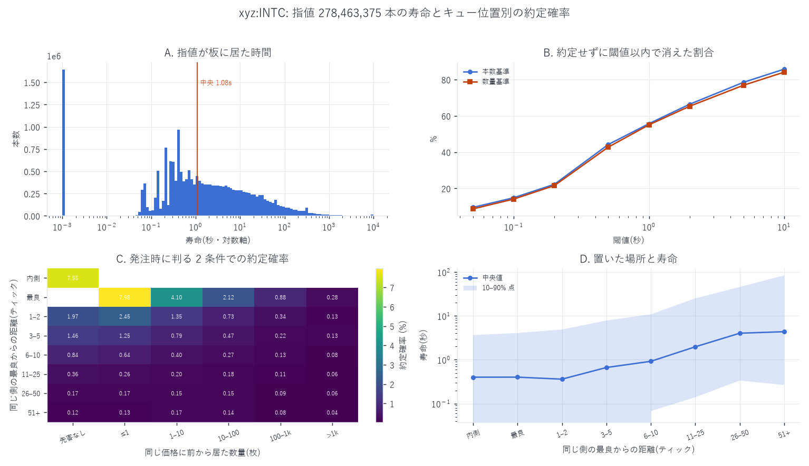
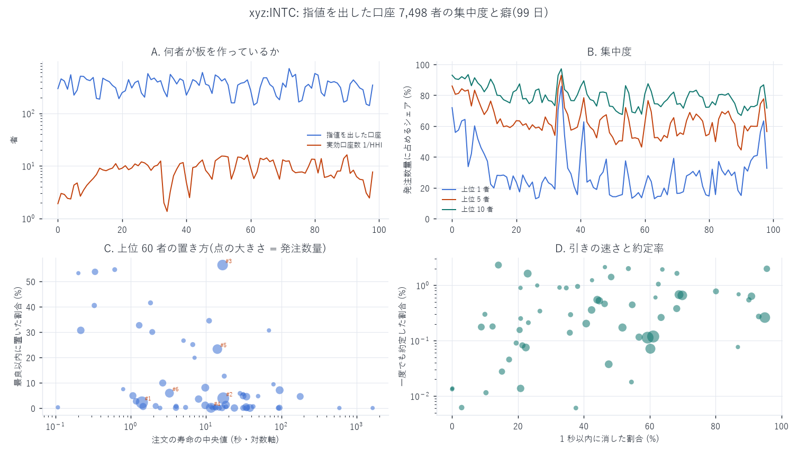

# 指値 1 本ごとの寿命とキュー位置 — L2 では作れない層

[← xyz:INTC の分析索引](README.md) ／ [用語辞書](../../../GLOSSARY.md)
／ [予測の定義](../../predicting_definition.md)

対象 `xyz:INTC` ／ 標本 2026-05-04 〜 2026-08-10 の 99 日

板に置かれた指値を **1 本ずつ個体として追い**、置いた場所・前に並んでいた量・
板に居た時間・どう消えたかを記録しました。価格水準ごとの合計しか持たない L2 では
作れず、注文 1 本ごとの記録(L4)があって初めて作れる層です。

**時間契約**: 層別に使う `dist_tick`(同じ側の最良からの距離)・
`ahead_lots`(同じ価格に既に積まれていた数量)・`spread_tick`・`orig_lots` は
**発注の瞬間に確定**します。目的変数(約定したか・寿命)はそれより後の情報なので、
この層別は先読みになりません。`shift(-k)` は使っていません。

---

## 1. 何を 1 行にしたか

`build_orderlife.py`。`l1` の注文イベントを oid で束ね、**その日に板へ置かれた
指値 1 本を 1 行**にします。板の作りは
[板の出どころを l2 から l1 へ移す](intc_bbo_l1_report.md) と同じで、
`Alo` / `Gtc` だけ、トリガー注文と Rejected 系は除きます。

| 列 | 中身 | 確定する時刻 |
|---|---|---|
| `ts_open` `is_bid` `pidx` `orig_lots` `tif` `reduce_only` | 発注そのもの | 発注時 |
| `dist_tick` | 同じ側の最良から何ティック奥か(負 = スプレッドの内側、0 = 最良と同値) | 発注時 |
| `ahead_lots` | 同じ価格に**既に積まれていた**数量 | 発注時 |
| `spread_tick` | 発注時のスプレッド(ティック) | 発注時 |
| `ts_close` `status` `rest_lots` | 終端イベント | 終端時 |
| `filled_lots` = `orig − rest` | 約定した量 | 終端時 |
| `life_ns` = `ts_close − ts_open` | 板に居た時間 | 終端時 |

`dist_tick` と `ahead_lots` は **その注文を板に入れる直前**の板から測ります。
自分自身を数えないためで、これを怠るとキュー位置が必ず 1 本ぶん大きく出ます。
実際、`dist_tick = 0`(最良と同値)の行に「先客なし」が 1 件も現れないことが、
この処理が効いていることの確認になります(最良に並べるということは、
そこに既に誰かが居るということなので)。

## 2. ★ `filled_lots` を素直に信じてはいけない

`reduce_only` の注文は、保有ポジションが減ると取引所が残量を**自動的に縮めます**。
残量が減っても約定とは限らないので、`orig − rest` を約定量として数えると過大になります。
hl-l4-pipeline ではこれで `filled_sz` を **22.8% 過大計上**し、
誤計上の **100% が `reduce_only`** でした。ここでは数量の集計から
`reduce_only` を必ず外しています。

## 3. 右打ち切り

窓の終わり(2026-08-10)までに終端イベントが来なかった注文は、寿命が判りません。
**集計に入れず、件数だけ報告**します。窓の途中で日をまたぐ注文は、
翌日以降の終端と突き合わせて正しく閉じています。

## 4. 全体像

99 日で板に置かれ、決着した指値は **2 億 7,994 万本**。うち `reduce_only` を除いた
**2 億 7,846 万本 / 321.9 億枚**を集計対象にしています。
窓の終わりまで決着しなかった注文は **7,246 本**(0.0026%)だけで、
右打ち切りの影響は無視できます。

| 量 | 値 |
|---|---:|
| 一度でも約定した**本数** | 2,205,786 = **0.792%** |
| 約定した**数量** | 42,760,401 枚 = **0.133%** |
| 寿命 10% 点 | 0.066 秒 |
| 寿命 **中央値** | **1.081 秒** |
| 寿命 90% 点 | 37.1 秒 |
| 寿命 99% 点 | 451.2 秒 |

**本数基準 0.792% と数量基準 0.133% は 6 倍違います。** 分子と分母の取り方が
違うだけで、どちらも「約定率」と呼べてしまう。大きい注文ほど約定しにくいので、
数量で数えると下がります。**どちらの数字か明示せずに引用してはいけません。**

結末の内訳:

| 結末 | 本数 | 割合 |
|---|---:|---:|
| `canceled` | 278,420,978 | 99.44% |
| `filled` | 1,416,054 | 0.506% |
| `reduceOnlyCanceled` | 80,250 | 0.029% |
| `selfTradeCanceled` | 19,509 | 0.007% |
| `scheduledCancel` / `marginCanceled` / `liquidatedCanceled` | 1,655 / 467 / 126 | — |

`filled`(全量約定)は 0.506% ですが、部分約定を含めた「一度でも約定した」は
0.792% です。差の 0.286 ポイントが**部分約定のまま取り消された注文**です。

### ★ 9.53% の注文は 1 ナノ秒も板に居ない

| 寿命 | 本数 | 割合 |
|---|---:|---:|
| **ちょうど 0 ns** | 26,537,714 | **9.530%** |
| 1 ミリ秒未満 | 26,537,719 | 9.530% |
| 1 ブロック(67 ms)未満 | 33,292,923 | 11.956% |

発注と終端が**同じナノ秒**、つまり同じブロックで処理された注文が 1 割近くあります。
0 ns と 1 ms 未満がほぼ同数(差 5 本)なので、これは「非常に速い取消」ではなく
**チェーンの 1 ブロックの中で完結した注文**です。ブロック周期が 67 ms なので、
この層は板に載って見えることすらありません。

板の状態から作る特徴量(前レポートの 1〜8 分類)には、この 1 割は
**1 秒格子ではまったく写りません**。注文 1 本ごとの記録でしか見えない層です。

## 5. 束の間の注文

「約定せずに閾値以内で消えた」割合です。

| 閾値 | 本数基準 | 数量基準 |
|---|---:|---:|
| 0.05 秒 | 9.53% | 8.72% |
| 0.1 秒 | 14.84% | 14.11% |
| 0.2 秒 | 22.27% | 21.56% |
| 0.5 秒 | 44.16% | 42.75% |
| **1 秒** | **55.68%** | **55.04%** |
| 2 秒 | 66.40% | 65.28% |
| 5 秒 | 78.47% | 76.85% |
| 10 秒 | 85.73% | 84.08% |

**板に出た指値の半分以上は 1 秒以内に消えます。** 本数基準と数量基準がほぼ同じ
(差 0.6 ポイント以内)なのは `xyz:INTC` の特徴で、`xyz:MU` では
大口だけが長く残るため両者が離れます。

## 6. ★発注時に判る 2 条件で約定確率がどこまで動くか

行は同じ側の最良からの距離、列は同じ価格に**前から居た数量**。
どちらも**発注の瞬間に確定**します。値は本数基準の約定確率(%)です。

| 距離＼前に居た量 | 先客なし | ≤1 | 1–10 | 10–100 | 100–1k | >1k |
|---|---:|---:|---:|---:|---:|---:|
| **内側**(スプレッドの中) | **7.545** | — | — | — | — | — |
| **最良**(同値) | — | **7.984** | 4.103 | 2.121 | 0.879 | **0.282** |
| 1–2 ティック | 1.972 | 2.449 | 1.347 | 0.731 | 0.337 | 0.128 |
| 3–5 | 1.463 | 1.254 | 0.790 | 0.470 | 0.221 | 0.133 |
| 6–10 | 0.841 | 0.643 | 0.402 | 0.271 | 0.134 | 0.083 |
| 11–25 | 0.364 | 0.260 | 0.201 | 0.184 | 0.111 | 0.062 |
| 26–50 | 0.174 | 0.167 | 0.146 | 0.150 | 0.086 | 0.060 |
| 51+ | 0.116 | 0.127 | 0.170 | 0.137 | 0.083 | 0.037 |

読み取れることは 3 つです。

1. **キュー位置は水準より効きます。** 最良に置いても、前に 1 枚以下しか居なければ
   7.98%、100〜1,000 枚居れば 0.879%、1,000 枚超なら 0.282% —— **28 分の 1** です。
   一方、最良から 1–2 ティック外へ動かしても(先客なしで)1.97% にしか落ちません。
2. **「内側」と「最良で先客なし」がほぼ同じ**(7.545% 対 7.984%)。
   スプレッドの内側に入れて価格を改善しても、最良に空きがあるときに並ぶのと
   変わりません。
3. **空欄には意味があります。** 「最良 × 先客なし」は定義上あり得ません
   (最良と同じ価格に置くということは、そこに誰か居るということ)。
   「内側 × 先客あり」も同様です。この 2 つが空になったことが、
   自分自身をキューに数えていないことの確認になっています。

## 7. 置いた場所と寿命

| 距離 | 寿命の中央値 |
|---|---:|
| 内側 | 約 0.4 秒 |
| 最良 | 約 0.4 秒 |
| 1–2 | 約 0.4 秒 |
| 3–5 | 約 0.7 秒 |
| 6–10 | 約 0.9 秒 |
| 11–25 | 約 1.9 秒 |
| 26–50 | 約 4.2 秒 |
| 51+ | 約 4.5 秒 |

近いほど短命です。触られる可能性が高い場所ほど早く引かれる、という当たり前の形
ですが、**最良と 1–2 ティックで差が出ない**のは `xyz:INTC` の刻みが粗い
(1 ティック = 約 0.86 bp)ためだと思われます。

## 8. 誰が板を作っているか

`l1` の `user` 列を注文 1 本ごとに貼って、口座別に集計しました
(0.42 GB の追加取得。アドレスは載せず通し番号だけで扱います)。

| 量 | 値 |
|---|---:|
| 期間中に指値を出した実口座 | **7,498 者** |
| 1 日あたり(中央値) | **360 者**(最小 141 / 最大 718) |
| 発注数量の HHI(日次中央値) | 0.1195 → **実効 8.37 者** |
| 上位 1 者のシェア | **27.6%** |
| 上位 5 者 | 61.7% |
| 上位 10 者 | 79.6% |

**360 者が居るのに、実効では 8.4 者しか居ません。** 分母は「その日に出された
指値の数量」で、板に在る量ではありません(在る量で測ると長く置く口座が重くなり、
別の数字になります)。

数量上位 12 者の癖:

| # | 発注本数 | 発注数量(枚) | 出た日数 | 買い比 | 最良以内 | 1 秒以内に消す | 約定率 | 寿命中央(秒) | 1 本の中央(枚) |
|---:|---:|---:|---:|---:|---:|---:|---:|---:|---:|
| 1 | 9,021,348 | 5,103,962,368 | 53 | 0.602 | 0.022 | 0.611 | 0.0012 | 1.41 | 456.3 |
| 2 | 32,493,602 | 4,628,001,293 | **99** | 0.510 | 0.038 | 0.594 | 0.0011 | 16.94 | 99.4 |
| 3 | 19,706,219 | 2,908,065,219 | 35 | 0.483 | **0.564** | **0.950** | 0.0026 | 16.60 | 100.0 |
| 4 | 4,020,016 | 2,244,549,234 | 34 | 0.482 | 0.001 | 0.602 | 0.0007 | 11.66 | 460.5 |
| 5 | 18,075,727 | 1,893,708,859 | 96 | 0.490 | 0.232 | 0.699 | **0.0066** | 14.15 | 99.4 |
| 6 | 3,782,810 | 1,327,097,727 | 75 | 0.496 | 0.059 | 0.689 | 0.0068 | 3.27 | 373.4 |
| 7 | 4,463,709 | 902,868,686 | 73 | 0.535 | 0.013 | 0.517 | 0.0017 | 18.30 | 200.0 |
| 8 | 2,196,489 | 767,863,423 | 66 | 0.501 | 0.070 | 0.230 | **0.0163** | **95.06** | 338.6 |
| 9 | 3,696,611 | 764,775,173 | 89 | 0.540 | 0.080 | 0.441 | 0.0055 | 9.77 | 195.2 |
| 10 | 3,903,734 | 739,688,773 | **99** | 0.491 | **0.000** | 0.224 | 0.0008 | 38.35 | 180.7 |
| 11 | 1,575,691 | 721,928,829 | 78 | **0.742** | 0.004 | 0.476 | 0.0004 | 34.12 | 444.0 |
| 12 | 12,805,930 | 691,754,276 | 90 | 0.513 | 0.011 | 0.407 | 0.0020 | 9.75 | 49.2 |

**出す量の大きさと「最良に居るか」は一致しません。** 最大の出し手(#1)が
最良以内に置くのは 2.2% だけで、#10 に至っては **0.000%** — 一度も最良に
並んでいません。最良に居るのは #3(56.4%)と #5(23.2%)で、
この 2 者は 1 秒以内に消す割合も 0.950 / 0.699 と高く、**速く出して速く引く**形です。
逆に #8 は寿命の中央が 95 秒と長く、約定率は 1.63% と最も高い。
**「板を厚くする役」と「最良を取りに行く役」は別の口座がやっています。**

これは `xyz:MU` で得られた「板に出す金額の大きさと MM らしさは一致しない」
という結論([このウォレットはマーケットメイカーか](../MU/mu_wallet_mm_report.md))と
同じ向きの所見です。
