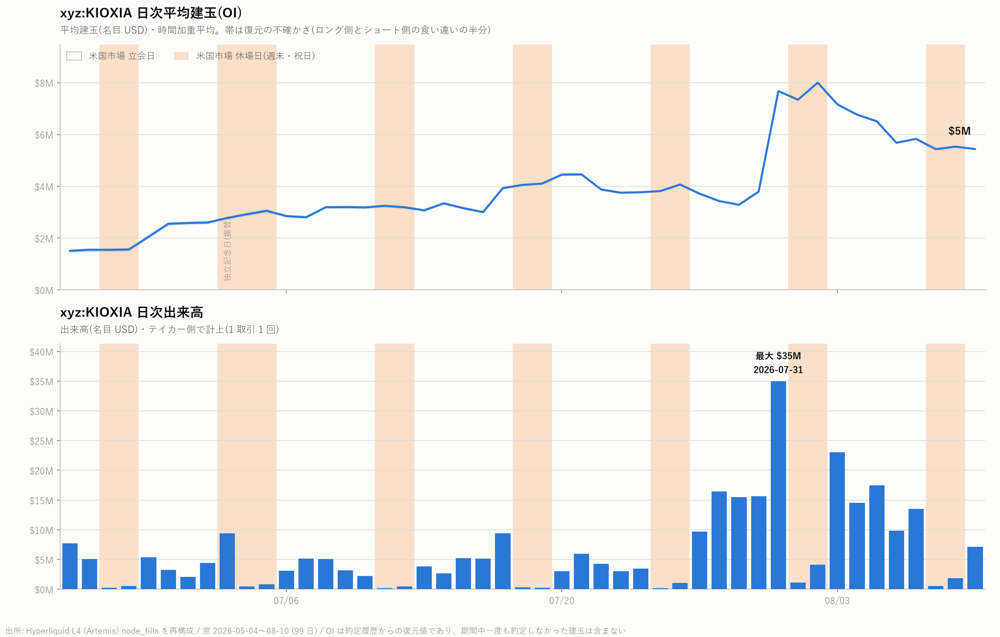
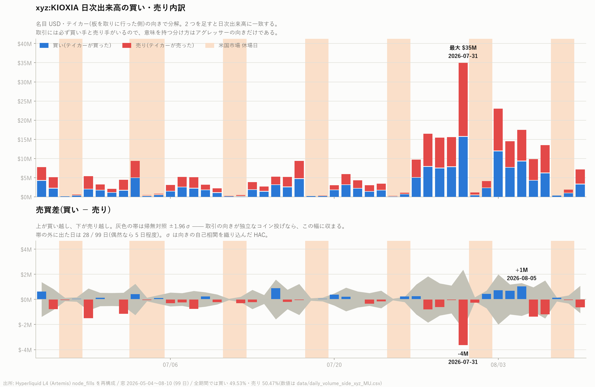
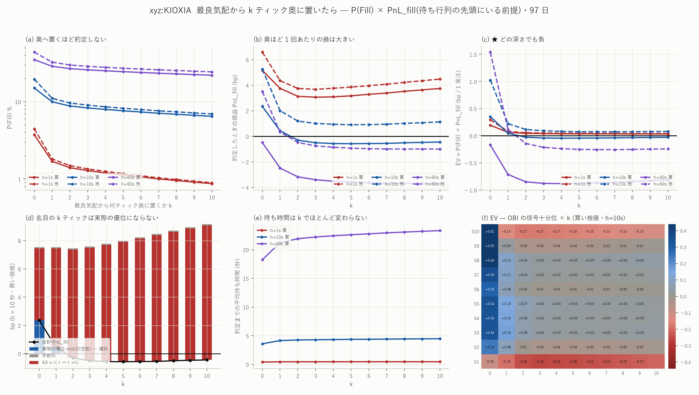
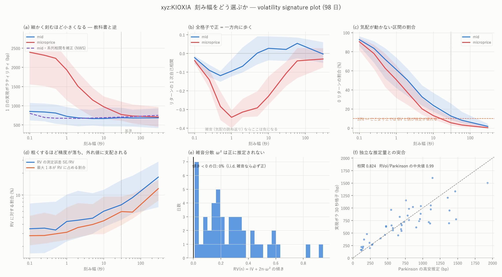
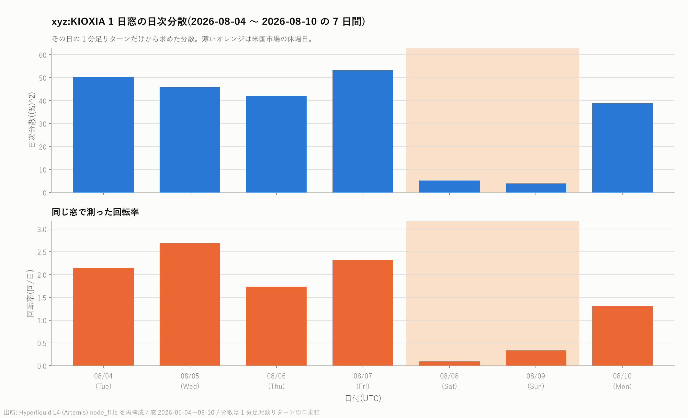
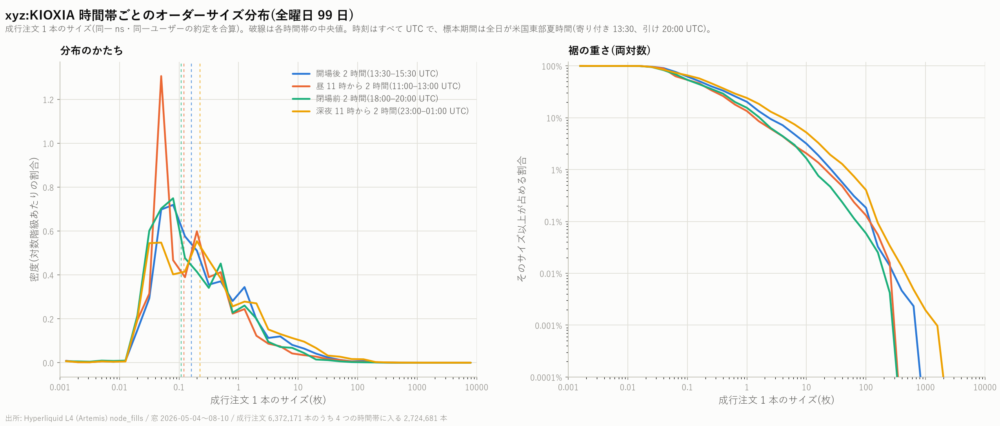
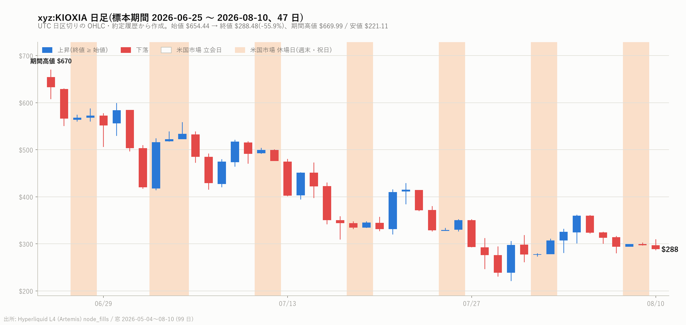

# `xyz:KIOXIA` 分析索引

[← ホーム](../../../README.md) / [Hyperliquid の分析](../README.md)

| 項目 | 内容 |
|---|---|
| 銘柄コード | `xyz:KIOXIA` |
| 原資産 | キオクシア(Kioxia)。NAND フラッシュメモリ大手、東証上場 |
| 商品の種別 | 無期限先物(perp)。24 時間 365 日取引 |
| 取引所 | [Hyperliquid](https://hyperliquid.xyz/)([Trade.xyz](https://trade.xyz/) が配備) |
| 標本期間 | **2026 年 6 月 25 日 〜 8 月 10 日(47 日)** — 板の稼働開始が他銘柄より 52 日遅い |
| 規模 | 日次出来高 \$410 万、取引 13,798 件/日、建玉 \$343 万 |

**7 銘柄で唯一、板が事実上まだ機能していない。**
スプレッド中央値 13.9bp(67 ティック)、最良気配 0.19 枚、約定は
10 秒に 0 件台。fills は 5 月 4 日からあるが、**bbo(板)は 99 ファイル中
52 が空**で、板の記録は 6 月 25 日から始まる。

---

## レポート

| レポート | 内容 |
|---|---|
| [MU の分析一式を KIOXIA で走らせる](kioxia_report.md) | 17 分析 + 特徴量 199 本 × 7 ホライズン。**予測力の山が 10 秒(0.359)** — 歪んだ気配が何十秒も放置される板。Book Slope は唯一立たない(t=1.8)。 |
| [7 銘柄の横並び](../cross_coin_report.md) | 板の姿は 20 倍違っても「効き方」の相関は +0.95〜1.00。 |
| [7 銘柄 × 84 本の十分位分析](../decile_all_report.md)(7 銘柄共通) | 最良気配と約定だけで作れる 84 本 × 9 ホライズン(100ms〜60 秒) × mid/micro。十分位の境目は**前日の分布**、標準誤差は日でクラスタ、帰無対照は 1 営業日ずらし。有意 51.2%(プラセボ 0.0%)。板が 2026-06-25 からなので **46 日**しかない。効果は 7 銘柄で最大(`ofi_ewma → mid_60s` 片側 5.22bp)だが、**費用も最大の 15.49bp** でその 34%。100ms では 24% しか有意にならず、**30〜60 秒でようやく 61%** に達する。 ★費用は銘柄ごとに違い、判定は \|D10 − D1\| ではなく**片側 max(\|D1\|,\|D10\|)** で行う。**7 銘柄 4,530 本の有意なセルのうち費用を越えたものはゼロ**。 |
| [7 銘柄のメイカー検証](../mm_all_report.md)(7 銘柄共通) | 在庫つきメイカー(両側に指値・\|q\|≤1 で FIFO 相殺・BBO 追随)を `xyz:MU` と同じ設定で当て、1 組あたり損益を恒等式で分解する。入口の門・無作為の門(帰無対照)・発注遅延 130 ms・執行できる数量を順に入れる。**唯一の黒字**(+1.976 bp/組、t=3.35)。半スプレッドが 16.182bp と桁違いで、劣化 45% と drift −6.792 を引いても残る。門ありは +7.128 bp・**19 日すべて黒字**で、130 ms の遅延にも耐える。★ただし BBO に中央 **\$66** しか並んでおらず、\$100 のクオートで −1.13 bp へ反転する。 ★7 銘柄のどれも、費用を引く前ですら**出す価値が無い**。 |
| [1 分足の平均回帰(20 分 SMA 基準)](../mrev_report.md)(8 銘柄共通) | $`D_t=\mathrm{mid}_t-F_t`$ の $`F_t`$ を 4 通り(microprice / EWMA / **SMA20** / モデル fair)置き、自己相関 $`\rho(k)`$・AR(1) の半減期・分散比 $`\mathrm{VR}(k)`$ で平均回帰を測る。**同じ欠測・ボラ・ティック幅のランダムウォークを帰無対照に置く**。φ=0.9225 が**ランダムウォークの 0.9224 と小数第 4 位まで一致**する(z=+0.03)。8 銘柄で唯一 **立会時間の VR(20)=1.151 と momentum 側**。約定値で測ると ρ(1)=−0.098 と強い負が出るが、これは 13.9bp のスプレッドが作る bid–ask bounce で、mid だと +0.029 になる。 |

---

## 図

**約定から見た素性**


**特徴量 199 本 × 7 ホライズンの予測力**


**建玉と出来高** / **買い売りの内訳**





**MicroPrice 帯 × ホライズンの上昇確率** / **OBI・OFI の行列**


**Book Slope 回帰** / **キャンセル率の傾き**


**符号の持続** / **テイカー向きの推移確率**


**OBI・OFI の自己相関(200ms)** / **100ms 分散と将来リターン**


**スプレッド・注文量・約定量の関係** / **深さと逆選択**




**markout の分解** / **流動性ショックからの回復**


**ボラティリティの姿** / **分散と回転率** / **注文サイズ** / **日足**









---

## 数値データ

| ファイル | 中身 |
|---|---|
| mrev_bars_xyz_KIOXIA.parquet | 1 分足(mid / micro / 約定 / スプレッド / OBI)(版管理外) |
| [mmgate_fit_xyz_KIOXIA.csv](../../../data/mmgate_fit_xyz_KIOXIA.csv) | 入口の門の学習・評価の別と通過率 |
| [inv_days_xyz_KIOXIA_q1.csv](../../../data/inv_days_xyz_KIOXIA_q1.csv) | 在庫つきメイカーの日次(門なし・幽霊注文) |
| [decile_null_xyz_KIOXIA_bbo.csv](../../../data/decile_null_xyz_KIOXIA_bbo.csv) | 同じ表のプラセボ(1 営業日ずらし) |
| [decile_sum_xyz_KIOXIA_bbo.csv](../../../data/decile_sum_xyz_KIOXIA_bbo.csv) | 84 本 × 18 目的変数の十分位要約(`build_decile.py`) |
| [profile_xyz_KIOXIA.csv](../../../data/profile_xyz_KIOXIA.csv) | 日次の出来高・件数・価格・参加者 |
| [suite_headline_xyz_KIOXIA.json](../../../data/suite_headline_xyz_KIOXIA.json) | 見出しの数字 |
| [xfeat_pred_xyz_KIOXIA.csv](../../../data/xfeat_pred_xyz_KIOXIA.csv) | 199 本 × 7 ホライズンの予測力 |
| [xfeat_daily_xyz_KIOXIA.csv](../../../data/xfeat_daily_xyz_KIOXIA.csv) | 上位の日次 r と符号一致 |
| [order_size_stats_xyz_KIOXIA.csv](../../../data/order_size_stats_xyz_KIOXIA.csv) | 時間帯別の注文サイズ |
| [daily_volume_side_xyz_KIOXIA.csv](../../../data/daily_volume_side_xyz_KIOXIA.csv) | 買い売り内訳と HAC z |

## 再現手順

```bash
uv run python scripts/mirror_to_local.py --coin xyz:KIOXIA
uv run python scripts/coin_profile.py    --coin xyz:KIOXIA --ref xyz:MU
sh scripts/run_mu_suite.sh xyz:KIOXIA
uv run python scripts/build_xfeat.py --coin xyz:KIOXIA
uv run python scripts/fit_xfeat.py   --coin xyz:KIOXIA --stage pool
uv run python scripts/fit_xfeat.py   --coin xyz:KIOXIA --stage daily
uv run python scripts/plot_xfeat.py  --coin xyz:KIOXIA
uv run python scripts/build_featbbo.py --coin xyz:KIOXIA                    # 84 本(bbo + fills のみ)
uv run python scripts/build_fwd.py      --coin xyz:KIOXIA --src featbbo --suffix _bbo
uv run python scripts/build_decile.py   --coin xyz:KIOXIA --src featbbo --suffix _bbo
uv run python scripts/build_inventory.py --coin xyz:KIOXIA --qmax 1 --posts
uv run python scripts/build_mmgate.py      --coin xyz:KIOXIA
uv run python scripts/build_mmgate_null.py --coin xyz:KIOXIA
uv run python scripts/build_inventory.py --coin xyz:KIOXIA --qmax 1 --gate data/entrygate_xyz_KIOXIA_mmg.parquet
uv run python scripts/build_mrev.py --coin xyz:KIOXIA
```