# `xyz:KIOXIA` — MU の分析一式を当てる(17 分析 + 特徴量 199 本 × 7 ホライズン)

[← xyz:KIOXIA の分析索引](README.md) ／ [7 銘柄の横並び](../cross_coin_report.md)
／ [予測の定義](../../predicting_definition.md)

対象 `xyz:KIOXIA`(キオクシア perp)
／ 標本 **2026-06-25 〜 2026-08-10 の 47 日**(板の稼働開始が遅い)
／ 数字の出所は [suite_headline_xyz_KIOXIA.json](../../../data/suite_headline_xyz_KIOXIA.json)

## 先に結論

- **板が事実上まだ機能していない市場の見本。** スプレッド中央値
  13.9bp = **67 ティック**、最良気配 0.19 枚、約定は 10 秒に 0 件台。
  bbo は 99 ファイル中 52 が空で、板の記録は 6/25 から
- **予測力の山は 10 秒(最大 \|r\| = 0.359)で、60 秒でも 0.290 残る。**
  7 銘柄で唯一、山が 1 秒より遅い。歪んだ気配が何十秒も放置される
  「板の更新の遅さの写像」であって、取れる予測力ではない
  (往復スプレッドが 28bp ある)
- **Book Slope が唯一立たない**(HAC t=1.8)。傾きを定義できるほど
  板が埋まっていない
- **キャンセル率の傾きの符号が唯一逆**(−0.071bp)。ただし絶対値は
  費用の 1/300 で、ノイズの範囲
- 清算は 17 件/日と、規模(\$343 万)のわりに多い。板が薄いので
  マークが飛びやすい

---

## A. この銘柄はどういう市場か

| 量 | 値 |
|---|---|
| 日次出来高(テイカー側、中央値) | \$4,097,666 |
| 日次取引件数(中央値) | 13,798 |
| 日中平均建玉(中央値) | \$3,427,149 |
| テイカー参加者/日(中央値) | 333 |
| 清算 fill/日(中央値) | 17 |
| 価格の中央値 | \$384 |
| 成行 1 本の中央値 / p99 | 0.085 枚 / 9.0 枚 |
| 買いの割合(平均) | 48.44% |
| \|z\|(HAC) > 2 の日 | 8 / 47 |

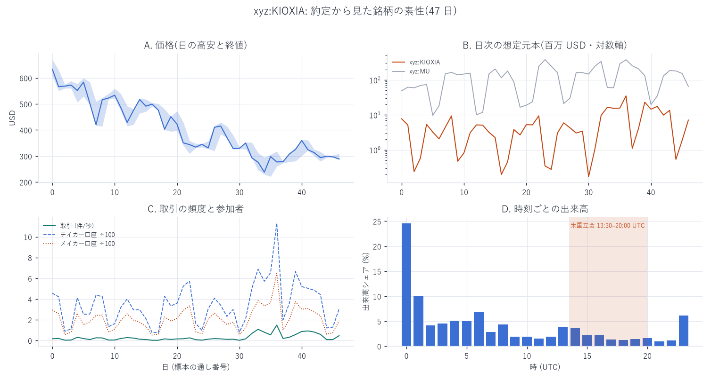

## B. 板の状態は将来の値動きを教えてくれるか

| h | 100ms | 500ms | 1s | 5s | 10s | 30s | 60s |
|---|---|---|---|---|---|---|---|
| 実測の最大 \|r\| | 0.141 | 0.295 | 0.314 | 0.355 | **0.359** | 0.333 | 0.290 |
| 帰無対照の最大 | 0.012 | 0.010 | 0.015 | 0.016 | 0.017 | 0.038 | 0.036 |

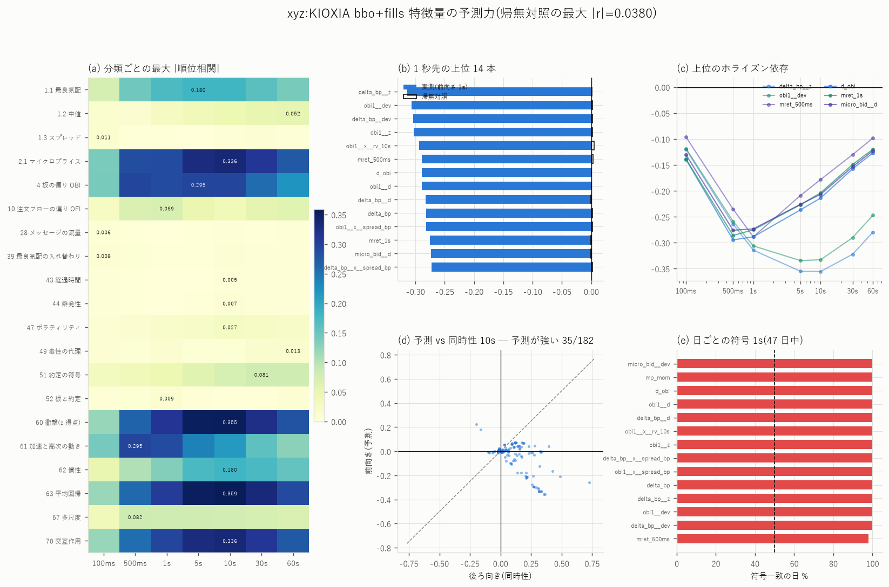

- 上位は `delta_bp__z` −0.314、`obi1__dev` −0.306(1 秒)。
  どの変換でも δ と OBI の逆張り
- **この大きさを「強い予測力」と読んではいけない。**
  幅 67 ティックの板で microprice が中心からずれたまま放置され、
  数十秒かけて戻る、という板の遅さがそのまま写っている。
  実効半スプレッド 11.1bp を引けば何も残らない
- 前半後半の r 相関 0.981(構造は安定)

| 指標 | 最大エッジ | セル | 帰無対照 |
|---|---|---|---|
| MicroPrice 乖離 | +0.179 | 閉場日 / > +20bp / k=1 | 0.039 |
| OBI | +0.091 | 立会日 / +0.75〜+1.00 / k=1 | — |
| OFI | +0.159 | 閉場日 / < −2σ / k=5 | — |

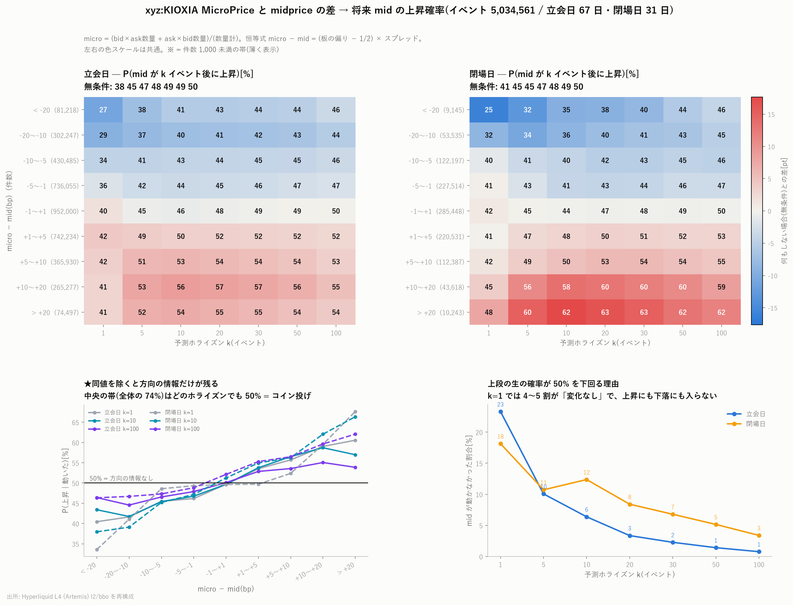

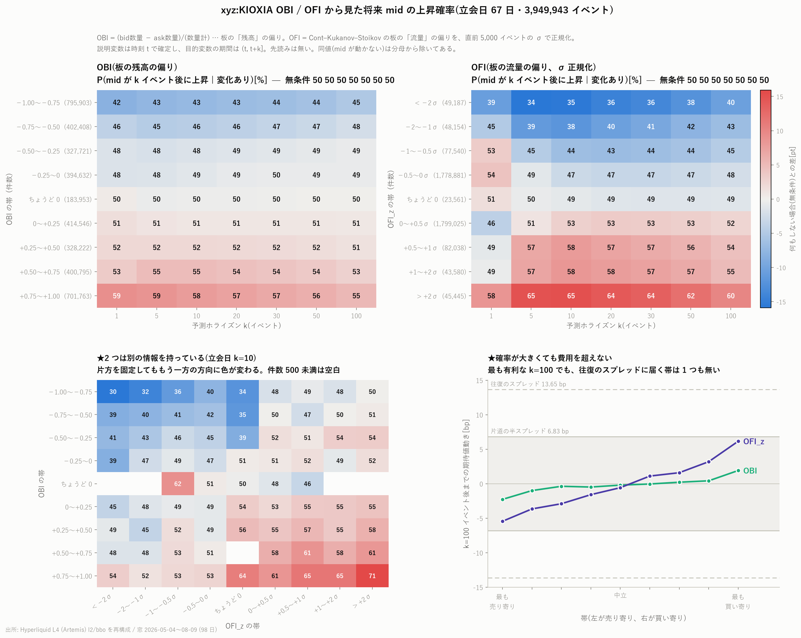

- Book Slope: β=0.003、**HAC t=1.8(7 銘柄で唯一 有意でない)**
- キャンセル率の傾き: 最大差 **−0.071bp**(閉場日/10 秒、唯一の負)、
  帰無対照 +0.012bp

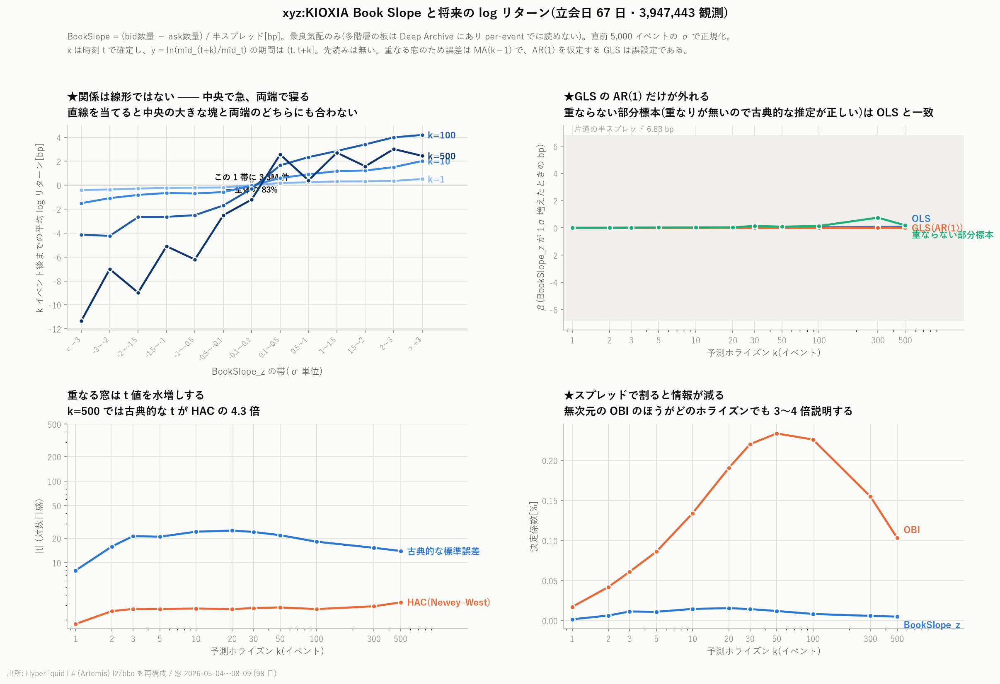

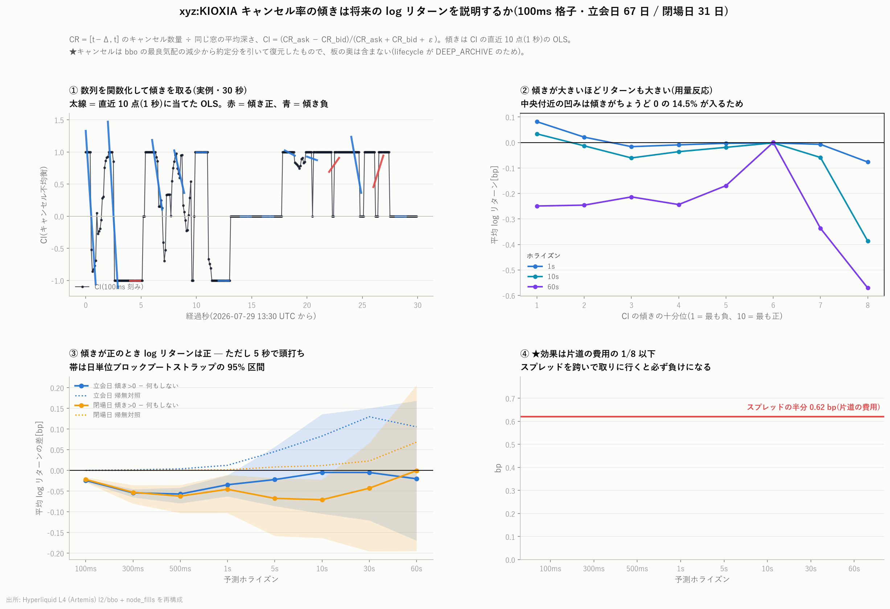

## C. 注文フローはどれだけ自分自身を引きずるか

| 量 | 値 |
|---|---|
| OBI 符号持続の超過(k=1) | +0.231 |
| OBI の lag1(200ms 格子) | **+0.914(7 銘柄で最大)** |
| OFI の lag1(200ms 格子) | +0.007(無記憶) |

OBI の lag1 が最大なのは板が最も動かないから
([MU の標本化の副作用](../MU/mu_acf_200ms_report.md)の極端な例)。

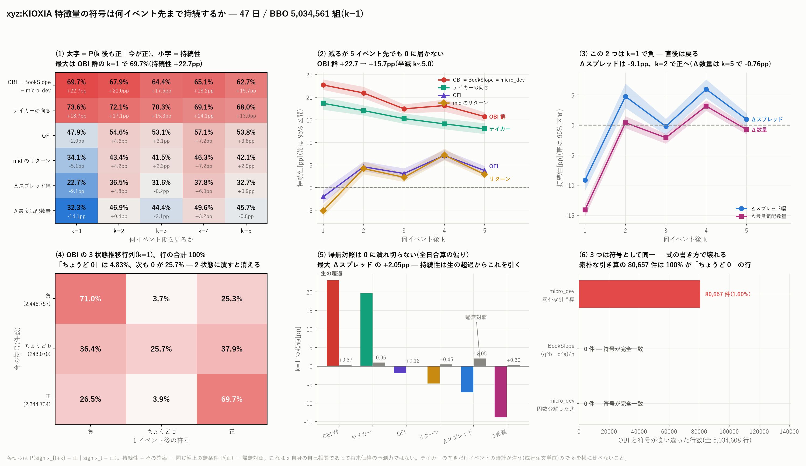

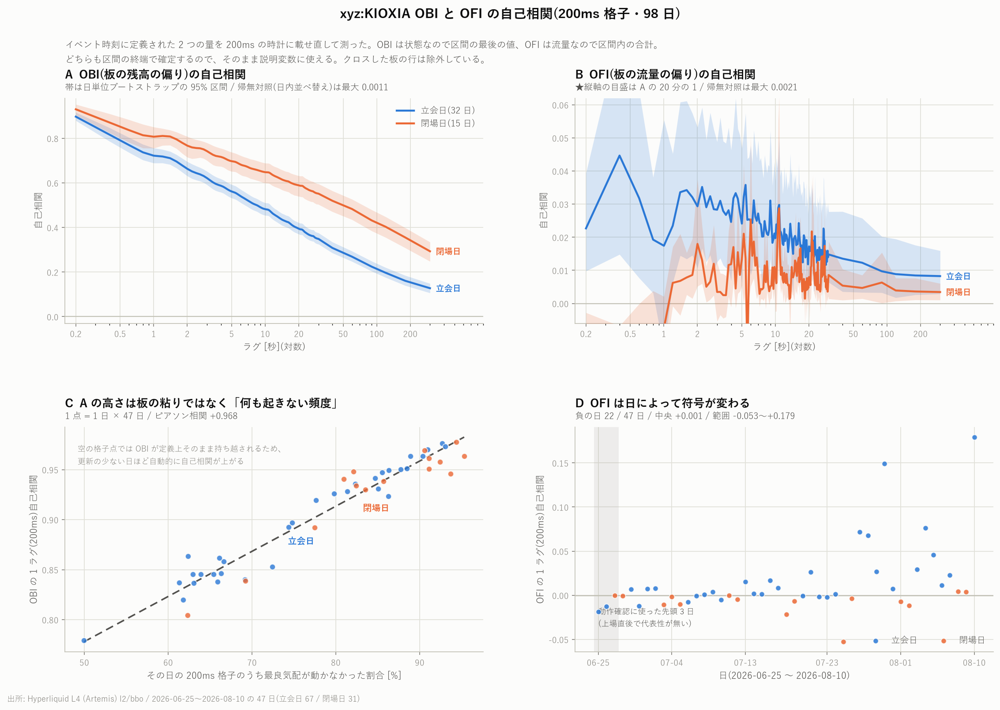

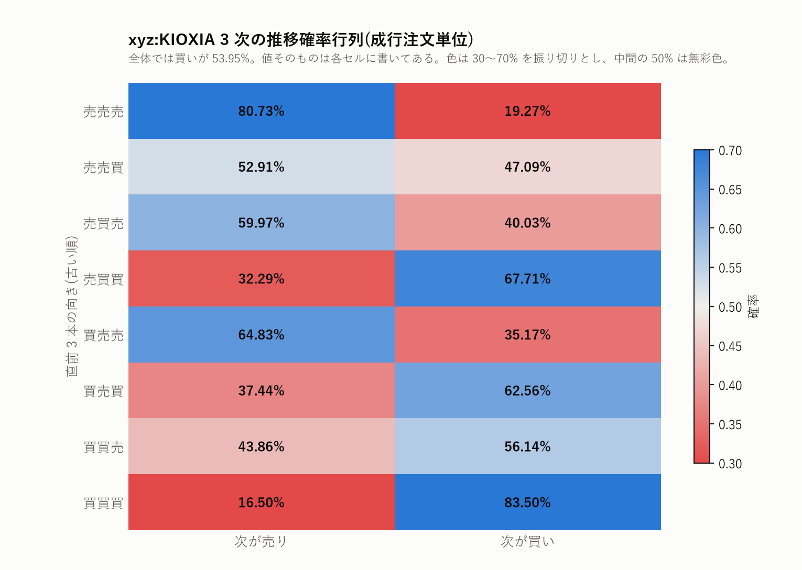

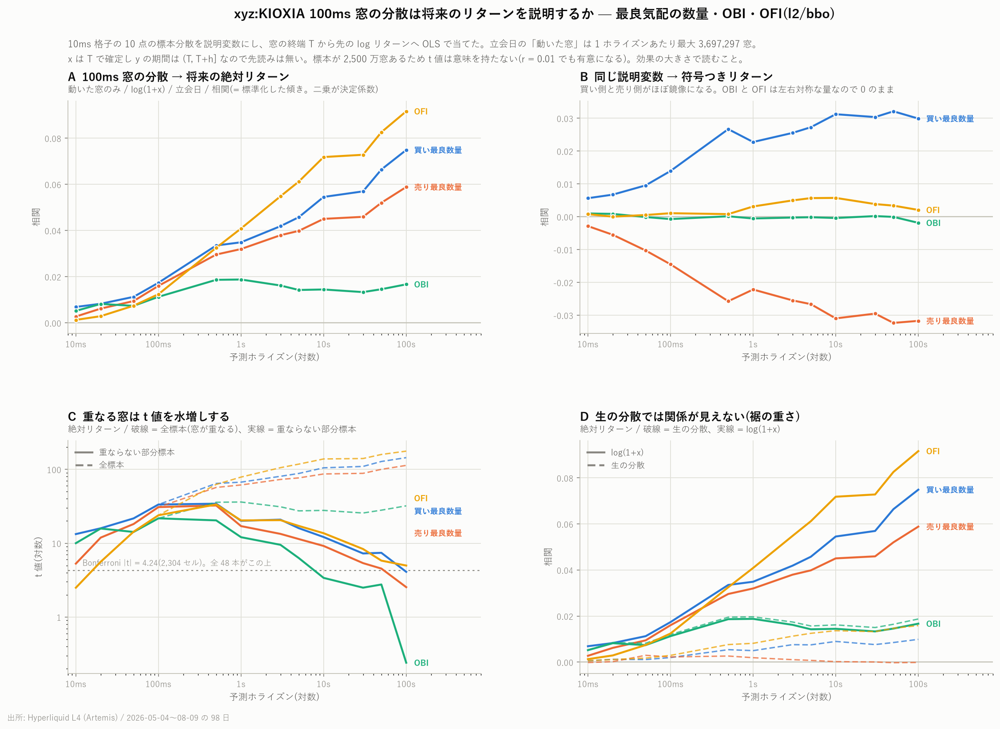

## D. 板の中の量どうし

- corr(スプレッド, 約定量) = −0.326
- corr(最良数量, 約定量) = −0.018

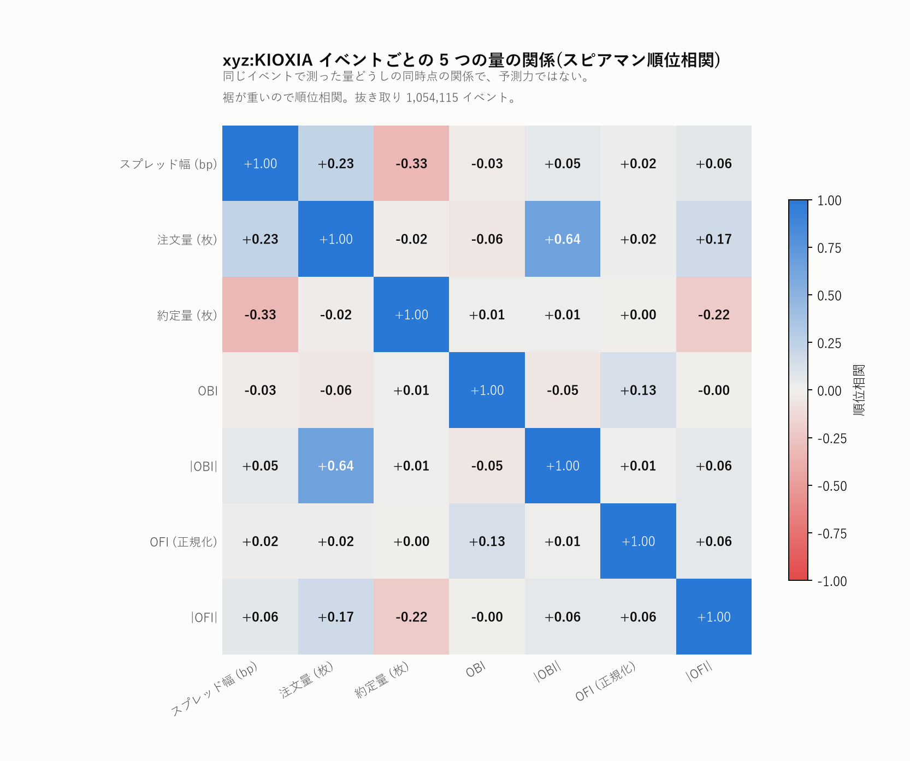

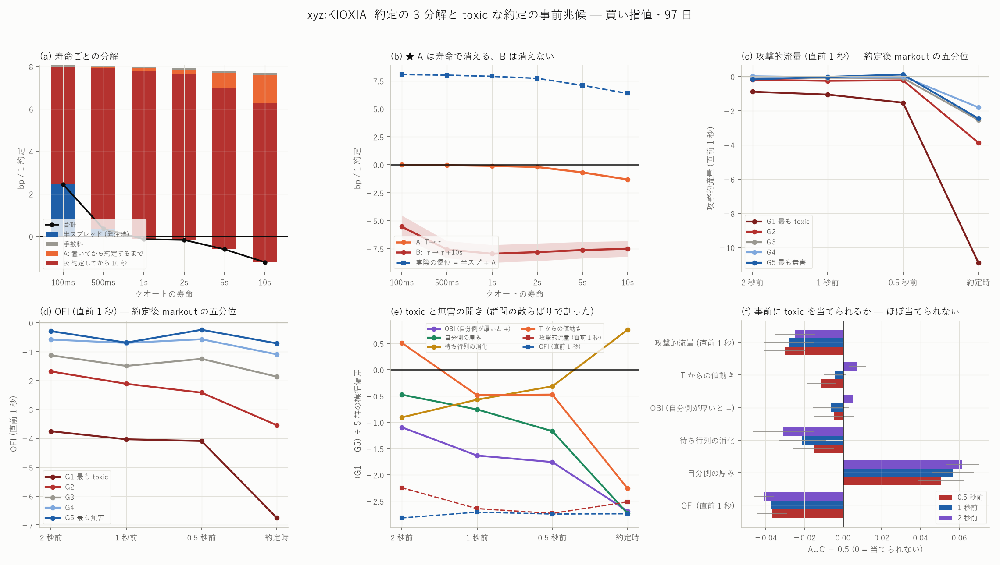

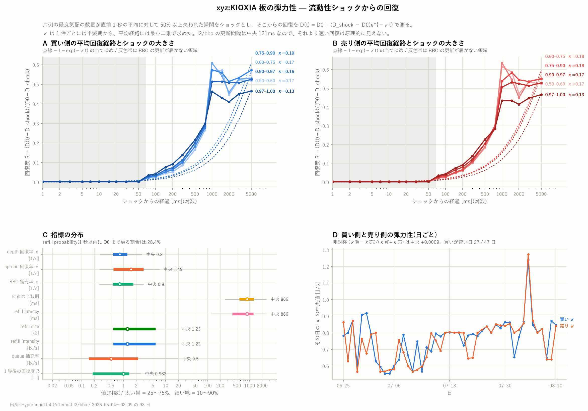

## 限界

1. **47 日しかない**うえ約定が疎で、他銘柄より 1 段割り引いて読む
   (帰無対照も 0.038 まで上がる)
2. bbo(最良 1 段)+ fills だけの物差し
3. 費用は引いていない。この銘柄は費用(往復 ≈28bp)が支配的で、
   予測力の数字に実務上の意味はない

数字の再現は [README の再現手順](README.md#再現手順) を参照。
